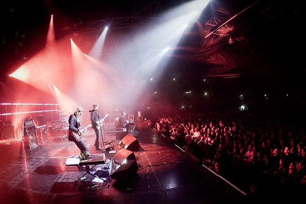
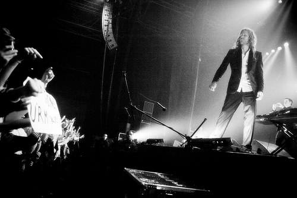
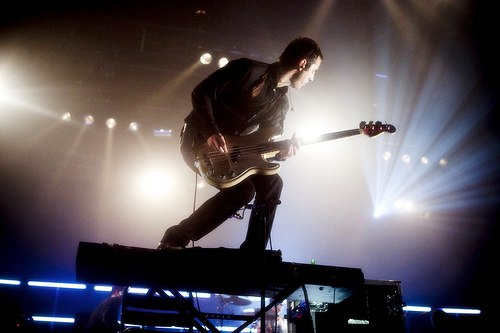
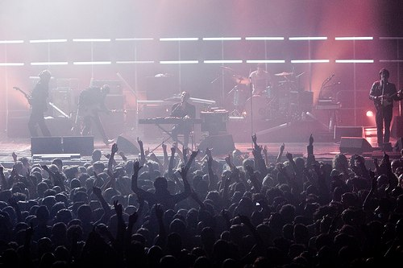
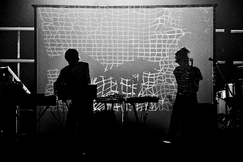

+++
type = "post"
titre = "Ghinzu au Zénith (23 octobre 2009)"
title = "Ghinzu au Zénith (23 octobre 2009)"
url = "/ghinzu-zenith-octobre-2009"
date = "2009-10-25T00:12:30"
Lastmod = "2010-03-15T15:44:48"
cover = "ghinzu.jpg"
categorie = [ "À voir… en live" ]
tag = [ "Concert", "Rock", "Zénith" ]
createur = [ "Ghinzu" ]
annee = [ "2009" ]
weight = 2009

+++

Hier soir, concert au Zénith avec Ghinzu, LE groupe du moment (bon, au moins un des groupes du moment&#8230;) issu de la fameuse scène rock belge. J&rsquo;ai découvert le groupe très tardivement, avec la sortie de <em>Mirror Mirror</em>, leur dernier album. Je connaissais bien le groupe de nom, et bien sûr &laquo;&nbsp;Do you read me ?&nbsp;&raquo; (mais qui ne connaît pas ce titre ?), mais pas plus. Depuis, j&rsquo;ai écouté toute la discographie et je suis tombé sous le charme de ce groupe un peu dérangé, qui semble en permanence sur le point d&rsquo;exploser. Sur scène, le plaisir fut un peu gâché par un son des plus médiocres, mais il était bien présent et Ghinzu fait par indéniablement partie de ces groupes qu&rsquo;il faut voir sur scène.

© Rod &#8211; <a href="http://www.le-hiboo.com/18258-ghinzu-zenith-paris-23-10-2009">Le HibOO</a>

Le choix d&rsquo;une salle comme le Zenith, même s&rsquo;il a des inconvénients (ah, le charme des petites salles&#8230;) se justifie pleinement au vu du nombre de fans amassés, et par la puissance que le groupe peut potentiellement dégager sur scène. J&rsquo;avais d&rsquo;ailleurs entendu ou lu que c&rsquo;était un groupe beaucoup plus vif sur scène que sur disque, un groupe qui déménageait en d&rsquo;autres termes. Sur scène, ils ont cinq et à l&rsquo;exception du batteur, ils tournent, s&rsquo;échangent les instruments, et remuent beaucoup sur la scène.

La musique de Ghinzu repose beaucoup sur l&rsquo;alternance de périodes calmes et d&rsquo;autres plus énervées, avec souvent des montées en puissance qui, bien réalisées, peuvent être d&rsquo;une efficacité redoutable (&laquo;&nbsp;Kashmir&nbsp;&raquo; en est l&rsquo;archétype bien sûr, mais je pense aussi au récent &laquo;&nbsp;Signal To Noise&nbsp;&raquo; de Peter Gabriel). Certains titres peuvent au contraire commencer très fort et marquer une pause à un moment ou à un autre. Par certains aspects, on retrouve ici des morceaux qu&rsquo;un groupe comme Wilco pourrait écrire. En concert, cela peut donner de très bons résultats. Une montée en puissance sonore bien réalisée a de quoi emporter un public vers des sommets, au moins le temps que la gravité reprenne ses droits (ah&#8230; quel souvenir de &laquo;&nbsp;Signal To Noise&nbsp;&raquo; en live justement).

© Rod &#8211; <a href="http://www.le-hiboo.com/18258-ghinzu-zenith-paris-23-10-2009">Le HibOO</a>

Pour le Zénith, cela a effectivement plutôt bien fonctionné même si, pour une mystérieuse raison, le son était moyen, car trop faible. D&rsquo;ordinaire les mauvais concerts sur le plan sonore sont bien trop forts et ne laissent place à aucun détail, noyant tout le son dans une sorte de magma sonore peu agréable. Mais ce soir, le volume était trop faible sur deux points précis : les basses et la voix.

Peut être est ce à cause de la première partie au contraire tellement chargée des fréquences les plus basses que tout le Zenith tremblait dangereusement, mais l&rsquo;ensemble du concert m&rsquo;a paru bien peu pêchu en basses, un domaine pourtant de prédilection où votre salon (ou casque) ne peut soutenir la comparaison. D&rsquo;ordinaire donc, les ingénieurs du son se lâchent et balancent des basses à ne plus savoir qu&rsquo;en faire. Quand le système suit et ne sature pas en permanence, cela peut être très agréable, la grisante sensation que son corps vibre en musique de tous les os. Là&#8230; eh bien il fallait tendre l&rsquo;oreille parfois pour seulement entendre ce que jouait le bassiste. Autant dire que l&rsquo;on devait être loin, très loin du <a href="http://www.dailymotion.com/video/x63uk_spinaltapampli_fun">cran 11</a>. Je ne suis pas spécialement fan de basses à outrance, mais elles sont quand même bien utiles, surtout en concert.

Le problème se retrouvait sur la voix qui, même dans les moments calmes, n&rsquo;était pas très forte. Alors dans les moments de furie totale, il fallait vraiment tendre l&rsquo;oreille pour déceler vaguement une voix humaine. Et encore, c&rsquo;est bien parce que je connais la musique que j&rsquo;ai pu ainsi &laquo;&nbsp;détecter&nbsp;&raquo; le chant. Dommage quand même. Peut-être peut-on y lire la volonté du groupe de ne pas mettre en avant le chanteur, mais c&rsquo;est un raisonnement idiot sur scène qui renforce l&rsquo;effet &laquo;&nbsp;bouillie sonore indistincte&nbsp;&raquo;.

© Rod &#8211; <a href="http://www.le-hiboo.com/18258-ghinzu-zenith-paris-23-10-2009">Le HibOO</a>

Nonobstant la qualité du son, le concert fut fort agréable et effectivement très remuant. Le public était vraiment déchainé, malgré le son moyen, et je dois dire qu&rsquo;il était difficile de ne pas résister. De toute façon, quand votre voisin fait des bonds de trois mètres dans tous les sens, il est conseillé de le suivre, si possible en suivant le rythme et la direction. Le niveau du concert approcha, sans l&rsquo;atteindre néanmoins, celui de Dionysos à l&rsquo;Olympia qui reste le concert d&rsquo;où je suis sorti le plus exténué et heureux. Le lien avec Dionysos se retrouve aussi dans la folie manifeste des membres du groupe, qui balancent gentiment leurs guitares au sol, qui sautent à pieds joints sur un pauvre synthé qui n&rsquo;avait rien demandé (ci-dessus) ou sur la batterie, quand ils ne se roulent pas à terre ou font un petit plongeon dans la fosse.

La musique de Ghinzu sur scène est aussi déjantée et, oh joie, s&rsquo;éloigne des albums. Le son est certes plus fort, plus lourd (enfin, aurait dû l&rsquo;être à tout le moins) et certains morceaux s&rsquo;étirent en longueur. Le tout est souvent assez brouillon, ce qui n&rsquo;est pas vraiment un problème d&rsquo;ailleurs (le côté rock à l&rsquo;ancienne, tout ça). D&rsquo;ailleurs, je me demande si le son moyen n&rsquo;était pas voulu, pour renforcer le côté brouillon : <a href="http://www.le-hiboo.com/18258-ghinzu-zenith-paris-23-10-2009#comment-42075">d&rsquo;après Rod</a>, ce concert était techniquement très bon, et je veux bien le croire. Je reste néanmoins sceptique sur l&rsquo;intérêt de la chose, et je parierai plus sur une erreur de jugement des ingénieurs du son&#8230;

© Rod &#8211; <a href="http://www.le-hiboo.com/18258-ghinzu-zenith-paris-23-10-2009">Le HibOO</a>

Un mot, avant de conclure, sur <a href="http://www.myspace.com/wearesoldout">Soldout</a>, la première partie. J&rsquo;ai dit qu&rsquo;elle était surchargée en basse, ce qui est même peu dire. C&rsquo;est bien simple, je crois que je n&rsquo;ai jamais autant vibré que pendant cette première partie, jusqu&rsquo;à l&rsquo;écœurement d&rsquo;ailleurs (il ne fallait pas que ça dure plus longtemps). La musique était clairement taillée pour les boites de nuit et ne manquait pas d&rsquo;efficacité pour chauffer le Zénith, mais elle m&rsquo;a aussi semblé plutôt monotone. On sentait le principe bien en place et décliné à l&rsquo;infini.

Reste un spectacle visuellement très impressionnant, basé quasi exclusivement sur le noir et blanc et très efficace. Un écran placé derrière le couple d&rsquo;artistes permet d&rsquo;afficher divers motifs noir et blanc, tandis que l&rsquo;éclairage montre le plus souvent les artistes comme des ombres, un procédé certes simple, mais là encore efficace. Le groupe utilise presque en permanence les flashs des stroboscopes (avis aux migraineux ou épileptiques&#8230;). L&rsquo;ensemble est assez impressionnant à regarder, surtout dans une grande salle comme le Zenith. La musique me semble moins inoubliable, mais elle est la preuve que le concert de Ghinzu avait un souci quelque part&#8230;

© Rod &#8211; <a href="http://www.le-hiboo.com/18261-soldout-zenith-paris-23-10-2009">Le HibOO</a>

À l&rsquo;heure du bilan, je retiens surtout l&rsquo;idée que Ghinzu est un groupe à suivre sur scène. Je pense que les concerts dans l&rsquo;intimité des petites salles étaient énormes, mais quand on découvre en même temps que les foules, il faut savoir faire avec ce que l&rsquo;on a. Et finalement, le Zenith convient pas mal à un tel groupe, un peu d&rsquo;espace ne leur faisant pas de mal pour exprimer toute leur puissance et leur folie. Reste que pour cela, il faut que le son suive, et là clairement, je suis resté sur ma faim.

Dommage, mais je ne regrette absolument pas le déplacement, et je ferai tout pour retourner voir le groupe sur scène à la prochaine occasion ! En attendant, les albums tournent en boucle sur la platine virtuelle et franchement&#8230; c&rsquo;est bien.

<em><a href="http://www.flickr.com/photos/pirlouiiiit/218579061/">Crédit couverture : pirlouiiiit @ FlickR</a></em>

