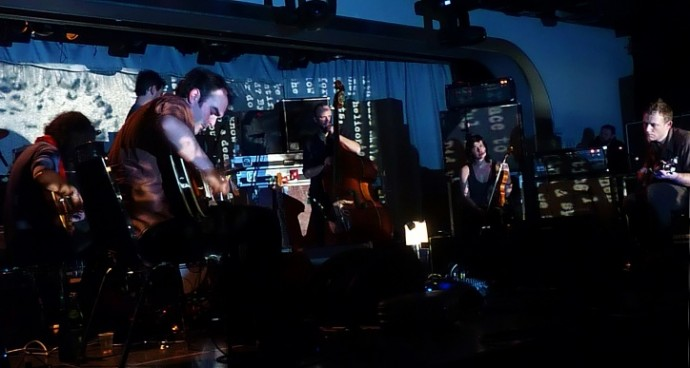
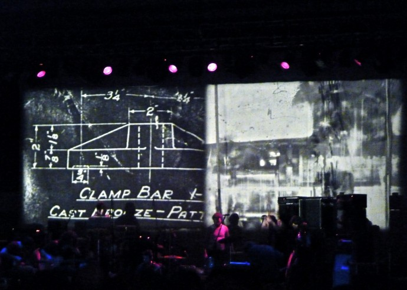

+++
titre = "Godspeed You! Black Emperor à la Grande Halle de la Villette (14 janvier 2011)"
title = "Godspeed You! Black Emperor à la Grande Halle de la Villette (14 janvier 2011)"
url = "/godpseed-you-black-emperor-halle-villette-janvier-2011"
date = "2011-01-15T14:40:12"
Lastmod = "2011-01-15T14:49:12"
cover = "godspeed-you-black-emperor.jpg"
categorie = [ "À voir… en live" ]
tag = [ "Concert", "Expérience", "Post-Rock" ]
createur = [ "Godspeed You! Black Emperor" ]
annee = [ "2011" ]
weight = 2011

+++

Godspeed You! Black Emperor est l&rsquo;un de ces rares groupes ou artistes à avoir le privilège d&rsquo;être identifié à jamais à un genre. S&rsquo;il est sans doute exagéré de parler d&rsquo;inventeurs du post-rock, il est indéniable que le groupe canadien a donné à ce genre ses lettres de noblesse. Aujourd&rsquo;hui encore, les quatre albums et quatorze morceaux de Godspeed You! Black Emperor font figure de référence. Je m&rsquo;étais résigné à ne jamais voir sur scène le groupe, inactif depuis la sortie de <em>Yanqui U.X.O.</em> en 2002. C&rsquo;est peu dire que je n&rsquo;ai pas hésité quand j&rsquo;ai appris que ce groupe mythique repartait en tournée et passait à Paris…

Un concert ne serait pas complet sans sa première partie, l&rsquo;occasion rêvée pour un artiste ou groupe en général moins connu de faire découvrir son travail. Cela étant, la première partie de ce concert s&rsquo;est révélée assez pénible… Total Life est un le projet solo de Kevin Doria, par ailleurs membre de Growing, groupe américain qui fait dans la musique expérimentale. Ce soir-là donc, un seul homme sur scène, derrière une table pleine de machines divers et variées. Ambiance électrique, on s&rsquo;en doute, mais le résultat fut surprenant, composé de bruits et de sons, quasiment jamais de notes (en voici un <a href="http://www.lastfm.fr/music/Total+Life/+videos/+1-3Ue5LcVEqrc">bon exemple</a>). Parfois, un rythme se détachait du lot, une fois ou deux un semblant de mélodie à pu s&rsquo;échapper, mais le reste était composé essentiellement de sons saturés et (très) forts. J&rsquo;en ai vu des premières parties sans grand intérêt, mais je dois avouer mon bonheur quand ce Doria a enfin quitté la scène. Il était temps de passer au plat de résistance. La salle les attend de pied ferme, c&rsquo;est peu dire. Dans ce vaste espace vide qu&rsquo;est la Grande Halle de la Villette, on ne trouve que des fans du groupe. On ne va pas à un concert de Godspeed You! Black Emperor par hasard, on y va parce que l&rsquo;on adore le groupe, parce que l&rsquo;on connaît sur le bout des doigts tous leurs albums, tous leurs morceaux, chaque mouvement des morceaux même. Cela se sent avec ce public étonnamment jeune, socialement assez homogène sans surprise et assez international (j&rsquo;étais entouré d&rsquo;un couple d&rsquo;Italiens charmants, et d&rsquo;un groupe de Belges aussi fins et légers que leur réputation le laisse entendre).

<em>Photo : <a href="http://www.efestivals.co.uk/festivals/alltomorrowsparties/2010wk3/photos-GodspeedYouBlackEmperor-ATP-NBC2010-JMW.shtml">eFestivals</a></em>

Le post-rock est le genre musical par excellence de la pression. Et s&rsquo;il y a bien une chose que les huit membres de Godspeed You! Black Emperor savent faire, c&rsquo;est faire monter la pression. Ils le prouvèrent d&rsquo;emblée avec une entrée sur scène progressive, à coups de guitares saturées. Efficace pour maintenir la tension dans le public, mais un peu longuet à mon goût, d&rsquo;autant que le volume est toujours aussi élevé. Quand enfin les premières notes d&rsquo;un morceau se font entendre, c&rsquo;est le soulagement qui gronde dans la salle, le concert peut commencer. On ne savait pas alors que ce concert allait durer plus de 2h30 et allait en épuiser plus d&rsquo;un, tant son intensité fut grande. Pourtant, les morceaux du groupe sont longs (ils atteignent souvent les vingt minutes) et montent en général progressivement en intensité jusqu&rsquo;à une explosion finale qui emporte tout. Dans l&rsquo;intervalle, plusieurs minutes se sont écoulées, souvent très calmes. À tel point que je me demande si le concert n&rsquo;aurait pas gagné à avoir lieu dans une salle en configuration assise, ou alors dans une salle beaucoup plus petite. Le volume très impressionnant de la Grande Halle se révèle néanmoins bienvenu pour laisser toute l&rsquo;ampleur nécessaire au volume sonore du groupe. Le résultat est efficace, indéniablement.

Godspeed You! Black Emperor n&rsquo;est pas un groupe de scène. L&rsquo;écoute des albums le laissait entendre, nous en avons eu la confirmation pour ce concert parisien. J&rsquo;ai rarement vu un concert aussi statique, même si la projection de quelques bandes (des vraies, avec de vrais projecteurs… étonnant pour un concert) rend un peu plus vivant l&rsquo;ensemble. Aucun effet de lumière pendant toute la durée du concert, le groupe se contentant d&rsquo;être éclairé par la poignée de spots statiques qui servent d&rsquo;habitude une scène entre deux morceaux. Les musiciens eux-mêmes sont du genre posés, la plupart sont d&rsquo;ailleurs assis, un guitariste tourne même le dos au public pour faire face à la batterie, placée comme toujours au centre. Autant dire qu&rsquo;il ne se passe rien sur scène, ou en tout cas très peu, ce qui est assez déroutant, tout comme le fait qu&rsquo;ils ne prononceront jamais un seul mot, même pas un &laquo;&nbsp;Hello Paris&nbsp;&raquo; au départ, se contentant d&rsquo;un geste de la main en entrée, et d&rsquo;un autre geste de la main en sortie. Les images projetées sont assez classiques, mais plutôt bien vues : elles donnent un sens à des morceaux par ailleurs totalement instrumentaux, sans être trop encombrantes pour autant. On sent que ces éléments visuels sont essentiels chez ce groupe, et le projectionniste qui est aussi le créateur des images, est d&rsquo;ailleurs listé comme membre de Godspeed You! Black Emperor à part entière. Ces images explicitent également l&rsquo;aspect politique d&rsquo;un groupe qui se dit très clairement anticapitaliste. Aspect renforcé aussi par le maintien d&rsquo;enregistrements audio réalisés avec des Américains tout aussi contestataires qui rangent leur pays parmi ceux du Tiers-Monde.

<em>Photo : <a href="http://www.flickr.com/photos/closeto94/5259963339/">closeto94 @ Flickr</a></em>

Le post-rock a trop souvent été caricaturé par de nombreux groupes, mais c&rsquo;est un genre beaucoup plus complexe qu&rsquo;il n&rsquo;y paraît. La musique de Godspeed You! Black Emperor le prouve bien : chaque morceau est une composition complexe avec plusieurs mouvements qui s&rsquo;agencent successivement, avec un grand nombre d&rsquo;instruments, chacun ayant un rôle bien spécifique dans le morceau. Cette complexité fait l&rsquo;intérêt des morceaux, bien sûr, mais elle peut aussi constituer une gêne en live. Autant le dire, les morceaux joués en concert sont très proches des morceaux enregistrés en studio. Il y a bien quelques changements par moments, mais ce sont toujours des changements légers alors que cette musique pourrait offrir plus de liberté. Cela dit, les fans venaient entendre des morceaux qu&rsquo;ils connaissaient et ils n&rsquo;ont pas été déçus. Je n&rsquo;ai détecté qu&rsquo;un seul nouveau morceau sur les sept joués dans la Grande Halle de la Villette : ils n&rsquo;étaient pas venus défendre un nouvel album, mais simplement pour jouer ensemble. Aucune interaction sur scène, des morceaux très proches des albums… mais que reste-t-il alors ? L&rsquo;énergie. C&rsquo;est en concert, avec les systèmes audio massifs des salles, que la musique de Godspeed You! Black Emperor révèle tout son potentiel. Et quel potentiel, quelle énergie déployée par les musiciens, c&rsquo;était décoiffant. C&rsquo;était un concert d&rsquo;une rare intensité qui a fait entrer en transe une bonne partie du public (aidé, il est vrai, par ce qu&rsquo;il avait entre les lèvres, ce n&rsquo;était pas seulement du tabac…). L&rsquo;ascension de l&rsquo;énergie avant l&rsquo;explosion finale est une idée géniale en musique, qui fonctionne à plein en concert : le nombre d&rsquo;explosions est tel, plusieurs par morceau, que la fatigue en sortant est forte. Je suis rarement sorti aussi fatigué d&rsquo;un concert qu&rsquo;après ces 2h30 bien tassées de concert.

On ne va pas par hasard à un concert de Godspeed You! Black Emperor, non. Mieux vaut bien connaître le groupe, ses albums, et apprécier cette musique singulière, bruyante, répétitive, sans paroles, mais aussi une musique entraînante, plus accessible qu&rsquo;on ne le pense et souvent très belle. Je tenais absolument à voir le groupe sur scène, sentant que l&rsquo;énergie déployée devait être bien plus importante encore que sur album. Je n&rsquo;ai pas été déçu sur ce point et rien que pour cela, le concert en vaut absolument la peine. Reste que le groupe gagnerait à s&rsquo;éloigner un peu de leurs compositions, créer la surprise et prendre un peu plus en considération le public devant eux. C&rsquo;est d&rsquo;autant plus dommage que pour avoir <a href="http://voiretmanger.fr/2010/04/01/three-silver-mt-zion-alhambra-mars-2010/">vu en concert A Silver Mt Zion</a>, groupe composé de membres de Godspeed You! Black Emperor, je sais que ces musiciens peuvent être plus chaleureux. Il est vrai néanmoins que la Grande Halle de la Villette n&rsquo;incite pas forcément à plus de chaleur et de proximité. Un bon concert donc, qui aurait pu être encore meilleur.

<em>Photo de couverture : <a href="http://www.flickr.com/photos/sibilino/5244720047/" target="_blank">sibilino @ FlickR</a></em>

