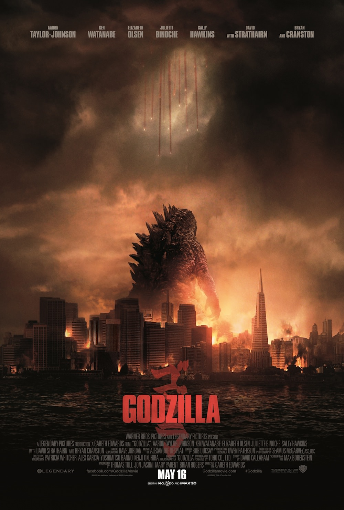
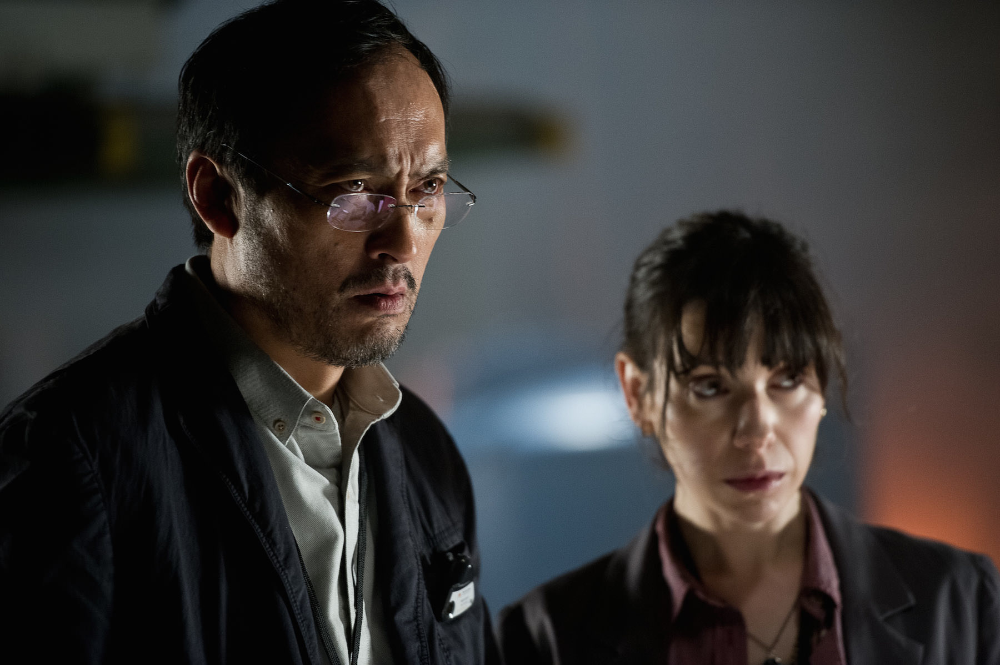

+++
type = "post"
titre = "<em>Godzilla</em>, Gareth Edwards"
title = "Godzilla, Gareth Edwards"
url = "/godzilla-edwards"
date = "2014-05-13T23:47:26"
Lastmod = "2014-05-15T15:00:15"
cover = "gareth-edwards-godzilla.jpg"
categorie = [ "À voir" ]
tag = [ "Action", "Blockbuster", "Fantastique", "Monstres", "Mythe", "Reboot", "Science-Fiction", "Sorties du mois", "Vite oublié" ]
createur = [ "Gareth Edwards" ]
acteur = [ "Aaron Taylor-Johnson", "Bryan Cranston", "David Strathairn", "Ken Watanabe" ]
annee = [ "2014" ]
weight = 2014
saga = [ "Godzilla" ]
pays = [ "États-Unis" ]

+++

Le cas Godzilla est fascinant dans l&rsquo;histoire du cinéma, et même dans la culture moderne en général. Ce monstre gigantesque a été créé au Japon au milieu des années 1950 pour un premier film, mais il a surtout alimenté des dizaines et des dizaines d&rsquo;œuvres jusqu&rsquo;à aujourd&rsquo;hui. Combien de créatures inventées par le Septième Art peuvent se targuer d&rsquo;avoir une telle aura, au point de marquer Hollywood d&rsquo;une étoile ? Seize ans après une version musclée et un peu bête signée Roland Emmerich, c&rsquo;est au tour de Gareth Edwards de s&rsquo;attaquer au mythe. Avec la promesse de revenir aux sources : son <em>Godzilla</em> est annoncé comme un pamphlet contre le nucléaire et les dérives de l&rsquo;Homme, et la victoire au contraire de la nature. Avec une <a href="http://voiretmanger.fr/bonne-bande-annonce/">bande-annonce prometteuse</a>, on attendait beaucoup de ce film… qui est finalement un blockbuster honorable, sans plus. À voir si vous aimez les (grosses) écailles.

Le <em>Godzilla</em> de Roland Emmerich a imposé avec lui une vision sombre assez basique du monstre : cette sorte de gros lézard malveillant n&rsquo;est là que pour massacrer de l&rsquo;humain, et il faut l&rsquo;abattre à tout prix. Au point que l&rsquo;on a pu, parfois, oublier que le mythe n&rsquo;est pas aussi basique : selon les visions, Godzilla peut effectivement être ce monstre sanguinaire qui ne cherche qu&rsquo;à détruire, mais il peut aussi être celui qui sauve l&rsquo;humanité d&rsquo;un autre désastre. Comme pour mieux se démarquer de son prédécesseur, c&rsquo;est précisément cette deuxième voix que choisit Gareth Edwards. Difficile de ne pas trop en dire pour ne pas dévoiler l&rsquo;intrigue qui se relève assez étonnante pour qui ne connaît rien en monstres japonais, mais on peut dire que ce <em>Godzilla</em> adopte un autre point de vue dans le mythe, tout aussi valable que celui plus basique de Roland Emmerich. Une originalité bienvenue, qui offre à cette nouvelle version un début plutôt satisfaisant. La première partie du film est en effet marquée par une ambiance très particulière : loin du vacarme habituel des blockbusters, le cinéaste essaie de proposer un point de vue scientifique, ou plutôt qui a vaguement la saveur de la science. Certes, <em>Godzilla</em> ne nous épargne pas l&rsquo;indispensable drame, mais le long-métrage parvient plutôt bien à poser son ambiance pseudo-scientifique qui est d&rsquo;autant plus convaincante que le monstre est alors totalement absent. On sent que quelque chose se trame, mais, comme le personnage de Joseph Brody qui est alors le principal, on ne sait rien et on s&rsquo;inquiète. Les détails ne sont pas essentiels, mais le scénario imagine en plus un parallèle passionnant avec la catastrophe de Fukushima et le fait que l&rsquo;on soit au Japon dans ces premières minutes n&rsquo;a, évidemment, rien d&rsquo;anodin. L&rsquo;ensemble est en tout cas convaincant et on retrouve un peu l&rsquo;ambiance d&rsquo;un <a href="http://voiretmanger.fr/prometheus-scott/" title="Prometheus, Ridley Scott"><em>Prometheus</em></a>, ce qui est une plutôt bonne surprise. Loin du blockbuster brutal que l&rsquo;on pouvait attendre, cette ouverture se concentre sur quelques personnages plutôt que sur les effets spéciaux, mais cela ne dure pas.

Malheureusement, <em>Godzilla</em> ne poursuit pas sur cette lancée et nous projette une quinzaine d&rsquo;années après. Le fils de Joseph Brody, Ford, entre en action et avec ce militaire comme héros, le film ne pouvait que se muscler. De fait, après des débuts plutôt posés, Gareth Edwards change d&rsquo;ambiance et tire vers le blockbuster assez traditionnel. Passons rapidement sur la première créature, puis la deuxième, et puis sur le combat entre ces deux monstres et Godzilla : tout ceci n&rsquo;a guère d&rsquo;importance dans ce scénario qui est alors monté sur des rails et suit très précisément tous les clichés du genre. Alors que <em>Godzilla</em> paraissait plutôt fin et bien vu, le film devient totalement téléphoné dans sa deuxième partie, avec un héros qui est toujours exactement là où il faut être, alors même qu&rsquo;il ne devrait pas. Un héros qui survit aussi quoi qu&rsquo;il arrive, qui a toujours les compétences nécessaires et c&rsquo;est bien sûr un héros qui, <em>in fine</em>, sauve San Francisco, donc les États-Unis, donc le monde. C&rsquo;est un peu facile et ce n&rsquo;est pas le très insipide — mais bien bodybuildé depuis l&rsquo;époque de <a href="http://voiretmanger.fr/kick-ass-vaughn/" title="Kick-Ass, Matthew Vaughn"><em>Kick-Ass</em></a> — Aaron Taylor-Johnson qui va nous aider à accepter ces situations un peu folles. Est-ce le scénario, la mauvaise direction d&rsquo;acteurs ou les acteurs eux-mêmes ? Toujours est-il qu&rsquo;il n&rsquo;y en a pas un pour sauver l&rsquo;autre : Bryan Cranston qui était si bon dans <a href="http://voiretmanger.fr/breaking-bad-gilligan/" title="Breaking Bad, Vince Gilligan (AMC)"><em>Breaking Bad</em></a> semble ici dans le même rôle, Ken Watanabe et David Strathairn ne sont pas aidés par des répliques d&rsquo;une bêtise confondante et mieux vaut ne pas évoquer les rôles féminins. Dans ce film de monstres, on retiendra surtout les créatures, et au fond ce ne serait pas aussi mal, si celles de Gareth Edwards n&rsquo;étaient pas aussi insignifiantes. Certes, elles sont grosses et <em>Godzilla</em> parvient bien à montrer leur taille dans un environnement urbain. Certes, les combats sont impressionnants, mais ce long-métrage est sorti un an après <a href="http://voiretmanger.fr/pacific-rim-toro/" title="Pacific Rim, Guillermo del Toro"><em>Pacific Rim</em></a> et on ne peut s&rsquo;empêcher de penser au travail de Guillermo del Toro. Que dire, en outre, de ces choix un peu faciles<a href="#fn-11576-1" rel="footnote">1</a>, qui nuisent encore une fois au réalisme de l&rsquo;ensemble ?

La première bande-annonce de <em>Godzilla</em> avait eu la bonne idée de cacher le monstre, une bonne idée que l&rsquo;on aurait aimé retrouver dans le long-métrage complet. Gareth Edwards n&rsquo;a pas pu s&rsquo;empêcher de nous montrer son joujou et si, il faut le reconnaître, certaines séquences sont bien réalisées et impressionnantes, son film en reste au statut de blockbuster aussi facile à voir qu&rsquo;à oublier. À trop nous montrer Godzilla, ce reboot enlève tout mystère et le rend presque sympathique. Dommage, d&rsquo;autant que les scénaristes n&rsquo;ont manifestement jamais pris la peine de créer des personnages crédibles ou intéressants. Des monstres perfectibles, des personnages fades… il reste bien le spectacle par moment, mais ce <em>Godzilla</em> ne fera sans conteste pas date.

<ol>
<li id="fn-11576-1">
Godzilla découvre quand il commence à être en difficulté qu&rsquo;il peut cracher une sorte de feu bleu. Comme c&rsquo;est pratique…&#160;<a href="#fnref-11576-1" rev="footnote">&#8617;</a>
</li>
</ol>

