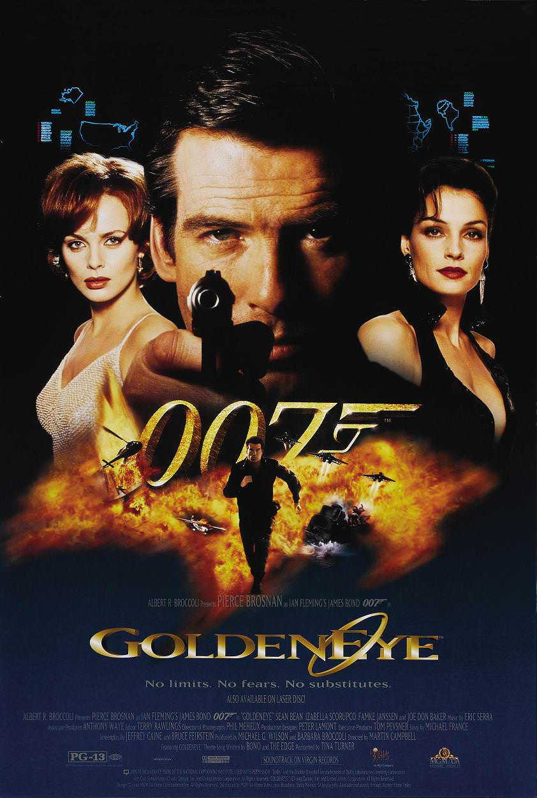
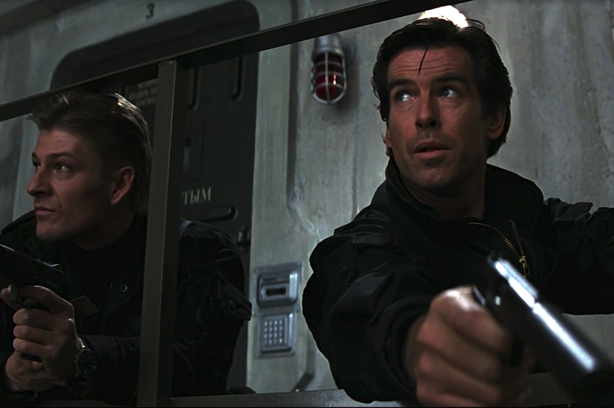
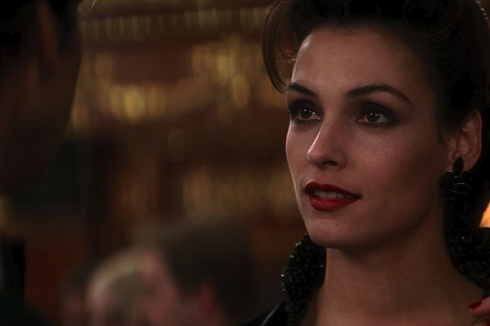

+++
titre = "<em>GoldenEye</em>, Martin Campbell"
title = "GoldenEye, Martin Campbell"
url = "/goldeneye-campbell"
date = "2012-11-25T09:55:19"
Lastmod = "2013-05-11T09:55:15"
cover = "goldeneye-pierce-brosnan-martin-campbell.jpg"
categorie = [ "À voir" ]
tag = [ "Action", "Blockbuster", "Espionnage", "Guerre froide", "James Bond" ]
createur = [ "Martin Campbell" ]
acteur = [ "Famke Janssen", "Izabella Scorupco", "Judi Dench", "Pierce Brosnan", "Sean Bean" ]
annee = [ "1995" ]
weight = 1995
saga = [ "James Bond" ]
pays = [ "États-Unis" ]

+++

Quand <em>GoldenEye</em> sort sur les écrans en 1995, personne n&rsquo;aurait parié un centime sur la franchise James Bond. La saga était au point mort après la déception de <em>Permis de tuer</em> sorti en 1989 et après des problèmes judiciaires autour des droits sur la juteuse licence. Pour relancer la saga, il fallait du sang neuf et ce dix-septième épisode officiel est placé sous le signe des premières fois. C&rsquo;est le premier avec Pierce Brosnan, le premier avec un réalisateur non britannique — Martin Campbell est néo-zélandais —, première fois que le personnage de M n&rsquo;est pas interprété par un homme, première fois qu&rsquo;un film utilise des effets spéciaux numériques, première fois aussi que l&rsquo;histoire se déroule après la chute du mur de Berlin… Des nouveautés qui ont permis à <em>GoldenEye</em> de rester dans les mémoires comme un bon <em>James Bond</em>. De fait, le film reste aujourd&rsquo;hui un spectacle de qualité, très plaisant à (re)voir, même s&rsquo;il a un peu vieilli…

L&rsquo;histoire commence en 1986, dans une URSS sur le déclin. Le MI6 a envoyé deux de ses agents secrets dans une base militaire à détruire : 007 et 006 sont en mission et tout se passe pour le mieux, jusqu&rsquo;au moment où 006 se fait tuer par l&rsquo;ennemi. James Bond ne se décourage pas, il détruit les installations et parvient à s&rsquo;enfuir <em>in extremis</em> à bord d&rsquo;un petit avion. Neuf ans plus tard, on le retrouve du côté de Monaco où il rencontre, un peu par hasard Xenia Onatopp, une mystérieuse femme. Cette dernière cache bien son jeu, puisqu&rsquo;elle réussit à s&rsquo;emparer d&rsquo;un hélicoptère flambant neuf pendant sa démonstration par des militaires. James Bond suspecte immédiatement l&rsquo;entourloupe, mais le MI6 assiste, impuissant, à la découverte de son utilisation. Xenia s&rsquo;est associée à un général russe pour exploiter GoldenEye, une arme ultime qui ne devait être qu&rsquo;un mythe et qui consiste à envoyer depuis un satellite une onde capable de détruire tous les appareils électriques, sauf le fameux hélicoptère conçu spécifiquement pour éviter ces attaques. Les malfaiteurs font une démonstration de leur arme en la retournant contre le centre de recherche qui l&rsquo;avait mise au point, mais la vraie cible est ailleurs…

Plus de dix ans avant <a title="Casino Royale, Martin Campbell - À voir et à manger" href="http://voiretmanger.fr/2012/11/18/casino-royale-campbell/"><em>Casino Royale</em></a>, Martin Campbell devait déjà offrir à la saga <em>James Bond</em> un second souffle. Dans les derniers épisodes, le succès n&rsquo;était plus au rendez-vous et les producteurs se sont sans doute un peu trop reposés sur leurs acquis et sur la réputation de l&rsquo;agent secret. Offrir un nouveau visage était bien sûr la première étape, mais au-delà du choix de Pierce Brosnan, le cinéaste a opté pour quelques ajustements dans la mécanique trop bien huilée de la saga. Même si on est encore loin de la brutalité et de la noirceur des films récents, <em>GoldenEye</em> adopte un ton plus sombre et son 007, bien que toujours très marqué par un humour <em>so british</em>, est plus sérieux et brutal que son prédécesseur. Les morts s&rsquo;accumulent dès la séquence d&rsquo;ouverture, tandis que la suite est une succession de combats impitoyables dans lesquels l&rsquo;ennemi n&rsquo;a aucune chance. Cette noirceur se retrouve aussi dans le scénario proprement dit : pour la première fois dans l&rsquo;histoire de la franchise, il s&rsquo;agit d&rsquo;une histoire originale et non d&rsquo;une adaptation de Ian Flemming. Les scénaristes ont imaginé une histoire dans l&rsquo;après-guerre froide et le méchant est ici plus complexe qu&rsquo;auparavant. D&rsquo;une part parce qu&rsquo;on ne le découvre qu&rsquo;assez tardivement, mais d&rsquo;autre part, parce qu&rsquo;il est très proche du MI6 et de James Bond. Même si elle n&rsquo;est pas aussi développée, on retrouve ici une idée très moderne et qui a même été reprise dans le récent <a title="Skyfall, Sam Mendes - À voir et à manger" href="http://voiretmanger.fr/2012/10/27/skyfall-mendes/"><em>Skyfall</em></a>. Autre idée moderne et réussie, celle que le MI6 est une institution dépassée par les évènements, qui peine à trouver sa place dans un monde moderne : l&rsquo;agence ne saisit pas ce qui se passe et n&rsquo;accepte pas de suivre les intuitions pourtant bonnes de 007.

Cette complexité reste toutefois relative et <em>GoldenEye</em> conserve les attributs classiques de la saga. Sa structure d&rsquo;abord est dès conventionnelle : le prégénérique en met plein la vue, puis on attaque une autre histoire en apparence, même si on découvre vite qu&rsquo;elle est liée à la précédente. On retrouve rapidement les personnages bien connus de la série, comme la secrétaire Moneypenny ou le spécialiste des gadgets Q, sans changement d&rsquo;acteurs dans les deux cas. M est un personnage récurent qui change ici de tête et le rôle est occupé pour la première fois par une femme, mais le changement le plus important vient plutôt de son attitude par rapport à James Bond, qu&rsquo;elle qualifie de dinosaure. Dans ce film, elle n&rsquo;a pas du tout l&rsquo;apparence maternelle qu&rsquo;on lui donnera par la suite. <em>GoldenEye</em> rénove quelques points, jusqu&rsquo;aux marques de voiture ou de montre d&rsquo;ailleurs, mais le changement se fait dans la continuité beaucoup plus que dans la rupture. Martin Campbell n&rsquo;a pas supprimé les relations sexuelles de l&rsquo;agent avec une James Bond girl au programme, il n&rsquo;a pas non plus enlevé les gadgets aussi nombreux qu&rsquo;improbables — la fameuse montre laser, par exemple —, même si le film laisse espérer encore plus avec la voiture de l&rsquo;agent qui n&rsquo;est finalement pas exploitée par le scénario.

La modernisation passe aussi à la réalisation. Martin Campbell délaisse les fameux studios Pinewood qui avaient servi à tous les <em>James Bond</em> jusque-là, au profit d&rsquo;une usine désaffectée qui fait office de studios, mais aussi de plans réels notamment en Russie, une première dans l&rsquo;histoire de la saga. C&rsquo;est aussi la première fois que l&rsquo;on a recours à des effets numériques dans la série et le cinéaste ne s&rsquo;en prive pas. <em>GoldenEye</em> multiplie les explosions spectaculaires, souvent quand elles ne sont pas très justifiées, d&rsquo;ailleurs, mais l&rsquo;ensemble est généreux et plutôt plaisant. Le long-métrage reste, encore aujourd&rsquo;hui, assez spectaculaire, que ce soit la séquence d&rsquo;entrée ou encore la course-poursuite en char d&rsquo;assaut dans les rues de Saint-Pétersbourg qui reste un grand moment. Le réalisme n&rsquo;est pas vraiment de mise et les effets ont assez mal vieilli — les explosions sont vraiment trop marquées pour ne pas sembler fausses —, mais <em>GoldenEye</em> constitue malgré tout un spectacle efficace. Pour son premier <em>James Bond</em>, Pierce Brosnan impose un style assez différent, à la fois puissant, classe et avec des touches humoristiques bien vues ; il fait alors la synthèse de tous ses prédécesseurs et offre une interprétation classique, mais réussie. Le film de Martin Campbell essaie aussi de moderniser la bande originale du film, mais la <a href="http://www.amazon.fr/gp/product/B00008BL4W/ref=as_li_ss_tl?ie=UTF8&amp;tag=leblogdenic07-21&amp;linkCode=as2&amp;camp=1642&amp;creative=19458&amp;creativeASIN=B00008BL4W" target="_blank">musique d&rsquo;Éric Serra</a> ne restera pas dans les annales, contrairement à la musique du générique interprétée par Tina Turner qui est toujours l&rsquo;une des plus connues de la saga.

Épisode de transition, <em>GoldenEye</em> tente avec succès de donner à la saga <em>James Bond</em> un second souffle. Le public retourne massivement en salles pour suivre les aventures de l&rsquo;agent 007, une belle preuve de la réussite de Martin Campbell. Aujourd&rsquo;hui encore, ce dix-septième épisode de la série reste un excellent film, le meilleur de la période Brosnan sans aucun doute.

<strong>James Bond reviendra dans… <a href="http://voiretmanger.fr/2012/12/02/demain-ne-meurt-jamais-spottiswoode/" title="Demain ne meurt jamais, Roger Spottiswoode"><em>Demain ne meurt jamais</em></a></strong>

<h3>Vous voulez m&rsquo;aider ?<a href="#footnote_0_7788" id="identifier_0_7788" class="footnote-link footnote-identifier-link" title="&Agrave; propos de la publicit&eacute;&hellip;">1</a></h3>
<ul>
<li><a href="http://www.amazon.fr/gp/product/B000NJM5VK/ref=as_li_ss_tl?ie=UTF8&amp;tag=leblogdenic07-21&amp;linkCode=as2&amp;camp=1642&amp;creative=19458&amp;creativeASIN=B000NJM5VK">Acheter le film en DVD sur Amazon</a></li>
<li><a href="http://www.amazon.fr/gp/product/B008HHMSJO/ref=as_li_ss_tl?ie=UTF8&amp;tag=leblogdenic07-21&amp;linkCode=as2&amp;camp=1642&amp;creative=19458&amp;creativeASIN=B008HHMSJO">Acheter le coffret Pierce Brosnan en Blu-Ray sur Amazon</a></li>
<li><a href="https://itunes.apple.com/fr/movie/goldeneye/id562054328">Acheter ou louer le film sur l&rsquo;iTunes Store</a></li>
</ul>
<ul>
<li><a href="http://www.amazon.fr/gp/product/B006VCDMQU/ref=as_li_ss_tl?ie=UTF8&amp;tag=leblogdenic07-21&amp;linkCode=as2&amp;camp=1642&amp;creative=19458&amp;creativeASIN=B006VCDMQU">Acheter le coffret <em>James Bond</em> en Blu-Ray sur Amazon</a></li>
<li><a href="http://www.amazon.fr/gp/product/B006VCDMD8/ref=as_li_ss_tl?ie=UTF8&amp;tag=leblogdenic07-21&amp;linkCode=as2&amp;camp=1642&amp;creative=19458&amp;creativeASIN=B006VCDMD8">Acheter le coffret <em>James Bond</em> en DVD sur Amazon</a></li>
</ul>

<ol class="footnotes"><li id="footnote_0_7788" class="footnote"><a href="http://voiretmanger.fr/soutien/">À propos de la publicité…</a> [<a href="#identifier_0_7788" class="footnote-link footnote-back-link">&#8617;</a>]</li></ol>
