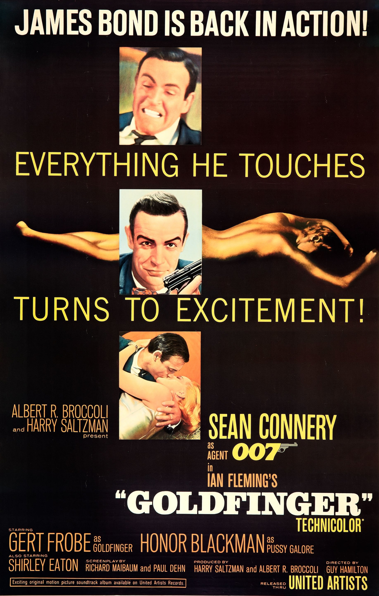
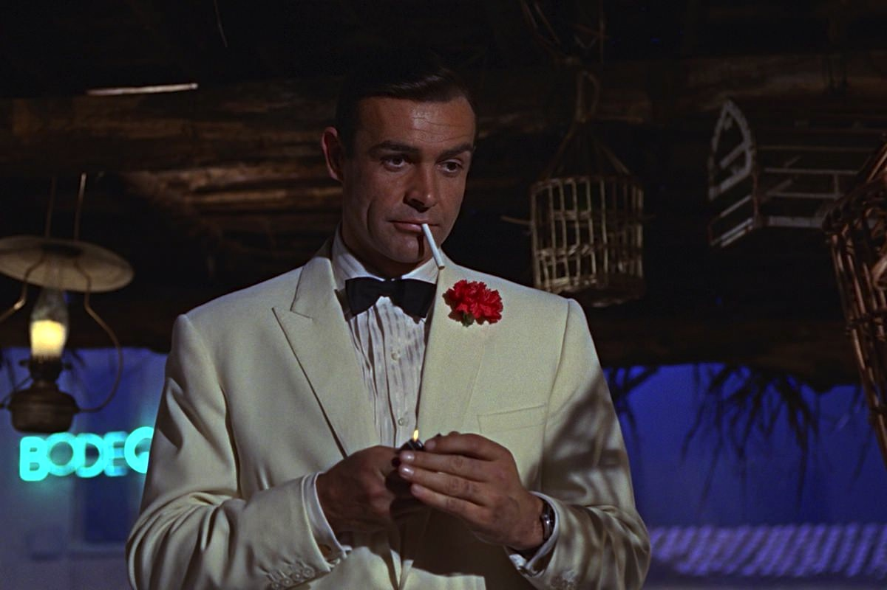
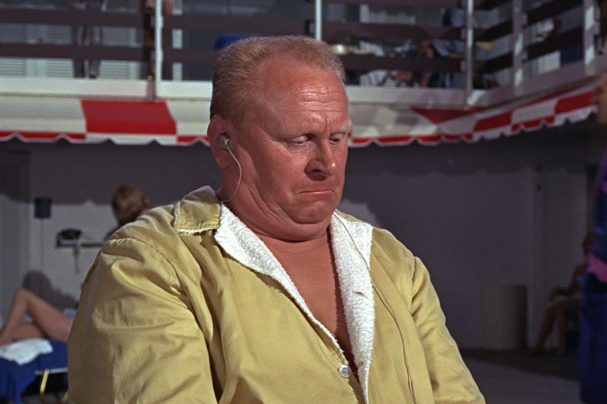

+++
titre = "<em>Goldfinger</em>, Guy Hamilton"
title = "Goldfinger, Guy Hamilton"
url = "/goldfinger-hamilton"
date = "2013-01-06T19:21:43"
Lastmod = "2013-05-11T10:07:55"
cover = "goldfinger-hamilton-sean-connery.jpg"
categorie = [ "À voir" ]
tag = [ "Action", "Blockbuster", "Espionnage", "James Bond" ]
createur = [ "Guy Hamilton" ]
acteur = [ "Bernard Lee", "Desmond Llewelyn", "Gert Fröbe", "Honor Blackman", "Sean Connery" ]
annee = [ "1965" ]
weight = 1965
saga = [ "James Bond" ]

+++

Les deux premiers films de la saga <em>James Bond</em> ont permis à l’espion de se faire une place sur les écrans, mais ce n’était d’abord qu’une place d’estime. <a href="http://voiretmanger.fr/2012/12/23/james-bond-007-contre-dr-no-young/" title="James Bond 007 contre Dr. No, Terence Young - À voir et à manger"><em>James Bond 007 contre Dr. No</em></a> comme <a href="http://voiretmanger.fr/2012/12/30/bons-baisers-russie-young/" title="Bons baisers de Russie, Terence Young - À voir et à manger"><em>Bons baisers de Russie</em></a> ont posé les bases, mais il reste encore à inventer et ce sont surtout de petits films en comparaison de ce qui va suivre. <em>Goldfinger</em>, en revanche, fait entrer la saga dans la catégorie très prisée des blockbusters à succès. Ce troisième épisode bénéficie d’un sujet conséquent pour l’époque, il se déroule aux États-Unis et multiplie les scènes d’action. Guy Hamilton derrière la caméra ajoute quelques idées qui feront date dans la saga et il permet à l’agent 007 d’entrer véritablement dans la légende. Au passage, <em>Goldfinger</em> est un excellent film dans le genre, sans doute l’un des meilleurs de la saga…

Créant une première rupture par rapport à ses deux prédécesseurs, <em>Goldfinger</em> ne s’intéresse plus au fameux SPECTRE et il ne suit pas <em>Bons baisers de Russie</em> au profit d’une intrigue nouvelle. Le MI6 envoie son agent enquêter sur Auric Goldfinger, un étrange homme d’affaires qui possède beaucoup de lingots d’or. Un peu trop même, aux yeux du trésor britannique qui se demande bien ce qu’il compte faire de tout cet or. Nous sommes alors au cœur des années 1960, une époque où les valeurs des différentes monnaies reposaient encore sur les stocks d’or des pays. Déplacer de grosses quantités d’or d’un pays à l’autre ne pouvait que déséquilibrer l’ordre mondial rendu déjà précaire par la Guerre froide et c’est fort de ce constat que James Bond est chargé d’enquêter sur cet homme. À peine a-t-il commencé son enquête que l’agent est assommé dans sa chambre et la fille avec laquelle il couchait est tuée avant d’être enduite d’une peinture à l’or. Cette mission se transforme en une affaire personnelle et l’agent poursuit ses recherches en Suisse, puis aux États-Unis où Goldfinger mène un plan machiavélique contre le stock d’or américain. 

Le scénario constitue la rupture la plus nette pour ce <em>Goldfinger</em>. C’est le premier film de la série à imaginer une séquence d’ouverture avant le générique qui n’a pas grand-chose à voir avec la suite. Guy Hamilton filme l’agent en pleine action contre la mafia de la drogue en Amérique du Sud, avant d’aller se reposer à Miami. C’est là le seul lien avec le reste de l’intrigue, puisque Goldfinger se trouve, par hasard, dans le même hôtel et James Bond peut commencer immédiatement son enquête. Contrairement à <em>Bons baisers de Russie</em>, l’agent entre directement en scène et il sera par la suite de tous les plans. Comme tous les <em>James Bond</em> qui suivront, l’agent est omniprésent et c’est sur lui que reposent toute l’intrigue et toute l’action. Felix Leiter, second rôle récurrent, occupe un rôle important bien sûr, mais il n’arrive qu’à la toute dernière minute, voire à la dernière seconde et l’agent 007 s’est débrouillé tout seul jusque-là. Tout seul, mais avec l’aide des gadgets de Q : ce dernier est apparu pour la première fois dans la saga dans le film précédent, mais Guy Hamilton lui laisse plus de place et laisse surtout plus de place à ses gadgets. <em>Goldfinger</em> introduit une voiture devenue par la suite mythique et nécessairement associée à la saga : la fameuse Aston Martin DB5. <em>James Bond 007 contre Dr. No</em> était totalement dépourvu de gadget, son successeur n’en proposait qu’un seul assez modeste, ici c’est vraiment l’explosion avec un scénario qui semble avoir été écrit pour mobiliser tous les gadgets présentés par Q. Ce principe deviendra l’un des piliers de la saga par la suite, Guy Hamilton est le premier à le mettre en œuvre et c’est une réussite.

L’équilibre, c’est peut-être la caractéristique principale de ce <em>Goldfinger</em>. Les deux premiers opus n’étaient pas équilibrés, mais ce troisième épisode très ambitieux offre au contraire la bonne dose de tous les ingrédients qui forment un bon <em>James Bond</em>. On retrouve des gadgets en quantité et parfaitement exploités, avec même une sorte d’attente qui se crée pour le spectateur qui a eu un avant-goût de ce que la voiture peut faire et qui espère bien que les gadgets seront tous exploités. L’action y est aussi bien présente, à travers des courses-poursuites en voiture, des combats armés et quelques combats individuels, entre 007 et Goldfinger ou, plus souvent, son bras droit. Ce personnage de méchant, un asiatique aussi solide qu’un roc qui utilise son chapeau de projectile mortel, avec quelques scènes d’anthologie à son actif. Le vrai méchant, Goldfinger, est lui aussi très présent et bien caractérisé, loin des personnages simplistes du SPECTRE. Son amour de l’or est bien rendu par Guy Hamilton qui multiplie les allusions et références et on a ainsi deux méchants tout à fait typiques de la saga, mais aussi plus puissants qu’avant. <em>Goldfinger</em> complète encore le tableau pour son personnage principal et Sean Connery, qui tient à nouveau le rôle, accentue le côté humoristique de l’agent 007. James Bond prend des coups, parfois assez durs d’ailleurs, mais il en rend aussi et il séduit comme jamais. Les trois James Bond Girls défilent ici, mais elles ne sont pas juste ici pour faire beau et la dernière donne même un bon coup de main à l’agent. 

Quand il réalise <em>Goldfinger</em>, Guy Hamilton a déjà une bonne dizaine d’années de carrière derrière lui. Les producteurs lui avaient déjà proposé ce travail pour <em>James Bond 007 contre Dr. No</em>, mais il avait alors refusé la proposition. Il accepte cette fois et opère quelques changements qu’il juge nécessaires. C’est ainsi la première fois que James Bond est vraiment mis en difficulté face à ses ennemis qui s’avèrent, quant à eux, vraiment dangereux. Sa réalisation s’avère aussi plus imaginative que les mises en scène de Terence Young, même si ce n’est peut-être que la conséquence de son budget plus confortable. Avec 3 millions de dollars, <em>Goldfinger</em> fait partie des gros films de son époque et son réalisateur bénéficie ainsi de la même somme réunie pour son prédécesseur, mais pour un seul film. Les explosions sont plus nombreuses — un peu trop peut-être : un avion n’explose pas au contact de l’eau en théorie… —, les cascades sont mieux réalisées et on voit quelques gadgets plus audacieux, notamment sur l’Aston Martin. De même, les scènes avec le laser impressionnent pour un film de près de cinquante ans et l’ensemble a bien vieilli. À un ou deux détails près (les plans dans les voitures, notamment), <em>Goldfinger</em> se regarde aujourd’hui sans souffrir du ridicule, ce qui est tout de même une belle performance…

<em>Goldfinger</em> n’est que le troisième épisode de la saga, mais il s’impose incontestablement comme un épisode culte. L’agent 007 tel qu’on le connaît bien est enfin là entièrement, de son flegme britannique à ses gadgets, en passant par sa célèbre voiture. En réalisant ce film où chaque composante de la saga est bien dosée, Guy Hamilton compose un classique. <em>Goldfinger</em> a bien vieilli et aujourd’hui encore, il reste un blockbuster d’action efficace et très plaisant.

<strong>James Bond reviendra dans… <a href="http://voiretmanger.fr/2013/01/13/operation-tonerre-young/" title="Opération Tonnerre, Terence Young"><em>Opération Tonnerre</em></a></strong>

<h3>Vous voulez m’aider ?<a href="#footnote_0_8272" id="identifier_0_8272" class="footnote-link footnote-identifier-link" title="&Agrave; propos de la publicit&eacute;&hellip;">1</a></h3>
<ul>
<li><a href="http://www.amazon.fr/gp/product/B001TEKHVS/ref=as_li_ss_tl?ie=UTF8&#038;tag=leblogdenic07-21&#038;linkCode=as2&#038;camp=1642&#038;creative=19458&#038;creativeASIN=B001TEKHVS">Acheter le film en Blu-Ray sur Amazon</a></li>
<li><a href="http://www.amazon.fr/gp/product/B000NJM5RO/ref=as_li_ss_tl?ie=UTF8&#038;tag=leblogdenic07-21&#038;linkCode=as2&#038;camp=1642&#038;creative=19458&#038;creativeASIN=B000NJM5RO">Acheter le film en DVD sur Amazon</a></li>
<li><a href="https://itunes.apple.com/fr/movie/goldfinger/id561631210">Acheter ou louer le film sur l’iTunes Store</a></li>
</ul>
<ul>
<li><a href="http://www.amazon.fr/gp/product/B008U6R9B4/ref=as_li_ss_tl?ie=UTF8&amp;tag=leblogdenic07-21&amp;linkCode=as2&amp;camp=1642&amp;creative=19458&amp;creativeASIN=B008U6R9B4">Acheter la trilogie complète en Blu-Ray sur Amazon</a></li>
<li><a href="http://www.amazon.fr/gp/product/B008U6R93C/ref=as_li_ss_tl?ie=UTF8&amp;tag=leblogdenic07-21&amp;linkCode=as2&amp;camp=1642&amp;creative=19458&amp;creativeASIN=B008U6R93C">Acheter la trilogie complète en DVD sur Amazon</a></li>
</ul>

<ol class="footnotes"><li id="footnote_0_8272" class="footnote"><a href="http://voiretmanger.fr/soutien/">À propos de la publicité…</a> [<a href="#identifier_0_8272" class="footnote-link footnote-back-link">&#8617;</a>]</li></ol>
