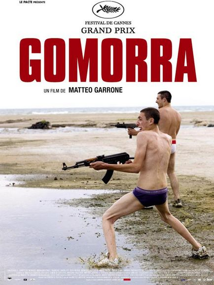

+++
type = "post"
titre = "Gomorra"
title = "Gomorra"
url = "/gomorra"
date = "2008-08-31T14:02:17"
Lastmod = "2012-05-19T09:46:31"
cover = "gomorra_garrone.jpg"
categorie = [ "À voir" ]
tag = [ "Festival de Cannes", "Mafia", "Politique" ]
createur = [ "Matteo Garrone" ]
annee = [ "2008" ]
weight = 2008

+++

Ce soir, apres plusieurs semaines sans cinéma, je suis allé voir <em>Gomorra</em> avec mes parents. Ce film italien réalisé par Matteo Garrone traite, comme son nom l’indique astucieusement<a href="#footnote_0_269" id="identifier_0_269" class="footnote-link footnote-identifier-link" title="M&eacute;lange de Camorra, pour le nom de la mafia, et de Gomorrhe, pour la ville biblique.">1</a> , de la Camorra napolitaine, une mafia qui, le film le rappelle à la fin, est l’une des plus active (comprendre, plus riche et meurtrière) du monde et qui agit autour de Naples. Ce film avait fait pas mal parler de lui à Cannes, où il avait d’ailleurs reçu le Grand Prix du Jury. Il faisait partie des films du festival que j’attendais avec le plus d’impatience, et je dois dire que je n’ai pas été déçu !

Le film reprend le livre éponyme d’un jeune auteur italien, Roberto Saviano, un livre qui se voulait une <em>nonfiction</em> à la manière de ce que faisait Truman Capote, en particulier avec <em>De sang froid</em>. Réaliste, ce livre décrivait la mafia, son organisation interne et ses méfaits à travers une vision interne puisque le point de vue était celui d’un des gangster de la mafia<a href="#footnote_1_269" id="identifier_1_269" class="footnote-link footnote-identifier-link" title="Je n&rsquo;ai pas lu personnellement le livre, donc je fais enti&egrave;rement confiance &agrave; ce que j&rsquo;ai lu &agrave; droite et &agrave; gauche">2</a>. Le film part de ce livre, mais change plusieurs points et en particulier le point de vue : au lieu de suivre le parcours d’un homme, il nous invite à suivre les parcours croisés de plusieurs membres de la mafia, mais toujours des personnes souhaitant y entrer ou en sortir. Mais on ne sort pas facilement du système, en tout cas vivant, voilà une des leçons de ce film très noir.

La majeure partie de l’action se passe dans une cité napolitaine comme on en fait plus depuis (elle doit dater des années 1960) : énorme vaisseau de béton avec cour intérieure, cette cité fermée sur elle-même est le paradis pour la mafia qui y écoule, en tout cas le film le dit, le plus de drogue en un même lieu au monde. Dans ces immeubles énormes et délabrés, tout le monde est concerné par la mafia, des acteurs principaux aux enfants, en passant bien sûr par les femmes, toujours passives et impuissantes dans ce système très masculin, mais entièrement concernées. La survie des familles ne dépend en fait que du bon vouloir de la mafia qui leur distribue un salaire hebdomadaire&#8230; en l’échange de quelques services bien sûr. Si une famille refuse d’entrer dans le système, au mieux on lui coupe les vivres, mais le plus souvent on l’oblige à partir voire on l’a tue. Même les courses sont entièrement organisées et contrôlées par la mafia : de toute façon, c’est bien simple, la mafia y contrôle tout et la police n’y entre qu’en masse et que si elle est obligée de le faire.

Le film présente ainsi, tout au long de ses 2h15, différentes facettes de l’activité de la Camorra : on y voit ainsi en détail son implication dans les catastrophes en ce qui concerne les déchets, avec des déchets ultra-toxique déposés n’importe comment dans des carrières à jour ouvert<a href="#footnote_2_269" id="identifier_2_269" class="footnote-link footnote-identifier-link" title="Et l&rsquo;on comprend alors mieux comment les d&eacute;chets peuvent s&rsquo;accumuler dans une grande ville, comme Naples, d&rsquo;un grand pays dit d&eacute;velopp&eacute; comme l&rsquo;Italie&hellip;">3</a>. On voit aussi le marché de la contre-façon dans les vêtements, le commerce de drogue bien sûr, et les règlements de compte entre bandes opposées.

Ce choix de plusieurs récits parallèles se découpant en plusieurs points du film permet au réalisateur de nous montrer cela et surtout de nous montrer que cela concerne aussi les petites gens, tous ceux qui n&rsquo;avaient rien demandé mais qui ont eu la malchance de naître au mauvais endroit, dans cette Gomorrhe italienne. Le scénario, bien fichu, rend le tout agréable mais ce choix n’a pas que des avantages. On perd un peu, je pense, en intensité et le procédé fait un peu &laquo;&nbsp;best-of&nbsp;&raquo; de tous les films de gangsters sortis. Une référence explicite à <em>Scarface</em> rappelle évidemment l&rsquo;affiliation avec ce film, et on peut s&rsquo;amuser à retrouver des allusions dans des scènes filmées &laquo;&nbsp;à la manière de&nbsp;&raquo;. Par ailleurs, certaines histoires m&rsquo;ont semblé plus intéressantes que d&rsquo;autres, mais cela est, bien sûr, totalement subjectif.

Ceci dit, ce film est littéralement excellent. La mise en scène, nerveuse, avec ses cadrages rapprochés et ses plans caméra à l&rsquo;épaule (juste ce qu&rsquo;il faut, personnellement je n&rsquo;aime pas du tout quand il y en a trop, et là je n&rsquo;ai pas été gêné&#8230;) apporte du rythme et une certaine intensité. C&rsquo;est vraiment un film à voir, même s&rsquo;il n&rsquo;est vraiment pas marrant, soyez-en prévenus ! 😉

<strong>Pour en savoir plus :</strong>

<ul style="list-style-type: disc;">
<li style="text-align: justify;"><a href="http://www.allocine.fr/film/fichefilm_gen_cfilm=134985.html">Gomorra sur Allociné</a></li>
<li style="text-align: justify;"><a href="http://www.critikat.com/Gomorra.html">Critique du film sur Critikat</a>, qui fait toujours d&rsquo;aussi bonnes critiques je trouve, et où on explique bien mieux que moi en quoi, techniquement, ce film est excellent&#8230; Je suis d&rsquo;accord avec ce que dit le critique, et je trouve ses explications convaincantes : je n&rsquo;aurai pas pu dire mieux !</li>
</ul>

<h3>Vous voulez m&rsquo;aider ?<a href="#footnote_3_269" id="identifier_3_269" class="footnote-link footnote-identifier-link" title="&Agrave; propos de la publicit&eacute;&hellip;">4</a></h3>
<ul>
<li><a href="http://www.amazon.fr/gp/product/B001ND9BWG/ref=as_li_ss_tl?ie=UTF8&tag=leblogdenic07-21&linkCode=as2&camp=1642&creative=19458&creativeASIN=B001ND9BWG">Acheter le film en DVD sur Amazon</a></li>
</ul>

<ol class="footnotes"><li id="footnote_0_269" class="footnote">Mélange de Camorra, pour le nom de la mafia, et de Gomorrhe, pour la ville biblique. [<a href="#identifier_0_269" class="footnote-link footnote-back-link">&#8617;</a>]</li><li id="footnote_1_269" class="footnote">Je n’ai pas lu personnellement le livre, donc je fais entièrement confiance à ce que j’ai lu à droite et à gauche [<a href="#identifier_1_269" class="footnote-link footnote-back-link">&#8617;</a>]</li><li id="footnote_2_269" class="footnote">Et l’on comprend alors mieux comment les déchets peuvent s’accumuler dans une grande ville, comme Naples, d’un grand pays dit développé comme l’Italie&#8230; [<a href="#identifier_2_269" class="footnote-link footnote-back-link">&#8617;</a>]</li><li id="footnote_3_269" class="footnote"><a href="http://voiretmanger.fr/soutien/">À propos de la publicité…</a> [<a href="#identifier_3_269" class="footnote-link footnote-back-link">&#8617;</a>]</li></ol>
