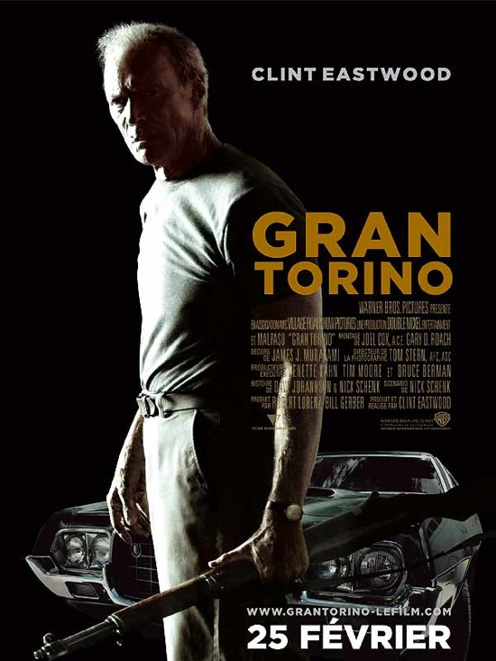

+++
type = "post"
titre = "<em>Gran Torino</em>, Clint Eastwood"
title = "Gran Torino, Clint Eastwood"
url = "/gran-torino-eastwood"
date = "2009-02-25T22:32:26"
Lastmod = "2013-12-09T15:40:10"
cover = "gran-torino-eastwood.jpg"
categorie = [ "À voir" ]
tag = [ "Société", "Violence" ]
createur = [ "Clint Eastwood" ]
acteur = [ "Ahney Her", "Bee Vang", "Clint Eastwood" ]
annee = [ "2009" ]
weight = 2009
pays = [ "États-Unis" ]

+++

Après <a href="/2008/12/19/lechange-meme-les-grands-peuvent-se-planter/"><em>L&rsquo;échange</em></a>, je craignais tellement pour la santé mentale de Clint Eastwood que je me disais, un peu triste, que c&rsquo;en était fini de lui, que ce réalisateur génial après avoir été un grand acteur était terminé&#8230; À tel point que je pensais même soigneusement éviter <em>Gran Torino</em>, son dernier film, sorti quelques mois après le précédent. Fort heureusement, je me suis trouvé devant un cinéma à une heure ou c&rsquo;était le seul film visible (je n&rsquo;allais quand même pas voir <em>Cyprien</em> !). Eh bien autant le dire d&rsquo;emblée, le Clint, le vrai, est de retour !

À bien des égards, <em>Gran Torino</em> a des allures de testament, comme si Clint Eastwood sentait la fin venir et voulait signer un film qui concentre tout son cinéma, qui reprend toutes ses thématiques phares, tout en introduisant un humour peu commun dans sa filmographie, mais ici bien réel. Le testament sur lequel le film se termine est très symbolique de cette intention que l&rsquo;on peut sentir parfois, peut-être seulement inconsciente. Par ailleurs, le film multiplie les références à d&rsquo;anciens films et d&rsquo;abord à la série des <em>Inspecteur Harry</em>, comme si le réalisateur octogénaire nous présentait sa filmographie. Enfin, la voiture mythique qui est ici à la fois secondaire et centrale : en donnant son titre au film, elle indique très clairement son poids symbolique et incarne à elle seule l&rsquo;Amérique de la grande époque, celle des Trente Glorieuses. C&rsquo;est une Ford déjà, l&rsquo;entreprise américaine par excellence ; c&rsquo;est la voiture de <em>Starksy et Hutch</em>, série phare des années 1970 et, aussi, des États-Unis de la même époque. En bref, c&rsquo;est plus qu&rsquo;une voiture alimentant vaguement le scénario, c&rsquo;est l&rsquo;Amérique à elle seule.

Bien évidemment, tous les thèmes centraux chez Clint Eastwood sont là. Les valeurs traditionnelles de l&rsquo;Amérique — la famille, le travail, mais aussi l&rsquo;importance de l&rsquo;individu face à l&rsquo;échec du collectif — sont ici toutes présentes et magnifiées, comme il se doit avec le réalisateur. La fin christique (je n&rsquo;en dis pas plus) est, à cet égard, très significative. Par ailleurs, l&rsquo;individualisme est au cœur du film puisqu&rsquo;il s&rsquo;agit en fait d&rsquo;une histoire de vengeance : la police ne fait pas son travail et c&rsquo;est donc à l&rsquo;individu qu&rsquo;il revient de faire le boulot.

Néanmoins, <em>Gran Torino</em> n&rsquo;a rien d&rsquo;un film didactique sur le plan moral. L&rsquo;acteur/réalisateur a bien trop d&rsquo;expérience pour se faire avoir et il sait conserver suffisamment de distance pour ne pas tomber dans le moralisme pur. L&rsquo;humour est le principal moteur de cette distanciation et la surprise est, au départ, complète. Rire dans un film d&rsquo;Eastwood, voilà qui n&rsquo;est pas usuel, d&rsquo;autant moins quand on sait que le rire est physique, voire bouffon. Pourtant, c&rsquo;est bien le cas ici, on rigole des grimaces de ce papy réac&rsquo; qui ne cesse de ressasser sa guerre de Corée et de parler de sa voiture, qui insulte tous les étrangers qu&rsquo;il rencontre alors qu&rsquo;il est lui-même d&rsquo;origine polonaise. Mais l&rsquo;insulte est ici partagée et devient même un jeu chez un coiffeur d&rsquo;origine italienne. Eastwood est, en tout cas, très impressionnant en bouledogue prêt à montrer ses dents, par exemple quand, à l&rsquo;enterrement de sa femme, une petite-fille vient avec le nombril à l&rsquo;air et un piercing planté. On rigole de ses vannes racistes, et on rigole d&rsquo;autant plus quand elles se répètent à l&rsquo;infini et perdent alors toute signification ou gravité.

Le film se construit initialement sur un contraste entre ce vieux réac et la famille d&rsquo;origine asiatique qui s&rsquo;installe à côté de chez lui. Une famille au contraire douce, en voie d&rsquo;intégration à l&rsquo;Amérique du melting-pot (seule la dernière génération parle anglais) et qui va, forcément, énerver notre héros. Jusqu&rsquo;à ce que, après avoir sauvé l&rsquo;un des membres de la famille, il en devienne le héros et se lie peu à peu d&rsquo;amitié avec, notamment, Thao, jeune garçon un peu paumé. S&rsquo;ajoute à cela une histoire de règlements de compte entre gangs, mais le scénario n&rsquo;est vraiment pas ce qu&rsquo;il y a de plus intéressant dans <em>Gran Torino</em>.

Évidemment, on retrouve en permanence les valeurs déjà évoquées, et d&rsquo;abord celle du melting-pot : le film oppose deux générations d&rsquo;Américains liés par le fait qu&rsquo;ils sont originaires d&rsquo;ailleurs, d&rsquo;Europe pour les anciens, d&rsquo;Asie pour les nouveaux. Mais finalement, ils sont tous sur le même plan et le film évite astucieusement tout manichéisme. Ainsi, on ne se combat pas seulement entre origines ethniques, mais aussi à l&rsquo;intérieur d&rsquo;une même communauté. À cela s&rsquo;ajoute la trame des relations entre générations qui sont aussi difficiles chez les Américains &laquo;&nbsp;de souche&nbsp;&raquo; que chez les nouveaux. D&rsquo;autre part, si le film appelle une vengeance personnelle, celle-ci est retardée, comme repoussée, et elle prend une forme pour le moins étonnante qui remet clairement en cause la valeur individualiste. Comme quoi, Clint Eastwood ne s&rsquo;enferme pas dans une idéologie&#8230;

J&rsquo;en ai déjà trop dit, je ne veux pas m&rsquo;étendre sur le sujet. Je ne peux que recommander ce film qui signe, sans conteste, le grand retour du maître du cinéma américain classique ! Oui, ce film est classique, mais cette fois le terme est positif.

Il est intéressant de se demander pourquoi <em>Gran Torino</em> réussit là où <em>l&rsquo;Échange</em> <a href="/2008/12/19/lechange-meme-les-grands-peuvent-se-planter/">s&rsquo;était, à mon humble avis, lamentablement planté</a>. Je pense que cela tient, déjà, à la présence de l&rsquo;acteur Eastwood devant la caméra : il apporte beaucoup à ce film, et manquait dans le précédent. Mais cela n&rsquo;explique pas tout, bien sûr. Il y a aussi le choix d&rsquo;une action resserrée (l&rsquo;essentiel du film se déroule entre deux mains) et un rythme bien plus soutenu que dans <em>L&rsquo;échange</em> qui m&rsquo;avait semblé bien trop long. Ici, l&rsquo;efficacité prime avant tout, et ça n&rsquo;est pas plus mal finalement&#8230; Le film est peut-être plus léger (et encore, j&rsquo;en doute) mais il est réussi.

Au moins, cela prouve que j&rsquo;avais raison : tout le monde peut se tromper, même les plus grands. Heureusement, tout le monde peut aussi se corriger, et c&rsquo;est manifestement le cas ici. Chapeau Monsieur Eastwood !

<strong>À lire</strong> : toutes les critiques sont assez unanimes, tout le monde aime le dernier Eastwood au point que ça en devient presque énervant&#8230; Bon enfin <em><a href="http://www.telerama.fr/cinema/films/gran-torino,372920,critique.php">Télérama</a></em>, les <em><a href="http://www.lesinrocks.com/cine/cinema-article/article/gran-torino/">Inrockuptibles</a></em> ou <a href="http://www.critikat.com/Gran-Torino.html">Critikat</a> sont aussi positifs que moi. J&rsquo;aime bien la dernière, comme d&rsquo;hab, pour sa longueur que le papier des deux premières ne permet pas.

<h3>Vous voulez m&rsquo;aider ?<a href="#footnote_0_1243" id="identifier_0_1243" class="footnote-link footnote-identifier-link" title="&Agrave; propos de la publicit&eacute;&hellip;">1</a></h3>
<ul>
<li><a href="http://www.amazon.fr/gp/product/B001XCWOJ4/ref=as_li_ss_tl?ie=UTF8&tag=leblogdenic07-21&linkCode=as2&camp=1642&creative=19458&creativeASIN=B001XCWOJ4">Acheter le film en Blu-Ray sur Amazon</a></li>
<li><a href="http://www.amazon.fr/gp/product/B001XCWOIU/ref=as_li_ss_tl?ie=UTF8&tag=leblogdenic07-21&linkCode=as2&camp=1642&creative=19458&creativeASIN=B001XCWOIU">Acheter le film en DVD sur Amazon</a></li>
<li><a href="http://itunes.apple.com/fr/movie/gran-torino/id367984773">Acheter ou louer le film sur l&rsquo;iTunes Store</a></li>
</ul>

<ol class="footnotes"><li id="footnote_0_1243" class="footnote"><a href="/a-propos/publicite/">À propos de la publicité…</a> [<a href="#identifier_0_1243" class="footnote-link footnote-back-link">&#8617;</a>]</li></ol>
