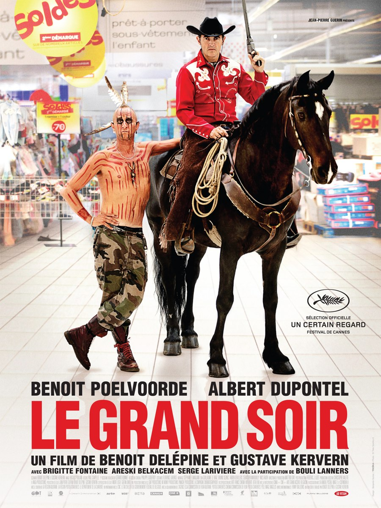
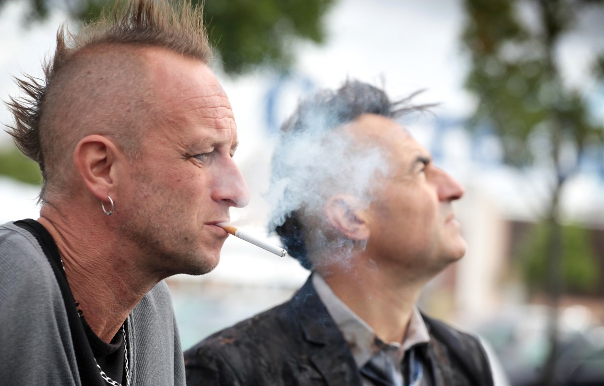
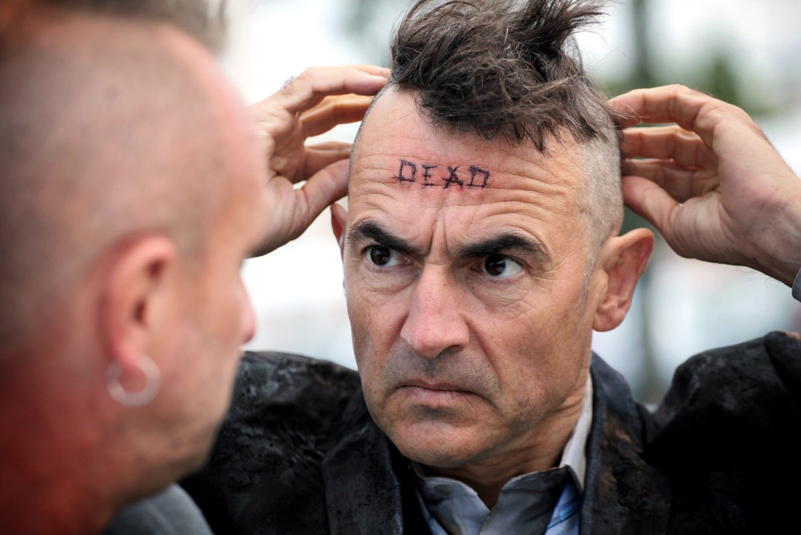

+++
type = "post"
titre = "Le Grand Soir, Benoît Delépine et Gustave Kervern"
title = "Le Grand Soir, Benoît Delépine et Gustave Kervern"
url = "/grand-soir-delepine-kervern"
date = "2012-06-23T00:34:51"
Lastmod = "2013-05-21T14:03:11"
cover = "le-grand-soir-poelvoorde-kervern-delepine.jpg"
categorie = [ "À voir" ]
tag = [ "Anarchie", "Capitalisme", "Crise", "Famille", "Farce", "Humour", "Société" ]
createur = [ "Benoît Delépine", "Gustave Kervern" ]
acteur = [ "Albert Dupontel", "Benoît Poelvoorde", "Brigitte Fontaine" ]
annee = [ "2012" ]
weight = 2012
pays = [ "France" ]

+++

Benoît Delépine et Gustave Kervern poursuivent ensemble leur cinéma anarchiste. Après les ouvrières qui engagent un tueur à gages contre leur patron dans <a title="Louise-Michel" href="http://voiretmanger.fr/2009/01/14/louise-michel/"><em>Louise-Michel</em></a> et après le road-trip décalé d&rsquo;un retraité dans <a title="Mammuth, Benoît Delépine et Gustave Kervern" href="http://voiretmanger.fr/2010/05/02/mammuth-delepine-kervern/"><em>Mammuth</em></a>, place au duo de frères sans abris dans un centre commercial. <em>Le Grand Soir</em> n&rsquo;annonce de grande révolution que par son titre, mais il propose plutôt une plongée dans le quotidien pour le moins loufoque de Not et de Dead. Une comédie satirique complètement barrée et un appel vibrant en faveur de la liberté totale.

Not se faisait appeler Benoît, mais ce temps est désormais bien révolu. Ce punk, la quarantaine, refuse ce nom et lui préfère son diminutif gravé sur le front. Il se vante d&rsquo;être le plus vieux punk à chiens d&rsquo;Europe et de fait, Not ne se déplace jamais sans son charmant Jack Russel. Ce petit chien tout mignon résume bien le personnage : ce SDF est un punk décalé, un peu looser sur les bords, un type en tout cas pas méchant malgré ses airs patibulaires. Refusant toutes formes d&rsquo;asservissement et en premier lieu le travail, il vit au jour le jour, dans la rue. Jean-Pierre, son petit frère, est très différent, du moins en apparence : ce vendeur de literie est très propre sur lui et il est aussi dynamique que son frère peut être mou. Ils sont différents, mais un élément les rassemble tous les week-ends : leurs parents, gérants d&rsquo;un restaurant La Pataterie dans un centre commercial anonyme. Un jour, Jean-Pierre est viré et il perd tout, son travail, mais aussi sa femme et sa fille. Il rejoint alors son frère dans la rue et se met à errer avec, gravé sur le front, son nouveau nom : Dead.

Les personnages de Benoît Delépine et Gustave Kervern sont très souvent des types un peu paumés et c&rsquo;est indéniablement le cas de ce duo de frères. L&rsquo;un comme l&rsquo;autre sont complètement givrés et il suffit de quelques minutes pour s&rsquo;en rendre compte. <em>Le Grand Soir</em> dresse des portraits croquignolesque à souhait entre Not qui joue aux gros durs avec son petit chien qui ne semble bon qu&rsquo;à s&rsquo;en prendre aux chats sur des affiches et surtout son frère, Dead, qui se met à dérailler complètement en cherchant à vendre ses matelas en mousse à tous les passants dans le centre commercial. Il faut dire qu&rsquo;ils tiennent ce comportement de leur mère, elle aussi frappée dans le restaurant. La voir éplucher des pommes de terre avec ses ongles verts fluo donne une idée assez précise pour comprendre à qui on a affaire : elle est même capable d&rsquo;abandonner le couffin de sa petite fille dans le MacDo du coin… Frappés, les personnages de <em>Le Grand Soir</em> sont aussi très attachants et c&rsquo;est une autre caractéristique de tous les films du duo de cinéastes venus de <em>Groland</em>. Ils ne sont pas vraiment ridicules et on sent que Benoît Delépine et Gustave Kervern ne se moquent pas d&rsquo;eux, mais les filment avec un œil attendri.

<em>Le Grand Soir</em> est une comédie qui tire plutôt en permanence vers la farce. Les situations y sont souvent absurdes et le meilleur exemple est peut-être une scène où Jean-Pierre s&rsquo;en prend à un arbuste qui se trouve sur son chemin et tente en vain de le plaquer au sol. À un autre moment, c&rsquo;est une discussion surréaliste qui s&rsquo;ouvre entre le responsable de la sécurité du centre commercial et le père des deux frères. Benoît Delépine et Gustave Kervern font parfois rire, mais on sourit plus souvent que l&rsquo;on ne rit et <em>Le Grand Soir</em> n&rsquo;est pas une grande comédie. Ce n&rsquo;était de toute manière pas le but : ce long-métrage n&rsquo;est un film léger qu&rsquo;en apparence, au fond il est tout à fait sérieux. Avec ces deux frères paumés qui errent dans un centre commercial, c&rsquo;est tout le capitalisme qui est dénoncé par les deux cinéastes. Dans <em>Le Grand Soir</em>, les plus ridicules ne sont pas forcément ceux que l&rsquo;on croit et le film pointe très clairement du doigt les gens &laquo;&nbsp;normaux&nbsp;&raquo;, ceux qui viennent faire leurs courses et qui ne réagissent même pas quand quelqu&rsquo;un veut s&rsquo;immoler au cœur du supermarché. La révolution que les deux personnages principaux essaient de mettre en place échoue à cause de l&rsquo;indifférence générale, mais qu&rsquo;importe, la révolte annoncée se fait à une autre échelle, dans un autre cadre.

Tous les films de Benoît Delépine et Gustave Kervern sont un peu loufoques, mais les deux cinéastes n&rsquo;ont plus à faire leurs preuves en matière de mise en scène et de montage. <em>Le Grand Soir</em> est tourné presque entièrement dans un centre commercial, un lieu assez peu propice aux belles images au cinéma, mais qui est ici bien valorisé. Le montage varie les sources, on a ainsi quelques plans en caméras de surveillance qui offrent un point de vue original et bien trouvé tout en créant la surprise. <em>Le Grand Soir</em> signe aussi la réunion de deux énormes acteurs qui n&rsquo;avaient jamais joué ensemble malgré d&rsquo;évidents points communs. Benoît Poelvoorde n&rsquo;avait pas été aussi excellent depuis longtemps, il retrouve ici un rôle assez proche de celui qu&rsquo;il tenait dans <a title="C’est arrivé près de chez vous, Rémy Belvaux, André Bonzel et Benoît Poelvoorde" href="http://voiretmanger.fr/2012/05/13/arrive-pres-chez-vous-belvaux-bonzel-poelvoorde/"><em>C’est arrivé près de chez vous</em></a>, son tout premier. Albert Dupontel reste quant à lui égal à lui-même, mais c&rsquo;est un plaisir de le retrouver ici. Autour d&rsquo;eux, quelques seconds rôles délicieux comme la trop rare Brigitte Fontaine qui offre une prestation remarquable ou encore le délicieux Bouli Lanners. La présence de la chanteuse n&rsquo;est d&rsquo;ailleurs pas innocente : la musique occupe une place importante dans <em>Le Grand Soir</em> avec même une place physique puisque le personnage principal rêve à plusieurs reprises de concerts des Wampas ; à un autre moment, c&rsquo;est un très beau duo entre Brigitte Fontaine et Bertranc Cantat que l&rsquo;on peut entendre.

Le cinéma de Benoît Delépine et Gustave Kervern ne ressemble à aucun autre, et c&rsquo;est très bien ainsi. <em>Le Grand Soir</em> est une œuvre burlesque, une farce anarchiste qui se ferme sur le drapeau noir et qui réclame la mort du capitalisme. C&rsquo;est aussi un double portrait loufoque, certes, mais aussi finalement plutôt émouvant. Une réussite, surtout si on aime les punks à chiens…

<h3>Vous voulez m&rsquo;aider ?<a href="#footnote_0_6888" id="identifier_0_6888" class="footnote-link footnote-identifier-link" title="&Agrave; propos de la publicit&eacute;&hellip;">1</a></h3>
<ul>
<li><a href="http://www.amazon.fr/gp/product/B008OJDMAO/ref=as_li_ss_tl?ie=UTF8&#038;tag=leblogdenic07-21&#038;linkCode=as2&#038;camp=1642&#038;creative=19458&#038;creativeASIN=B008OJDMAO">Acheter le film en Blu-Ray sur Amazon</a></li>
<li><a href="http://www.amazon.fr/gp/product/B008OJDMD6/ref=as_li_ss_tl?ie=UTF8&#038;tag=leblogdenic07-21&#038;linkCode=as2&#038;camp=1642&#038;creative=19458&#038;creativeASIN=B008OJDMD6">Acheter le film en DVD sur Amazon</a></li>
<li><a href="https://itunes.apple.com/fr/movie/le-grand-soir/id550040260">Acheter ou louer le film sur l&rsquo;iTunes Store</a></li>
</ul>

<ol class="footnotes"><li id="footnote_0_6888" class="footnote"><a href="http://voiretmanger.fr/soutien/">À propos de la publicité…</a> [<a href="#identifier_0_6888" class="footnote-link footnote-back-link">&#8617;</a>]</li></ol>
