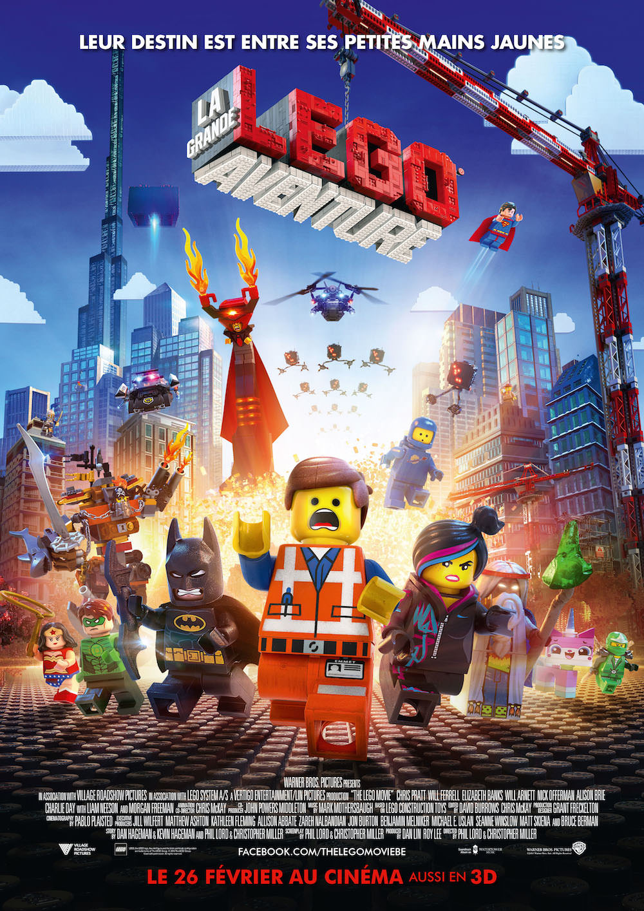
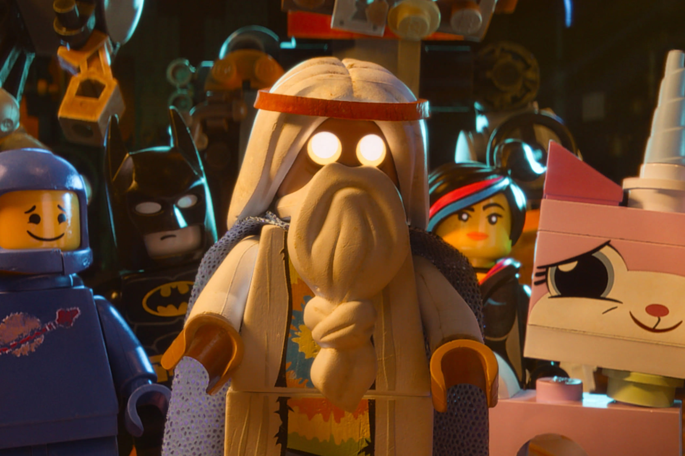
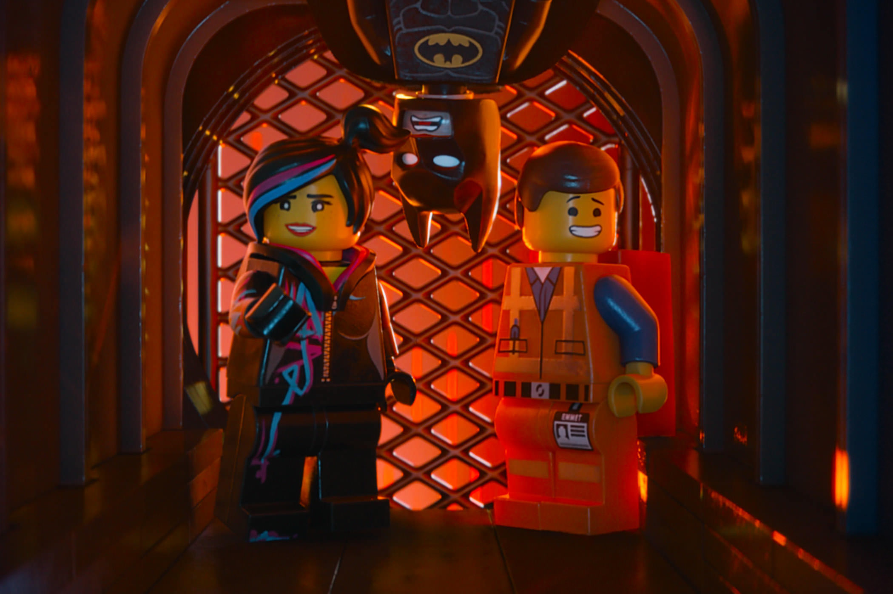

+++
type = "post"
titre = "<em>La Grande Aventure Lego</em>, Phil Lord et Chris Miller"
title = "La Grande Aventure Lego, Phil Lord et Chris Miller"
url = "/grande-aventure-lego-lord-miller"
date = "2014-02-20T22:14:39"
Lastmod = "2014-12-22T14:52:39"
cover = "la-grande-aventure-lego-lord-miller.jpg"
categorie = [ "À voir" ]
tag = [ "Animation", "Aventure", "Batman", "Humour", "Jeu", "Parodie", "Sorties du mois", "Superhéros" ]
createur = [ "Chris Miller", "Phil Lord" ]
acteur = [ "Will Ferrell" ]
annee = [ "2014" ]
weight = 2014
pays = [ "Australie", "États-Unis" ]
original = "The Lego Movie"

+++

Imaginez un film avec des Lego. Non pas quelques briques colorées ici, ou là, mais uniquement des Lego. Les personnages sont des Lego et les décors sont conçus en Lego, des bâtiments jusqu’aux flammes, des véhicules jusqu’aux gouttes d’eau. L’idée semble totalement folle, mais c’est pourtant celle qu’ont eu Phil Lord et Chris Miller. <em>La Grande Aventure Lego</em> n’est certainement pas le titre de l’année, mais ce film d’animation est lancé comme un défi : peut-on réaliser un long-métrage qui tienne la route en n’utilisant que des briques ? La réponse est positive, sans aucun doute : exploitant cette contrainte comme un formidable moteur d’inspiration, ce film d’une liberté folle est à la fois spectaculaire et très drôle. Même s’il est conçu pour être vu par tout le monde à partir de trois ans, <em>La Grande Aventure Lego</em> sera sans doute plus apprécié par les grands pour son vertige de clins d’œil et de parodies. À ne pas rater pour une séance extrêmement fun…

Sans introduction d’aucune sorte, Phil Lord et Chris Miller ouvrent leur film avec une séquence entièrement en Lego et déjà le ton humoristique du projet est sensible. <em>La Grande Aventure Lego</em> commence en effet avec la victoire temporaire du méchant qui parvient à subtiliser une arme secrète et ultime, le Kragle. Le sorcier Vitruvius qui la protégeait jusque-là annonce alors qu’une prophétie prévoit qu’un être extraordinaire viendra détruire tous les plans du méchant. Cette première séquence permet de s’acclimater avec l’animation à base de briques, et déjà on ressent la grande liberté du projet qui se permet tout dans cet univers de jouet. Un des moments forts du film suit directement, alors que l’on découvre, Emmet, un Lego ouvrier tout à fait banal dans une ville de Lego. Phil Lord et Chris Miller s’en sont donnés à cœur joie pour imaginer une sorte de dystopie, un univers où tout le monde suit précisément les règles et où tout le monde est toujours poli et heureux. Une <a href="http://www.youtube.com/watch?v=XXzr7mogFxQ">chanson niaise</a> — mais si difficile à oublier une fois qu’on l’a entendue ! — tourne en boucle toute la journée et notre futur héros passe son temps à construire des immeubles avec la joie simple de celui qui ne se pose jamais de questions. En quelques minutes, <em>La Grande Aventure Lego</em> fait preuve d’une distance sarcastique que l’on ne soupçonnait pas et qui est bien éloignée des standards des films pour enfants. Même s’il serait très exagéré de parler de film politique, le long-métrage impose malgré tout un regard critique sur notre propre société et le fait avec beaucoup d’humour. Cette ouverture est vraiment excellente et justifierait presque à elle seule de voir le film, mais ce n’est pas tout.

Une fois que le personnage principal de <em>La Grande Aventure Lego</em> apprend son statut de héros, le film change et devient un film d’aventures parodique bourré de références aussi nombreuses que variées. Il y en a pour tous les goûts, mais les superhéros ont une place de choix, avec Batman, Superman ou encore Green Lantern qui jouent des rôles importants. Mieux vaut ne pas lister trop de gags ou de clins d’œil pour garder la surprise, mais on peut dire que les scénaristes se sont amusés à ridiculiser les versions Lego de ces superhéros que l’on connaît bien, imaginant par exemple un Batman à l’égo surdimensioné et pas toujours très compétent, ou bien encore un Green Lantern qui colle en permanence Superman. Les méthodes utilisées par Phil Lord et Chris Miller ne sont pas très originales, certes, mais elles sont d’une redoutable efficacité et on rigole très souvent pendant tout le film. Le récit proprement dit n’a qu’une importance très relative, <em>La Grande Aventure Lego</em> intéresse surtout pour son univers décalé où tout est permis. Une scène de course poursuite autour d’un train est à cet égard très impressionnante : renouvelant les codes du genre, le film s’amuse à modifier les décors au fil de ses envies, comme on pouvait le faire quand on jouait aux Lego. C’est bien la force de ce film que de jouer sur cette corde sensible, sans tomber dans le sentimentalisme niais que l’on pouvait craindre. Pas sûr que les plus jeunes enfants s’y retrouvent, mais on apprécie qu’un film qui les vise explicitement ne leur parle pas comme à des débiles. Dans ce tableau très positif, la fin que l’on ne révélera pas vient un peu gâcher la fête avec un retour d’un scénario extrêmement prévisible que <em>La Grande Aventure Lego</em> avait su éviter jusque-là. Sans gâcher tout le plaisir éprouvé auparavant, cette séquence finale est un petit peu décevante et surtout un peu longue, même si le tout dernier twist est au contraire une excellente idée qui laisse espérer le meilleur pour la suite, d’ores et déjà prévue.

Difficile de ne pas s’enthousiasmer face à ce spectacle de qualité conçu exclusivement avec les briques des Lego. Loin de l’excuse marketing que l’on pouvait craindre, cette contrainte est certainement la meilleure chose qui pouvait arriver à <em>La Grande Aventure Lego</em>. Phil Lord et Chris Miller l’ont exploité pour développer encore plus leur univers et le résultat est époustouflant. L’animation de briques Lego uniquement est techniquement très réussie et surtout le film est drôle, souvent très drôle même. La fin n’est peut-être pas aussi réussie, mais qu’importe : <em>La Grande Aventure Lego</em> est un film extrêmement plaisant, à voir à tout âge pour passer un excellent moment !

<h3>Vous voulez <a href="/soutien/">m&rsquo;aider</a> ?</h3>
<ul>
<li><a href="http://www.amazon.fr/gp/product/B00IIOW026/ref=as_li_ss_tl?ie=UTF8&amp;tag=leblogdenic07-21&amp;linkCode=as2&amp;camp=1642&amp;creative=19458&amp;creativeASIN=B00IIOW026">Acheter le film en Blu-ray sur Amazon</a></li>
<li><a href="http://www.amazon.fr/gp/product/B00IIOVZ1S/ref=as_li_ss_tl?ie=UTF8&amp;tag=leblogdenic07-21&amp;linkCode=as2&amp;camp=1642&amp;creative=19458&amp;creativeASIN=B00IIOVZ1S">Acheter le film en DVD sur Amazon</a></li>
<li><a href="https://itunes.apple.com/fr/movie/la-grande-aventure-lego/id805917617">Acheter ou louer le film sur l&rsquo;iTunes Store</a></li>
</ul>

