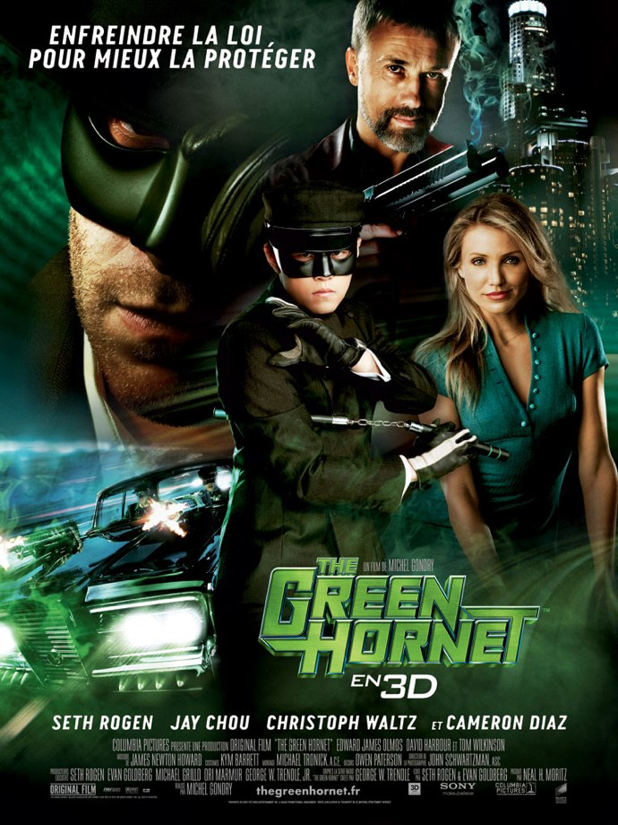
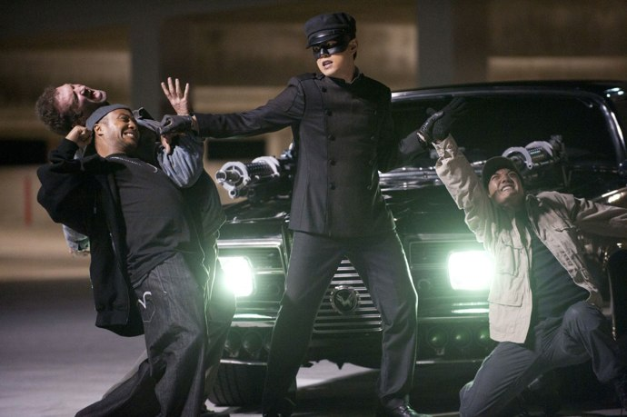

+++
type = "post"
titre = "The Green Hornet, Michel Gondry"
title = "The Green Hornet, Michel Gondry"
url = "/green-hornet-gondry"
date = "2011-01-13T01:03:14"
Lastmod = "2013-02-09T15:35:11"
cover = "the-green-hornet.jpg"
categorie = [ "À voir" ]
tag = [ "3D", "Action", "Blockbuster", "Société", "Superhéros" ]
createur = [ "Michel Gondry" ]
acteur = [ "Cameron Diaz", "Christoph Waltz", "Jay Chou", "Seith Rogen" ]
annee = [ "2011" ]
weight = 2011
pays = [ "États-Unis" ]

+++

À l&rsquo;image de son superhéros, <em>The Green Hornet</em> n&rsquo;est pas un film comme les autres. Adaptation de cette histoire de superhéros née à la radio américaine dans les années 1930 et non d&rsquo;un comics, ce blockbuster a en effet été réalisé par Michel Gondry, cinéaste français décidément touche à tout. Son apport sur un blockbuster, un film de superhéros qui plus est, était loin d&rsquo;être simple à cerner, mais le résultat est réjouissant. Certes, <em>The Green Hornet</em> est une grosse machine hollywoodienne, avec son panel de star, ses effets spéciaux numériques (et la désormais inévitable 3D), mais c&rsquo;est aussi un film de Michel Gondry qui n&rsquo;a pas sacrifié son univers au passage. Fun, libre, amusant… un film à ne pas rater.

Le Frelon Vert n&rsquo;a pas que le nom de ridicule. C&rsquo;est un superhéros qui combat le mal, certes, mais il ne l&rsquo;a même pas fait exprès. Ce frelon entre dans la vaste catégorie des superhéros sans superpouvoirs, aux côtés de Batman bien sûr, mais aussi d&rsquo;Iron Man ou encore de Kick-Ass dans un autre registre. Ces héros-là sont souvent riches et mettent leur richesse au service d&rsquo;une noble cause et de l&rsquo;achat des gadgets les plus sophistiqués. Britt Reid est également extrêmement riche : fils d&rsquo;un magnat de la presse patron d&rsquo;un très gros quotidien, il ne sait pas trop que faire de sa vie, si ce n&rsquo;est faire la fête et profiter autant qu&rsquo;il peut. Autant le dire, ce n&rsquo;est pas du goût de son père qui se désespère de voir ainsi son fils se prélasser dans la luxure permanente et surtout de le voir faire les gros titres de son propre journal. Ce père, c&rsquo;est à la fois un modèle bien sûr pour Britt, mais aussi un homme intègre qu&rsquo;il ne peut supporter, un homme qui a brisé ses rêves d&rsquo;enfant et qui réprimande toujours autant son fils devenu adulte. Quand son père meurt, Britt est abasourdi, mais il ne trouve rien de mieux que de décapiter la statue de son père. Cet acte de vengeance puéril est aussi l&rsquo;acte de naissance de son statut de superhéros. Aidé par le chauffeur de son père, un jeune asiatique qui sait faire des cafés exquis autant que donner des coups et bricoler des voitures pour leur ajouter lance-missiles ou sièges éjectables, notre héros se met en tête de lutter contre les méchants gars de la ville. Cette idée, plus proche du jeu entre potes que de la noble volonté de décimer le mal, va mener le Green Hornet et son acolyte sans nom à faire les gros titres de la presse et à se faire remarquer par le parrain de la mafia locale, le dangereux Chudnofsky qui n&rsquo;entend pas partager son empire mafieux. Attaqué à la fois par la police et la mafia, le frelon va tenter, comme le clame l&rsquo;affiche, de protéger la loi en commençant par l&rsquo;enfreindre.

Par bien des aspects, le Frelon Vert est un superhéros assez classique dans la collection américaine. C&rsquo;est un homme sans pouvoirs surnaturels, mais qui se donne les moyens d&rsquo;agir pour satisfaire son objectif. Comme Batman et Iron Man, le Green Hornet est lié à une puissante entreprise, en l&rsquo;occurrence un journal, qui lui donne d&rsquo;immenses moyens financiers qui lui laissent les coudées franches pour mener à bien son combat. Britt dispose ainsi d&rsquo;une immense fortune et il utilise également l&rsquo;entreprise qui le soutient à son profit : non en y développant des armes, mais en l&rsquo;utilisant comme arme médiatique pour mettre en valeur son combat. La presse joue souvent un rôle important dans les films de superhéros : elle est centrale dans Superman, par exemple, autant d&rsquo;ailleurs que dans ce film où le superhéros est aussi le patron du journal qui est au centre des préoccupations. <em>The Green Hornet</em> présente bien les enjeux et la manière dont Britt utilise son journal pour mettre en valeur ses actes en tant que superhéros. Le combat du Frelon Vert est tout autant classique : même si ce n&rsquo;est pas toujours forcément explicite dans le récit, c&rsquo;est toujours la mafia locale qui est visée, et d&rsquo;abord son chef, un parrain aux origines soviétiques qui s&rsquo;est mis en tête de contrôler tout le commerce illégal de la ville. Dans un second temps, ce méchant extrêmement classique arborera même un semblant de costume (rouge, bien sûr) qui le rapproche du superhéros en négatif. Le Frelon Vert dispose enfin des attributs attendus pour un superhéros, la voiture équipée de multiples gadgets et armes, le masque, le costume, la signature (une carte de visite)…

Tous les éléments sont rassemblés et pourtant, le Frelon Vert n&rsquo;a rien d&rsquo;un superhéros bien sérieux, et c&rsquo;est là tout l&rsquo;intérêt. Le héros de <em>The Green Hornet</em> est, disons-le, un vrai loser qui ne réussit jamais ce qu&rsquo;il entreprend, comme l&rsquo;assène, terrible condamnation, son père alors que le jeune Britt s&rsquo;est fait virer de l&rsquo;école pour avoir tenté, en vain, de défendre une fille sans défense dans la cour de récrée. Le Frelon Vert ne serait absolument rien sans Kato qui occupe le rôle traditionnel du &laquo;&nbsp;<em>sidekick</em>&nbsp;&raquo; et qui fait tout dans le duo. C&rsquo;est lui qui bricole les voitures et invente des armes, c&rsquo;est lui qui combat vraiment les méchants, c&rsquo;est lui qui a inventé les costumes, c&rsquo;est lui même qui a trouvé le nom. Sans lui, Britt n&rsquo;est plus qu&rsquo;un loser vantard et pathétique, ce qui est inhabituel bien sûr pour un superhéros. Il n&rsquo;a non seulement aucun superpouvoirs, mais il n&rsquo;est pas doué pour autant, un peu à l&rsquo;image de Kick-Ass. Ainsi, quand il prend une initiative (enregistrer son adversaire pour briser sa carrière), c&rsquo;est l&rsquo;occasion d&rsquo;un échec total avec un côté en plus ridicule (la clé USB sushi). Autre élément atypique dans <em>The Green Hornet</em>, les méchants ne paraissent pas bien méchants tandis que la lutte menée par le héros semble bien enfantine. Si Britt enfile le costume du Frelon Vert, c&rsquo;est d&rsquo;abord parce que ça l&rsquo;amuse beaucoup, mais c&rsquo;est aussi pour se venger de son père et lui prouver, <em>post-mortem</em>, qu&rsquo;il n&rsquo;est pas qu&rsquo;un bon à rien. Nulle morale dans ce choix, alors que les superhéros sont en général motivés par des motifs moraux, souvent la volonté de supprimer une source de problèmes, ou lutter contre l&rsquo;injustice. Si Britt devient le Green Hornet en somme, c&rsquo;est plus par accident que par choix. C&rsquo;est sans doute ce qui fait la spécificité du personnage, et donc son intérêt.

Michel Gondry aux commandes pour un blockbuster hollywoodien… l&rsquo;idée avait de quoi faire sourire, ou trembler. Lui qui était connu pour ses films bricolés (à l&rsquo;image de son dernier, <em>Soyez sympas, rembobinez</em>) s&rsquo;est trouvé à la tête d&rsquo;un film à gros budget (90 millions de dollars <a href="http://www.imdb.com/title/tt0990407/">estimés</a>). Le résultat prouve que le réalisateur français est un excellent cinéaste : faisant fi des contraintes des studios américains, il a imposé sa patte tout en respectant le cahier des charges. <em>The Green Hornet</em> est ainsi un film à la fois très fun, drôle même, bien rythmé par une action continue, mais aussi un film qui retrouve la liberté formelle si chère à Gondry et qui trouve ici son point culminant dans une scène de <em>split-screen</em> (partage de l&rsquo;écran) absolument ébouriffante et qui fonctionne parfaitement bien. La fusion entre Hollywood et Gondry est réussie, même si <em>The Green Hornet</em> n&rsquo;est peut-être pas aussi facile d&rsquo;accès que les plus décérébrés des blockbusters, ce qui n&rsquo;est pas un inconvénient. Cette liberté formelle se retrouve aussi dans le côté un peu caricatural des personnages, notamment le costume qui se rapproche d&rsquo;une parodie de costume de superhéros. <em>The Green Hornet</em> fait dans l&rsquo;outrance et cela lui réussit, le film étant ainsi à plusieurs reprises drôle, ce qui n&rsquo;était pas évident sur le papier. L&rsquo;humour provient notamment de la relation entre les deux héros, une relation qui surligne la tension homosexuelle, un aspect qui est souvent sous-jacent dans les comics (Batman et Robin bien sûr, pour ne citer qu&rsquo;eux). C&rsquo;est une véritable réussite que même la 3D, aussi inutile<a href="#footnote_0_4539" id="identifier_0_4539" class="footnote-link footnote-identifier-link" title="La meilleure utilisation de la 3D, la seule peut-&ecirc;tre m&ecirc;me, se situe dans le g&eacute;n&eacute;rique de fin. Se taper un film entier assombri et flou pour un g&eacute;n&eacute;rique de fin, certes amusant, voil&agrave; qui est p&eacute;nible&hellip;">1</a> qu&rsquo;elle nuit à la qualité de l&rsquo;image, ne parvient pas à gâcher. Cette réussite, le film la doit aussi à ses interprètes, tous à un très beau niveau, que ce soit Seth Rogen pour le rôle-titre ou Jay Chou qui fait un très bon Kato. Même Cameron Diaz est très bien, mais c&rsquo;est Christophe Waltz que l&rsquo;on remarque en particulier, même si son rôle est bien trop réduit à mon goût.

Michel Gondry et blockbuster de superhéros. Avouons-le, le mélange intriguait, entre intérêt et méfiance pour cet assemblage qui n&rsquo;allait pas de soi. Avec <em>The Green Hornet</em>, Gondry prouve qu&rsquo;il est un grand cinéaste capable d&rsquo;imposer son propre univers à l&rsquo;industrie cinématographique d&rsquo;Hollywood. Le résultat est réjouissant : c&rsquo;est à la fois un spectacle réjouissant, du grand spectacle comme on aime en voir en salles, et un film finalement plus libre qu&rsquo;il n&rsquo;y paraît, où les thèmes du superhéros sont traités à la limite de la parodie. Ce <em>Green Hornet</em> est une excellente surprise, à ne pas rater.

<h3>Vous voulez m&rsquo;aider ?<a href="#footnote_1_4539" id="identifier_1_4539" class="footnote-link footnote-identifier-link" title="&Agrave; propos de la publicit&eacute;&hellip;">2</a></h3>
<ul>
<li><a href="http://www.amazon.fr/gp/product/B004KKXOAY/ref=as_li_ss_tl?ie=UTF8&#038;tag=leblogdenic07-21&#038;linkCode=as2&#038;camp=1642&#038;creative=19458&#038;creativeASIN=B004KKXOAY">Acheter le film en Blu-Ray sur Amazon</a></li>
<li><a href="http://www.amazon.fr/gp/product/B004IK8GZ4/ref=as_li_ss_tl?ie=UTF8&#038;tag=leblogdenic07-21&#038;linkCode=as2&#038;camp=1642&#038;creative=19458&#038;creativeASIN=B004IK8GZ4">Acheter le film en DVD sur Amazon</a></li>
<li><a href="https://itunes.apple.com/fr/movie/the-green-hornet/id432046650">Acheter ou louer le film sur l&rsquo;iTunes Store</a></li>
</ul>

<ol class="footnotes"><li id="footnote_0_4539" class="footnote">La meilleure utilisation de la 3D, la seule peut-être même, se situe dans le générique de fin. Se taper un film entier assombri et flou pour un générique de fin, certes amusant, voilà qui est pénible… [<a href="#identifier_0_4539" class="footnote-link footnote-back-link">&#8617;</a>]</li><li id="footnote_1_4539" class="footnote"><a href="http://voiretmanger.fr/soutien/">À propos de la publicité…</a> [<a href="#identifier_1_4539" class="footnote-link footnote-back-link">&#8617;</a>]</li></ol>
