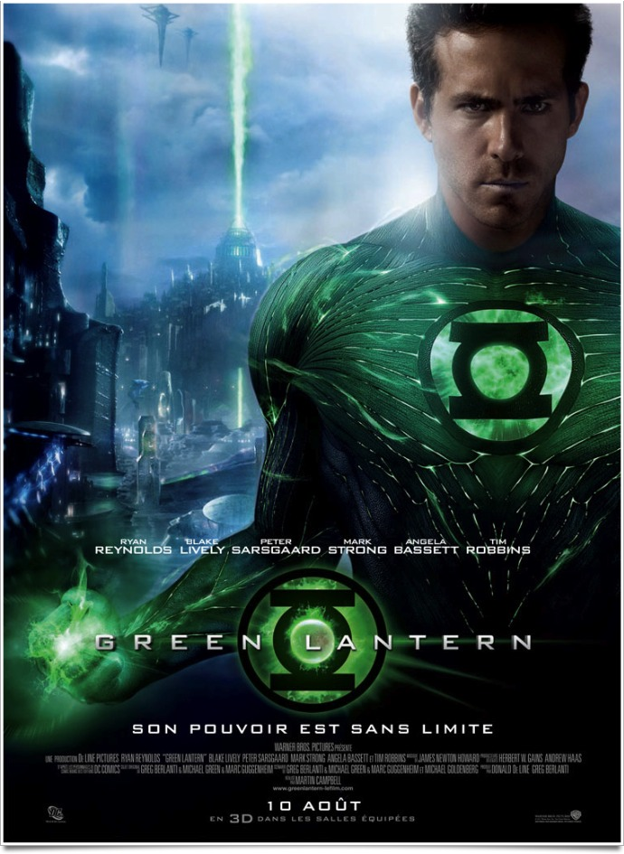
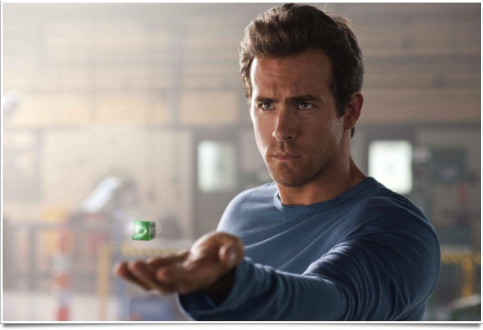
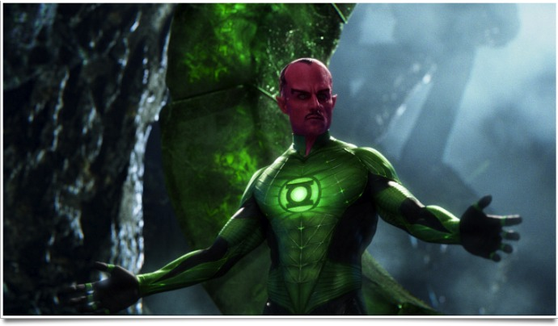

+++
type = "post"
titre = "<em>Green Lantern</em>, Martin Campbell"
title = "Green Lantern, Martin Campbell"
url = "/green-lantern-campbell"
date = "2011-11-29T23:30:46"
Lastmod = "2015-03-13T23:52:48"
cover = "green-lantern.jpg"
categorie = [ "À voir" ]
tag = [ "Adaptation bande-dessinée", "Blockbuster", "Comics", "Kitsch", "Science-Fiction", "Superhéros", "Vite oublié" ]
createur = [ "Martin Campbell" ]
acteur = [ "Blake Lively", "Mark Strong", "Peter Sarsgaard", "Ryan Reynolds" ]
annee = [ "2011" ]
weight = 2011
pays = [ "États-Unis" ]

+++

Les adaptations de comics ont la côte en ce moment, pour le meilleur et pour le pire. S&rsquo;il fallait un exemple pour illustrer cette catégorie, on choisirait bien <em>Green Lantern</em>. Cette adaptation réalisée par Martin Campbell accumule tout ce qu&rsquo;il ne faut pas faire dans une adaptation de comics. Le film pourra faire office de bon contre-exemple pour les cinéastes en herbe, mais il est à peine supportable, même en le regardant au second degré.

Personnage créé dans les années 1940, le Green Lantern est un superhéros d&rsquo;un genre assez particulier. Ses pouvoirs ne sont pas naturels comme Spiderman ou Superman, ils ne sont pas créés de toutes pièces comme pour ceux d&rsquo;<a href="http://voiretmanger.fr/2010/04/29/iron-man-2-favreau/">Iron Man</a>, mais ils proviennent d&rsquo;un anneau vert. Cet anneau choisit son porteur à la mort du précédent et il confère à celui qui le porte des pouvoirs illimités. Par sa seule volonté, le Green Lantern peut créer tout ce qu&rsquo;il veut, une arme ou même un bâtiment complet. Leur rôle est de surveiller l&rsquo;univers, rien de moins. La mythologie de cet univers est complexe et <em>Green Lantern</em> prend beaucoup de temps à le mettre en place. Le film commence par une longue introduction, mais les explications reviendront à différentes étapes. <em>Green Lantern</em> suit les tribulations de Hal Jordan, le premier humain choisit pour être un de ces soldats de l&rsquo;univers. Les autres Green Lantern peinent à prendre cet être jugé trop faible, mais c&rsquo;est le seul qui ose se mettre en travers de la route de Parallax, un terrible méchant qui veut rien de moins que détruire les Green Lantern et donc l&rsquo;univers…

L&rsquo;histoire de <em>Green Lantern</em> peut paraître complexe à l&rsquo;écrit et la longueur de son synopsis trahit bien sa difficulté à résumer le scénario. Pourtant, à l&rsquo;écran, ce n&rsquo;est pas vraiment la complexité qui saute aux yeux. Bien au contraire, <em>Green Lantern</em> est sur des rails et propose une histoire à la banalité affligeante. Dès les premières scènes, on sent les rôles attribués à chaque personnage : le petit garçon qui perd son père aviateur sera le gentil, le petit garçon qui passe ses temps dans les livres sera le méchant. Malheureusement, Martin Campbell ne déçoit pas et son long-métrage applique à la lettre ce que l&rsquo;on avait deviné dès les premiers instants. Cette banalité est gênante puisqu&rsquo;elle bloque totalement l&rsquo;intérêt du spectateur : on sait comment cela va se terminer avant même que <em>Green Lantern</em> commence et les enjeux sont vraiment limités. L&rsquo;adaptation du comics original est peut-être fidèle, mais peu importe : ce qui peut passer dans des cases des années 1940 devient gênant dans un film de 2011.

Rien ne permet au spectateur de s&rsquo;intéresser à cet univers qui se veut complexe, mais qui devient vite grotesque. La présentation des Green Lantern est beaucoup trop caricaturale et schématique et leur histoire est pleine de choses étranges qui diminuent son réalisme. Sans dévoiler la fin de <em>Green Lantern</em>, même si spoiler le film s&rsquo;avère très difficile, disons simplement qu&rsquo;elle est d&rsquo;une banalité telle que l&rsquo;on peine à comprendre pourquoi elle n&rsquo;a pas été appliquée d&rsquo;emblée. L&rsquo;histoire des Green Lantern se veut complexe, elle ne parvient qu&rsquo;à être ridicule avec un défilé d&rsquo;extraterrestres censés être originaux, mais qui sont tous d&rsquo;un ennui abyssal (ils ressemblent quasiment tous à des humains, au mieux on aura une tête de poisson sur un corps humain). La bonne idée toutefois est de placer la terre et les humains au second plan, ce qui est plutôt rare dans le genre. Malheureusement, <em>Green Lantern</em> ne fait rien de cette idée… Pour ne rien arranger, le héros du film de Martin Campbell est soporifique, au mieux. L&rsquo;intérêt des superhéros est toujours leurs doutes, leur questionnement… ici il n&rsquo;en est jamais question. Du jour au lendemain, il devient Green Lantern et… voilà, c&rsquo;est tout. Il essaie bien à un moment d&rsquo;abandonner son rôle, mais il n&rsquo;y a là encore aucun suspense et il rentre bien vite dans les rangs. On a rarement vu aussi peu intéressant, même <a href="http://voiretmanger.fr/2011/08/20/captain-america-first-avenger-johnston/">Captain America</a> qui était pourtant un héros bien lisse, était bien plus captivant. C&rsquo;est dire…

<em>Green Lantern</em> frappe dès les premières images par sa laideur. On imagine, on espère en tout cas, que les effets visuels sont tous recherchés, mais le résultat est vraiment très kitsch et vieillot. Il faut voir ces combinaisons vertes flashy, ces têtes d&rsquo;un rouge pourpre, ces flots d&rsquo;énergie verte baveux… tout est d&rsquo;un mauvais goût assez incroyable. <em>Green Lantern</em> aurait pu être un film assez drôle au second degré, mais Martin Campbell ne fait malheureusement aucun pas en ce sens. Son film est au contraire d&rsquo;un sérieux troublant tant il tranche avec le style graphique, kitchissime. Sans parler de goûts et de couleurs, on se demande quand même comment un film a pu engloutir autant d&rsquo;argent pour un résultat aussi médiocre. Un point positif toutefois : les combats où chaque partie peut créer l&rsquo;arme de son choix sont assez funs et plutôt bien rendus. Malheureusement, ils sont peu nombreux et ne modifient pas l&rsquo;impression d&rsquo;ensemble.

Difficile de trouver quelque chose à sauver dans <em>Green Lantern</em> : j&rsquo;ai beau chercher, mais j&rsquo;ai de la peine. Le film de Martin Campbell aurait pu être drôle, mais ce n&rsquo;est même pas le cas. Trop prévisible, trop sérieux, le film fait sentir ses deux heures et s&rsquo;avère même assez pénible à regarder. De la part du réalisateur du très bon <a href="http://voiretmanger.fr/casino-royale-campbell/" title="Casino Royale, Martin Campbell"><em>Casino Royal</em></a>, c&rsquo;est assez décevant…

<h3>Vous voulez m&rsquo;aider ?</h3>
<ul>
<li><a href="http://www.amazon.fr/gp/product/B005GYJQE6/ref=as_li_ss_tl?ie=UTF8&tag=leblogdenic07-21&linkCode=as2&camp=1642&creative=19458&creativeASIN=B005GYJQE6">Acheter le film en Blu-Ray (et DVD) sur Amazon</a></li>
<li><a href="http://www.amazon.fr/gp/product/B005F49KHK/ref=as_li_ss_tl?ie=UTF8&tag=leblogdenic07-21&linkCode=as2&camp=1642&creative=19458&creativeASIN=B005F49KHK">Acheter le film en DVD sur Amazon</a></li>
</ul>

