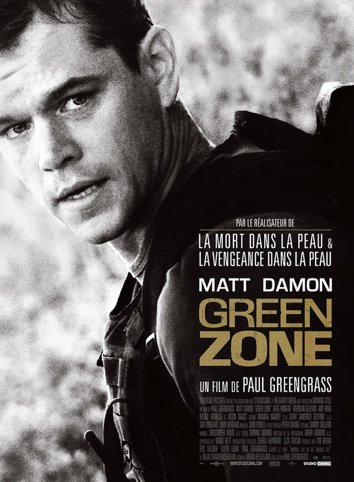
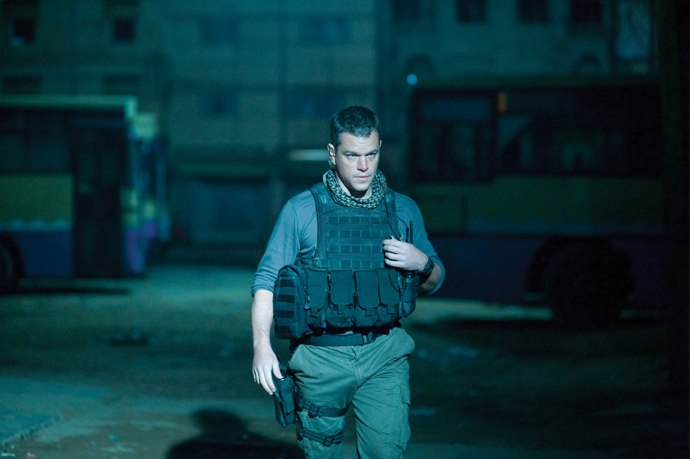
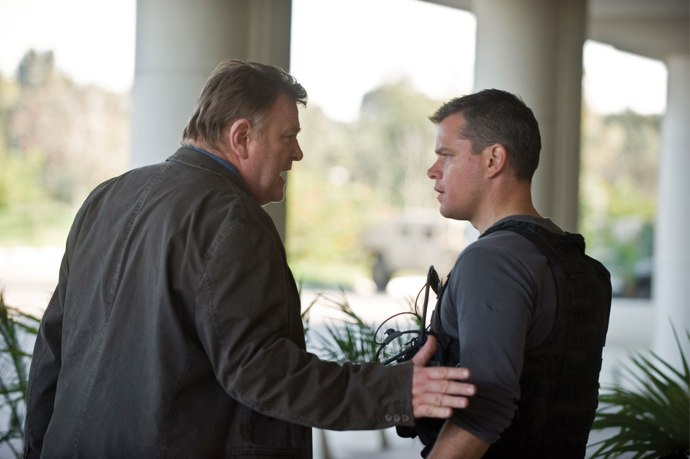
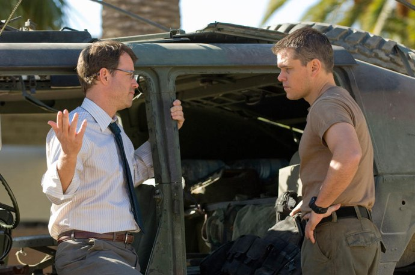

+++
type = "post"
titre = "<em>Green Zone</em>, Paul Greengrass"
title = "Green Zone, Paul Greengrass"
url = "/green-zone-greengrass"
date = "2010-04-26T00:03:23"
Lastmod = "2014-03-16T19:03:07"
cover = "green-zone-matt-damon.jpg"
categorie = [ "À voir" ]
tag = [ "Blockbuster", "Docufiction", "Guerre", "Irak" ]
createur = [ "Paul Greengrass" ]
acteur = [ "Amy Ryan", "Greg Kinnear", "Jason Isaacs", "Matt Damon" ]
annee = [ "2010" ]
weight = 2010
pays = [ "États-Unis" ]

+++

Paul Greengrass est devenu ultra célèbre pour la trilogie Jason Bourne, sorte de James Bond survitaminé où le réalisateur britannique affinait son style nerveux et hyper efficace. Mais Greengrass est aussi l&rsquo;auteur de docufictions politiquement engagés depuis <em>Sunday Bloody Sunday</em> qui dénonçait les violences en Irlande du Nord par l&rsquo;évocation très documentée du <a href="http://fr.wikipedia.org/wiki/Bloody_Sunday_(1972)">samedi sanglant</a> jusqu&rsquo;à <em>Vol 93</em> qui retraçait les dernières heures du vol qui aurait dû s&rsquo;abattre sur Washington. <em>Green Zone</em>, son dernier film, condense les deux tendances du réalisateur et offre une synthèse, liant la précision du docufiction à l&rsquo;action nerveuse des <em>Jason Bourne</em>. Un mélange efficace…

<em>Green Zone</em> suit Roy Miller, adjudant-chef de l&rsquo;armée américaine chargé de trouver les armes de destructions massives dans un Irak dévasté justement pour ces armes. Les États-Unis se sont engagés sur la menace que faisait courir le pays de Saddam Hussein au monde occidental, mais ces menaces sont finalement restées virtuelles. Au début du film, on assiste à une des missions de la brigade de Miller : quelques véhicules foncent dans un Bagdad où règne l&rsquo;anarchie et où le pillage est devenu la norme. Ils arrivent sur le lieu censé contenir les armes puis perdent un homme à la sécuriser avant de s&rsquo;apercevoir qu&rsquo;en fait d&rsquo;armes de destruction massive, il n&rsquo;y a qu&rsquo;un hangar désaffecté depuis de nombreuses années et quelques pièces détachées de toilettes. En bon soldat, Miller s&rsquo;exécute, mais il sent bien que quelque chose ne tourne pas rond : lui et ses hommes n&rsquo;ont trouvé strictement aucune arme et tous les renseignements supposés corrects se révèlent en fait faux.

Roy Miller est un naïf qui ne conçoit pas une seule seconde que les États-Unis aient fait la guerre sans armes. Comme il le dit lui-même à un moment, on l&rsquo;a envoyé pour trouver des armes qui, manifestement, n&rsquo;existent pas et il ne peut pas continuer ainsi sans réagir. Sa hiérarchie ne veut rien entendre, lui rappelant son rôle de simple exécutant, mais il trouve quand même des oreilles plus attentives, notamment dans les rangs de la CIA. Alors qu&rsquo;il tente de corriger ce qu&rsquo;il considère comme une injustice, l&rsquo;armée et le gouvernement américains instaurent tant bien que mal un gouvernement supposé démocrate avec le succès que l&rsquo;on connaît encore aujourd&rsquo;hui.

<em>Green Zone</em> est un docufiction puisqu&rsquo;il part d&rsquo;évènements réels et les agrémente d&rsquo;éléments fictifs. Le cadre du film, la guerre en Irak, est évidemment réel, de même que la chronologie est exacte en ce qui concerne les grands moments du film comme la dissolution de l&rsquo;armée irakienne et du parti Baas simultanément à la création d&rsquo;un premier gouvernement dirigé par un irakien d&rsquo;origine placé par les Américains. Les pillages, les tensions permanentes et en augmentation constante sont tout aussi vraies et si la caméra de Greengrass ne s&rsquo;est jamais posée en Irak pendant le tournage (réalisé en Espagne et au Maroc et sans fond vert, comme quoi les décors à l&rsquo;ancienne ont du bon), on a souvent l&rsquo;impression de revoir les images diffusées à l&rsquo;époque par tous les journaux télévisés de la planète. La reconstitution est soignée et le film ne sonne jamais faux, tout y est crédible, que ce soit les actions de l&rsquo;armée américaine ou le côté irakien. Les dialogues en arabe et la présence sur le tournage de vétérans de la guerre en Irak contribuent sans nul doute à ce sentiment permanent de réalisme.

La part de fiction est néanmoins très présente et inévitable étant donnée la proximité historique du sujet. Il est d&rsquo;ailleurs toujours frappant, à propos, de constater à quel point la culture anglo-saxonne peut revenir sur un sujet aussi brulant et récent que la guerre en Irak et en faire la critique. Le film opère une plongée au cœur des services secrets américains et le scénariste aurait dû obtenir un accès à une quantité énorme de sujets classés secret défense pour écrire la réalité. Cela n&rsquo;est évidemment pas pensable et <em>Green Zone</em> s&rsquo;en tient au vraisemblable. Les conflits entre services secrets et armée sont un classique et ils ont sans doute été exacerbés quand les premiers connaissaient le terrain et préconisaient des mesures que les seconds ne pouvaient appliquer du fait des pressions politiques. Le film a bien sûr certainement romancé tout cela, mais l&rsquo;ensemble m&rsquo;a semblé toujours convaincant.

Fiction aussi par le point de vue. <em>Green Zone</em> suit quasiment constamment Miller et même s&rsquo;il présente à plusieurs reprises le camp adverse (les réunions des anciens cadres de l&rsquo;armée irakienne) ou le centre de commandement américain pour faire avancer l&rsquo;intrigue, il reste néanmoins concentré sur le point de vue du soldat. À ce titre, on s&rsquo;éloigne du documentaire se voulant objectif et d&rsquo;ailleurs Paul Greengrass entend bien passer un message très clair contre l&rsquo;administration Bush qui a voulu la guerre. <em>Green Zone</em> se veut ainsi un pamphlet contre la guerre, mais fort heureusement, il n&rsquo;est jamais lourd dans la dénonciation. Le film ne dit jamais rien, il se contente de montrer et de faire comprendre par l&rsquo;image, et c&rsquo;est tant mieux. Le plan qui clôt le film est parfaitement révélateur de son fonctionnement : la caméra quitte le niveau du sol et monte vers le ciel, révélant au loin une gigantesque raffinerie de pétrole. Un plan et la véritable motivation des Américains, la seule raison qui explique cette guerre insensée est rappelée. Greengrass nous évite les messages finaux comme tant de réalisateurs en auraient fait, il fait confiance à l&rsquo;intelligence de ses spectateurs. <em>Green Zone</em> ne laisse de toute façon pas vraiment de place au doute et la dénonciation saute aux yeux d&rsquo;emblée. Le spectateur est invité à s&rsquo;identifier à Miller et à s&rsquo;indigner avec lui, et avec les Irakiens d&rsquo;ailleurs.

Paul Greengrass n&rsquo;a pas oublié pour autant les leçons de Jason Bourne et le fait de voir Matt Damon à l&rsquo;écran ferait presque oublier le sujet original au profit d&rsquo;un <em>Green Zone dans la peau</em>. Le réalisateur ne laisse jamais retomber la pression pendant les deux petites heures du film et même les scènes de dialogue sont filmées en mouvement. La caméra ne se pose jamais, toujours à l&rsquo;épaule ou en travellings. Dans les scènes d&rsquo;action, elle aurait tendance à trop bouger, mais le réalisateur rappelle sa très grande maîtrise en parvenant à maintenir l&rsquo;action lisible, à la tenir de bout en bout sans jamais perdre le spectateur. Son style reste très efficace, même s&rsquo;il n&rsquo;est pas très original et peut parfois donner un sentiment de déjà-vu. La musique m&rsquo;a semblé un peu trop présente et aurait gagné à plus de finesse à mon avis.

Le bilan de <em>Green Zone</em> est plutôt positif en ce qui me concerne. Le mélange entre action nerveuse à la <em>Jason Bourne</em>, et docufiction critique m&rsquo;a paru efficace et plaisant. Certes, la caméra de Greengrass est parfois trop nerveuse et on en sort un peu sonné, mais après tout, c&rsquo;est l&rsquo;effet recherché. Le message est en tout cas très efficace, même si évidemment, il est plus facile à dire sept ans après. Je ne crois pas néanmoins que le film soit &laquo;&nbsp;en retard&nbsp;&raquo; : si l&rsquo;on a lu en long, en large et en travers que les armes n&rsquo;ont jamais existé et que les Américains ont fait la guerre par intérêt financier essentiellement, l&rsquo;avait-on vu dans une œuvre de fiction grand public ?

Les avis sont souvent plus négatifs sur Internet. Alexandre de Plan-C par exemple a <a href="http://www.plan-c.fr/article-green-zone-la-vengeance-dans-le-pot-aux-roses-48838609.html">regretté</a> un traitement qu&rsquo;il juge démagogue. Si effectivement le film est orienté clairement en faveur d&rsquo;un camp, je ne me suis jamais senti manipulé à mon insu : peut-être attendais-je un film contre l&rsquo;administration Bush ? Critique plus dure encore de Benjamin sur Playlist Society : il <a href="http://www.playlistsociety.fr/2010/04/green-zone-de-paul-greengrass-610.html">évoque</a> le fait que les personnages ne sont pas très creusés, ce qui n&rsquo;est effectivement pas faux. Par contre, je ne trouve pas que Greengrass n&rsquo;ait rien à dire sur le sujet des armes de destruction massive, au contraire même. Avis également négatif chez <a href="http://www.critikat.com/Green-Zone.html">Critikat</a>. Quelques avis plus positifs malgré tout, que ce soit celui de <a href="http://www.toujoursraison.com/2010/02/green-zone.html">Rob Gordon</a> ou de Nicolas de <a href="http://www.filmosphere.com/2010/04/critique-green-zone-2010/">Filmosphère</a>.

<h3>Vous voulez m&rsquo;aider ?<a href="#footnote_0_3213" id="identifier_0_3213" class="footnote-link footnote-identifier-link" title="&Agrave; propos de la publicit&eacute;&hellip;">1</a></h3>
<ul>
<li><a href="http://www.amazon.fr/gp/product/B0042ZUNLA/ref=as_li_ss_tl?ie=UTF8&tag=leblogdenic07-21&linkCode=as2&camp=1642&creative=19458&creativeASIN=B0042ZUNLA">Acheter le film en Blu-Ray sur Amazon</a></li>
<li><a href="http://www.amazon.fr/gp/product/B003GISS2A/ref=as_li_ss_tl?ie=UTF8&tag=leblogdenic07-21&linkCode=as2&camp=1642&creative=19458&creativeASIN=B003GISS2A">Acheter le film en DVD sur Amazon</a></li>
<li><a href="https://itunes.apple.com/fr/movie/green-zone/id384283736">Acheter ou louer le film sur l&rsquo;iTunes Store</a></li>
</ul>

<ol class="footnotes"><li id="footnote_0_3213" class="footnote"><a href="http://voiretmanger.fr/soutien/">À propos de la publicité…</a> [<a href="#identifier_0_3213" class="footnote-link footnote-back-link">&#8617;</a>]</li></ol>
