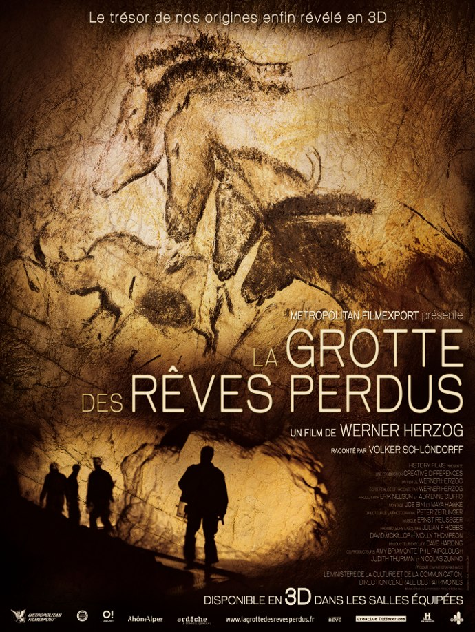
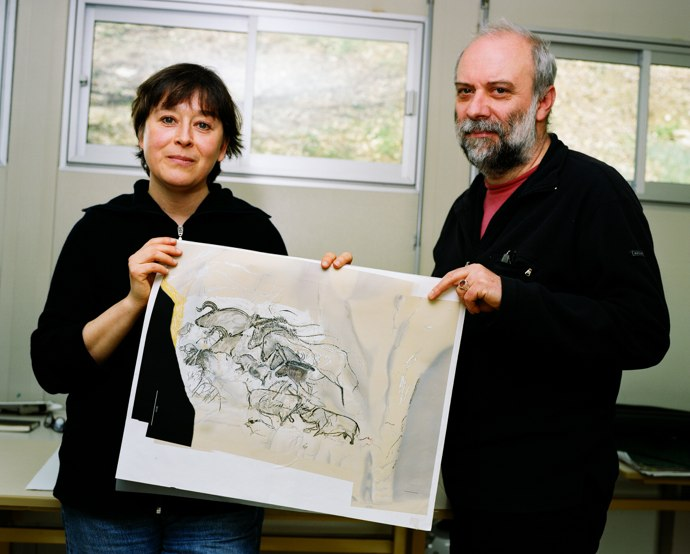
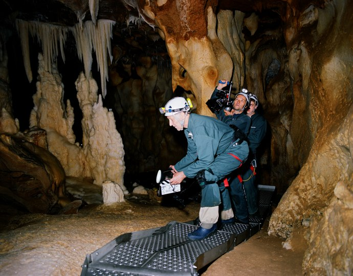

+++
titre = "La Grotte des rêves perdus, Werner Herzog"
title = "La Grotte des rêves perdus, Werner Herzog"
url = "/grottes-reves-perdus-herzog"
date = "2012-03-11T17:04:51"
Lastmod = "2012-03-12T13:46:54"
cover = "herzog-la-cave-des-reves-disparus.jpg"
categorie = [ "À voir" ]
tag = [ "Art", "Documentaire", "Expérience", "Histoire" ]
createur = [ "Werner Herzog" ]
acteur = [ "Werner Herzog" ]
annee = [ "2011" ]
weight = 2011
pays = [ "États-Unis", "France" ]

+++

Remonter aux origines de l&rsquo;humanité par la naissance de l&rsquo;art : tel est l&rsquo;objectif un peu fou de <em>La Grotte des rêves perdus</em>, le dernier film de Werner Herzog. Le cinéaste allemand a eu l&rsquo;autorisation exceptionnelle de filmer les plus vieilles peintures rupestres connues à ce jour et il en a tiré un documentaire pédagogique autant qu&rsquo;un film plein de réflexions à la limite de la métaphysique. Un voyage dans le temps fascinant…

La grotte des rêves dont il est question ici est la <a href="http://fr.wikipedia.org/wiki/Grotte_Chauvet">grotte Chauvet</a>, une grotte découverte récemment puisqu&rsquo;elle ne date que de la fin de l&rsquo;année 1994. Une brèche dans la roche le long de l&rsquo;Ardèche et un courant d&rsquo;air qui en sort engage deux hommes et une femme à s&rsquo;y engouffrer. Ils découvrent alors une immense cavité — environ 500 m de long — et des centaines de peintures rupestres. La communauté scientifique ne tarde pas à s&rsquo;y intéresser et la datation des peintures a fait l&rsquo;effet d&rsquo;une petite bombe : vieilles pour certaines de plus de 30 000 ans av. J.-C., elles sont deux fois plus vieilles que les peintures de Lascaux qui étaient jusqu&rsquo;alors considérées comme les plus anciennes. La grotte Chauvet a instantanément remis en cause la théorie qui était alors couramment acceptée selon laquelle l&rsquo;art avait doucement évolué pendant les années, d&rsquo;une forme très primitive à une forme plus moderne. Les peintures découvertes à Chauvet sont extrêmement abouties, elles sont même parfois extrêmement modernes en figurant le mouvement ou des expressions avec un réalisme troublant.

Ces peintures sont l&rsquo;occasion, pour Werner Herzog, de questionner la naissance de l&rsquo;humanité. <em>La Grotte des rêves perdus</em> émet une sorte d&rsquo;hypothèse : l&rsquo;homme moderne nait avec l&rsquo;invention de l&rsquo;art qui lui permet de laisser une trace de son existence pour les générations suivantes. Les peintures parfaitement intactes grâce à la fermeture hermétique de la grotte pendant plus de 20 000 ans semblent avoir été peintes à l&rsquo;époque contemporaine, alors qu&rsquo;elles sont extrêmement vieilles. L&rsquo;homme d&rsquo;aujourd&rsquo;hui peut les comprendre, au moins en partie : des scientifiques expliquent ainsi les œuvres d&rsquo;art qui doivent se comprendre comme des histoires racontées par nos ancêtres. Scène de chasse, séduction d&rsquo;une lionne par un lion, fuite d&rsquo;un bison… ces dessins ne sont pas totalement abstraits et ils ont rempli leur rôle de transmission d&rsquo;une information à travers les millénaires. <em>La Grotte des rêves perdus</em> montre aussi qu&rsquo;ils conservent une part de mystère, une part qu&rsquo;ils conserveront d&rsquo;ailleurs pour toujours. Dans la salle la plus profonde, on peut reconnaître le corps d&rsquo;une femme qui semble s&rsquo;accoupler avec un bison : il en manque une partie, on a du mal à reconnaître ce que l&rsquo;on nous décrit et le sens de ce dessin reste de toute manière perdu à jamais.

Au cours du film, Werner Herzog émet des hypothèses : il n&rsquo;y a aucun être humain représenté sur les murs, à l&rsquo;exception de cette étrange femme. Les peintures ne sont présentes que dans les grottes enfoncées, dans le noir. Il fallait donc des torches pour peindre et ensuite profiter des œuvres : le cinéaste imagine que les ombres des occupants se projetaient sur les murs et permettaient ainsi l&rsquo;interaction avec les animaux peints. Le cinéaste n&rsquo;a pas pu filmer avec des torches, mais <em>La Grotte des rêves perdus</em> rend plutôt bien le sentiment de mouvements des bêtes que peut apporter un éclairage. Ces animaux peints de quelques traits semblent prendre vie devant les caméras de Werner Herzog et le choix de filmer en 3D renforce sûrement cet aspect. Même sans cela, les plongées dans la grotte de Chauvet ont un côté mystique assez fort : on comprend alors les questions métaphysiques du cinéaste.

<em>La Grotte des rêves perdus</em> n&rsquo;est pas qu&rsquo;un voyage mystique, c&rsquo;est aussi un documentaire pédagogique sur les peintures rupestres et la vie de nos ancêtres. Werner Herzog filme ainsi les scientifiques qui travaillent au quotidien sur la grotte, ils répondent aux questions et donnent des explications. On les suit ainsi dans leur travail quotidien, on voit leurs réalisations, comme cette impressionnante représentation virtuelle de la grotte réalisée à l&rsquo;aide de scanners 3D. C&rsquo;est un travail de fourmis qu&rsquo;ils opèrent pour comprendre chaque dessin, chaque ossement trouvé dans la grotte et c&rsquo;est un travail aussi fascinant. Un des artistes avait un défaut sur l&rsquo;un des doigts de sa main, ce qui a permis aux scientifiques de le suivre dans la grotte. Les datations précises permettent également de connaître les étapes successives qui amènent au résultat final. Werner Herzog filme <em>La Grotte des rêves perdus</em> avec une simplicité et une transparence qui surprend dans un premier temps. Le documentaire n&rsquo;est pas que dans la grotte, il est aussi sur le film qui devient aussi parfois un making-of. Le cinéaste explique, par le biais du narrateur, qu&rsquo;il ne filme pas ceci ou cela pour telle raison technique, il justifie ainsi sa façon de filmer comme l&rsquo;utilisation d&rsquo;une caméra radioguidée qui permet autant de faire des plans dans les gorges de l&rsquo;Ardèche, que de faire le tour d&rsquo;un poteau inaccessible dans la grotte.

Le voyage dans le temps proposé par Werner Herzog avec <em>La Grotte des rêves perdus</em> est vraiment fascinant. Le spectateur est plongé 30 000 ans auparavant, il peut alors contempler des peintures rupestres de toute beauté et profiter pleinement d&rsquo;un lieu fermé au grand public. Cette plongée dans le passé amène une touche mystique loin de l&rsquo;agitation du présent. Une expérience de cinéma réjouissante, à ne pas rater.

La Grotte des rêves perdus <em>est sorti en DVD et Blu-Ray le premier mars ; distribué par la <a href="http://www.metrofilms.com/home.html">Metropolitan Filmexport</a>. Découvrez d’autres films sur Cinetrafic dans la catégorie <a href="http://www.cinetrafic.fr/documentaire">Documentaire</a> ainsi que la catégorie <a href="http://www.cinetrafic.fr/film-2011">Film 2011</a></em>.

<h3>Vous voulez m&rsquo;aider ?<a href="#footnote_0_5921" id="identifier_0_5921" class="footnote-link footnote-identifier-link" title="&Agrave; propos de la publicit&eacute;&hellip;">1</a></h3>
<ul>
<li><a href="http://www.amazon.fr/gp/product/B006MNQSQ4/ref=as_li_ss_tl?ie=UTF8&amp;tag=leblogdenic07-21&amp;linkCode=as2&amp;camp=1642&amp;creative=19458&amp;creativeASIN=B006MNQSQ4">Acheter le film en Blu-Ray sur Amazon</a> (avec une version 3D)</li>
<li><a href="http://www.amazon.fr/gp/product/B006MNQT9A/ref=as_li_ss_tl?ie=UTF8&amp;tag=leblogdenic07-21&amp;linkCode=as2&amp;camp=1642&amp;creative=19458&amp;creativeASIN=B006MNQT9A">Acheter le film en DVD sur Amazon</a></li>
</ul>

<ol class="footnotes"><li id="footnote_0_5921" class="footnote"><a href="http://voiretmanger.fr/a-propos/publicite/">À propos de la publicité…</a> [<a href="#identifier_0_5921" class="footnote-link footnote-back-link">&#8617;</a>]</li></ol>
