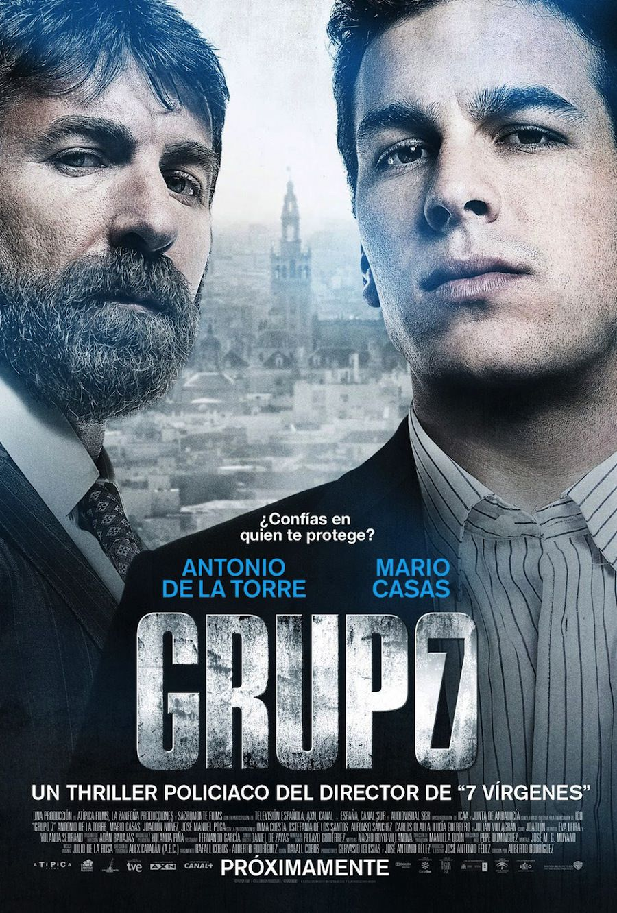
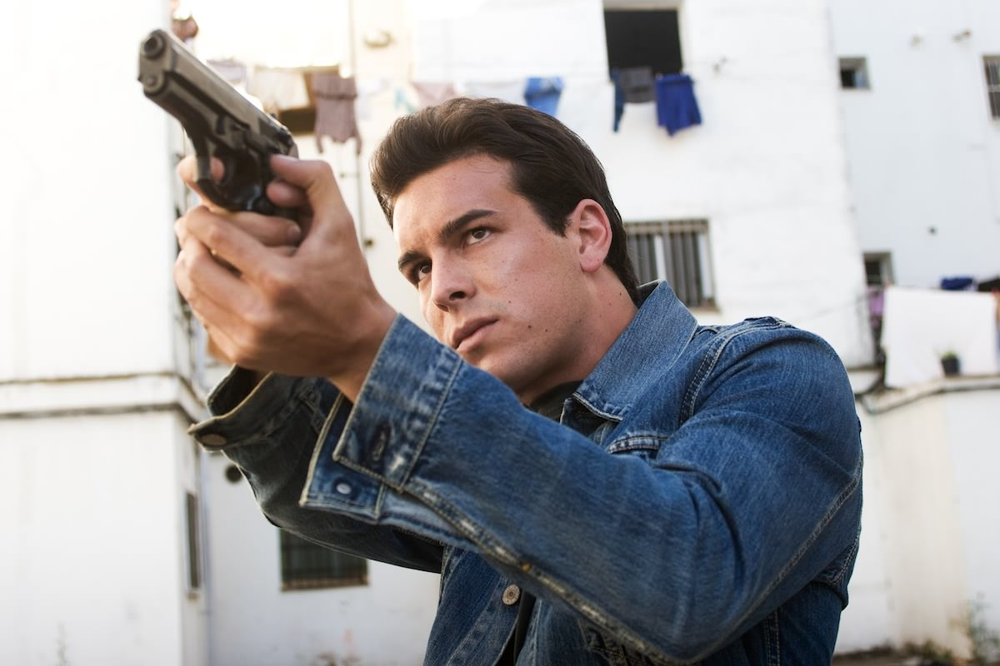
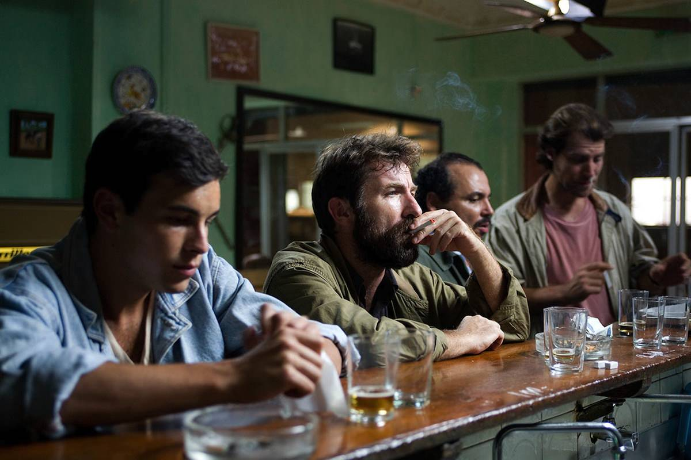

+++
type = "post"
titre = "Groupe d&rsquo;élite, Alberto Rodriguez"
title = "Groupe d'élite, Alberto Rodriguez"
url = "/groupe-elite-rodriguez"
date = "2012-12-29T18:55:09"
Lastmod = "2013-04-14T10:16:39"
cover = "grupo-7-roberto-rodriguez.jpg"
categorie = [ "À voir" ]
tag = [ "Action", "Drogue", "Histoire vraie", "Police", "Société", "Thriller", "Violence" ]
createur = [ "Alberto Rodriguez" ]
acteur = [ "Antonio de la Torre", "Mario Casas" ]
annee = [ "2013" ]
weight = 2013
original = "Grupo 7"

+++

Pour sa quatrième réalisation, Alberto Rodriguez a opté pour un film policier assez classique dans sa forme et pour une histoire vraie méconnue en France. <em>Groupe d&rsquo;élite</em> raconte ainsi l’histoire d’un groupe de policiers qui n’hésite pas à recourir à tous les moyens pour vider Séville de la drogue, quitte à être eux-mêmes hors-la-loi. Un sujet intéressant, pour un film d’action extrêmement efficace, à défaut d’être très original.

À la fin des années 1980, Séville se prépare activement à accueillir l’Exposition internationale universelle de 1992. La ville est alors prise par le trafic de la drogue et une véritable mafia qui met en danger la bonne tenue des évènements. Le gouvernement local décide alors de taper sur la table une bonne fois pour toutes et donne à la police une mission très simple : éloigner la drogue du centre de la ville. Le Grupo 7 est une petite unité de quatre personnes chargées exclusivement du trafic de drogue. Leur seul mot d’ordre est l’efficacité et la fin justifie presque toujours les moyens à leurs yeux. Il n’hésite pas à torturer, psychologiquement ou physiquement, les drogués qu’ils trouvent dans la rue pour retrouver leurs fournisseurs et arrêter ces derniers. Une traque sans merci qui aussi particulièrement difficile pour les policiers. Un jour, ils tombent sur le fournisseur le plus important de la ville. Plutôt que de tout faire saisir par le reste de la police, ils font de la femme qui s’occupait du stock un témoin clé et gardent pour eux une partie de la drogue. Leur idée est simple : devenir eux-mêmes fournisseurs pour mieux démanteler le réseau de Séville. Un pari risqué puisqu’ils sortent au passage du respect strict de la loi. La fin justifie-t-elle toujours les moyens ?

<em>Groupe d&rsquo;élite</em> commence sur une course-poursuite. Des policiers poursuivent plusieurs suspects et on suit plus particulièrement les pas d’Ángel. Le jeune homme débute dans le métier, mais son acharnement est déjà sensible et sans jamais lâcher son suspect, il finit par le coincer dans un cul-de-sac. Alberto Rodriguez suit ensuite son parcours au sein de la formation : c’est lui qui a l’idée de garder de la drogue pour la distribuer et obtenir des informations. Sous son impulsion, le groupe gagne vite la reconnaissance du chef des polices de Séville qui n’hésite pas à les médailler. La méthode s’avère concluante et les policiers arrêtent les dealers par dizaines et leur action commence à avoir ses effets, même si les journalistes et l’opinion publique dans son ensemble s’interroge sur les méthodes employées. Les quatre policiers ne s’embarrassent pas avec la législation, ils font ce qu’ils veulent de leurs prisonniers et même Ángel qui semblait au départ contre la torture, fût-elle psychologique, y adhère finalement. <em>Groupe d&rsquo;élite</em> s’avère très efficace pour suivre la carrière du jeune homme, sa gloire, mais aussi sa chute quand la mafia se réveille et entend le frapper en retour. La structure pyramidale est classique, mais Alberto Rodriguez la manie à merveille et propose une relecture efficace.

Suivant assez scrupuleusement cette structure, <em>Groupe d&rsquo;élite</em> ne séduira pas les amateurs du genre par un scénario novateur. Alberto Rodriguez n’a pas vraiment d’autres ambitions que de proposer une relecture, mais ce n’est jamais gênant. Le spectateur sait en gros à quoi s’en tenir, il sait notamment que la gloire du septième groupe de la police ne sera pas éternelle et que le revers finira tôt ou tard par arriver. Qu’importe, <em>Groupe d&rsquo;élite</em> sait rester suffisamment intense pour que l’attention du spectateur ne soit jamais détournée de ce long-métrage assez bref (1h35) et très intense, comme un coup de poing. Il faut dire que le contexte historique mis en avant par le film d’Alberto Rodriguez est méconnu et fascinant : on a du mal à imaginer qu’une ville comme Séville puisse être dans un tel état il y a une trentaine d’années encore. Quand le cinéaste termine son film avec des images de l’Exposition universelle, immaculée et majestueuse, on est loin des images de taudis du début. Ce contexte sert de réceptacle à une histoire prenante et Alberto Rodriguez a judicieusement insisté sur deux personnages. Ángel et Rafael sont totalement différents, le premier vient d’arriver et il a la hargne des bleus, tandis que le second est habitué et on le sent brisé. Loin d’en rester à cette opposition brutale, <em>Groupe d&rsquo;élite</em> sait construire des personnages denses et forts, pas si différents qu’il n’y paraissait au premier abord. Ils ont droit également à une attention particulière du côté de leur famille et Alberto Rodriguez montre bien en quoi cette carrière prenante est difficilement compatible avec une vie de couple normale. Là encore, il n’y a rien de révolutionnaire, mais le long-métrage sait avancer avec justesse et sincérité.

Alberto Rodriguez a le sens du rythme et le prouve avec <em>Groupe d&rsquo;élite</em>. On a déjà dit que le film était souvent intense : cette intensité est bien sûr la conséquence d’une action efficace, avec de nombreuses courses-poursuites souvent très réussies, dans la veine de la saga <em>Jason Bourne</em>. Elle est aussi liée à un montage rapide qui ne s’attarde pas sur les péripéties inutiles et qui accélère la montée du groupe pour mieux s’arrêter, finalement, sur sa chute. Alberto Rodriguez compose par ailleurs une image toujours soignée, souvent sombre pour mieux mettre en valeur un cadre assez délabré. Les acteurs du groupe sont tous excellents et contribuent à la réussite de <em>Groupe d&rsquo;élite</em> par leur crédibilité sans faille. Parmi les quatre policiers, il convient de saluer plus particulièrement le travail du jeune Mario Casas, impeccable en flic d’abord timide qui prend de plus en plus d’assurance au point d’en faire trop. À ses côtés, Antonio de la Torre est excellent en flic brisé et bourru, mais qui parvient à s’ouvrir et dévoiler ses failles.

L’originalité absolue n’est pas la condition <em>sine qua non</em> à la réussite d’un film et Alberto Rodriguez le montre bien avec <em>Groupe d&rsquo;élite</em>. Ce petit film s’avère extrêmement prenant et révèle une efficacité sans faille jusqu’à son final. Ajoutons à cette efficacité du coup de poing un contexte socio-historique méconnu qui relève encore l’intérêt du spectateur. Un joli petit film, à découvrir.

<h3>Vous voulez m&rsquo;aider ?<a href="#footnote_0_8098" id="identifier_0_8098" class="footnote-link footnote-identifier-link" title="&Agrave; propos de la publicit&eacute;&hellip;">1</a></h3>
<ul>
<li><a href="http://www.amazon.fr/gp/product/B00B4DBRR2/ref=as_li_ss_tl?ie=UTF8&tag=leblogdenic07-21&linkCode=as2&camp=1642&creative=19458&creativeASIN=B00B4DBRR2">Acheter le film en Blu-Ray sur Amazon</a></li>
<li><a href="http://www.amazon.fr/gp/product/B00B4DBRPY/ref=as_li_ss_tl?ie=UTF8&tag=leblogdenic07-21&linkCode=as2&camp=1642&creative=19458&creativeASIN=B00B4DBRPY">Acheter le film en DVD sur Amazon</a></li>
<li><a href="https://itunes.apple.com/fr/movie/groupe-delite/id622917078">Acheter ou louer le film sur l&rsquo;iTunes Store</a></li>
</ul>

<ol class="footnotes"><li id="footnote_0_8098" class="footnote"><a href="/soutien/">À propos de la publicité…</a> [<a href="#identifier_0_8098" class="footnote-link footnote-back-link">&#8617;</a>]</li></ol>
