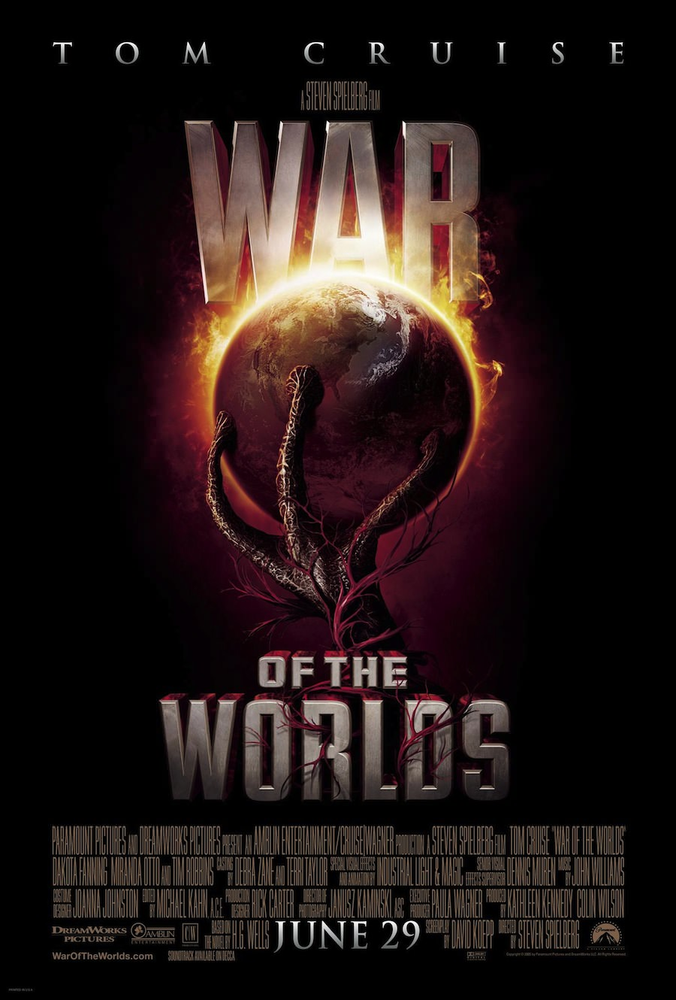
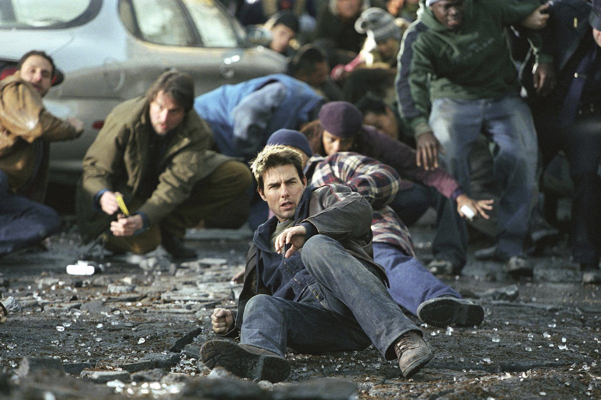
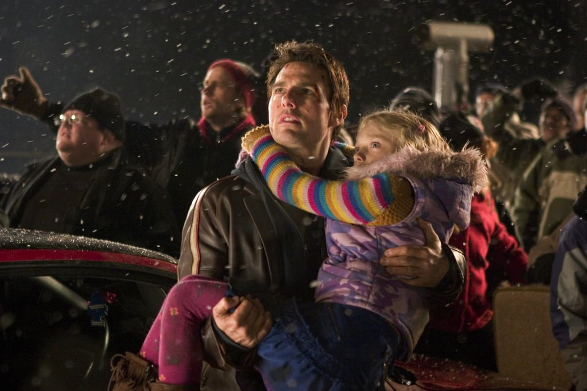

+++
type = "post"
titre = "<em>La guerre des mondes</em>, Steven Spielberg"
title = "La guerre des mondes, Steven Spielberg"
url = "/guerre-mondes-spielberg"
date = "2013-02-22T00:19:47"
Lastmod = "2014-12-06T16:00:30"
cover = "guerre-des-mondes-spielberg-tom-cruise-dakota-fanning.jpg"
categorie = [ "À voir" ]
tag = [ "Adaptation littéraire", "Apocalypse", "Blockbuster", "Extra-terrestre", "Famille", "Guerre", "Science-Fiction", "Vite oublié" ]
createur = [ "Steven Spielberg" ]
acteur = [ "Dakota Fanning", "Justin Chatwin", "Tom Cruise" ]
annee = [ "2005" ]
weight = 2005
pays = [ "États-Unis" ]
original = "War of the Worlds"

+++

Pour la troisième fois, Steven Spielberg s’intéresse aux extra-terrestres, mais sous un angle totalement différent. Alors que <a href="/2013/02/15/rencontres-du-troisieme-type-spielberg/" title="Rencontres du troisième type, Steven Spielberg - À voir et à manger"><em>Rencontres du troisième type</em></a> et <a href="/2013/02/19/et-extra-terrestre-spielberg/" title="E.T. l'extra-terrestre, Steven Spielberg - À voir et à manger"><em>E.T. l’extra-terrestre</em></a> optaient pour des créatures pacifiques venues par erreur ou pour une raison implicite sur la terre, ce nouveau long-métrage choisit au contraire l’angle de l’invasion destructrice. <em>La guerre des mondes</em> est l’adaptation du roman éponyme de H.G. Wells sorti à la fin du XIXe siècle. Un classique de la science-fiction noire avec cette histoire d’envahisseurs venus de l’espace pour détruire la terre, tout simplement. Steven Spielberg en fait un film catastrophe très efficace, mais quelque peu gâché par son happy-end familial totalement attendu dans ce cinéma. Dommage, même si le spectacle reste très efficace…

Le scénario est connu et déjà vu dans de nombreuses œuvres de littérature ou de cinéma : un jour, une civilisation extra-terrestre décide de venir sur Terre pour y détruire les hommes. Publié en 1898, <em>La guerre des mondes</em> de H.G. Wells fait figure de précurseur et il reste, encore aujourd’hui, une œuvre culte dans le genre apocalyptique. Steven Spielberg en a gardé l’idée principale et les grandes lignes, tout en modifiant quelques points : l’action passe du Royaume-Uni aux États-Unis et le personnage principal n’est plus un journaliste, mais un père de famille divorcé qui a la charge de ses enfants juste au moment de l’invasion. Pour le reste, c’est la même chose : d’énormes orages sévissent un peu partout sur la planète et peu après, de gros tripods sortent de terre et se mettent à attaquer les villes et leurs habitants. Leur laser ne laisse aucune chance aux humains aux pieds de ces énormes robots et il ne reste plus que de la poussière en cas de tir réussi. L’armée essaie bien de répliquer, mais les extra-terrestres avaient prévu le coup et leurs boucliers ne peuvent être franchis par les armes américaines. La partie semble très mal partie et <em>La guerre des mondes</em> ressemble vite à un récit post-apocalyptique, avec la même conclusion assez originale empruntée par Steven Spielberg au roman.

Pour raconter cette histoire de destruction, <em>La guerre des mondes</em> avait besoin d’un héros charismatique. Fidèle à ses habitudes et ses préoccupations, Steven Spielberg a opté pour un père de famille en difficulté. Ray Ferrier est un docker qui vit seul depuis le divorce de sa femme. Certains week-ends, il a la garde de ses deux enfants, son fils adolescent Robbie et sa petite fille Rachel. Avant l’attaque, le cinéaste a le temps de montrer que les relations entre Ray et ses enfants ne sont pas au beau fixe, c’est même tout le contraire. Robbie ne parle plus du tout à son père qu’il dédaigne en l’appelant par son prénom, tandis que Rachel a du mal à trouver sa place avec son père qui semble de son côté délaisser ses enfants. Fatigué de s’opposer à son fils, Ray finit vite par abandonner et va se coucher, laissant à ses enfants le soin de commander à manger. <em>La guerre des mondes</em> ne fait pas vraiment dans la subtilité et la fin inversée est entrevue dès les premières minutes. Ce n’est certainement pas le point fort du film, tant Steven Spielberg semble incapable ici de faire preuve de la moindre subtilité. Le fils désire s’engager dans l’armée pour défendre son pays et les arguments du père sont toujours ridicules, tandis que le cinéaste essaie un peu grossièrement de tirer les larmes de ses spectateurs à plusieurs reprises. Là où <em>E.T. l’extra-terrestre</em> savait susciter l’émotion avec subtilité et du coup une certaine efficacité, <em>La guerre des mondes</em> déçoit avec une histoire beaucoup trop attendue. On comprend assez mal par ailleurs l&rsquo;héroïsation troublante du héros qui passe par un meurtre, certes pour sauver sa vie et celle de sa propre fille.

Faut-il tout jeter pour autant ? Non, car <em>La guerre des mondes</em> est aussi un film catastrophe très bien mené et particulièrement efficace. Passée l’introduction familiale un peu lourde, Steven Spielberg entre dans le vif du sujet, mais il le fait, très intelligemment, de façon détournée. On ne voit pas tout de suite un robot extra-terrestre attaquer tout ce qui bouge, mais l’information passe d’abord par des extraits de journaux qui évoquent de mystérieux orages qui plongent des pays entiers dans le noir. L’orage arrive ensuite à quelques mètres de la maison des héros et c’est seulement après cette menace inconnue et donc très surprenante que l’on découvre enfin la nature des envahisseurs. S’ensuit une longue séquence de destruction pure qui prouve une nouvelle fois que Steven Spielberg n’a rien perdu de sa maîtrise technique et de son art du blockbuster. Visuellement, <em>La guerre des mondes</em> est réussi, mais le cinéaste sait provoquer une émotion importante avec peu de choses. La séquence du crash d’avion vécue entièrement depuis la cave de la maison est à cet égard extrêmement réussie. Plus largement, le choix de se concentrer sur Ray et ses deux enfants est payant en terme de scénario. Outre qu’il renforce le côté sentimental du film, il cache au spectateur la vue d’ensemble, ce qui renforce le sentiment d’incompréhension et de peur de la part des personnages. Un point de vue plus général ou des personnages au cœur de l’action auraient contribué à réduire la tension dramatique de <em>La guerre des mondes</em>. Sans atteindre les sommets du genre, le long-métrage séduit par ses séquences prenantes, avec quelques passages intenses, comme ce passage dans la maison avec Ray, sa fille et un tiers. L’ensemble tient plutôt bien la route, du moins tant que l’on ne s’approche pas trop du happy-end si prévisible.

Nonobstant sa fin décevante, <em>La guerre des mondes</em> reste ainsi un blockbuster efficace et très bien mené. Il faut dire que Steven Spielberg a quasiment inventé le genre avec <em>Les dents de la mer</em> et le cinéaste n’a pas perdu de son savoir-faire. La séquence où un tripode apparaît pour la première fois, en particulier, est un modèle du genre. Le cinéaste peut compter sur John Williams pour composer une <a href="http://www.amazon.fr/gp/product/B0009A3ZZI/ref=as_li_ss_tl?ie=UTF8&tag=leblogdenic07-21&linkCode=as2&camp=1642&creative=19458&creativeASIN=B0009A3ZZI">bande originale</a> à la hauteur : sa musique est angoissante à souhait quand il le faut, émouvante au bon moment… bref, c’est une réussite dans le genre. Tom Cruise est venu chercher Steven Spielberg pour tourner à nouveau avec lui, après le succès de <a href="/2012/06/17/minority-report-spielberg/" title="Minority Report, Steven Spielberg - À voir et à manger"><em>Minority Report</em></a> et il a été très impliqué dans le projet, au point de concentrer les critiques autour de son adhésion à l’église de scientologie. À l’écran, il est extrêmement expressif, quitte à en faire parfois un peu trop, mais son jeu convient au blockbuster qu’est <em>La guerre des mondes</em>. À ses côtés, on retiendra surtout la prestation de Dakota Fanning, très convaincante dans son rôle de petite fille.

<em>La guerre des mondes</em> n’est pas totalement réussi, loin de là. Sa fin trop convenue et attendue déçoit, mais elle ne suffit pas à annuler tout ce qui précède et notamment le blockbuster très efficace composé par Steven Spielberg. C’est un film catastrophe très classique, certes, mais il est extrêmement bien fait et mérite d’être vu pour cette raison. Dommage quand même de ne faire de cette attaque extra-terrestre qu’un prétexte pour réunir une famille…

<h3>Vous voulez m&rsquo;aider ?</h3>
<ul>
<li><a href="http://www.amazon.fr/gp/product/B003EN2SKK/ref=as_li_ss_tl?ie=UTF8&tag=leblogdenic07-21&linkCode=as2&camp=1642&creative=19458&creativeASIN=B003EN2SKK">Acheter le film en Blu-Ray sur Amazon</a></li>
<li><a href="http://www.amazon.fr/gp/product/B000BUZTWS/ref=as_li_ss_tl?ie=UTF8&tag=leblogdenic07-21&linkCode=as2&camp=1642&creative=19458&creativeASIN=B000BUZTWS">Acheter le film en DVD sur Amazon</a></li>
<li><a href="https://itunes.apple.com/fr/movie/la-guerre-des-mondes/id566868993">Acheter ou louer le film sur l&rsquo;iTunes Store</a></li>
</ul>

