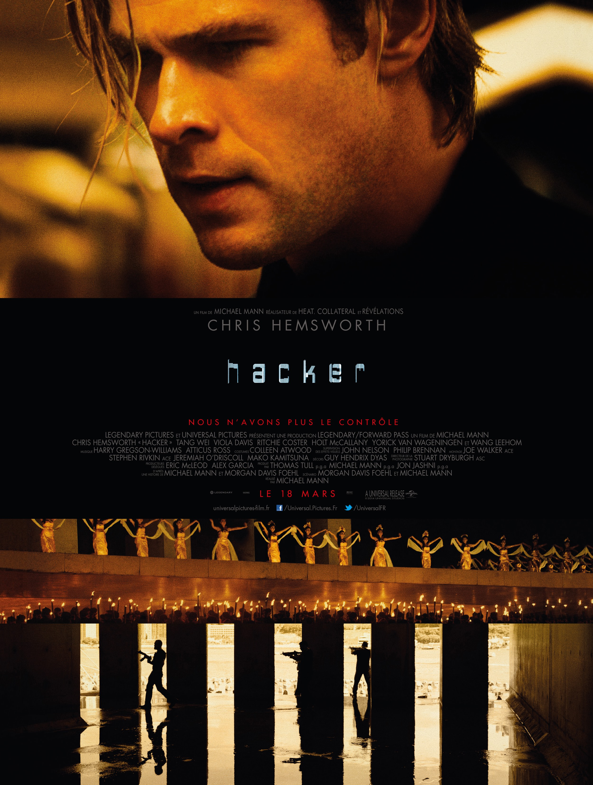

+++
type = "post"
titre = "<em>Hacker</em>, Michael Mann"
title = "Hacker, Michael Mann"
url = "/hacker-mann"
date = "2015-03-20T23:50:55"
Lastmod = "2015-03-20T23:53:49"
cover = "hacker-michael-mann.jpg"
categorie = [ "À voir" ]
tag = [ "Action", "Amour", "Hacker", "Informatique", "Sorties du mois", "Thriller", "Vite oublié" ]
createur = [ "Michael Mann" ]
acteur = [ "Chris Hemworth", "Holt McCallany", "Leehom Wang", "Ritchie Coster", "Tang Wei", "Viola Davis" ]
annee = [ "2015" ]
weight = 2015
pays = [ "États-Unis" ]
original = "Blackhat"

+++

<em>Hacker</em> est une œuvre fascinante qui donne constamment l&rsquo;impression de passer à côté de son sujet. Alors que le dernier film de Michael Mann devrait s&rsquo;intéresser à la cyber-criminalité et au cyber-terrorisme, il oublie bien vite son sujet et se tourne vers ce qu&rsquo;il a déjà su si bien faire : un thriller à l&rsquo;ancienne qui se termine en une confrontation entre deux hommes. Dans l&rsquo;ultime scène d&rsquo;affrontement, son héros revendique même que le code et les 1 et les 0 de l&rsquo;informatique n&rsquo;ont aucune importance. Un éclair de lucidité de la part du cinéaste, ou bien une note d&rsquo;intention ? Difficile de répondre, mais <em>Hacker</em> intéresse précisément par ce qu&rsquo;il rate. Loin de signer le film moderne et ambitieux que l&rsquo;on pouvait attendre sur le piratage informatique, Michael Mann semble se contenter de refaire <a href="/heat-mann/" title="Heat, Michael Mann"><em>Heat</em></a>, qui plus est sans trop y croire. À l&rsquo;heure du bilan, ce n&rsquo;est pas réussi, mais ce n&rsquo;est n&rsquo;est pas non plus sans intérêt. Un long-métrage curieux, marqué par quelques scènes époustouflantes.

La séquence d&rsquo;ouverture est pile dans le sujet : Michael Mann filme une cyber-attaque menée contre une centrale nucléaire chinoise et il propose une vision concrète de cette attaque. À la fois extrêmement bien documentée — des écrans de contrôle aux puces mémoire, en passant par des centaines de câbles intermédiaires, on est bien au cœur d&rsquo;un système informatique — et personnifiée un petit peu dans l&rsquo;esprit de <a href="/saga/tron/"><em>Tron</em></a>, avec cette idée du virus en blanc qui prend le dessus sur le code de base en noir. C&rsquo;est visuellement très réussi et même si c&rsquo;est techniquement faux, c&rsquo;est une belle manière de montrer le piratage au cœur des composants sans passer par un écran plein de texte. On peut saluer l&rsquo;idée qui place la barre très haut pour <em>Hacker</em>… et puis c&rsquo;est tout. Alors qu&rsquo;avec un tel départ, on pouvait s&rsquo;attendre à un film résolument moderne, alors que c&rsquo;est exactement l&rsquo;inverse qui se produit. Michael Mann abandonne les nouvelles technologies et embraye sur un thriller extrêmement conventionnel, avec recherche d&rsquo;un criminel par un couple de policier, une américaine et un chinois, assisté d&rsquo;un hacker et criminel qu&rsquo;ils sortent de prison pour les aider. Passant du tout au tout, le long-métrage surprend et déstabilise, d&rsquo;autant que ce n&rsquo;est pas un effet qui passe : l&rsquo;écrasante majorité des deux heures de <em>Hacker</em> est dénuée de toute intrigue informatique et se contente plutôt d&rsquo;un cinéma à l&rsquo;ancienne, pour ne pas dire vieillot, et même souvent kitsch. Michael Mann multiplie les ralentis et envoie une musique toujours un peu trop lourde et caricaturale.

Michael Mann est devenu célèbre pour quelques idées de mise en scène, à commencer par ses mythiques survols urbains nocturnes. On en retrouve quelques-uns dans <em>Hacker</em> qui inscrivent ce dernier opus dans la filmographie du cinéaste, mais ce n&rsquo;est pas l&rsquo;essentiel du propos. À mi-chemin entre les États-Unis et la Chine, le film évolue entre les films de gangsters de l&rsquo;un et les chorégraphies minutieuses de l&rsquo;autre, avec à la clé quelques scènes vraiment époustouflantes, il faut le reconnaître. Fidèle à ses habitudes, le réalisateur montre la violence de la manière la plus abrupte possible, ce qui se traduit par des scènes de tir extrêmement réalistes et saisissantes. La poursuite dans le port est au niveau de virtuose que l&rsquo;on avait l&rsquo;habitude de voir chez Michael Mann, tandis que la scène de combat finale est sans conteste l&rsquo;un des plus forts moments de cinéma de ces dernières années. Cette séquence est magnifique et à la fois surprenante par son absence totale de technologies : <em>Hacker</em> commence de manière aussi moderne qu&rsquo;il se conclut à l&rsquo;ancienne, pratiquement avec un combat à mains nues. C&rsquo;est étonnant et pas inintéressant, si ce n&rsquo;est que l&rsquo;on aimerait dire que c&rsquo;était intentionnel. Hélas, Michael Mann donne plutôt le sentiment de ne pas toujours savoir ce qu&rsquo;il doit faire, et de laisser rapidement l&rsquo;informatique pour revenir à ce qu&rsquo;il connaît. À certains égards, son film donne l&rsquo;impression d&rsquo;être l&rsquo;œuvre de plusieurs personnes. Quelques scènes sur un ordinateur sont réalistes et très bien faites, alors que d&rsquo;autres tombent dans les travers du hacker de cinéma, avec des supercheries absolument pas crédibles. Et puis pourquoi ce personnage principal, censé être un expert en piratage informatique, est-il aussi bon en combat ?

Tous les personnages de <em>Hacker</em> manquent de crédibilité — les doublages ratés n&rsquo;aident pas, mais les acteurs pourraient être plus charismatiques —, tout comme aussi l&rsquo;intrigue générale, en fait, qui s&rsquo;avère vite être vraiment sans intérêt. On ne parvient pas vraiment à intéresser au sort de ces personnages qui n&rsquo;existent jamais et l&rsquo;intrigue amoureuse posée là comme un cheveu sur la soupe est ridicule au possible. Il ne reste pas grand-chose au dernier film de Michael Mann, et pourtant on ne peut pas l&rsquo;évacuer d&rsquo;un revers de la main, sans y revenir. C&rsquo;est un long-métrage imparfait avec sa promesse de modernité perturbée par le résultat, un thriller extrêmement classique. Outre quelques scènes magnifiques ou magistralement présentées, <em>Hacker</em> est aussi intriguant par certains de ses choix. Son personnage principal est incarné par un Chris Hemsworth absent et jamais vraiment dans le rôle, mais est-ce la faute de l&rsquo;acteur, ou est-ce voulu ? Après tout, son personnage se présente lui-même comme un fantôme. Michael Mann a au moins réussi à nous perturber, mais pour autant sa dernière réalisation n&rsquo;est pas une réussite : bel effort, mais ça n&rsquo;a pas suffi…

