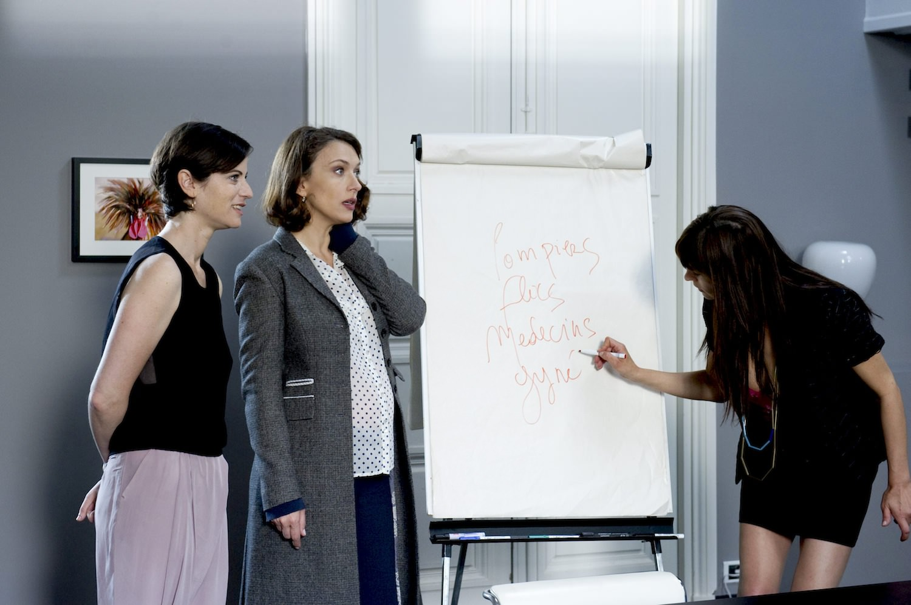
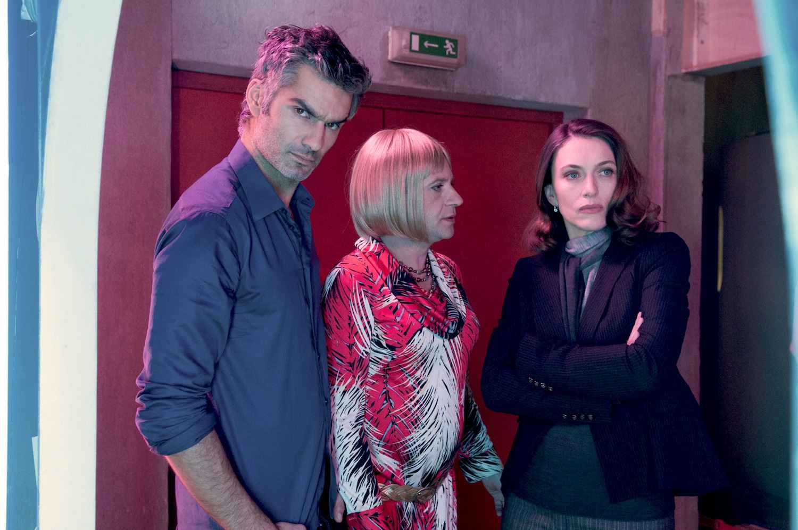
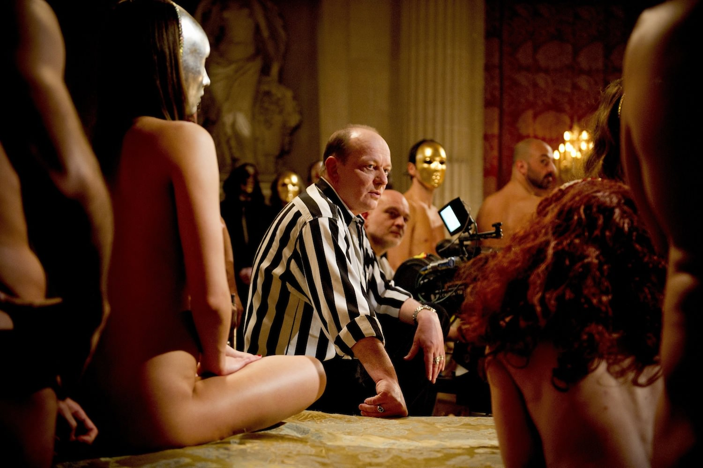

+++
type = "post"
titre = "<em>Hard</em>, Cathy Verney (Canal+)"
title = "Hard, Cathy Verney (Canal+)"
url = "/hard-verney-canal"
date = "2013-06-08T10:07:46"
Lastmod = "2013-10-26T15:44:39"
cover = "hard-natacha-lindinger-canal+.jpg"
categorie = [ "À voir" ]
tag = [ "Comédie", "Drame", "Famille", "Humour", "Série", "Sexe", "Société" ]
createur = [ "Canal+", "Cathy Verney" ]
acteur = [ "François Vincentelli", "Katia Lewkowicz", "Michèle Moretti", "Natacha Lindinger", "Stéphan Wojtowicz" ]
annee = [ "2008" ]
weight = 2008
pays = [ "France" ]

+++

Une mère de famille qui découvre à la mort de son mari que ce dernier ne gérait pas une société de transport, mais… une société de production de films pornographiques. À partir de cette petite idée un peu folle, Canal+ a imaginé une série complète avec <em>Hard</em> qui compte deux saisons et qui est toujours active. Sur le principe de <a href="http://voiretmanger.fr/weeds-kohan-showtime/" title="Weeds, Jenji Kohan (Showtime)"><em>Weeds</em></a> qui faisait confronter une mère de famille à la drogue, cette série fonctionne essentiellement sur la rencontre improbable entre une Versaillaise et le monde du porno. Les épisodes sont courts, l’action avance rapidement et l’humour fonctionne vraiment bien. Même si <em>Hard</em> n’est pas sans défaut, c’est une série très drôle à ne pas rater. 

Le premier épisode de <em>Hard</em> fait office de pilote et d’introduction. Aussi bref que tous les épisodes de la série — une grosse vingtaine de minutes —, il permet de découvrir le personnage principal, Sophie, mère de famille dans un pavillon de banlieue parisienne chic. Elle s’occupe de ses deux adolescents avec son mari, jusqu’au jour où celui-ci tombe du toit qu’il réparait et meurt sur le coup. L’accident survient dans les deux premières minutes, car ce n’est pas le sujet de cette série imaginée par Cathy Verney. Non, le sujet est la vie de veuve de Sophie : alors qu’elle fait passer des plateaux de nourriture à l’enterrement de son mari, sa belle-mère lui annonce que son époux l’a trompé depuis des années. Il dirige en fait Soph&rsquo;X, une société de production de contenus pornographiques qu’elle doit maintenant gérer. Il ne pouvait y avoir pire nouvelle pour cette femme respectable qui tient à mener une vie normée et à donner à ses enfants une éducation convenable. La rencontre avec les employés de Soph&rsquo;X ne pouvait être qu’électrique et la première saison de <em>Hard</em> repose justement sur ces premiers contacts. Dès qu’elle pose les pieds dans son entreprise, Sophie est horrifiée par ce qu’elle voit, par ces femmes et ces hommes qui baisent toute la journée devant des caméras par plaisir. On imagine très bien qu’elle n’a jamais connu que du sexe très sage avec son mari, un plaisir réglé et régulier bien éloigné des fantasmes mis en œuvre pour les amateurs de pornographie qui utilisent les services de son entreprise. Le contraste entre cette femme réservée, voire guindée, et des employés assez vulgaires n’est pas très original, mais il fonctionne à plein et Cathy Verney a su créer des rôles sur mesure, à l’image de Pierre, le réalisateur, qui joue parfaitement le type vulgaire qui a fait du porno toute sa vie et qui ne vit que pour ça. Après cette première saison diffusée en 2008 et réalisée avec des bouts de ficelle — cela se voit… —, la série a bénéficié de moyens bien supérieurs pour une deuxième saison diffusée en 2011 cette fois. 

Toutes les bonnes séries rassemblent d’abord de bons personnages et <em>Hard</em> le prouve admirablement. Son point de départ est si mince qu’il lui fallait de sacrés personnages pour tenir la distance : même si on note quelques pertes de faiblesse ici ou là, force est de constater que Canal+ a su tenir la distance jusqu’ici. La première saison composée de six épisodes d’une vingtaine de minutes était très courte, mais la seconde d’une douzaine d’épisodes permet de développer les personnages et les situations. En plus de Soph&rsquo;X, la série de Cathy Verney développe surtout l’histoire de Sophie et de ses relations tant avec ses enfants qu’avec l’un des employés de l’entreprise avec lequel elle tombe amoureuse. Non content de diriger une société de porno, elle doit gérer sa relation avec un gardeur : dans la société très coincée où elle vit, autant dire que ce ne sera pas une partie de plaisir. Pour ce rôle, <em>Hard</em> peut en tout cas compter sur le talent de Natacha Lindinger : l’actrice est parfaite pour interpréter cette femme extrêmement coincée au début qui se détend peu à peu. Par ses mimiques et ses intonations, elle évoque parfois le personnage de Thérèse dans <em>Le Père Noël est une ordure</em>, mais Natacha Lindinger ne s’arrête pas là et explore d’autres terrains de jeux avec un personnage qui évolue au fil des épisodes. Il faut dire que <em>Hard</em> la soumet à de multiples épreuves toujours plus intenses : entre ses enfants qui pètent les plombs — Jules, son fils, qui amène un poney puis un cochon à la maison est délicieux —, ses difficultés à gérer financièrement la société et surtout à changer ses habitudes, puis sa rencontre difficile avec un milieu mafieux. Elle doit aussi gérer au quotidien les employés de Soph&rsquo;X qui sont comme sa seconde famille, mais en encore plus barrée. Tous les personnages sont délicieux, de sa belle-mère lesbienne (Michèle Moretti) à Roy Lapoutre, la star du X de la société (François Vincentelli, très bon) en passant par Pierre, le réalisateur (Stéphan Wojtowicz). Tous ne sont pas aussi fouillés que ces trois-là, mais même les caricatures, comme la secrétaire stupide ou les hardeurs qui ne pensent qu’au sexe, sont tous amusants et souvent touchants.

Difficile de savoir si <em>Hard</em> va tenir encore la distance, sachant qu’une troisième saison a été confirmée par Canal+. Qu’importe, les deux premières saisons de cette série atypique sont excellentes et méritent à elles seules de regarder la création de Cathy Verney. On a rarement l’occasion de voir une plongée aussi crue dans l’univers de la pornographie, la série ne s’interdit rien, sans tomber elle-même dans le sexe : avis aux amateurs, hormis quelques paires de seins et de fesses, on ne voit rien… Cette série est d’abord drôle, très drôle même et son format court favorise un ton léger et incisif qui lui va à merveille. 

<h3>Vous voulez m&rsquo;aider ?<a href="#footnote_0_9655" id="identifier_0_9655" class="footnote-link footnote-identifier-link" title="&Agrave; propos de la publicit&eacute;&hellip;">1</a></h3>
<ul>
<li><a href="http://www.amazon.fr/gp/product/B003CGIQAK/ref=as_li_ss_tl?ie=UTF8&#038;tag=leblogdenic07-21&#038;linkCode=as2&#038;camp=1642&#038;creative=19458&#038;creativeASIN=B003CGIQAK">Acheter la première saison en DVD sur Amazon</a></li>
<li><a href="http://www.amazon.fr/gp/product/B004Q64X4S/ref=as_li_ss_tl?ie=UTF8&#038;tag=leblogdenic07-21&#038;linkCode=as2&#038;camp=1642&#038;creative=19458&#038;creativeASIN=B004Q64X4S">Acheter la deuxième saison en DVD sur Amazon</a></li>
<li><a href="http://www.amazon.fr/gp/product/B005BHE3WI/ref=as_li_ss_tl?ie=UTF8&#038;tag=leblogdenic07-21&#038;linkCode=as2&#038;camp=1642&#038;creative=19458&#038;creativeASIN=B005BHE3WI">Acheter les deux premières saisons en DVD sur Amazon</a></li>
<li><em>Hard</em> sur l&rsquo;iTunes Store : <a href="https://itunes.apple.com/fr/tv-season/hard-saison-1/id634423896">saison 1</a> | <a href="https://itunes.apple.com/fr/tv-season/hard-saison-2/id634430271">saison 2</a></li>
</ul>

<ol class="footnotes"><li id="footnote_0_9655" class="footnote"><a href="http://voiretmanger.fr/soutien/">À propos de la publicité…</a> [<a href="#identifier_0_9655" class="footnote-link footnote-back-link">&#8617;</a>]</li></ol>
