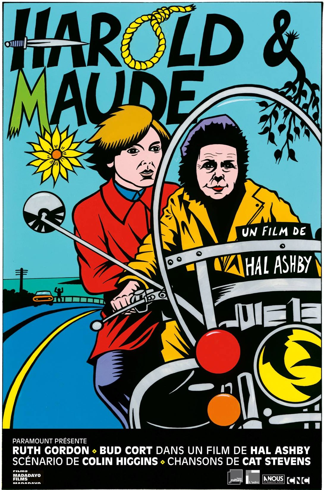
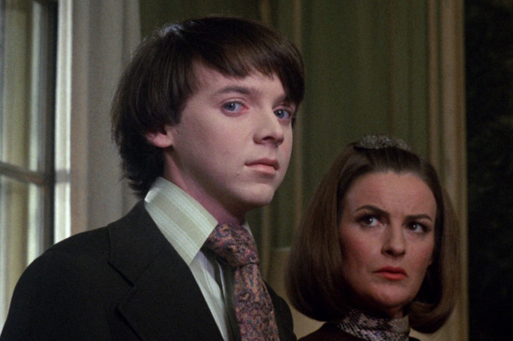

+++
titre = "<em>Harold et Maude</em>, Hal Ashby"
title = "Harold et Maude, Hal Ashby"
url = "/harold-maude-ashby"
date = "2015-05-26T20:28:12"
Lastmod = "2015-05-26T20:34:38"
cover = "harold-maude-ruth-gordon-bud-cort.jpg"
categorie = [ "À voir" ]
tag = [ "Amour", "Comédie romantique", "Famille", "Humour", "Mort", "Philosophie", "Psychologie", "Romance", "Société" ]
createur = [ "Hal Ashby" ]
acteur = [ "Bud Cort", "Ruth Gordon" ]
annee = [ "1971" ]
weight = 1971
pays = [ "États-Unis" ]
original = "Harold and Maude"

+++

Échec commercial à sa sortie, <em>Harold et Maude</em> a fait scandale dans les années 1970 avant de devenir un film culte. En racontant une histoire d&rsquo;amour entre un très jeune homme et une très vieille femme, Hal Ashby propose sa vision de la libération de ces années-là. Plus de quarante ans après, son long-métrage ne choque plus autant, même si la différence d&rsquo;âge entre les deux protagonistes reste toujours aussi impressionnante et bien visible. À défaut de choquer, <em>Harold et Maude</em> parvient toutefois à amuser : cette comédie romantique est en effet toujours aussi drôle et sur ce point, elle n&rsquo;a pas pris une ride. À (re)voir avec plaisir !

L&rsquo;intrigue se déploie autour d&rsquo;une idée simple : Harold, jeune homme à peine sorti de l&rsquo;adolescence, rencontre Maude, une femme qui a déjà beaucoup vécu et qui va vers ses 80 ans et ils tombent amoureux l&rsquo;un de l&rsquo;autre. Pour autant, <em>Harold et Maude</em> n&rsquo;a rien d&rsquo;un film simpliste, car son réalisateur prend le soin de poser chaque personnage. On découvre tout d&rsquo;abord Harold, qui est censé avoir une vingtaine d&rsquo;années, mais qui en fait quinze. Bud Cort, son interprète, avait en fait 23 ans lors du tournage, mais le jeune acteur semble vraiment plus jeune, presque trop : on pourrait presque croire à une erreur de casting. Hal Ashby le dépeint comme un garçon solitaire et qui n&rsquo;a surtout aucun sens à donner à sa vie, à tel point que sa seule passion semble être de mettre en scène son suicide. Habitant seul avec sa mère dans une immense demeure, il n&rsquo;a jamais eu besoin de rien, mais rejette la bourgeoisie à laquelle appartient sa famille en se tuant régulièrement… ou plutôt en imitant le geste. <em>Harold et Maude</em> commence d&rsquo;ailleurs avec son premier suicide : on voit le jeune homme descendre les escaliers, mettre de la musique et préparer méticuleusement son suicide, avant de se balancer au bout d&rsquo;une corde. Quand sa mère entre dans la pièce, on s&rsquo;attendrait à des cris, mais elle se contente de vaquer à ses occupations et de protester contre celles, malsaines il faut le reconnaître de son fils. C&rsquo;est tout à fait l&rsquo;esprit de ce film, décalé et anti-conformiste et Hal Ashby va multiplier les scènes de faux suicides, utilisant ce comique de répétition spectaculaire avec un effet très convaincant.

Harold est comique par sa manière de rejeter la vie en se suicidant constamment pour de faux, mais Maude n&rsquo;est pas en reste. Les deux personnages se croisent à plusieurs reprises à des enterrements : assister à cette cérémonie pour de parfaits inconnus est en effet le passe-temps de l&rsquo;un, comme de l&rsquo;autre. Incarnée par une Ruth Gordon parfaitement pétillante, cette femme qui a connu l&rsquo;horreur des camps de concentration mène une vie totalement débridée. Elle suit une sorte de philosophie qui incite à profiter au maximum et surtout à découvrir en permanence de nouvelles choses, elle est constamment joyeuse et boute-en-train. Mais c&rsquo;est aussi une voleuse hors-pair, qui n&rsquo;arrête pas d&rsquo;emprunter des véhicules et qui se moque de l&rsquo;autorité : <em>Harold et Maude</em> est aussi très drôle grâce à ses interventions, c&rsquo;est un personnage marquant, indéniablement. Mais le long-métrage de Hal Ashby n&rsquo;est pas seulement drôle, il évoque aussi une véritable histoire d&rsquo;amour. Sans aller aussi loin que <a href="http://voiretmanger.fr/gerontophilia-labruce/" title="Gerontophilia, Bruce LaBruce"><em>Gerontophilia</em></a> sur le même sujet — et pourtant, la polémique a été beaucoup plus importante à l&rsquo;époque qu&rsquo;aujourd&rsquo;hui —, le film sait aussi présenter l&rsquo;amour des deux personnages avec réalisme. Harold a beau être vraiment très jeune, on dirait presque un enfant sur certains plans, on croit à son attachement pour Maude, puisque c&rsquo;est grâce à elle qu&rsquo;il trouve un sens à donner à sa vie jusque-là vide. Les motivations de Maude sont moins explicites, mais qu&rsquo;importe, leur histoire fonctionne, malgré les interdictions imposées par les producteurs au réalisateur<a href="#fn-13779-1" rel="footnote">1</a>.

Porté par une bande-originale excellente et signée Cat Stevens, <em>Harold et Maude</em> reste une comédie vraiment très amusante, en plus d&rsquo;être une histoire d&rsquo;amour atypique et touchante. Hal Ashby ne choque plus, mais son humour reste toujours d&rsquo;actualité et on passe un très bon moment avec son long-métrage. Un classique !

<h3>Vous voulez <a href="http://voiretmanger.fr/soutien/">m&rsquo;aider</a> ?</h3>
<ul>
<li><a href="http://www.amazon.fr/gp/product/B00DE6NH3E/ref=as_li_ss_tl?ie=UTF8&amp;tag=leblogdenic07-21&amp;linkCode=as2&amp;camp=1642&amp;creative=19458&amp;creativeASIN=B00DE6NH3E">Acheter le film en Blu-ray sur Amazon</a></li>
<li><a href="http://www.amazon.fr/gp/product/B000066RTD/ref=as_li_ss_tl?ie=UTF8&amp;tag=leblogdenic07-21&amp;linkCode=as2&amp;camp=1642&amp;creative=19458&amp;creativeASIN=B000066RTD">Acheter le film en DVD sur Amazon</a></li>
<li><a href="https://itunes.apple.com/fr/movie/harold-et-maude/id285671994">Acheter ou louer le film sur l&rsquo;iTunes Store</a></li>
</ul>

<ol>
<li id="fn-13779-1">
Hal Ashby souhaitait aller beaucoup plus loin dans la représentation de l&rsquo;amour entre ses deux personnages, notamment en montrant une scène de sexe. Quand on pense aux réactions des contemporains à la sortie de cette version au fond très chaste, on se dit qu&rsquo;ils avaient peut-être raison…&#160;<a href="#fnref-13779-1" rev="footnote">&#8617;</a>
</li>
</ol>

