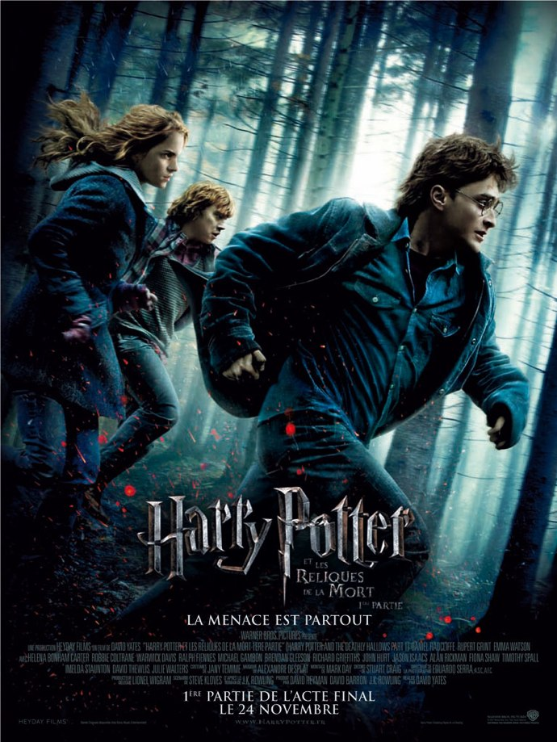
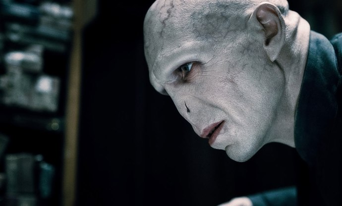

+++
type = "post"
titre = "<em>Harry Potter et les Reliques de la Mort (partie 1)</em>, David Yates"
title = "Harry Potter et les Reliques de la Mort (partie 1), David Yates"
url = "/harry-potter-7-partie-1-yates"
date = "2010-11-24T23:18:12"
Lastmod = "2014-09-24T00:02:11"
cover = "harry-potter-7-partie-1.jpg"
categorie = [ "À voir" ]
tag = [ "Blockbuster", "Drame", "Fantastique", "Guerre", "Harry Potter", "Magie", "Sorcellerie" ]
createur = [ "David Yates" ]
acteur = [ "Alan Rickman", "Bill Nighy", "Bonnie Wright", "Daniel Radcliffe", "Emma Watson", "Ralph Fiennes", "Rupert Grint", "Tom Felton" ]
annee = [ "2010" ]
weight = 2010
saga = [ "Harry Potter" ]
pays = [ "États-Unis" ]
original = "Harry Potter and the Deathly Hallows - Part 1"

+++

Septième et ultime tome de la saga, <em>Harry Potter et les Reliques de la Mort</em> est très nettement à part. Épisode où tous les enjeux de la série se nouent et où le combat à mort entre Voldemort et Harry Potter se conclut. Un épisode essentiel, marqué par une noirceur inédite et étonnante quand on pense que la série visait au départ des enfants. Mais à l&rsquo;image de son héros, <em>Harry Potter</em> a évolué au fil des années et l&rsquo;adaptation cinématographique en est le parfait reflet. Plus complexe, plus noir, plus lent aussi, <em>Harry Potter et les Reliques de la Mort (partie 1)</em> n&rsquo;a plus grand-chose à voir avec les six précédents films. Finis l&rsquo;apprentissage de la magie et les duels de magicien, place à la guerre totale. Le changement est réussi, même si cette première partie est décevante sur le plan de l&rsquo;histoire, qui n&rsquo;avance pour ainsi dire pas. Cette première partie met en tout cas en appétit et fait attendre un fil qui aura intérêt à être à la hauteur des attentes…

<strong>Si vous n&rsquo;avez pas lu le livre, ni vu le film, à votre place je m&rsquo;arrêterais là…</strong>

<em>Harry Potter et les Reliques de la Mort (partie 1)</em> commence comme tous les films de la série, par les vacances scolaires, prélude à la rentrée des classes. Dès les premières images, le ton n&rsquo;est pas aux réjouissances : la famille adoptive de Harry quitte le sorcier et Hermione abandonne sa famille après avoir effacé toutes traces de sa présence, jusque dans la mémoire de ses parents. Voldemort n&rsquo;a jamais été aussi puissant, et son pouvoir se renforce de jour en jour : le Ministère de la Magie est désormais entre ses mains et il ne reste plus qu&rsquo;une poignée de magiciens suffisamment fous pour se placer entre lui et sa cible unique, Harry Potter. On le sait depuis toujours, les deux magiciens sont connectés depuis que Voldemort a tué la mère de Harry Potter et le petit magicien à lunettes est le seul à pouvoir résister au terrible Voldemort, implacable et extrêmement talentueux magicien tombé dans l&rsquo;obscurité. Mais désormais, les enjeux dépassent très largement le duel qui prévalait dans les premiers tomes : désormais, tout le monde est concerné, tous les magiciens et même les hommes. Le combat est total et il n&rsquo;y a plus aucune règle, si ce n&rsquo;est la mort, d&rsquo;un côté ou de l&rsquo;autre. Le trio d&rsquo;amis, Harry, Hermione et Ron, décide alors de partir en quête des Horcruxes, objets dans lesquels Voldemort a placé une partie de son âme. S&rsquo;ils parviennent à tous les détruire, Voldemort disparaîtra. Cette première partie rapporte le récit de cette quête et surtout de l&rsquo;errance des trois magiciens dans les forêts anglaises, en plein hiver et alors que les derniers espoirs s&rsquo;amenuisent toujours plus.

On le comprend bien, cette première partie de <em>Harry Potter et les Reliques de la Mort</em> n&rsquo;est pas marquée par une gaieté insouciante débordante. Bien au contraire, la noirceur est omniprésente et le film s&rsquo;achève brutalement sur une victoire indéniable de Voldemort qui laisse entrevoir des difficultés encore plus grandes par la suite. Le ton est donné d&rsquo;entrée, avec une absence frappante de couleurs et une musique triste, deux caractéristiques qui ne quitteront plus le film, sauf en de très rares moments. Voldemort ne prépare plus son retour, cette étape est désormais terminée, il est de retour et il a enclenché une guerre totale. Les combats commencent très vite et sont immédiatement terribles, avec des morts de part et d&rsquo;autre et avec une inhibition totale vis-à-vis des règles que les sorciers suivent usuellement, notamment par rapport aux moldus. Tous les coups sont permis pour atteindre Harry Potter et Voldemort ne s&rsquo;en prive pas. C&rsquo;est pourquoi, à l&rsquo;image de Frodon dans <em>Le Seigneur des Anneaux</em>, Harry décide de partir presque seul (avec Ron et Hermione, quand même) accomplir sa tâche, la destruction des Horcruxes. À partir de ce moment-là, le film se concentre sur le trio et met de côté la guerre qui bat par ailleurs et qui ne concernera directement le fil narratif que par épisodes brefs, comme lorsqu&rsquo;ils se rendent au cœur du Ministère de la Magie. La lutte entre le bien et le mal est un élément de base du mythe exploité par <em>Harry Potter</em> comme avant lui par Tolkien, ou par <em>Star Wars</em>, dans un autre registre. Rien d&rsquo;original chez J.K. Rowling, mais ce thème est toujours aussi efficace : ce sont deux visions du monde incompatibles qui s&rsquo;affrontent et une seule doit l&rsquo;emporter au bout du compte. David Yates rend bien l&rsquo;atmosphère de guerre totale qui concerne à la fois tout le monde, tout en n&rsquo;empêchant pas les populations de continuer à vivre, malgré tout. En matière de mal, la référence constante de <em>Harry Potter</em> est l&rsquo;Allemagne nazie (eugénisme, race supérieure des sorciers, procès…) et le Londres de cette première partie n&rsquo;est pas sans rappeler certaines images de la Seconde Guerre mondiale, tandis que ceux qui protègent Harry Potter et affrontent Voldemort sont évidemment les résistants. Cet aspect était déjà présent précédemment, mais il s&rsquo;affirme ici pleinement. Rien de bien original, là encore, mais on est quand même loin des récits gentillets des débuts. Les affrontements entre Voldemort et Harry Potter ont rythmé toute la série, mais Voldemort ne se fait désormais plus avoir, il a mis toutes les chances de son côté et Harry ne peut plus compter que sur lui-même. Autant le dire, la tension est constante.

<a href="http://voiretmanger.fr/2009/07/24/harry-potter-prince-sang-mele-yates/"><em>Harry Potter et le prince de Sang-Mêlé</em></a>, le film qui précède celui-ci, était diamétralement opposé. Le combat entre Voldemort et Harry Potter était écarté tout simplement par le scénario qui avait fait le choix de couper l&rsquo;action… au profit d&rsquo;un film resserré sur les personnages. Le résultat, un <em>teen-movie</em> assez classique où les premiers émois des adolescents étaient largement montrés, m&rsquo;avait paru intéressant. Avec <em>Harry Potter et les Reliques de la Mort</em>, le combat revient au premier plan, tandis que les personnages sont beaucoup plus secondaires. Même si Ron est follement amoureux d&rsquo;Hermione et réciproquement sans que l&rsquo;un ose l&rsquo;avouer à l&rsquo;autre, on se fiche bien de cet aspect-là pour mieux parler de la lutte entre le bien et le mal à laquelle le trio est obligé, bien malgré lui, de participer. Si le scénario a forcément fait des choix face à un récit si dense, le découpage en deux films offre à David Yates largement le temps pour installer le récit et expliquer les multiples détails en cours. Ainsi, bien que le récit soit rendu complexe par la multiplication des personnages et des lieux, le spectateur n&rsquo;est jamais perdu et la tension est toujours suffisamment haute pour maintenir son intérêt. Et pourtant, il ne se passe vraiment pas beaucoup de choses dans <em>Harry Potter et les Reliques de la Mort (partie 1)</em>… En effet, si le film se recentre sur le combat Voldemort/Potter, il ne fait pas pour autant la part belle à l&rsquo;action, finalement très peu présente. Le film attaque fort, mais son rythme baisse aussi très vite et la quête des trois héros se déroule à un rythme inattendu pour un film hollywoodien à gros budget. Certains plans évoquent même un road-movie post-apocalyptique façon <em><a href="http://voiretmanger.fr/2009/12/05/la-route-hillcoat/">The Road</a></em>, ce qui est une vraie surprise par rapport à la franchise <em>Harry Potter</em>. Ce choix de diviser le dernier tome, évidemment justifié par la perspective alléchante de doubler la mise, se comprend assez bien quand on a vu le film. Certes, il ne se passe pratiquement rien au niveau de l&rsquo;histoire (finalement, à part détruire un Horcruxe, nos héros ne font pas grand-chose), mais alors que le film dure quand même 2h30, on ne voit pas le temps passer, trop occupés à attendre qu&rsquo;il se passe quelque chose. La fin du film sur un Voldemort victorieux est à la fois extrêmement frustrante et brillante d&rsquo;un point de vue marketing, créant une attente extrêmement folle pour la suite. On comprend mal, à propos, pourquoi les deux parties sont temporellement si distantes : une sortie avec un mois ou deux de décalage semblait largement suffisante…

David Yates n&rsquo;est pas un réalisateur vraiment digne d&rsquo;intérêt, il ne fait preuve d&rsquo;aucune personnalité propre depuis qu&rsquo;il a repris le flambeau de la série <em>Harry Potter</em>, mais ce n&rsquo;est pas grave. Il s&rsquo;agit là d&rsquo;adaptations de films à succès, plus des mises en images de luxe que des véritables créations cinématographiques et on n&rsquo;attend pas d&rsquo;une mise en image un point de vue particulier. On en attend une fidélité au matériau original et, dans le cas d&rsquo;une série s&rsquo;étalant sur une dizaine d&rsquo;années, de la cohérence. Mission totalement remplie pour David Yates qui ne se débrouille d&rsquo;ailleurs pas aussi mal qu&rsquo;on le dit parfois. À défaut de proposer un univers propre, il réussit à adapter des livres complexes sans trop de casse et il parvient assez bien à retranscrire l&rsquo;ambiance de désespoir du livre. Ses techniques sont évidemment très simples, de l&rsquo;absence de couleurs chatoyantes (quand ce n&rsquo;est pas de couleurs tout court) à l&rsquo;omniprésence corrélée de la nuit ou de l&rsquo;obscurité, en passant par une musique un peu sinistre. Encore une fois, c&rsquo;est efficace, plutôt bien fichu, on n&rsquo;en demandait pas plus. Rupert Grint (Ron) confirme le bon niveau de son jeu, quand Daniel Radcliffe reste assez lisse et peu passionnant. Quoiqu&rsquo;il en soit, c&rsquo;est la première fois au cinéma que l&rsquo;on suit sur autant de temps et autant de films les mêmes personnages joués par les mêmes acteurs et on a un peu le sentiment de les connaître comme s&rsquo;ils appartenaient à la famille. Leur jeu d&rsquo;acteurs passerait presque au second plan…

<em>Harry Potter et les Reliques de la Mort (partie 1)</em> est indéniablement la dernière adaptation de la série à succès de J.K. Rowling, il y a des sorciers qui volent, qui se battent à coups de baguette, il y a les journaux aux images animées, les serpents, il y a les têtes habituelles, il y a Voldemort, il y a Harry Potter. Mais en même temps, tout a changé. Terminé Dumbledore, tué à la fin de l&rsquo;épisode précédent, fini Poudlard qui n&rsquo;apparaît même pas à l&rsquo;écran et qui se contente d&rsquo;être vaguement évoqué, finis aussi les matchs de Quidditch, les créatures mystérieuses, les nouveaux sorts ou les études. La fin approche à grands pas et c&rsquo;est désormais le noir qui domine. Le combat à mort du bien et du mal représentés par deux jumeaux inextricablement liés se déroule enfin vraiment et la tension est à son zénith. Pourtant, la résolution devra encore attendre : cette première partie est celle où tout va au plus mal, avant peut-être un retour de la lumière. Harry n&rsquo;avance pas, il erre dans des forêts désertes sans trop savoir que faire. Plus road-movie apocalyptique qu&rsquo;année joyeuse à Poudlard, ce dernier film de la saga surprend par son ton résolument adulte en même temps que par son histoire qui n&rsquo;avance pas vraiment, sans pour autant ennuyer. L&rsquo;attente est telle que le temps passe très vite… mais l&rsquo;ultime film <em>Harry Potter</em>, prévu pour sortir le 13 juillet 2011, à intérêt d&rsquo;être à la hauteur de l&rsquo;attente créée par cette première partie.

Critique aussi brillante que son avis est enthousiaste chez <a href="http://www.toujoursraison.com/2010/11/harry-potter-et-les-reliques-de-la-mort.html">Rob Gordon</a> qui félicite le dénuement du film, son introspection mélancolique « <em>loin de l&rsquo;harassant foisonnement de Poudlard</em> ». <a href="http://www.filmosphere.com/2010/11/critique-harry-potter-et-les-reliques-de-la-mort-partie-1-harry-potter-and-the-deathly-hallows-part-1-2010/">Filmosphère</a> évoque une &laquo;&nbsp;<em>excellente surprise</em>&laquo;&nbsp;, c&rsquo;est &laquo;&nbsp;<em>une des meilleures adaptions</em>&nbsp;&raquo; de la saga papier pour <a href="http://myscreens.fr/2010/cinema/harry-potter-et-les-reliques-de-la-mort-1re-partie-critique/">MyScreens</a>, <a href="http://elleaimelecinema.fr/a-la-une/harry-potter-et-les-reliques-de-la-mort-partie-1">L. aime le cinéma</a> quant à elle parle d&rsquo;une &laquo;&nbsp;<em>friandise de luxe pour les fans de la première heure comme pour un public plus familial</em>.&nbsp;&raquo; <a href="http://www.critikat.com/Harry-Potter-et-les-reliques-de-la.html">Critikat</a> enfin reconnaît aussi la qualité de ce film et applaudit le choix de diviser <em>Harry Potter et les Reliques de la Mort</em> en deux films, offrant ainsi tout le temps nécessaire à l&rsquo;univers potterien.

Et bon anniversaire Ariane !

<h3>Vous voulez m&rsquo;aider ?<a href="#footnote_0_4280" id="identifier_0_4280" class="footnote-link footnote-identifier-link" title="&Agrave; propos de la publicit&eacute;&hellip;">1</a></h3>
<ul>
<li><a href="http://www.amazon.fr/gp/product/B004D2BHJE/ref=as_li_ss_tl?ie=UTF8&tag=leblogdenic07-21&linkCode=as2&camp=1642&creative=19458&creativeASIN=B004D2BHJE">Acheter le film en Blu-Ray sur Amazon</a></li>
<li><a href="http://www.amazon.fr/gp/product/B004D2BHH6/ref=as_li_ss_tl?ie=UTF8&tag=leblogdenic07-21&linkCode=as2&camp=1642&creative=19458&creativeASIN=B004D2BHH6">Acheter le film en DVD sur Amazon</a></li>
<li><a href="http://itunes.apple.com/fr/movie/harry-potter-et-les-reliques/id428207201">Acheter le film sur l&rsquo;iTunes Store</a></li>
</ul>
<ul>
<li><a href="http://www.amazon.fr/gp/product/B005JRHBII/ref=as_li_ss_tl?ie=UTF8&tag=leblogdenic07-21&linkCode=as2&camp=1642&creative=19458&creativeASIN=B005JRHBII">Acheter la saga en Blu-Ray sur Amazon</a></li>
<li><a href="http://www.amazon.fr/gp/product/B005JRHBG0/ref=as_li_ss_tl?ie=UTF8&tag=leblogdenic07-21&linkCode=as2&camp=1642&creative=19458&creativeASIN=B005JRHBG0">Acheter le film en DVD sur Amazon</a></li>
</ul>

<ol class="footnotes"><li id="footnote_0_4280" class="footnote"><a href="http://voiretmanger.fr/a-propos/publicite/">À propos de la publicité…</a> [<a href="#identifier_0_4280" class="footnote-link footnote-back-link">&#8617;</a>]</li></ol>
