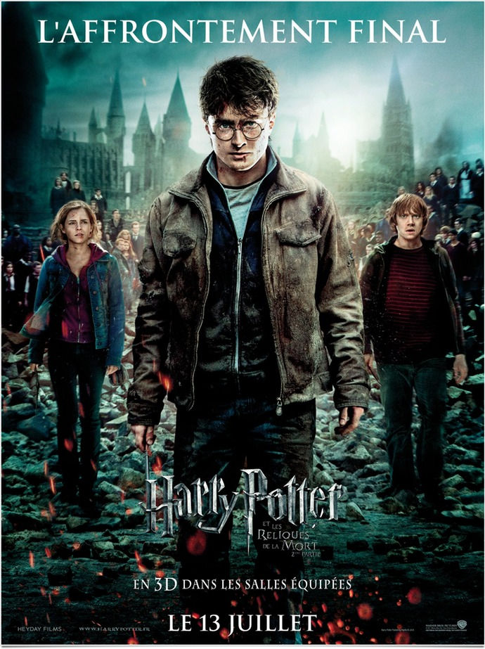
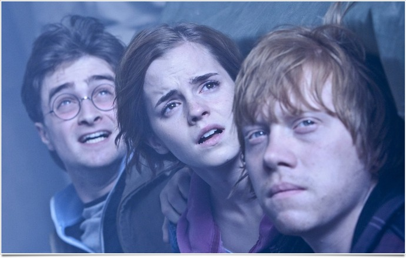
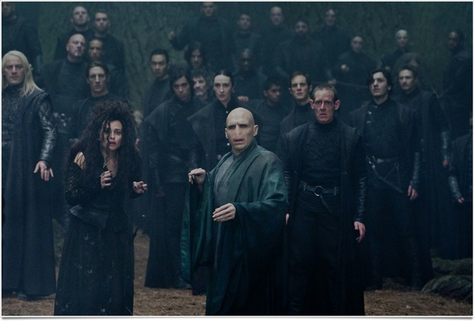

+++
type = "post"
titre = "<em>Harry Potter et les Reliques de la Mort (partie 2)</em>, David Yates"
title = "Harry Potter et les Reliques de la Mort (partie 2), David Yates"
url = "/harry-potter-7-reliques-mort-partie-2-yates"
date = "2011-07-15T01:10:27"
Lastmod = "2014-09-23T23:59:35"
cover = "harry-potter-et-les-reliques-de-la-mort-partie-2-yates.jpg"
categorie = [ "À voir" ]
tag = [ "Blockbuster", "Drame", "Fantastique", "Guerre", "Harry Potter", "Magie", "Sorcellerie" ]
createur = [ "David Yates" ]
acteur = [ "Alan Rickman", "Bill Nighy", "Daniel Radcliffe", "Emma Watson", "Helena Bonham Carter", "Michael Gambon", "Ralph Fiennes", "Rupert Grint" ]
annee = [ "2011" ]
weight = 2011
saga = [ "Harry Potter" ]
pays = [ "États-Unis" ]
original = "Harry Potter and the Deathly Hallows - Part 2"

+++

« L’affrontement final » : le ton est donné. <em>Harry Potter et les Reliques de la Mort (partie 2)</em> est l’ultime combat entre Harry Potter et son ennemi jumeau Voldemort. C’est le combat de la dernière chance pour la magie blanche contre la magie noire, c’est aussi le point final d’une saga qui a fait ses premiers pas au cinéma il y a dix ans de cela. Dix ans et huit films après, les spectateurs ont grandi, tout comme les acteurs et les films. <a href="http://voiretmanger.fr/harry-potter-a-l-ecole-des-sorciers-colombus/" title="Harry Potter à l’école des sorciers, Chris Colombus"><em>Harry Potter à l’école des sorciers</em></a> était une adaptation gentille, pour les enfants. <em>Harry Potter et les Reliques de la Mort</em> est un film long (4h30 en tout) et extrêmement noir, bien loin du public d’enfants visé par le premier opus. Plus classique dans cette deuxième partie, la conclusion de la saga Harry Potter ne déçoit pas. On nous a promis un affrontement final, on l’a et on en prend plein les yeux.

<em><a href="http://voiretmanger.fr/2010/11/24/harry-potter-7-partie-1-yates/">Harry Potter et les Reliques de la Mort (partie 1)</a></em> s’achevait à un moment critique. Voldemort mettait la main sur la baguette de Dumbledore qui se trouve être la plus puissante baguette qui soit. La quête des trois héros patinait alors que le camp adverse allait de victoire en victoire. Cette fin très sombre concluait un long road-trip tendance post-apocalyptique et plein de désespoir. <em>Harry Potter et les Reliques de la Mort (partie 2)</em> reprend exactement au même moment. Harry et ses amis enterrent l’elfe Dobby, mais l’action prend vite le dessus, en quête des derniers Hoxcruxes, objets renfermant l’âme de Voldemort. On se rend ainsi dans la banque des Gobelins, puis rapidement à Poudlard. Oubliée dans la première partie, l’école revient au centre de l’action dans cet ultime épisode et avec elle des lieux déjà connus du spectateur. Même si le terrain de quidditch est en flammes, même si l’école est en ruine, même si la forêt interdite est pleine de maraudeurs à la solde de Voldemort… on est en terrain connu. L’école justement va constituer le lieu de l’affrontement final. Les péripéties s’enchainent à un rythme élevé, les derniers pans de l’histoire d’Harry restés dans l’ombre se dévoilent… jusqu’à l’épilogue que l’on ne dévoilera pas pour ceux qui n’ont pas encore lu le livre, ou vu le film.

La partie 1 tranchait par une narration lente et épurée. <em>Harry Potter et les Reliques de la Mort (partie 2)</em> au contraire reprend un rythme de narration plus classique pour un blockbuster, avec beaucoup de scènes d’action qui ménagent toutefois quelques pauses romantiques (les premières amours se dévoilent enfin) ou comiques. Reste que le film de David Yates est extrêmement dense et se concentre quasiment exclusivement sur cet affrontement final des deux ennemis liés contre leur volonté et à leur insu. Si les liens entre Harry Potter et Voldemort sont présents dans toute la saga, ils deviennent ici prépondérants et justifient la conclusion. Celle-ci est assez complexe à dire vrai, mais le film parvient assez miraculeusement à rendre totalement compréhensible l’histoire. Mieux vaut avoir une idée assez précise des épisodes précédents, indéniablement, et le film ne fait quasiment aucun effort pour rattraper ceux qui sont perdus : en cela, <em>Harry Potter et les Reliques de la Mort (partie 2)</em> est vraiment la suite d’un seul et même film. L’histoire reste néanmoins tout à fait lisible, tout comme l’action : David Yates a fait le choix avisé de ne pas trop accentuer le côté épique qui rappelle immanquablement <em>Le Seigneur des Anneaux</em>. Le combat de Poudlard sert ici de toile de fond à la quête quasiment personnelle de Harry Potter, il ne prend jamais le devant de la scène. Certaines scènes épiques ou époustouflantes restent au programme, mais le film est finalement plutôt modeste de ce côté, avec une relative économie de moyens qui tranche par rapport à la moyenne des productions de cette taille.

On l’a dit, <em>Harry Potter et les Reliques de la Mort (partie 2)</em> est plus classique que la première partie, finalement assez osée et relativement difficile d’accès pour un blockbuster familial. Classique, certes, mais pas déjà vu : depuis la mort de Dumbledore, plus rien n’est comme avant, le côté noir de la magie prend une force considérable et devient la norme. Poudlard n’est plus le cocon protecteur qu’il était bon an mal an jusque-là, c’est devenu un camp de prisonniers assez terrifiant. Ce combat dépasse tous les personnages du film, exception faite peut-être de Voldemort et Harry Potter et le film les efface également. Par le passé, certains épisodes ont pu accorder une place importante aux personnages eux-mêmes, à leur psychologie et leurs relations — on pense tout particulièrement à <a href="http://voiretmanger.fr/harry-potter-et-le-prince-de-sang-mele-yates/" title="Harry Potter et le Prince de sang mêlé, David Yates"><em>Harry Potter et le Prince de sang mêlé</em></a> qui tendait presque au <em>teen-movie</em> —, celui-ci les met presque totalement de côté, alors même que c’est le moment où tout se concrétise. Ron et Hermione s’avouent enfin leur amour et le montrent, Harry et Gini continuent de s’embrasser discrètement et Harry obtient enfin les dernières pièces du puzzle de sa vie en accédant aux pensées du professeur Rogue. <em>Harry Potter et les Reliques de la Mort (partie 2)</em> a néanmoins tendance à les laisser de côté et à se concentrer sur l’affrontement. Ce choix est certainement le meilleur avec un matériau de base d’une telle densité, même si certains éléments sont clairement sacrifiés, notamment sur la mort de personnages secondaires importants. On aurait également aimé en savoir plus sur les relations entre Rogue et la mère de Harry, mais tous ces choix se comprennent facilement au regard de la richesse de l’affrontement lui-même. Encore une fois, le temps n’est pas aux tergiversations et aux explications.

David Yates n’a peut-être aucune personnalité marquée en tant que réalisateur, il est certainement celui qui a le plus marqué la saga. Par le nombre de films évidemment, mais aussi par un style discret, mais bien réel. Alfonso Cuarón a fait une proposition intéressante et certainement plus cinéphile avec <em>Harry Potter et le Prisonnier d’Azkaban</em>, mais ce film est sans doute trop original et différent du reste de la saga. <em>Harry Potter et les Reliques de la Mort (partie 2)</em>, comme la première partie, est très noir, aussi à l’écran. Les images sont dénaturées, les tons sont sombres ou grisâtres… la lumière et les couleurs n’ont pas souvent l’occasion de se faire une place. Cet ultime épisode retrouve les combats et les effets spéciaux à la pelle, mais pas à outrance. Le film n’est pas une démonstration technique, les effets sont en général bien choisis et utilisés à bon escient. La musique est sur le même ton, discrète et bien trouvée. <em>Harry Potter et les Reliques de la Mort (partie 2)</em> n’est pas un film qui brille par son originalité, certes, mais il tient parfaitement la route et sert parfaitement son propos. David Yates est modeste, et il a bien raison. Seul regret, une 3D vraiment inutile qui a été certainement imposée par des studios en quête de gros sous. Elle n’est quasiment jamais utilisée, ou de manière bien trop discrète pour se faire remarquer. D’un côté, tant mieux, le film ne pâtit pas d’images floues et sombres, mais on se demande bien pourquoi elle est imposée ainsi… Si vous le pouvez, autant voir ce film sans lunettes.

Quand le générique de fin paraît et que l’on suit les aventures du sorcier à la cicatrice en forme d’éclair depuis ses débuts, on se sent forcément un peu étrange. Ça y est, c’est fini, le rendez-vous quasiment annuel n’est plus : Harry Potter ne sera plus jamais (normalement) sur les écrans. <em>Harry Potter et les Reliques de la Mort (partie 2)</em> est une belle fin pour cette saga, une fin plutôt sage et mesurée, une fin efficace, pas trop épique, mais quand même impressionnante, une fin qui devrait soulever d’émotion les plus grands fans. Ne le nions pas, la partie 1 était plus intéressante, parce que plus radicale et sèche encore que cette deuxième partie. Reste que cette fin touche forcément un peu plus et conclut une expérience cinématographique rare. Dix ans passés avec des acteurs, on aurait presque l’impression de les connaître comme de la famille lointaine…

<h3>Vous voulez m&rsquo;aider ?<a href="#footnote_0_4960" id="identifier_0_4960" class="footnote-link footnote-identifier-link" title="&Agrave; propos de la publicit&eacute;&hellip;">1</a></h3>
<ul>
<li><a href="http://www.amazon.fr/gp/product/B00567I0XG/ref=as_li_ss_tl?ie=UTF8&#038;tag=leblogdenic07-21&#038;linkCode=as2&#038;camp=1642&#038;creative=19458&#038;creativeASIN=B00567I0XG">Acheter le film en Blu-Ray sur Amazon</a></li>
<li><a href="http://www.amazon.fr/gp/product/B006T6HHW8/ref=as_li_ss_tl?ie=UTF8&#038;tag=leblogdenic07-21&#038;linkCode=as2&#038;camp=1642&#038;creative=19458&#038;creativeASIN=B006T6HHW8">Acheter le film en DVD sur Amazon</a></li>
<li><a href="http://itunes.apple.com/fr/movie/harry-potter-et-les-reliques/id465705992">Acheter ou louer le film sur l&rsquo;iTunes Store</a></li>
</ul>
<ul>
<li><a href="http://www.amazon.fr/gp/product/B005JRHBII/ref=as_li_ss_tl?ie=UTF8&#038;tag=leblogdenic07-21&#038;linkCode=as2&#038;camp=1642&#038;creative=19458&#038;creativeASIN=B005JRHBII">Acheter la saga en Blu-Ray sur Amazon</a></li>
<li><a href="http://www.amazon.fr/gp/product/B005JRHBG0/ref=as_li_ss_tl?ie=UTF8&#038;tag=leblogdenic07-21&#038;linkCode=as2&#038;camp=1642&#038;creative=19458&#038;creativeASIN=B005JRHBG0">Acheter le film en DVD sur Amazon</a></li>
</ul>

<ol class="footnotes"><li id="footnote_0_4960" class="footnote"><a href="http://voiretmanger.fr/a-propos/publicite/">À propos de la publicité…</a> [<a href="#identifier_0_4960" class="footnote-link footnote-back-link">&#8617;</a>]</li></ol>
