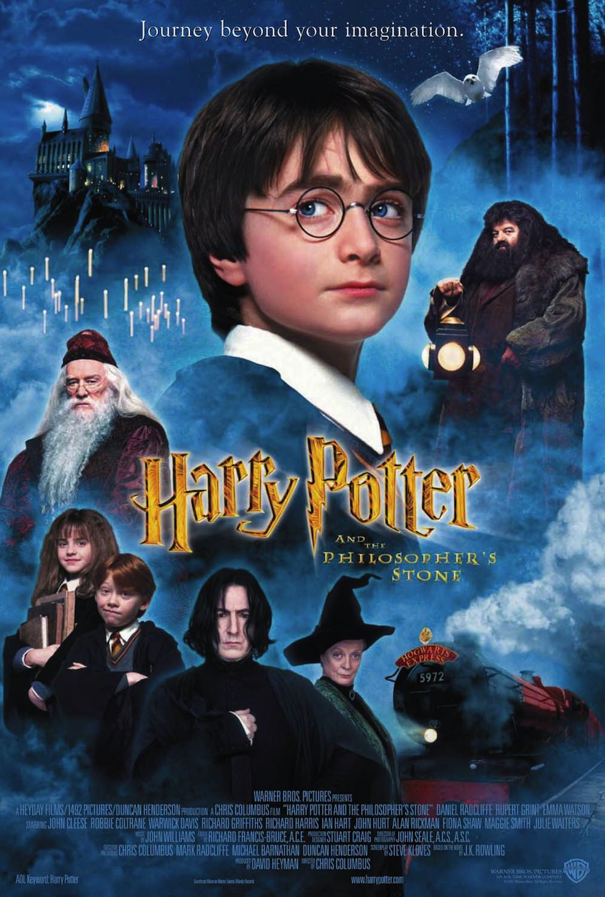
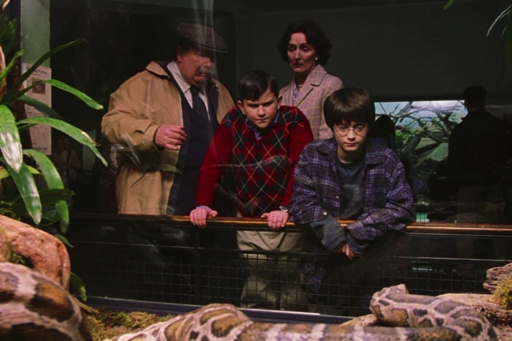
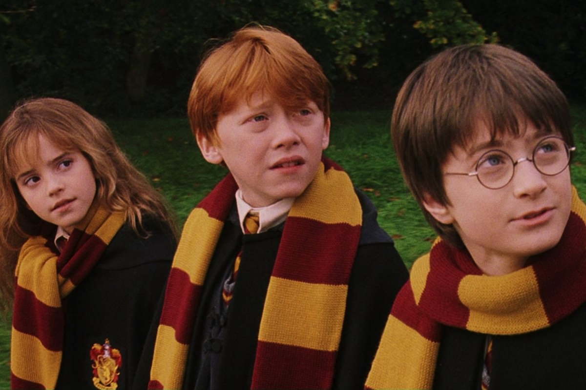
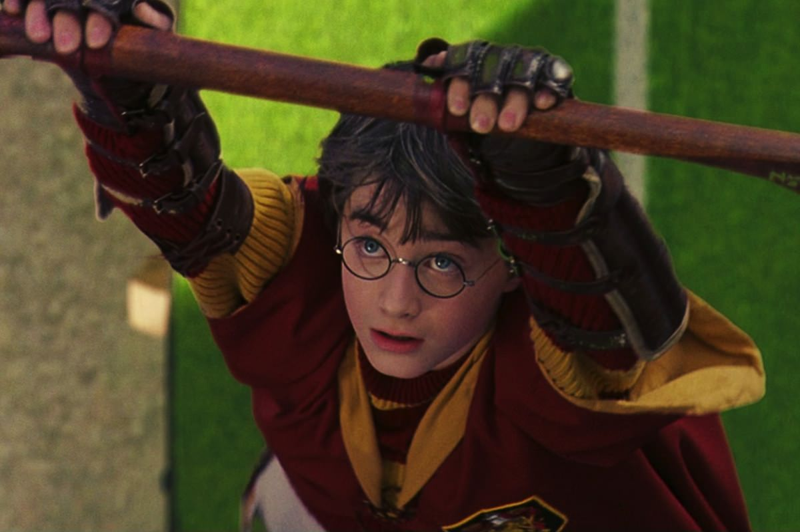

+++
type = "post"
titre = "<em>Harry Potter à l&rsquo;école des sorciers</em>, Chris Colombus"
title = "Harry Potter à l'école des sorciers, Chris Colombus"
url = "/harry-potter-a-l-ecole-des-sorciers-colombus"
date = "2013-05-21T10:21:29"
Lastmod = "2013-05-29T22:37:22"
cover = "harry-potter-a-l-ecole-des-sorciers-daniel-radcliffe.jpg"
categorie = [ "À voir" ]
tag = [ "Adaptation littéraire", "Aventure", "Blockbuster", "Famille", "Fantastique", "Harry Potter", "Humour", "Magie" ]
createur = [ "Chris Colombus" ]
acteur = [ "Alan Rickman", "Daniel Radcliffe", "Emma Watson", "Maggie Smith", "Richard Harris", "Robbie Coltrane", "Rupert Grint" ]
annee = [ "2001" ]
weight = 2001
saga = [ "Harry Potter" ]
pays = [ "États-Unis" ]
original = "Harry Potter and the Philosopher's Stone"

+++

La saga <em>Harry Potter</em> était déjà un phénomène planétaire en 2001, mais pas encore au cinéma. Si le premier roman écrit par J.K. Rowling est largement passé inaperçu, le succès commence dès le deuxième tome et les producteurs de cinéma ne sont pas passés à côté. Warner achète pour une bouchée de pain les droits pour porter le premier volume à l’écran et c’est ainsi que <em>Harry Potter à l’école des sorciers</em> sort dans toutes les salles de cinéma à la fin de l’année 2001. Difficile alors de deviner que ce premier long-métrage allait ouvrir la voie à l’une des plus grandes sagas de l’histoire du cinéma, avec cette particularité que les personnages grandiront au même rythme que les acteurs et que leurs spectateurs. En attendant, c’est Chris Colombus qui est chargé de réaliser ce premier opus et <em>Harry Potter à l’école des sorciers</em> est à l’image de ses jeunes acteurs : un film destiné d’abord aux enfants. Il n’est encore ni l’heure de la noirceur, ni celle de l’adolescence : pendant 2h30, on découvre en même temps que le héros de la saga un univers magique à couper le souffle. Un premier film réussi, à voir et à revoir en famille.

Peut-on encore ignorer l’histoire de Harry Potter, le sorcier orphelin qui est le seul à avoir survécu à l’attaque du plus grand sorcier à faire de la magie noire ? <em>Harry Potter à l’école des sorciers</em> nous permet de découvrir le personnage principal de la saga, mais aussi son univers. Chris Colombus commence de manière astucieuse directement quand on dépose le bébé sur le pas de porte de son oncle Vernon et de sa tante Pétunia qui est aussi la sœur de la mère de Harry. Après la mort de ses deux parents, le garçon est recueilli par cette famille qui le hait, ou plutôt qui hait le fait qu’il soit un sorcier. Le film ne s’attarde pas plus sur sa jeune enfance que le roman de J.K. Rowling, pour continuer peu avant son onzième anniversaire. Onze ans, c’est l’âge auquel un sorcier entre à Poudlard, l’école de sorcellerie. Harry y est inscrit depuis sa naissance, mais sa famille d’accueil n’accepte pas le fait qu’il soit un sorcier et l’empêche de partir. Cette première séquence chez « les Moldus » (nom de ceux qui ne sont pas sorciers) est traditionnelle dans la saga, mais elle est rarement aussi développée que dans <em>Harry Potter à l’école des sorciers</em>. Il faut dire que Harry lui-même ignore tout de sa condition et le jeune garçon est résigné, dans un premier temps, à vivre dans ce cadre sans amour. Pour Chris Colombus, c’est l’occasion de séquences tournées vers l’humour, surtout avec la famille de Harry composée uniquement de personnages médiocres et méchants, jusqu’à la caricature. Les trois acteurs s’en donnent à cœur joie et cette partie est assez drôle, comme s’il s’agissait d’une relecture sur le mode de la farce d’un <em>Oliver Twist</em>. Le processus d’identification joue à plein et tous les jeunes spectateurs s’identifieront immédiatement au personnage qui est toujours un peu triste, faute de comprendre sa différence.

Cette situation familiale difficile posée, <em>Harry Potter à l’école des sorciers</em> hausse le ton en nous plongeant dans un univers que l’on a découvert pour la première fois avec ce film et qui reste d’une richesse folle, même s’il est beaucoup plus familier aujourd’hui. Chris Colombus met en place l’univers magique du film avec une séquence d’emplettes dans un Londres de sorciers auquel on accède par l’arrière-cour d’un bar un peu miteux. À partir de là, le film est vraiment mené à la hauteur du jeune Harry Potter qui découvre, bouche bée, cet univers où tout le monde possède une baguette et peut faire ce qu’il veut avec. <em>Harry Potter à l’école des sorciers</em> pose d’emblée quelques lieux emblématiques qui reviendront régulièrement, dont la banque des Gobelins, mais aussi le fameux train qui emmène tous les élèves à Poudlard. C’est justement dans le train que le trio se forme : central dans la saga, il est composé de Harry Potter bien sûr et de ses deux meilleurs amis, Ron Weasley et Hermione Granger. Ces trois personnages sont totalement complémentaires et leurs premières aventures vont le prouver : le courage de Harry, l’intelligence de Hermione et la naïveté sympa de Ron. Rarement une saga au cinéma n’avait duré aussi longtemps avec les mêmes personnages et, plus important encore, les mêmes acteurs. En 2001, leur choix était essentiel et on peut dire que Chris Colombus a fait les bons choix : Daniel Radcliffe se débrouille déjà bien pour jouer le garçon émerveillé qui cherche à comprendre ce qui lui arrive, mais on retiendra surtout les mines de Rupert Grint dans le rôle de Ron et l’interprétation d’Emma Watson en caricature de première de la classe est tordante. Ils sont encore très jeunes dans <em>Harry Potter à l’école des sorciers</em> et la saga va révéler différemment chaque membre du trio, mais ils sont en tout cas convaincants dans ce premier film à leur image.  

Chris Colombus n’a pas été choisi à la réalisation pour imprimer sa marque et <em>Harry Potter à l’école des sorciers</em> est un film assez pauvre sur le plan cinématographique, ou plutôt transparent. La mise en scène est toute entière mise au service de l’histoire et son unique enjeu est de fournir une introduction aussi efficace que possible. Et ce premier film est d’une efficacité redoutable : même s’il dure plus de 2h30, on ne s’ennuie jamais et on se laisse au contraire porter par ce récit magique qui concentre tous les points forts de la saga. À cet égard, <em>Harry Potter à l’école des sorciers</em> est peut-être paradoxalement l’épisode le plus équilibré : moins spectaculaire ou sombre que certains successeurs, pas encore touché par l’adolescence de ses personnages et de son public, il est un film familial réussi. Les touches d’humour sont bien dosées, on a (un peu) peur avec Harry et ses amis et surtout on découvre tout ce qui fait le succès de <em>Harry Potter</em>. Une fois arrivés à Poudlard, les héros vont en effet découvrir un après l’autre tous les éléments clés de l’école et de la saga. Des couloirs parfois dangereux jusqu’à la hutte de Hagrid, de la forêt interdite jusqu’aux pièces secrètes du château, <em>Harry Potter à l’école des sorciers</em> offre un aperçu plutôt complet des décors de la série. Chris Colombus met aussi en scène des moments clés, avec un premier match de Quidditch très réussi, plusieurs cours, quelques affrontements avec des bestioles terrifiantes et dangereuses (un troll, un dragon, un chien à trois têtes, etc.) et évidemment, le défi final. Les premières années écrites par J.K. Rowling se concluent toujours sur une série d’épreuves qui impliquent, de près ou de loin, Harry Potter et son ennemi de toujours Voldemort. Ce premier affrontement entre les deux sorciers est un moment fort de <em>Harry Potter à l’école des sorciers</em> : le personnage maléfique n’a pas encore de corps, mais il est déjà très impressionnant, peut-être même plus encore que lorsqu’il sera incarné. Chris Colombus visant la jeunesse, il filme ce combat de manière assez sage, mais la scène n’en est pas moins inquiétante, surtout pour les enfants. C’est, en tout cas, une bien belle entrée en matière pour cette première approche : la saga ne fait, après tout, que commencer.

Pour sa première fois, la saga <em>Harry Potter</em> s’offre une adaptation de qualité sous la direction de Chris Colombus. Certes, <em>Harry Potter à l’école des sorciers</em> n’est pas du grand cinéma, mais ce n’est pas le but recherché : ce film est une illustration assez fidèle — les fans n’ont évidemment pas manqué de relever les trous du scénario… — et plutôt réussie du premier roman. Le public visé est jeune, le film est d’ailleurs autorisé pour tous les enfants à partir de six ans : on est loin de la noirceur qui caractérisera la fin de la saga. En attendant, <em>Harry Potter à l’école des sorciers</em> offre une introduction enjouée et plaisante à l’univers de J.K. Rowling. Le succès a été immédiat : la saga part sur de bonnes bases et peut dorénavant sortir tous les ans, ou presque…

<h3>Vous voulez m’aider ?<a href="#footnote_0_9530" id="identifier_0_9530" class="footnote-link footnote-identifier-link" title="&Agrave; propos de la publicit&eacute;&hellip;">1</a></h3>
<ul>
<li><a href="http://www.amazon.fr/gp/product/B000X37JB2/ref=as_li_ss_tl?ie=UTF8&#038;tag=leblogdenic07-21&#038;linkCode=as2&#038;camp=1642&#038;creative=19458&#038;creativeASIN=B000X37JB2">Acheter le film en Blu-Ray sur Amazon</a></li>
<li><a href="http://www.amazon.fr/gp/product/B0001GQW5A/ref=as_li_ss_tl?ie=UTF8&#038;tag=leblogdenic07-21&#038;linkCode=as2&#038;camp=1642&#038;creative=19458&#038;creativeASIN=B0001GQW5A">Acheter le film en DVD sur Amazon</a></li>
<li><a href="https://itunes.apple.com/fr/movie/harry-potter-lecole-des-sorciers/id405031123">Acheter ou louer le film sur l’iTunes Store</a></li>
</ul>
<ul>
<li><a href="http://www.amazon.fr/gp/product/B005JRHBII/ref=as_li_ss_tl?ie=UTF8&#038;tag=leblogdenic07-21&#038;linkCode=as2&#038;camp=1642&#038;creative=19458&#038;creativeASIN=B005JRHBII">Acheter la saga en Blu-Ray sur Amazon</a></li>
<li><a href="http://www.amazon.fr/gp/product/B005JRHBG0/ref=as_li_ss_tl?ie=UTF8&#038;tag=leblogdenic07-21&#038;linkCode=as2&#038;camp=1642&#038;creative=19458&#038;creativeASIN=B005JRHBG0">Acheter le film en DVD sur Amazon</a></li>
</ul>

<ol class="footnotes"><li id="footnote_0_9530" class="footnote"><a href="http://voiretmanger.fr/soutien/">À propos de la publicité…</a> [<a href="#identifier_0_9530" class="footnote-link footnote-back-link">&#8617;</a>]</li></ol>
