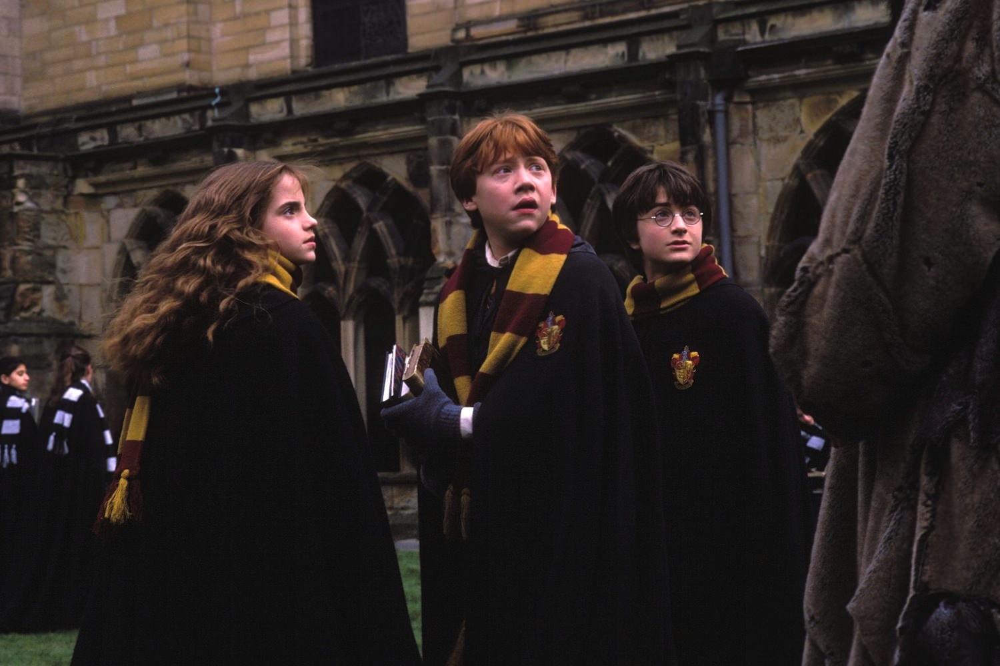
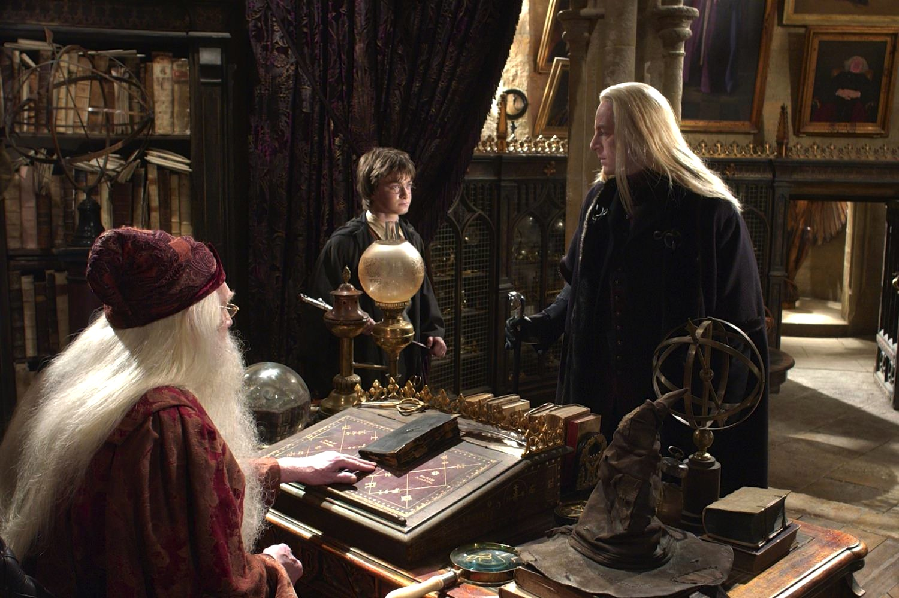

+++
type = "post"
titre = "<em>Harry Potter et la chambre des secrets</em>, Chris Colombus"
title = "Harry Potter et la chambre des secrets, Chris Colombus"
url = "/harry-potter-et-la-chambre-des-secrets-colombus"
date = "2013-05-24T09:02:22"
Lastmod = "2013-05-29T22:33:10"
cover = "harry-potter-et-la-chambre-des-secrets-daniel-radcliffe-chris-colombus.jpg"
categorie = [ "À voir" ]
tag = [ "Action", "Adolescence", "Blockbuster", "Enquête", "Fantastique", "Magie", "Saga" ]
createur = [ "Chris Colombus" ]
acteur = [ "Alan Rickman", "Daniel Radcliffe", "Emma Watson", "Kenneth Branagh", "Maggie Smith", "Richard Harris", "Robbie Coltrane", "Rupert Grint" ]
annee = [ "2002" ]
weight = 2002
saga = [ "Harry Potter" ]
pays = [ "États-Unis" ]
original = "Harry Potter and the Chamber of Secrets"

+++

Trois jours à peine après la sortie de <a href="/harry-potter-a-l-ecole-des-sorciers-colombus/" title="Harry Potter à l’école des sorciers, Chris Colombus"><em>Harry Potter à l’école des sorciers</em></a>, la production commence à travailler à une suite. Le premier volet de l’adaptation au cinéma des aventures du sorcier Harry Potter a été un tel succès que la suite ne pouvait que suivre très rapidement. Un an après, <em>Harry Potter et la chambre des secrets</em> sort dans les salles du monde entier. Chris Colombus est à nouveau employé pour réaliser ce nouveau tome qui change déjà de ton. Finies les aventures pour enfants, Harry et ses amis grandissent, ils entrent dans l’adolescence et gagnent en maturité, tout comme l’histoire, plus sombre et violente que précédemment. Un changement de direction qui sera confirmé par la suite et qui se fait encore par petites touches dans ce blockbuster qui sait rester largement familial. Moins d’humour, plus d’action et du grand spectacle : la formule n’est pas très originale, mais <em>Harry Potter et la chambre des secrets</em> la met très bien en œuvre. 

En décembre 2002, on découvrait le plaisir de retrouver tous les ans, ou presque, le monde magique de la saga <em>Harry Potter</em>. Dès que le logo s’affiche, quand la (très bonne) <a href="http://www.amazon.fr/gp/product/B00006IR5S/ref=as_li_ss_tl?ie=UTF8&tag=leblogdenic07-21&linkCode=as2&camp=1642&creative=19458&creativeASIN=B00006IR5S">bande originale</a> à nouveau composée par John Williams fait sonner les notes cristallines du « thème Harry Potter » : aucun doute à avoir, on est à nouveau dans l’univers imaginé par J.K. Rowling. De fait, ce nouveau film suit une structure assez similaire au précédent : <em>Harry Potter et la chambre des secrets</em> ouvre chez l’oncle et la tante de Harry et même si la situation de ce dernier a un peu évolué — il a une vraie chambre désormais —, le comportement de ses tuteurs à son égard n’a pas changé. Il est toujours maltraité et c’est pire encore cette année : Dobby, un elfe, est bien décidé à l’empêcher de se rendre à Poudlard pour le sauver d’une menace qui reste inconnue et fait tout pour le punir. Avec succès d’ailleurs, mais Chris Colombus avance rapidement et sauve son héros des griffes de ses tortionnaires grâce à Ron et ses frères qui viennent le chercher en voiture. Après cette introduction estivale, le long-métrage nous embarque vers Poudlard pour suivre une année de cours plus ou moins normale. Par rapport à <em>Harry Potter à l’école des sorciers</em>, la situation est plus tendue à cause d’une menace qui s’instaure vite : le chat du surveillant, puis des élèves sont retrouvés pétrifiés dans les couloirs de l’école, tandis que des messages sur les murs annoncent la réouverture de la Chambre des Secrets. À l’école, Harry retrouve justement ses deux meilleurs amis et il n’est jamais éloigné très longtemps de Ron et Hermione : ensemble, ils se mettent logiquement en quête de savoir ce qu’est cette chambre secrète et de trouver celui qui est derrière ces menaces. Chris Colombus reprend ainsi la structure crescendo du film précédent, qui est aussi celle du roman : <em>Harry Potter et la chambre des secrets</em> augmente en intensité dramatique au fur et à mesure que les héros avancent vers le méchant de l’épisode qui n’est autre, on s’en doute, que Voldemort. La dernière partie est ainsi consacrée à la découverte de la chambre et surtout à l’affrontement final qui verra la victoire de Harry Potter : on n’en est qu’au deuxième tome après tout.

<em>Harry Potter et la chambre des secrets</em> reprend beaucoup de thèmes récurrents dans la saga et il est ainsi toujours très familier. Les personnages et les acteurs n’ont pas changé, à l’exception du professeur des forces du mal qui est renouvelé à chaque fois : Gilderoy Lockhart est un professeur menteur et égocentrique, un personnage loufoque très réussi et parfaitement interprété par Kenneth Branagh. Chris Colombus ne change pas les éléments qui ont fait le succès du premier opus, des commerces de magie de Londres jusqu’à la forêt interdite de Poudlard, mais il introduit quelques nouveautés. L’elfe Dobby ne joue encore qu’un rôle mineur, tandis que Hermione est absente pendant une large partie du long-métrage : le film se resserre ainsi sur Ron et Harry, et même surtout ce dernier. Ce changement est significatif d’un autre, plus profond : <em>Harry Potter et la chambre des secrets</em> a largement perdu le ton enfantin de son prédécesseur. En un an, Daniel Radcliffe, Rupert Grint et Emma Watson ont grandi, les deux premiers ont mué — l’acteur qui interprète Ron a même les sautes de voix typiques de cet âge — et l’ambiance a mué avec eux. Finis donc le ton enjoué, les musiques douces et les combats cérébraux : place à une violence plus frontale et brutale et à un ton plus sombre. Sans atteindre le désespoir qui caractérise la fin de la saga, Chris Colombus opère un changement très net dès ce deuxième volet qui est plus adulte, tout simplement. Si l’on peut regarder <em>Harry Potter à l’école des sorciers</em> sans risque avec des enfants, celui-ci risque bien de les impressionner un peu trop. Entre araignées et serpents, les messages écrits au sang sur les murs et le combat final ensanglanté risqueront d’impressionner les plus jeunes. Les autres apprécieront ce changement de ton qui sied plutôt bien à la saga.

Chris Colombus ne signe pas plus un grand film, mais il réalise un nouveau un excellent blockbuster pour cette deuxième adaptation de la saga <em>Harry Potter</em>. Plus sombre, <em>Harry Potter et la chambre des secrets</em> suit l’âge de ses personnages et vise moins ostensiblement les plus jeunes. Tant mieux, cet épisode est une mise en images réussie du roman de J.K. Rowling, pour un film dense et intense qui sait préserver le côté magique de l’ensemble. 

<h3>Vous voulez m&rsquo;aider ?<a href="#footnote_0_9541" id="identifier_0_9541" class="footnote-link footnote-identifier-link" title="&Agrave; propos de la publicit&eacute;&hellip;">1</a></h3>
<ul>
<li><a href="http://www.amazon.fr/gp/product/B002NRBY08/ref=as_li_ss_tl?ie=UTF8&tag=leblogdenic07-21&linkCode=as2&camp=1642&creative=19458&creativeASIN=B002NRBY08">Acheter le film en Blu-Ray sur Amazon</a></li>
<li><a href="http://www.amazon.fr/gp/product/B00008CJKR/ref=as_li_ss_tl?ie=UTF8&tag=leblogdenic07-21&linkCode=as2&camp=1642&creative=19458&creativeASIN=B00008CJKR">Acheter le film en DVD sur Amazon</a></li>
<li><a href="https://itunes.apple.com/fr/movie/harry-potter-et-la-chambre/id404658163">Acheter ou louer le film sur l&rsquo;iTunes Store</a></li>
</ul>
<ul>
<li><a href="http://www.amazon.fr/gp/product/B005JRHBII/ref=as_li_ss_tl?ie=UTF8&tag=leblogdenic07-21&linkCode=as2&camp=1642&creative=19458&creativeASIN=B005JRHBII">Acheter la saga en Blu-Ray sur Amazon</a></li>
<li><a href="http://www.amazon.fr/gp/product/B005JRHBG0/ref=as_li_ss_tl?ie=UTF8&tag=leblogdenic07-21&linkCode=as2&camp=1642&creative=19458&creativeASIN=B005JRHBG0">Acheter le film en DVD sur Amazon</a></li>
</ul>

<ol class="footnotes"><li id="footnote_0_9541" class="footnote"><a href="/soutien/">À propos de la publicité…</a> [<a href="#identifier_0_9541" class="footnote-link footnote-back-link">&#8617;</a>]</li></ol>
