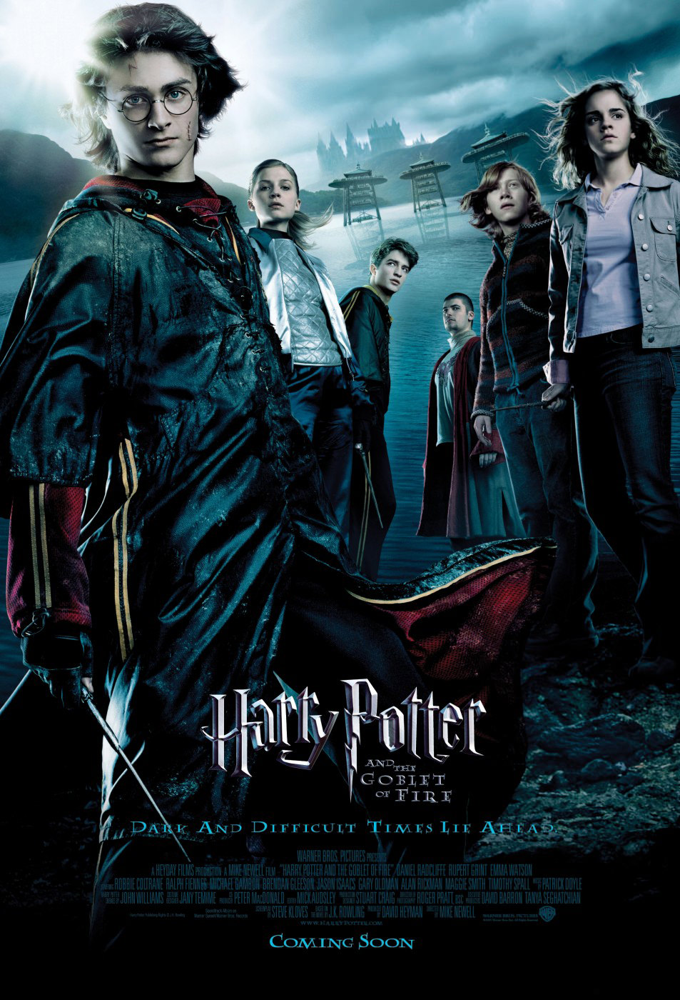
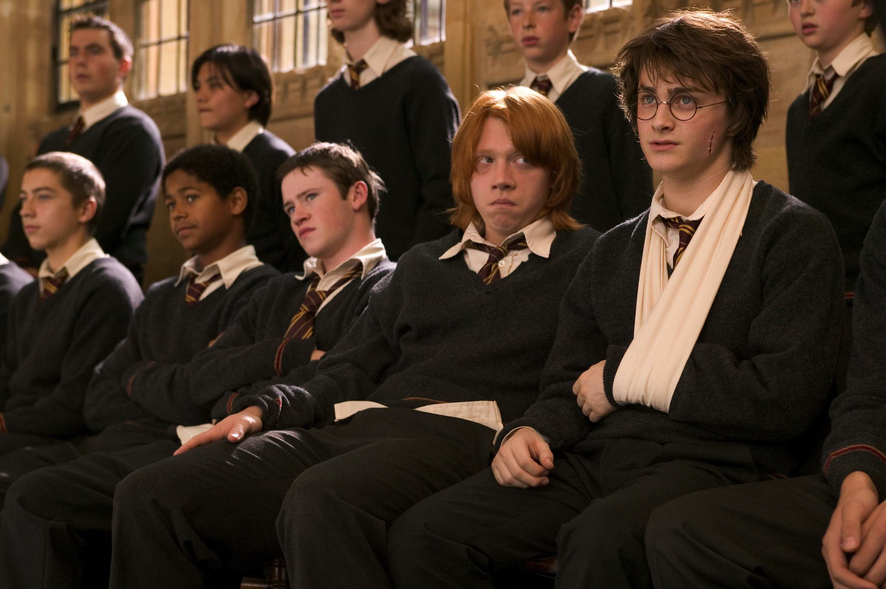
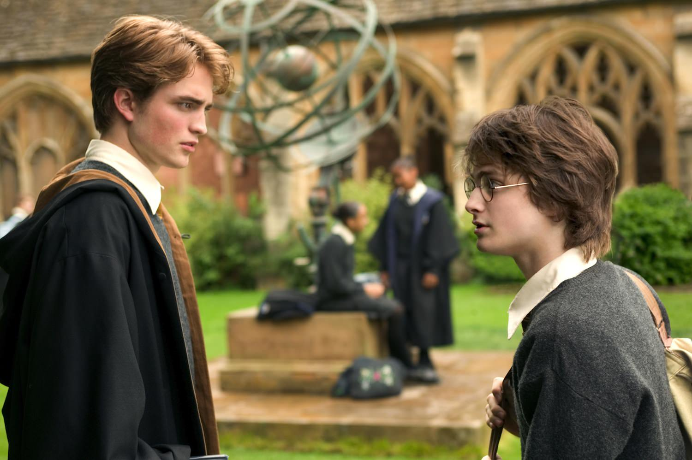

+++
type = "post"
titre = "<em>Harry Potter et la Coupe de Feu</em>, Mike Newell"
title = "Harry Potter et la Coupe de Feu, Mike Newell"
url = "/harry-potter-et-la-coupe-de-feu-newell"
date = "2013-05-29T00:00:08"
Lastmod = "2013-05-29T22:25:50"
cover = "harry-potter-et-la-coupe-de-feu-mike-newell.jpg"
categorie = [ "À voir" ]
tag = [ "Action", "Adolescence", "Blockbuster", "Fantastique", "Harry Potter", "Magie", "Saga", "Teen Movie" ]
createur = [ "Mike Newell" ]
acteur = [ "Brendan Gleeson", "Daniel Radcliffe", "Emma Watson", "Michael Gambon", "Ralph Fiennes", "Rupert Grint" ]
annee = [ "2005" ]
weight = 2005
saga = [ "Harry Potter" ]
pays = [ "États-Unis" ]
original = "Harry Potter and the Goblet of Fire"

+++

Un an après <a href="/harry-potter-et-le-prisonnier-d-azkaban-cuaron/" title="Harry Potter et le Prisonnier d’Azkaban, Alfonso Cuarón"><em>Harry Potter et le Prisonnier d’Azkaban</em></a> qui avait plongé la saga dans la noirceur, un quatrième épisode sort dans les salles du monde entier. Poursuivant le travail de Chris Colombus et d&rsquo;Alfonso Cuarón, c&rsquo;est Mike Newell qui prend le relai avec cette nouvelle adaptation des romans de J.K. Rowling. <em>Harry Potter et la Coupe de Feu</em> est un épisode essentiel dans l&rsquo;ensemble, puisque c&rsquo;est celui où Voldemort — l&rsquo;incarnation du mal par excellence dans <em>Harry Potter</em> — fait son grand retour et affronte pour la première fois le héros. Un moment très attendu donc, qui est amené par un blockbuster très efficace et à la fois assez étrange, alors que les personnages entrent de plain-pied dans l&rsquo;adolescence. Un long-métrage rythmé, spectaculaire et plaisant. 

Quelque chose s&rsquo;est cassé avec le précédent épisode. La magie enfantine des deux premiers tomes n&rsquo;a plus de place dans la saga et <em>Harry Potter et la Coupe de Feu</em> fait les choses différemment. Nulle introduction estivale chez les Dursleys cette fois, le film ouvre sur une scène d&rsquo;une noirceur absolue, où l&rsquo;on découvre les serviteurs de Voldemort qui s&rsquo;affaire autour d&rsquo;une forme que l&rsquo;on comprend être le corps du futur maître de la magie noire. Une mise à mort conclut cette scène qui est en fait un cauchemar de Harry Potter… que l&rsquo;on retrouve directement dans la famille de son ami Ron. Mike Newell semble ensuite retrouver un ton plus joyeux avec la Coupe de Quidditch, mais ce n&rsquo;est qu&rsquo;une illusion : alors que l&rsquo;on s&rsquo;attendait à un spectacle sportif dans le même esprit que le premier match dans <a href="/harry-potter-a-l-ecole-des-sorciers-colombus/" title="Harry Potter à l’école des sorciers, Chris Colombus"><em>Harry Potter à l’école des sorciers</em></a>, le match est évacué en deux secondes et le film retombe alors dans la noirceur absolue avec l&rsquo;attaque des Mangemorts et le signe de Voldemort qui témoigne de sombres présages. <em>Harry Potter et la Coupe de Feu</em> évacue également tout le cérémonial du départ et du voyage en train, on retrouve les personnages directement à Poudlard et là encore, le scénario mené à tambour battant ne s&rsquo;attarde pas. Le film introduit son sujet central, à savoir le « Tournoi des trois sorciers » qui oppose régulièrement trois écoles de magie dont, on l&rsquo;aura compris, Poudlard cette année-là. Très vite, Harry y est impliqué en devenant, bien malgré lui, un candidat et les épreuves commencent. Mike Newell découpe ainsi son film en trois étapes qui sont autant d&rsquo;épreuves du tournoi et de moments forts dans le récit. Il y a d&rsquo;abord les dragons à affronter, puis les sirènes du lac et enfin un labyrinthe enchanté : on retrouve dans ce trio les épreuves successives des deux premiers films, certes, mais là encore rien n&rsquo;est vraiment pareil. Le héros ne doit pas affronter seul ses ennemis, même si c&rsquo;est évidemment ce qui se passe. <em>Harry Potter et la Coupe de Feu</em> est ensuite construit entièrement autour de cette série d&rsquo;obstacles, là où ses prédécesseurs ne laissaient qu&rsquo;une place réduite aux épreuves, souvent à la fin. À l&rsquo;image du reste du film, le cinéaste filme ces épreuves sans perdre de temps, mais il n&rsquo;empêche que Mike Newell offre quelques séquences impressionnantes. La magie est au rendez-vous, même si elle est désormais beaucoup plus sombre — on découvre les sorts interdits que seuls Voldemort et ses partisans utilisent — et l&rsquo;ensemble est très divertissant et plutôt bien mené. 

<em>Harry Potter et la Coupe de Feu</em> n&rsquo;est pas qu&rsquo;un simple film d&rsquo;action pour autant, bien au contraire. Alors que Mike Newell filme des séquences au moins aussi sombres que pouvaient l&rsquo;être celles d&rsquo;Alfonso Cuarón, son adaptation n&rsquo;est pas aussi désespérée dans l&rsquo;ensemble. Paradoxalement, on sourit quand on ne rit pas dans ce nouvel opus qui réussit à être à la fois sombre et léger. Et pour cause, ses trois personnages principaux sont entrés de plein pied dans l&rsquo;adolescence, et cela se voit : c&rsquo;est le premier film de la saga qui s&rsquo;apparente au <a href="http://fr.wikipedia.org/wiki/Teen_movie"><em>teen movie</em></a>, ce genre comique qui met en scène des adolescents et leurs problèmes. Harry doit affronter des dragons et Voldemort, c&rsquo;est vrai, mais ce n&rsquo;est sans doute pas le plus difficile. Comme s&rsquo;en amuse d&rsquo;ailleurs son ami Ron à un moment, l&rsquo;épreuve la plus éprouvante pour eux est… d&rsquo;inviter une fille pour le bal de Noël donné à l&rsquo;occasion du tournoi. Ce bal situé au cœur de <em>Harry Potter et la Coupe de Feu</em> est filmé comme une épreuve à part entière et c&rsquo;est certainement la plus difficile à mener pour Harry et Ron. Les voir ainsi totalement maladroits avec les filles est assez amusant, mais le plus réussi reste leurs chamailleries dignes de collégiens. Ce ne sont pas des disputes vraiment sérieuses et c&rsquo;est justement ce qui fait tout leur charme : on sent que les hormones font leur travail. Daniel Radcliffe et Rupert Grint ont vieilli, ils ont les cheveux longs et en bataille dans cet épisode et déjà on sent une différence de jeu qui va se confirmer dans la suite : alors que le premier reste assez monocorde, le second développe ses talents d&rsquo;acteur et s&rsquo;avère plus convaincant. À leurs côtés, ou plutôt entre les deux, Emma Watson est beaucoup plus restée du côté de l&rsquo;enfance, mais son jeu est plus subtil, bien loin de la première de la classe un peu peste des débuts. En comparaison, Robert Pattinson qui n&rsquo;avait pas encore connu la gloire grâce à <a href="/saga/twilight/"><em>Twilight</em></a> fait en revanche pale figure. <em>Harry Potter et la Coupe de Feu</em> accorde plus de place à Dumbledore, l&rsquo;occasion de découvrir un Michael Gambon finalement assez convaincant, tandis que l&rsquo;on retrouve avec plaisir tous les professeurs de l&rsquo;école. Mike Newell ne révolutionne rien, ce n&rsquo;est d&rsquo;ailleurs pas son rôle, mais il a su correctement s&rsquo;approprier l&rsquo;univers de <em>Harry Potter</em>, tout en lui ajoutant cette touche adolescente qui fait l&rsquo;originalité de ce quatrième épisode par ailleurs toujours assez sombre.

Sans être l&rsquo;épisode le plus passionnant de la saga, <em>Harry Potter et la Coupe de Feu</em> est un divertissement de qualité, où l&rsquo;on ne s&rsquo;ennuie pas et qui nous permet de découvrir enfin le Voldemort version cinéma. Pour cette première apparition, Ralph Fiennes qui a été chargé de l&rsquo;interpréter s&rsquo;en sort plutôt bien, même si la vision dans <em>Harry Potter à l&rsquo;école des sorciers</em> était, paradoxalement, plus impressionnante. Reste que cette première rencontre entre Harry et son ennemi est une réussite, surtout après un film qui a oscillé constamment entre la gravité du mal et la légèreté du <em>teen movie</em> : la rupture finale est alors totale et Mike Newell a bien réussi son coup sur ce point. On pourrait critiquer une photographie un peu trop verdâtre, quelques scènes un peu ridicules et des personnages secondaires à peine esquissés, mais qu&rsquo;importe : <em>Harry Potter et la Coupe de Feu</em> est une adaptation plaisante et qui introduit comme il se doit le grand méchant de la saga. Voldemort a désormais la première place, il va pouvoir agir !

<h3>Vous voulez m&rsquo;aider ?<a href="#footnote_0_9587" id="identifier_0_9587" class="footnote-link footnote-identifier-link" title="&Agrave; propos de la publicit&eacute;&hellip;">1</a></h3>
<ul>
<li><a href="http://www.amazon.fr/gp/product/B000X37J8A/ref=as_li_ss_tl?ie=UTF8&tag=leblogdenic07-21&linkCode=as2&camp=1642&creative=19458&creativeASIN=B000X37J8A">Acheter le film en Blu-Ray sur Amazon</a></li>
<li><a href="http://www.amazon.fr/gp/product/B000ETWCBC/ref=as_li_ss_tl?ie=UTF8&tag=leblogdenic07-21&linkCode=as2&camp=1642&creative=19458&creativeASIN=B000ETWCBC">Acheter le film en DVD sur Amazon</a></li>
<li><a href="https://itunes.apple.com/fr/movie/harry-potter-et-la-coupe-de-feu/id365946551">Acheter ou louer le film sur l&rsquo;iTunes Store</a></li>
</ul>
<ul>
<li><a href="http://www.amazon.fr/gp/product/B005JRHBII/ref=as_li_ss_tl?ie=UTF8&tag=leblogdenic07-21&linkCode=as2&camp=1642&creative=19458&creativeASIN=B005JRHBII">Acheter la saga en Blu-Ray sur Amazon</a></li>
<li><a href="http://www.amazon.fr/gp/product/B005JRHBG0/ref=as_li_ss_tl?ie=UTF8&tag=leblogdenic07-21&linkCode=as2&camp=1642&creative=19458&creativeASIN=B005JRHBG0">Acheter le film en DVD sur Amazon</a></li>
</ul>

<ol class="footnotes"><li id="footnote_0_9587" class="footnote"><a href="/soutien/">À propos de la publicité…</a> [<a href="#identifier_0_9587" class="footnote-link footnote-back-link">&#8617;</a>]</li></ol>
