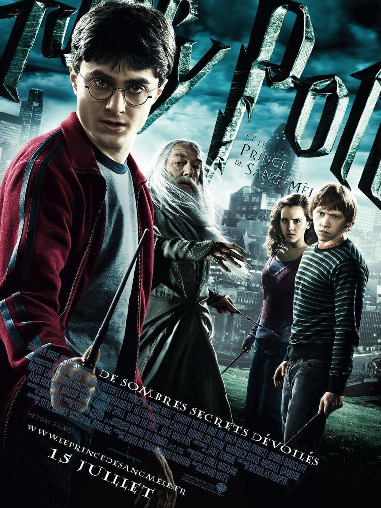
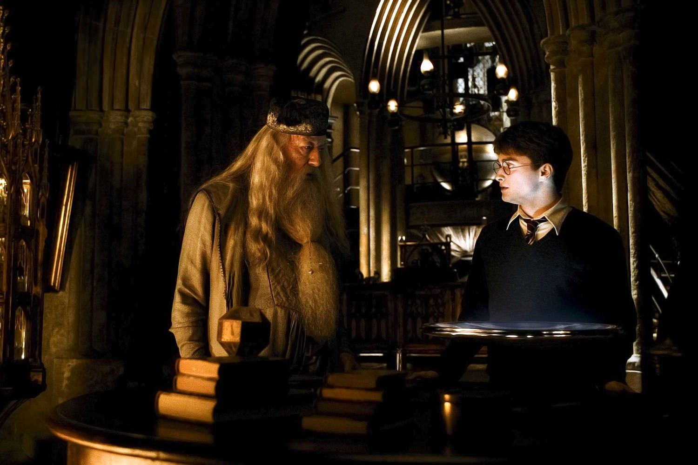
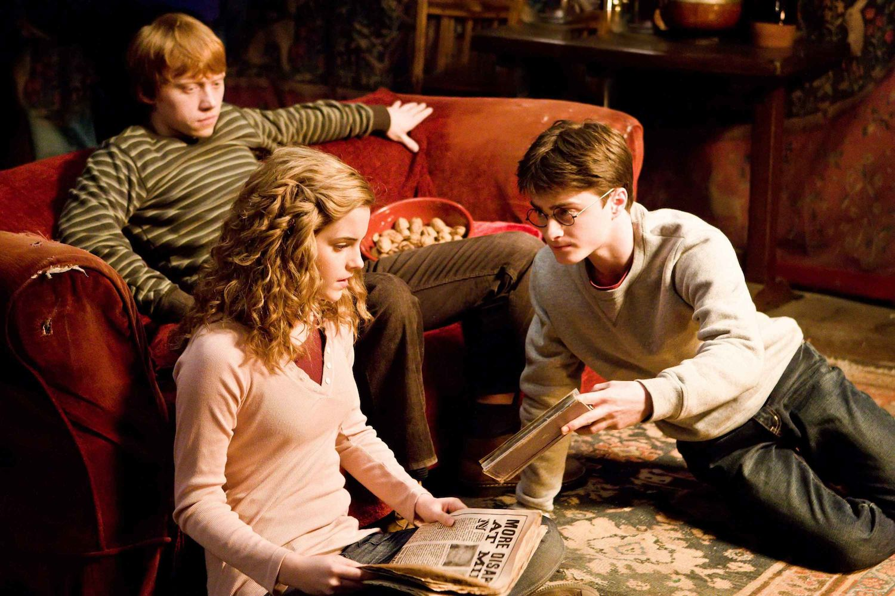

+++
type = "post"
titre = "<em>Harry Potter et le Prince de sang mêlé</em>, David Yates"
title = "Harry Potter et le Prince de sang mêlé, David Yates"
url = "/harry-potter-et-le-prince-de-sang-mele-yates"
date = "2013-06-02T10:46:31"
Lastmod = "2013-06-01T10:53:23"
cover = "harry-potter-et-le-prince-de-sang-mele-david-yates-daniel-radcliffe.jpg"
categorie = [ "À voir" ]
tag = [ "Adaptation littéraire", "Adolescence", "Amour", "Fantastique", "Harry Potter", "Saga", "Teen Movie" ]
createur = [ "David Yates" ]
acteur = [ "Bonnie Wright", "Daniel Radcliffe", "Emma Watson", "Evanna Lynch", "Jim Broadbent", "Michael Gambon", "Rupert Grint" ]
annee = [ "2009" ]
weight = 2009
saga = [ "Harry Potter" ]
pays = [ "États-Unis" ]
original = "Harry Potter and the Half-Blood Prince"

+++

À la fin de <a href="http://voiretmanger.fr/harry-potter-et-l-ordre-du-phenix-yates/" title="Harry Potter et l’Ordre du Phénix, David Yates"><em>Harry Potter et l’Ordre du Phénix</em></a> qui préparait le terrain avec le retour au grand jour de Voldemort, on pouvait s’attendre à un nouvel épisode plein de combats épiques. David Yates qui revient à la réalisation pour ce nouvel opus surprend avec un long-métrage étonnamment vide. L’action est réduite au strict minimum dans <em>Harry Potter et le Prince de sang mêlé</em>, il ne sa passe quasiment rien, sauf à la toute fin. Dans cet épisode de transition assez surprenant, le cinéaste prend le temps de s’intéresser à ses personnages et à leurs premiers émois amoureux, pour un film fantastique et dramatique teinté de <em>teen movie</em>. Un mélange pour le moins inattendu et un <em>Harry Potter</em> très sombre qui fait office de belle introduction avant le final encore plus sombre. David Yates s’éloigne du pur divertissement pour un résultat pas toujours parfait, mais intéressant. 

Depuis le retour de Voldemort, les années scolaires de Harry et ses deux amis ne peuvent plus se dérouler normalement. <em>Harry Potter et le Prince de sang mêlé</em> ne fait pas exception et la première scène du film est très significative à cet égard : les Mangemorts qui officient au nom de Voldemort, s’en prennent non pas à des sorciers, mais à des individus anonymes dans les rues de Londres. Ils attaquent et détruisent un pont et créent la panique dans la capitale anglaise : en quelques plans, David Yates montre très bien que la menace dépasse désormais largement Poudlard et ses sorciers, mais qu’elle concerne tout le monde, bien au-delà de la magie. Les premiers plans sont aussi l’occasion de créer un lien direct avec <em>Harry Potter et l’Ordre du Phénix</em> et montrer ainsi que ce film suit directement son prédécesseur. Nulle scène de vacances chez les Dursley, on retrouve Harry et Dumbledore photographiés au ministère de la magie juste après avoir échappé à Voldemort, puis le jeune magicien ère tout l’été dans la capitale britannique, avant d’être entraîné par le directeur de l’école. Ensemble, ils vont convaincre un professeur de venir enseigner, puis ils partent chez les Weasley et le cours normal d’un épisode de la saga peut reprendre… temporairement au moins. Le train, l’arrivée se déroulent sans encombre, mais le rythme scolaire ne prend pas et les personnages sont bien vite rattrapés par le conflit qui couve. <em>Harry Potter et le Prince de sang mêlé</em> monte encore la menace d’un cran et cet épisode est particulièrement sombre et inquiétant, alors même que le grand méchant de la saga n’apparaît jamais. Voldemort réserve son apparition au septième tome, mais il est omniprésent par ses disciples et surtout par Drago qui joue pour la première fois un rôle central en ouvrant les portes de l’école. Pendant ce temps, Dumbledore essaie toujours de comprendre ce qui se passe, mais pour la première fois également, il emmène avec lui Harry. David Yates ne filme plus des enfants, mais de jeunes adultes qui n’ont pas encore quitté l’adolescence, mais qui ont considérablement grandi malgré tout. 

Cette période d’entre-deux pour les personnages est particulièrement sensible dans <em>Harry Potter et le Prince de sang mêlé</em>. D’un côté, le long-métrage de 2h30 est marqué par une maturité plus importante encore que ce que l’on a pu voir jusqu’ici, avec un rythme assez lent qui tranche avec les œuvres précédentes. David Yates signe une énorme production digne de Hollywood évidemment, mais ni l’ambiance, ni le rythme ne vont dans ce sens. Le film est beaucoup trop lent et vide pour n’être qu’un simple blockbuster : pour preuve, on sera bien en peine de résumer ce qui fait avancer l’action. Ce sixième épisode est placé sous le signe des explications et on découvre enfin comment Tom Jedusor a pu survivre et revenir en tant que Voldemort. On apprend qui l’a aidé, mais on ne sait pas encore tout : quand <em>Harry Potter et le Prince de sang mêlé</em> se termine, les questions restent encore majoritaires et il faudra attendre le septième tome pour avoir toutes les réponses. L’action n’est pas plus au rendez-vous et on pourra d’ailleurs reprocher à l’adaptation de David Yates d’avoir écarté toutes les scènes d’action écrites par J.K. Rowling, surtout à la fin. Dans le roman, une grande bataille oppose les deux camps pour clore cet épisode ; il n’en est rien dans le film qui se conclut sur la promesse de poursuivre le travail de recherche mené dans ce film. Une fin surprenante, comme un <em>cliff-hanger</em> apaisé où c’est la suite qui est attendue. <em>Harry Potter et le Prince de sang mêlé</em> ne contient pas beaucoup de révélations, ni d’action intensive : que reste-t-il dès lors ? Des personnages que l’on suit depuis plusieurs années avec leurs acteurs qui ont grandi et développent leurs talents. Une excellente occasion leur est justement donnée dans ce film avec la naissance de leurs premiers sentiments amoureux : Harry aime Gini qui sort avec un autre, Hermione aime Ron qui fréquente une autre… la situation est compliquée et David Yates ne manque pas de l’exploiter. Ce <em>Teen Movie</em> au cœur d’un récit par ailleurs très sombre détonne dans l’ensemble, mais de manière assez surprenante, c’est aussi ce qui fait l’intérêt de ce long-métrage plus complexe qu’il n’y paraissait au premier abord. 

<em>Harry Potter et le Prince de sang mêlé</em> n’est sans doute pas la meilleure adaptation de la saga au cinéma, mais le deuxième épisode tourné par David Yates est intéressant. Intéressant, parce qu’il fait des choix anormaux pour un film de son envergure : la séquence quasiment en noir et blanc et assez longue avec Harry Potter et Dumbledore est inattendue, tandis que l’ensemble du film est étonnamment vide. L’histoire n’avance que très peu, il n’y a pas vraiment d’action et le long-métrage se contente la plupart du temps des histoires d’amour des héros. Sans aller aussi loin que dans <a href="http://voiretmanger.fr/harry-potter-7-partie-1-yates/" title="Harry Potter et les Reliques de la Mort (partie 1), David Yates"><em>Harry Potter et les Reliques de la Mort (partie 1)</em></a>, le cinéaste ose l’épure après cinq films très remplis et c’est plutôt audacieux. <em>Harry Potter et le Prince de sang mêlé</em> est loin d’être parfait, il lui manque quelques scènes importantes et il souffre de quelques problèmes de rythme, tandis que sa photographie est parfois un peu caricaturale, mais c’est une transition atypique avant la bataille finale. 

<h3>Vous voulez m&rsquo;aider ?<a href="#footnote_0_9632" id="identifier_0_9632" class="footnote-link footnote-identifier-link" title="&Agrave; propos de la publicit&eacute;&hellip;">1</a></h3>
<ul>
<li><a href="http://www.amazon.fr/gp/product/B002QBWSS8/ref=as_li_ss_tl?ie=UTF8&#038;tag=leblogdenic07-21&#038;linkCode=as2&#038;camp=1642&#038;creative=19458&#038;creativeASIN=B002QBWSS8">Acheter le film en Blu-Ray sur Amazon</a></li>
<li><a href="http://www.amazon.fr/gp/product/B002QBWSSI/ref=as_li_ss_tl?ie=UTF8&#038;tag=leblogdenic07-21&#038;linkCode=as2&#038;camp=1642&#038;creative=19458&#038;creativeASIN=B002QBWSSI">Acheter le film en DVD sur Amazon</a></li>
<li><a href="https://itunes.apple.com/fr/movie/harry-potter-et-le-prince/id365283033">Acheter ou louer le film sur l&rsquo;iTunes Store</a></li>
</ul>
<ul>
<li><a href="http://www.amazon.fr/gp/product/B005JRHBII/ref=as_li_ss_tl?ie=UTF8&#038;tag=leblogdenic07-21&#038;linkCode=as2&#038;camp=1642&#038;creative=19458&#038;creativeASIN=B005JRHBII">Acheter la saga en Blu-Ray sur Amazon</a></li>
<li><a href="http://www.amazon.fr/gp/product/B005JRHBG0/ref=as_li_ss_tl?ie=UTF8&#038;tag=leblogdenic07-21&#038;linkCode=as2&#038;camp=1642&#038;creative=19458&#038;creativeASIN=B005JRHBG0">Acheter le film en DVD sur Amazon</a></li>
</ul>

<ol class="footnotes"><li id="footnote_0_9632" class="footnote"><a href="http://voiretmanger.fr/soutien/">À propos de la publicité…</a> [<a href="#identifier_0_9632" class="footnote-link footnote-back-link">&#8617;</a>]</li></ol>
