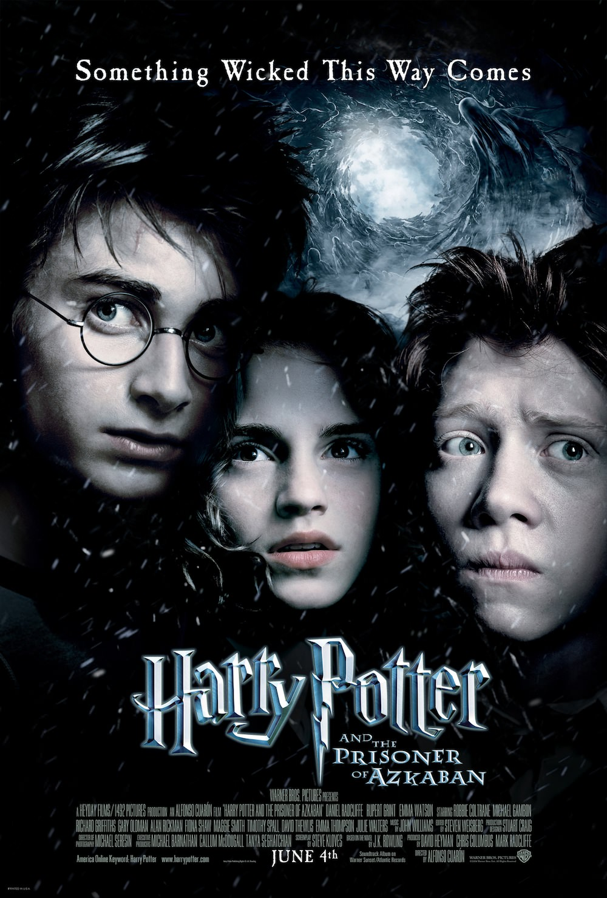
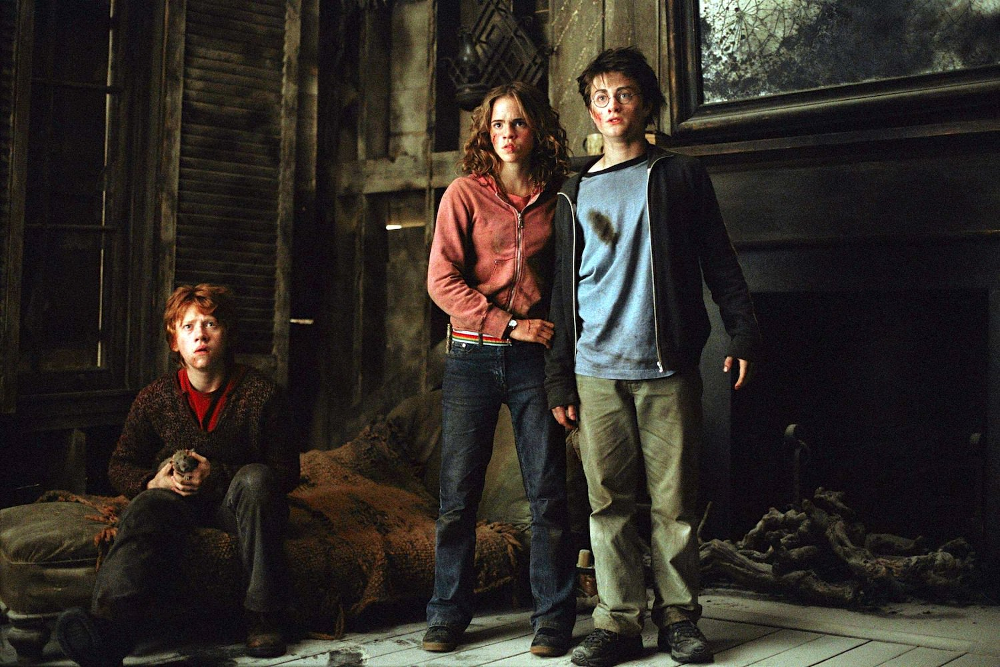
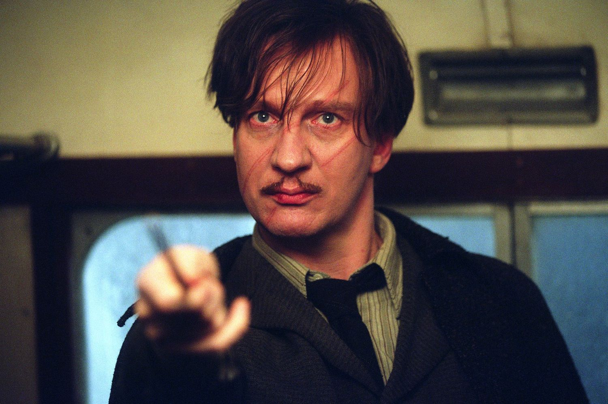

+++
titre = "<em>Harry Potter et le Prisonnier d&rsquo;Azkaban</em>, Alfonso Cuarón"
title = "Harry Potter et le Prisonnier d'Azkaban, Alfonso Cuarón"
url = "/harry-potter-et-le-prisonnier-d-azkaban-cuaron"
date = "2013-05-26T10:49:24"
Lastmod = "2013-05-29T22:27:46"
cover = "harry-potter-azkaban-emma-watson-rupert-grint-daniel-radcliffe.jpg"
categorie = [ "À voir" ]
tag = [ "Action", "Adaptation littéraire", "Blockbuster", "Fantastique", "Harry Potter", "Saga" ]
createur = [ "Alfonso Cuarón" ]
acteur = [ "Alan Rickman", "Daniel Radcliffe", "David Thewlis", "Emma Watson", "Gary Oldman", "Michael Gambon", "Robbie Coltrane", "Rupert Grint" ]
annee = [ "2004" ]
weight = 2004
saga = [ "Harry Potter" ]
pays = [ "États-Unis" ]
original = "Harry Potter and the Prisoner of Azkaban"

+++

La troisième année de Harry Potter sort dans les salles en 2004 et ce nouvel opus est placé sous le signe du changement. Chris Colombus qui avait réalisé les deux précédents ne souhaite pas continuer et il cède la place à un cinéaste très différent : Alfonso Cuarón. Le réalisateur mexicain n’est pas encore très connu, mais il a tourné quelques films remarqués et J.K. Rowling qui surveille de très près les adaptations au cinéma de ses best-sellers apprécie son travail. <em>Harry Potter et le Prisonnier d’Azkaban</em> crée une rupture très nette avec les deux films qui le précèdent. Même si <a href="http://voiretmanger.fr/harry-potter-et-la-chambre-des-secrets-colombus/" title="Harry Potter et la chambre des secrets, Chris Colombus"><em>Harry Potter et la chambre des secrets</em></a> tendait déjà vers plus de noirceur, il gardait une part d’enfance dans sa mise en scène et dans une certaine forme de désinvolture. Ce n’est plus le cas avec ce nouveau film qui penche très clairement vers la noirceur, dans cet épisode de transition où le combat contre Voldemort est légèrement mis de côté. Alfonso Cuarón impose sa patte de cinéaste, pour un résultat moins impersonnel et donc plus intéressant en terme de cinéma. 

<em>Harry Potter et le Prisonnier d’Azkaban</em> se déroule sur la troisième année de scolarité des personnages principaux de la saga et ce troisième volet reprend quelques passages obligés. Alfonso Cuarón débute ainsi chez l’oncle et la tante de Harry : ce dernier y est toujours aussi malheureux et le film se concentre justement sur la goutte qui fait déborder le vase. La famille reçoit son autre tante qui le déteste et le traite de tous les noms, mais ce qui met le jeune adolescent hors de lui, ce sont des insultes sur ses deux parents. Excédé, le sorcier la fait gonfler comme un gros ballon avant de partir : d’emblée, on sent que quelque chose a changé avec cette nouvelle année. Le personnage principal de la saga n’est plus le petit garçon bien sage qu’il était, c’est un adolescent qui se prend en main et qui, plus que jamais, décide par lui-même et ne respecte pas les règles qu’on lui fixe. <em>Harry Potter et le Prisonnier d’Azkaban</em> évoque aussi pour la première fois la noirceur du personnage : quand il apprend que le fameux prisonnier du titre a trahi ses parents, il entre dans une rage noire et se promet de tuer cet homme. Cette évolution vers la noirceur est essentielle dans cet opus : Chris Colombus avait préparé le terrain, mais c’est bien Alfonso Cuarón qui lui donne toute sa place. Dans la saga, les deux premières années correspondent à une première approche du mal et même si Harry s’en est pris à Voldemort par deux fois, il l’a fait par des intermédiaires et il s’en est tiré assez facilement à chaque fois. Ce temps est terminé, alors même que <em>Harry Potter et le Prisonnier d’Azkaban</em> nous éloigne paradoxalement du grand ennemi de la saga. Voldemort n’est jamais loin évidemment, mais il n’apparaît pas et Alfonso Cuarón se contente bien souvent de l’évoquer, sans s’y attarder. L’homme qui s’échappe de la prison d’Azkaban est directement lié à lui et l’intrigue tourne ainsi autour de la mort des parents de Harry Potter, mais ce dernier ne doit pas l’affronter. Malgré cette absence, c’est l’épisode le plus sombre et le plus violent des trois qui sont alors sortis, et ce pour plusieurs raisons.

Si le long-métrage réalisé par Alfonso Cuarón impressionne particulièrement, c’est d’abord parce que, pour la première fois dans la saga, Harry Potter doit affronter seul ses ennemis. Jusque-là, il n’était jamais seul et avait Ron et souvent Hermione à ses côtés pour l’aider. Dans <em>Harry Potter et le Prisonnier d’Azkaban</em>, il est bloqué à Poudlard à plusieurs reprises et doit agir seul, tant pour comprendre ce qui se passe que pour agir. Certes, il est aidé à la fin par Hermione, mais son amie n’intervient que de manière secondaire : c’est lui seul qui, cette fois, agit et utilise la magie comme jamais auparavant. Il faut dire que la menace est grande : si Voldemort est absent, les détraqueurs qui font ici office de méchants sont encore plus impressionnants. Ces sortes de spectres noirs qui protègent la prison d’Azkaban et qui avalent l’âme de leurs victimes sont particulièrement réussis et le cinéaste mexicain a su les rendre vraiment terrifiants. Grâce à eux et grâce à l’ambiance très sombre du film, on craint pour la vie de Harry Potter ou de ses proches et c’est une première. <em>Harry Potter et le Prisonnier d’Azkaban</em> ne se contente pas de menaces lointaines, c’est le premier épisode qui introduit la menace directement dans Poudlard. La réussite du film tient aussi dans la vision de son réalisateur : Alfonso Cuarón impose un univers visuel beaucoup plus âpre que ce qu’avait fait Chris Colombus. Ses décors approchent par moment d’un gothique que n’aurait pas renié Tim Burton et il s’autorise quelques libertés à la fois par rapport au roman et par rapport aux éléments que les spectateurs ont découverts avec <a href="http://voiretmanger.fr/harry-potter-a-l-ecole-des-sorciers-colombus/" title="Harry Potter à l’école des sorciers, Chris Colombus"><em>Harry Potter à l’école des sorciers</em></a>. Pour ne prendre qu’un exemple, la hutte de Hagrid n’est plus à cent mètres de l’école avec un terrain plat, mais plus loin et surtout après un pont suspendu et des escaliers très inclinés et que l’on suppose glissants. Ces petits changements ont pu choquer les plus grands fans des romans, mais ils apportent à la saga une maturité et une noirceur inédites et bienvenues. <em>Harry Potter et le Prisonnier d’Azkaban</em> oublie peut-être certains éléments du roman, mais ce n’est pas très grave et l’essentiel y est : pendant que Voldemort se prépare à l’arrière-plan, le héros doit affronter des ennemis plus violents, alors que sa sécurité n’est plus aussi assurée. 

À l’exception du professeur Dumbledore remplacé par un Michael Gambon qui offre une interprétation très différente de celle de son prédécesseur décédé peu avant la sortie de <em>Harry Potter et la chambre des secrets</em>, on retrouve les mêmes visages dans ce troisième opus de la saga. Tout change pourtant avec ce <em>Harry Potter et le Prisonnier d’Azkaban</em> qui fait une entrée très remarquée du côté de la noirceur, tant par l’ambiance gothique imposée par Alfonso Cuarón que par la menace plus pesante sur les personnages. Harry et ses amis murissent et la saga aussi, comme en témoigne symboliquement la nouvelle direction musicale. John Williams est toujours aux commandes de la nouvelle <a href="http://www.amazon.fr/gp/product/B000249EY2/ref=as_li_ss_tl?ie=UTF8&#038;tag=leblogdenic07-21&#038;linkCode=as2&#038;camp=1642&#038;creative=19458&#038;creativeASIN=B000249EY2">bande originale</a>, mais son travail est plus complexe et tourmenté qu’avant, avec des genres différents et quelques morceaux dissonants qui surprennent dans une aussi grosse production. <em>Harry Potter et le Prisonnier d’Azkaban</em> est plus tourmenté, quand il n’est pas complètement barré — la séquence du bus en est un bel exemple. Ce n’est pas forcément le meilleur <em>Harry Potter</em>, c’est au moins un épisode plus original et plus intéressant. 

<h3>Vous voulez m&rsquo;aider ?<a href="#footnote_0_9579" id="identifier_0_9579" class="footnote-link footnote-identifier-link" title="&Agrave; propos de la publicit&eacute;&hellip;">1</a></h3>
<ul>
<li><a href="http://www.amazon.fr/gp/product/B002NRBXYK/ref=as_li_ss_tl?ie=UTF8&#038;tag=leblogdenic07-21&#038;linkCode=as2&#038;camp=1642&#038;creative=19458&#038;creativeASIN=B002NRBXYK">Acheter le film en Blu-Ray sur Amazon</a></li>
<li><a href="http://www.amazon.fr/gp/product/B00030H4T2/ref=as_li_ss_tl?ie=UTF8&#038;tag=leblogdenic07-21&#038;linkCode=as2&#038;camp=1642&#038;creative=19458&#038;creativeASIN=B00030H4T2">Acheter le film en DVD sur Amazon</a></li>
<li><a href="https://itunes.apple.com/fr/movie/harry-potter-et-le-prisonnier/id366046113">Acheter ou louer le film sur l&rsquo;iTunes Store</a></li>
</ul>
<ul>
<li><a href="http://www.amazon.fr/gp/product/B005JRHBII/ref=as_li_ss_tl?ie=UTF8&#038;tag=leblogdenic07-21&#038;linkCode=as2&#038;camp=1642&#038;creative=19458&#038;creativeASIN=B005JRHBII">Acheter la saga en Blu-Ray sur Amazon</a></li>
<li><a href="http://www.amazon.fr/gp/product/B005JRHBG0/ref=as_li_ss_tl?ie=UTF8&#038;tag=leblogdenic07-21&#038;linkCode=as2&#038;camp=1642&#038;creative=19458&#038;creativeASIN=B005JRHBG0">Acheter le film en DVD sur Amazon</a></li>
</ul>

<ol class="footnotes"><li id="footnote_0_9579" class="footnote"><a href="http://voiretmanger.fr/soutien/">À propos de la publicité…</a> [<a href="#identifier_0_9579" class="footnote-link footnote-back-link">&#8617;</a>]</li></ol>
