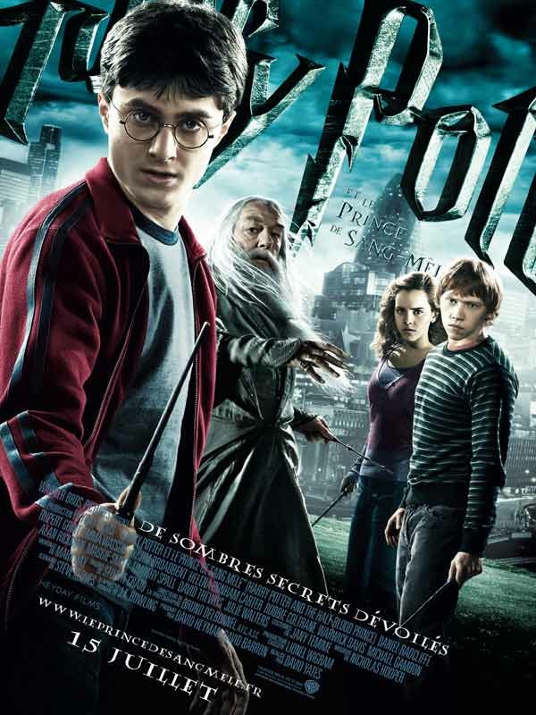
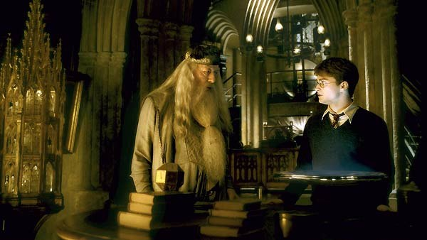
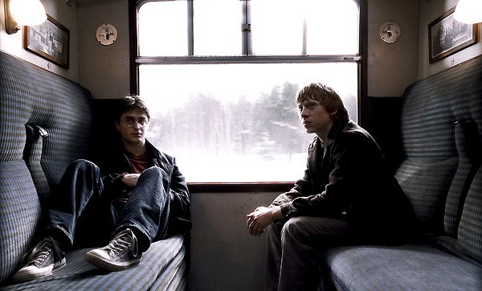

+++
titre = "Harry Potter et le Prince de Sang Mêlé, David Yates"
title = "Harry Potter et le Prince de Sang Mêlé, David Yates"
url = "/harry-potter-prince-sang-mele-yates"
date = "2009-07-24T22:57:00"
Lastmod = "2013-07-25T09:30:59"
cover = "harry-potter-prince-sang-mele.jpg"
categorie = [ "Archives du blog" ]
tag = [ "Blockbuster", "Fantastique", "Harry Potter", "Humour", "Teen Movie", "Vite oublié" ]
original = "Harry Potter and the Half-Blood Prince"

+++

<strong>Depuis cet article &laquo;&nbsp;historique&nbsp;&raquo;, j&rsquo;ai publié une nouvelle critique du film : <a href="http://voiretmanger.fr/harry-potter-et-le-prince-de-sang-mele-yates/" title="Harry Potter et le Prince de sang mêlé, David Yates"><em>Harry Potter et le Prince de sang mêlé</em></a></strong>

<em>Harry Potter et le Prince de Sang Mêlé</em> de David Yates est le sixième film de la série des Harry Potter et l&rsquo;adaptation du sixième tome de la saga sur papier. Cet épisode de transition n&rsquo;est pas le plus trépidant de la série, loin de là, mais il est intéressant à plusieurs titres.

Tout d&rsquo;abord, comme le <a href="http://www.playlistsociety.fr/2009/07/harry-potter-et-le-prince-de-sang-mele.html">rappelle judicieusement Benjamin</a> de <strong>Playlist Society</strong>, ce nouveau film n&rsquo;est que le sixième d&rsquo;une série de huit films (le dernier tome étant subdivisé en deux films). C&rsquo;est la première fois, au cinéma, que l&rsquo;on suit une histoire si longtemps avec les mêmes acteurs. On a ainsi eu tout le loisir de les voir évoluer, et évidemment, à cet âge là, la transformation est spectaculaire. Finalement, on a un peu l&rsquo;impression de les connaître, tous ces acteurs, ils ont pris une véritable existence réaliste. Leur reconversion sera sans nul doute difficile, mais pour l&rsquo;heure, cela seul justifie l&rsquo;intérêt de toute la série.

Cet épisode est tout entier de transition. Transition avant le grand final dans le septième et ultime épisode où tous les fils patiemment tissés depuis le premier tome seront finalement dénoués. Si je me souviens très bien du dernier tome par cette capacité assez impressionnante de J.K. Rowling de retomber sur ses pieds sans tomber dans le n&rsquo;importe quoi, le sixième épisode me laisse un souvenir plus creux. Je me souvenais de quelques scènes, mais globalement, ça n&rsquo;est pas l&rsquo;épisode que j&rsquo;ai le plus apprécié. L&rsquo;action patine, le nombre de questions laissées en suspens explose et globalement on attend la suite.

Le film laisse aussi cette impression. Il ne se passe finalement pas grand-chose dans <em>Harry Potter et le Prince de Sang Mêlé</em>, ce qui est plutôt inattendu. Certes, il y a bien quelques scènes où l&rsquo;action surgit d&rsquo;autant plus fortement qu&rsquo;elle est assez rare en moyenne. On n&rsquo;a même pas vraiment les basiques qui constituaient la base de tous les films précédents : ainsi, on n&rsquo;a pas vraiment de match de Quidditch, ni de combat de sorcier. Il y en a bien un de chaque, mais à chaque fois le traitement est très rapide, comme si le film préférait se pencher sur d&rsquo;autres sujets. Comme si, finalement, le récit du combat contre Voldemort n&rsquo;était qu&rsquo;accessoire. D&rsquo;ailleurs, la plupart des scènes d&rsquo;action du livre ont purement et simplement été supprimées, au profit de nouvelles scènes inattendues et pas forcément bien utiles (la maison des Weasley).

Mais que reste-t-il alors ? Eh bien un <em>teen movie</em> plutôt amusant. Aussi étonnant que cela puisse paraître, <em>Harry Potter et le Prince de Sang Mêlé</em> s&rsquo;intéresse plus à l&rsquo;adolescence de nos héros et à leurs premiers émois amoureux, qu&rsquo;à la montée de la magie noire et des dangers. Alors que l&rsquo;on pouvait s&rsquo;attendre, la saga devenant de plus en plus noire en approchant de la fin, à ce que les films deviennent plus sérieux au fur et à mesure, on a le sentiment au contraire qu&rsquo;ils deviennent de plus en plus légers et souvent drôles, comme l&rsquo;a très bien <a href="http://www.toujoursraison.com/2009/07/harry-potter-et-le-prince-de-sang-mele.html">évoqué Rob Gordon</a>.

Ainsi, l&rsquo;heure est certes grave et Harry et Dumbledore vaquent régulièrement à leur occupation — récupérer et détruire les <em>Hoxcruses</em> —, mais dans le même temps Ron tombe sous les assauts d&rsquo;une jeune fille vraiment amoureuse et même Hermione, d&rsquo;habitude si sérieuse, commence à se lâcher un peu. Les personnages les plus décalés sont les plus réussis, mention spéciale à ce propos à Ruper Grint qui s&rsquo;améliore de film en film. À l&rsquo;inverse, le pauvre Drago Malfoy à côté est très sérieux et assez ennuyeux. Dans le comique du film, Snape joue toujours un rôle aussi important, et ici s&rsquo;en donne à cœur joie dans le moment crucial de son basculement dans le côté obscur, même si ses plus longs rôles sont plutôt avant cette sixième année.

Le film n&rsquo;est pas, sur le plan technique, des plus passionnant. Il est efficace, parfois plus que cela il est vrai, mais de toute manière on ne va pas voir Harry Potter pour son expérimentation cinématographique. Reste que le film est très impressionnant à voir au cinéma : s&rsquo;il est des films qui ne demandent pas vraiment le déplacement, <em>Harry Potter et le Prince de Sang Mêlé</em> n&rsquo;en fait pas partie.

Ce sixième film de la saga Harry Potter en a manifestement déçu plus d&rsquo;un. De nombreux fans regrettent la perte de scènes jugées clés, ou l&rsquo;ajout de scènes inutiles. Beaucoup reprochent aussi le côté <em>teen-movie</em>, peut-être jugé pas compatible avec le sérieux des événements. Pourtant, je trouve ce choix original plutôt intéressant et je préfère, connaissant la matière disponible dans le tome, sacrifier quelques scènes de bataille au profit de scènes plus &laquo;&nbsp;psychologiques&nbsp;&raquo;. Le film est même encore trop long à mon avis et cette longueur le dessert en faisant ressortir l&rsquo;idée de la transition avant le grand final.

Dans l&rsquo;ensemble, je n&rsquo;ai pas trouvé que <em>Harry Potter et le Prince de Sang Mêlé</em> était un mauvais film, mais il ne restera évidemment pas dans les annales du cinéma. En même temps, est-ce l&rsquo;objectif ou même le rôle d&rsquo;un tel film ? Plus que cela, on voit une nouvelle étape dans la vie de personnages et d&rsquo;acteurs devenus presque des connaissances. Je n&rsquo;avais jusque-là connu telle impression qu&rsquo;avec <a href="http://voiretmanger.fr/2012/08/01/six-feet-under-ball-hbo/" title="Six Feet Under, Alan Ball (HBO)"><em>Six Feet Under</em></a>, excellentissime série américaine s&rsquo;écoulant, de mémoire, sur six années. Le retrouver au cinéma est vraiment agréable et je le dis franchement, j&rsquo;ai hâte de voir la suite.

<h3>Vous voulez m&rsquo;aider ?<a href="#footnote_0_1670" id="identifier_0_1670" class="footnote-link footnote-identifier-link" title="&Agrave; propos de la publicit&eacute;&hellip;">1</a></h3>
<ul>
<li><a href="http://www.amazon.fr/gp/product/B002QBWSS8/ref=as_li_ss_tl?ie=UTF8&#038;tag=leblogdenic07-21&#038;linkCode=as2&#038;camp=1642&#038;creative=19458&#038;creativeASIN=B002QBWSS8">Acheter le film en Blu-Ray sur Amazon</a></li>
<li><a href="http://www.amazon.fr/gp/product/B002SKMGB6/ref=as_li_ss_tl?ie=UTF8&#038;tag=leblogdenic07-21&#038;linkCode=as2&#038;camp=1642&#038;creative=19458&#038;creativeASIN=B002SKMGB6">Acheter le film en DVD sur Amazon</a></li>
<li><a href="https://itunes.apple.com/fr/movie/harry-potter-et-le-prince/id365283033">Acheter ou louer le film sur l&rsquo;iTunes Store</a></li>
</ul>

<ol class="footnotes"><li id="footnote_0_1670" class="footnote"><a href="http://voiretmanger.fr/soutien/">À propos de la publicité…</a> [<a href="#identifier_0_1670" class="footnote-link footnote-back-link">&#8617;</a>]</li></ol>
