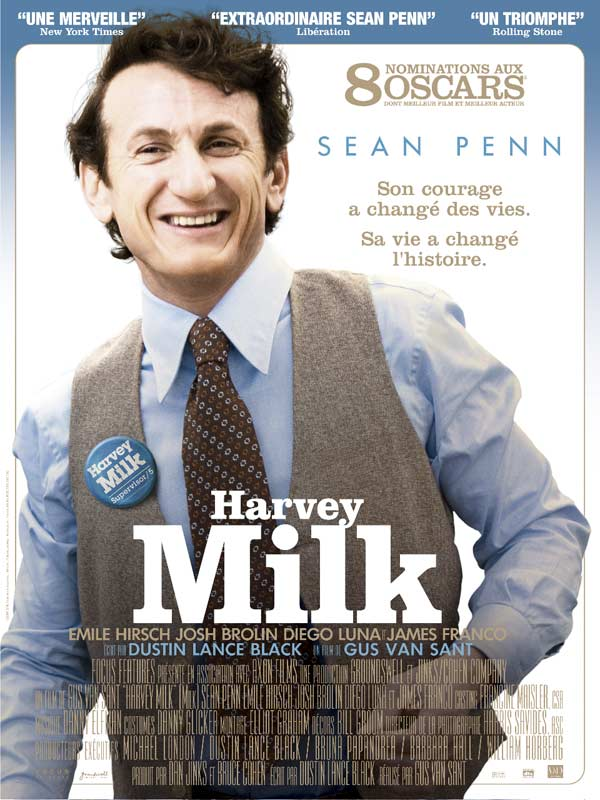
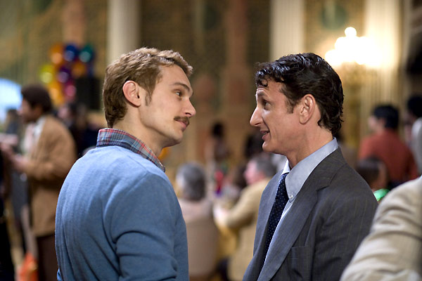

+++
titre = "Harvey Milk de&#8230; Gus Van Sant ?"
title = "Harvey Milk de&#8230; Gus Van Sant ?"
url = "/harvey-milk-gus-van-sant"
date = "2009-03-07T16:05:24"
Lastmod = "2010-02-07T10:57:02"
cover = "pennmilk.jpg"
categorie = [ "À voir" ]
tag = [ "Biopic", "Histoire", "Homosexualité" ]
annee = [ "2009" ]
weight = 2009
pays = [ "États-Unis" ]

+++

Hier soir, j&rsquo;ai vu mon film sérieux de la semaine, <em>Harvey Milk</em>, biopic du premier homme ouvertement gay élu à une fonction officielle aux États-Unis. Il s&rsquo;agit aussi du dernier film de Gus Van Sant, mais alors, mieux vaut le dire vite.

<a href="http://www.allocine.fr/film/fichefilm_gen_cfilm=130781.html">

</a>

En effet, Gus Van Sant est un réalisateur talentueux et récompensé à maintes reprises pour son travail, mais surtout, bien sûr, de la palme d&rsquo;or pour <em>Elephant</em> en 2003. Capable du meilleur (Elephant bien sûr), comme du pire (<em>Last Days</em>, un des films qui m&rsquo;a le plus ennuyé&#8230;), le réalisateur suivait une voie très personnelle, marquée par une déconstruction plus ou moins totale de la temporalité de l&rsquo;intrigue, au profit d&rsquo;un assemblage de moments que le spectateur peut reconstituer, ou pas. Le tout accompagné d&rsquo;une mise en scène originale, innovante souvent, un peu âpre parfois&#8230; en tout cas quelque chose de différent.

Or je n&rsquo;ai pas arrêté, pendant deux heures, de me demander où était passé Gus Van Sant. <em>Harvey Milk</em> est un film d&rsquo;une linéarité des plus banales et d&rsquo;une mise en scène qui fait le minimum syndical, et encore. Ce film aurait pu être réalisé par n&rsquo;importe qui, il n&rsquo;innove en rien, n&rsquo;apporte rien, se contente de montrer des faits. Manifestement, le réalisateur a décidé de s&rsquo;effacer totalement, comme en témoigne la place de son nom sur l&rsquo;affiche : c&rsquo;est bien simple, on ne le voit pas, il est caché au milieu de l&rsquo;affiche comme s&rsquo;il était honteux. J&rsquo;ai vu l&rsquo;affiche plusieurs fois avant de repérer le nom du réalisateur, je pensais que Sean Penn était à la fois l&rsquo;acteur principal et aux commandes. Cette affiche me semble donc très significative, à cet égard.

Du coup, le film a été un peu gâché par cette attente. J&rsquo;ai été le voir avec une amie qui a beaucoup aimé et a pris le film quasiment pour un documentaire. Ça n&rsquo;est pas bête comme façon de voir les choses, mais j&rsquo;en ai été tout bonnement incapable. J&rsquo;ai vu un biopic à la réalisation sans véritable intérêt, un film très politique et très engagé ce qui est aussi nouveau pour le réalisateur. J&rsquo;ai aussi vu un film qui se réfugie derrière les images d&rsquo;archives, comme s&rsquo;il n&rsquo;assumait pas son propos. En général, ça ne me plait pas tellement quand un film commence en nous expliquant que tout ce qui suit est vrai, ou en se terminant en racontant ce qui s&rsquo;est passé ensuite. Mais ça, encore, cela passe (surtout pour le message final, après tout, le film se termine). Par contre, je n&rsquo;aime pas du tout quand un cinéaste se protège par des images d&rsquo;archives : c&rsquo;est flagrant ici lors de la scène finale (ou quasi finale) qui présente la marche silencieuse organisée après la mort de Harvey Milk. Ils sont très nombreux, comme on le voit très bien, mais le réalisateur, peut-être pendant qu&rsquo;on n&rsquo;allait pas le croire, passe ensuite à des images d&rsquo;archives qui montrent&#8230; ben la même chose.

Reste le fond, et il est vrai qu&rsquo;il n&rsquo;est pas inintéressant. Personnellement, je ne connaissais pas Harvey Milk (C&rsquo;est bien la peine d&rsquo;étudier les États-Unis en cours tiens&#8230;) et j&rsquo;en ai appris beaucoup. Le film est, sur ce point, très efficace, on suit très bien ce qui se passe, qui fait quoi, qui pense quoi, bref, c&rsquo;est bien fichu. Les acteurs sont tous très bons, Sean Penn fait un Harvey Milk convaincant et Josh Brolin est très bien en opposant irlandais catholique troublé, rien à dire. Par ailleurs, il est vrai que le film évite un ton trop didactique et reste assez léger sur le mélo, à quelques rares exceptions près, donc un bon point pour ça aussi. Et le héros conserve une part d&rsquo;ambiguïté (par exemple, le fait que tous les amants le quittent ou se suicident) bienvenue, même si pas vraiment exploitée.

Mais un bon sujet suffit-il à faire un bon film ? Eh bien je ne pense pas. Un bon téléfilm, sans doute, un film acceptable certainement, mais pas un bon film. Je ne me suis pas ennuyé un seul moment dans <em>Harvey Milk</em>, mais on est très très loin de ce que l&rsquo;on pouvait attendre d&rsquo;un réalisateur comme Gus Van Sant. Finalement, le mieux, pour apprécier le film, est d&rsquo;y aller en oubliant totalement qui l&rsquo;a réalisé voire, mieux, en ne connaissant absolument pas les derniers films de Gus Van Sant. Sinon, vous serez sans doute déçus. En tout cas, je l&rsquo;ai été : un Gus Van Sant sans Gus Van Sant, voilà une idée un peu bizarre. J&rsquo;en viendrais presque à regretter <em>Last Days</em>, c&rsquo;est dire&#8230;

Une fois n&rsquo;est pas coutume, mes trois critiques préférées ne sont pas d&rsquo;accord avec moi et ont bien aimé, voire adoré, le film. <em><a href="http://www.lesinrocks.com/cine/cinema-article/article/harvey-milk/">Les Inrockuptibles</a></em> sont les plus enthousiastes avec une critique pour une fois longue et argumentée, et qui ne manque pas d&rsquo;intérêt, notamment sur l&rsquo;idée que le réalisateur se serait comme retiré de la vie publique américaine pendant les deux mandats Bush, produisant des films très européens (il est vrai que ses derniers films n&rsquo;ont eu aucun succès aux États-Unis) et revenant sur le devant de la scène avec Obama. Ça ne manque pas d&rsquo;intérêt, mais je ne vois pas en quoi le retour à Hollywood empêchait Gus Van Sant d&rsquo;y apporter son originalité, plutôt que de faire un film aussi banal. <em><a href="http://www.telerama.fr/cinema/films/harvey-milk,373096,critique.php">Télérama</a></em> et <a href="http://www.critikat.com/Harvey-Milk.html">Critikat</a> ont également beaucoup aimé le film.

