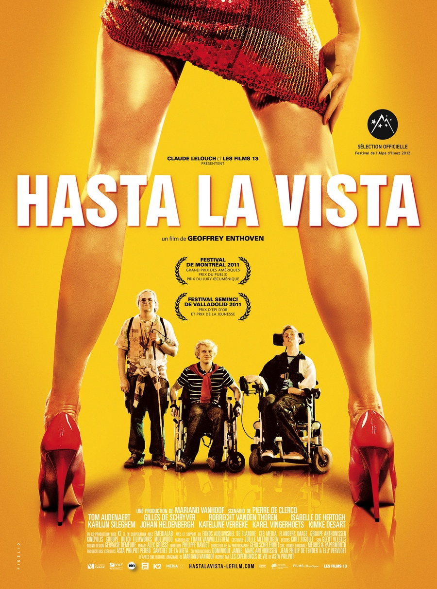
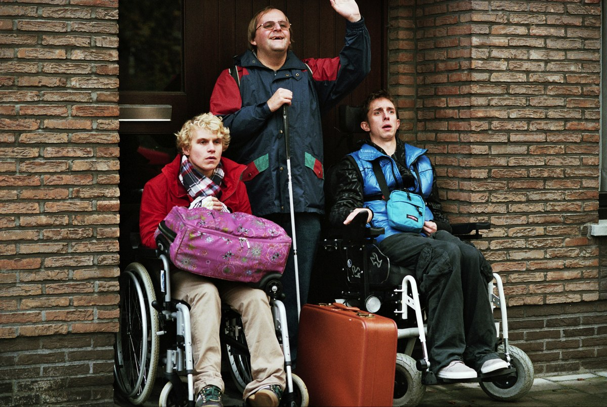

+++
titre = "<em>Hasta la vista</em>, Geoffrey Enthoven"
title = "Hasta la vista, Geoffrey Enthoven"
url = "/hasta-la-vista-enthoven"
date = "2012-07-01T10:35:47"
Lastmod = "2014-08-30T23:15:39"
cover = "hasta-la-vista.jpeg"
categorie = [ "À voir" ]
tag = [ "Adolescence", "Apprentissage", "Drame", "Handicap", "Humour", "Road-movie", "Sexe" ]
createur = [ "Geoffrey Enthoven" ]
acteur = [ "Gilles De Schrijver", "Robrecht Vanden Thoren" ]
annee = [ "2012" ]
weight = 2012
pays = [ "Belgique" ]

+++

Trois jeunes handicapés et encore puceaux qui décident de traverser l&rsquo;Europe pour découvrir les joies du sexe en Espagne. Le synopsis de <em>Hasta la vista</em> rappelle forcément <a title="Intouchables, Eric Toledano et Olivier Nakache" href="http://voiretmanger.fr/2011/11/08/intouchables-toledano-nakache/"><em>Intouchables</em></a> qui a connu un succès phénoménal l&rsquo;an dernier. Nonobstant un regard assez similaire sur le handicap, les deux films n&rsquo;ont rien à voir. Les héros de Geoffrey Enthoven sont handicapés, certes, mais ce n&rsquo;est pas l&rsquo;essentiel et ce road-movie décalé est bien plus qu&rsquo;un simple film à handicap, encore moins un banal teen movie. Une œuvre au contraire très juste, à voir.

Philip est paralysé, seules ses mains et sa tête bougent encore. Lars est atteint d&rsquo;un cancer qui a paralysé ses membres inférieurs. Jozef est aveugle. Ils ont tous les trois une vingtaine d&rsquo;années et ils n&rsquo;ont jamais connu que l&rsquo;amour. Philip demande certains soirs à sa mère de mettre sa main sous son pantalon et la vie sexuelle des trois se résume pour le moment à des films pornos. Avec l&rsquo;âge, le besoin se fait toutefois plus pressant, à tel point qu&rsquo;ils ont une idée un peu folle : se rendre dans un bordel espagnol qui se spécialise dans les handicapés. Ils ont tout prévu pour convaincre leurs parents : l&rsquo;expédition est déguisée en voyage sur la route du vin, ils embauchent un infirmier et chauffeur de minibus adapté à leur handicap… Les parents acceptent, le voyage s&rsquo;organise, mais la santé de Lars se dégrade brutalement, il n&rsquo;en a plus que pour quelques jours, semaines au mieux. Le voyage est naturellement annulé par les parents, mais les trois jeunes hommes ne veulent pas en rester là. Ils préparent en cachette leur départ et se rendent en Espagne sans prévenir leurs parents…

Geoffrey Enthoven ouvre son film avec… une paire de seins. La caméra suit quelques instants la poitrine évidemment magnifique avant de se tourner vers Philip dans son fauteuil. Le sujet de <em>Hasta la vista</em> est compris dès ce premier plan : l&rsquo;histoire de trois jeunes handicapés qui veulent baiser pour la première fois de leur vie. Comme Eric Toledano et Olivier Nakache avant lui, le cinéaste traite du handicap de manière frontale, sans fard, mais sans misérabilisme pour autant. Les trois héros du film sont handicapés de manière plus ou moins sérieuse, mais ils vivent avec et veulent justement voyager et découvrir le monde malgré leur handicap, ou plutôt à cause de celui-ci. Leur vie est difficile, mais le film ne s&rsquo;apitoie jamais sur leur sort et <em>Hasta la vista</em> est même souvent assez drôle, sans appartenir pour autant au genre de la comédie. On a ainsi droit à quelques blagues sur le handicap, souvent de la part des handicapés eux-mêmes : le personnage de Jozef n&rsquo;hésite ainsi jamais à se moquer de sa propre condition physique. Au fond, Geoffrey Enthoven ne traite pas le handicap comme quelque chose d&rsquo;exceptionnel, il le montre dans son quotidien, comme quelque chose de normal. C&rsquo;est peut-être la force du film, qui lui évite aussi de tomber dans les pièges de son scénario casse-gueule.

<em>Hasta la vista</em> est inspiré par l&rsquo;histoire vraie d&rsquo;Asti Philpot, un Américain paralysé qui a lui aussi perdu sa virginité dans un bordel espagnol. Est-ce pour cette raison que le film évite les pièges que lui tendait son scénario ? La lecture du synopsis avait de quoi faire frémir, on est à mi-chemin entre le film d&rsquo;handicapés et le teen movie le plus grossier, façon <em>American Pie</em>. Le résultat est pourtant singulièrement fin et juste : Geoffrey Enthoven a su doser les émotions pour réussir à passer du rire aux larmes sans forcer ses spectateurs, en douceur et avec sincérité. Les personnages de <em>Hasta la vista</em> sont handicapés, ce qui complique indéniablement leur quête de sexe. Mais ils pourraient très bien ne souffrir d&rsquo;aucun handicap, là n&rsquo;est pas l&rsquo;essentiel. Ce sont avant tout trois jeunes gens qui n&rsquo;ont pas encore tout à fait quitté l&rsquo;adolescence, même s&rsquo;ils ont tous dépassé les vingt ans. Leurs mères sont toujours à leurs côtés pour tout faire, y compris la toilette intime de Philip. Ils sont encore très dépendants, n&rsquo;ont jamais rien fait sans leurs parents et ils n&rsquo;ont pas vécu la séparation nécessaire pour qu&rsquo;ils puissent devenir des adultes. À ce titre, <em>Hasta la vista</em> évoque le film d&rsquo;apprentissage et le voyage se fait initiatique. Une initiation bien plus que sexuelle : quand ils terminent leur route, Philip, Jozef et Lars sont devenus des hommes.

Loin du rythme auquel est condamné Philip par sa chaise roulante électrique, <em>Hasta la vista</em> est filmé avec entrain et une vitalité surprenante au regard de son sujet. Geoffrey Enthoven maintient le rythme propre au genre du road movie et filme ses personnages au plus près, pour ne rater aucune de leurs émotions. L&rsquo;ensemble est très réussi : le spectateur ne s&rsquo;ennuie pas une seconde, l&rsquo;histoire avance bien et l&rsquo;on passe effectivement d&rsquo;une émotion à l&rsquo;autre tout au long du film. <em>Hasta la vista</em> est également très bien écrit et la finesse des dialogues est indispensable à son succès. De même, il faut saluer le réalisme de tous les personnages, même les plus secondaires, à l&rsquo;image de la très belle et sincère relation entre Lars et sa petite sœur. Le cinéaste fait juste ce qu&rsquo;il faut, il ne cherche pas à provoquer à tout pris les émotions, mais il y parvient malgré tout, notamment grâce à la bande originale particulièrement réussie elle aussi. Le film ne serait rien sans ses acteurs évidemment et il convient de saluer la performance des trois acteurs principaux, tous impeccables : Robrecht Vanden Thoren compose un Philip convaincant, tandis que Gilles De Schrijver est très bon avec ses faux airs de Jérémie Renier.

Filmer le handicap avec précision et justesse est peut-être ce que <em>Hasta la vista</em> réussit le mieux. Geoffrey Enthoven est parvenu à éviter les pièces du genre et à filmer trois handicapés en montrant qu&rsquo;ils sont plus que cela. Une réussite toute en finesse, entre humour et émotion… on n&rsquo;avait pas vu cela depuis <a title="Oxygène, Hans Van Nuffel" href="http://voiretmanger.fr/2010/12/14/oxygene-van-nuffel/"><em>Oxygène</em></a>, un autre film flamant d&rsquo;ailleurs. <em>Hasta la vista</em> est parfait pour une séance drôle et pleine d&rsquo;émotions à la fois, un film à découvrir.

<h3>Vous voulez <a href="http://voiretmanger.fr/soutien/">m&rsquo;aider</a> ?</h3>
<ul>
<li><a href="http://www.amazon.fr/gp/product/B008218N4O/ref=as_li_ss_tl?ie=UTF8&amp;tag=leblogdenic07-21&amp;linkCode=as2&amp;camp=1642&amp;creative=19458&amp;creativeASIN=B008218N4O">Acheter le film en Blu-ray sur Amazon</a></li>
<li><a href="http://www.amazon.fr/gp/product/B008218N3A/ref=as_li_ss_tl?ie=UTF8&amp;tag=leblogdenic07-21&amp;linkCode=as2&amp;camp=1642&amp;creative=19458&amp;creativeASIN=B008218N3A">Acheter le film en DVD sur Amazon</a></li>
<li><a href="https://itunes.apple.com/fr/movie/hasta-la-vista/id541753696">Acheter ou louer le film sur l&rsquo;iTunes Store</a></li>
</ul>

