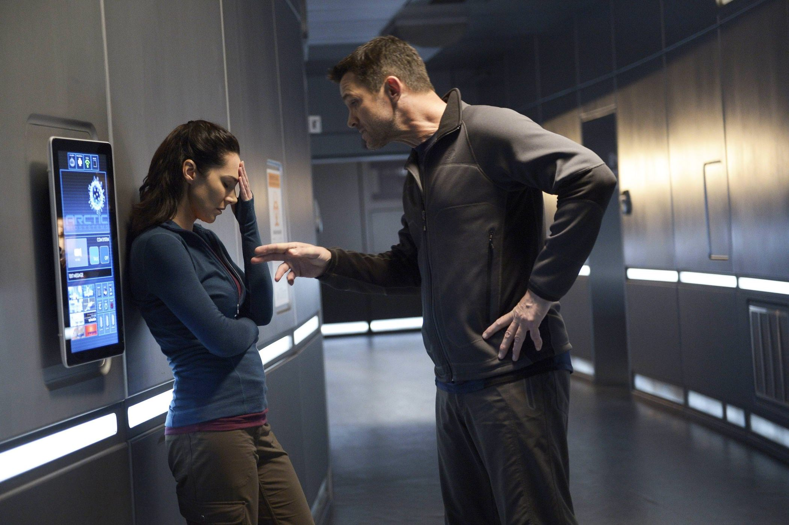
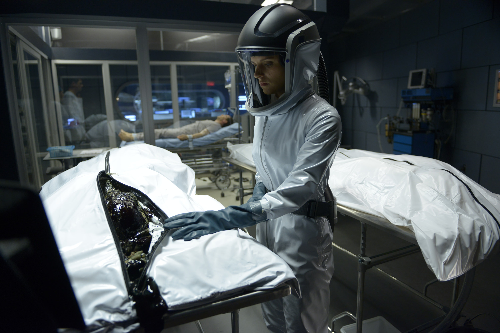
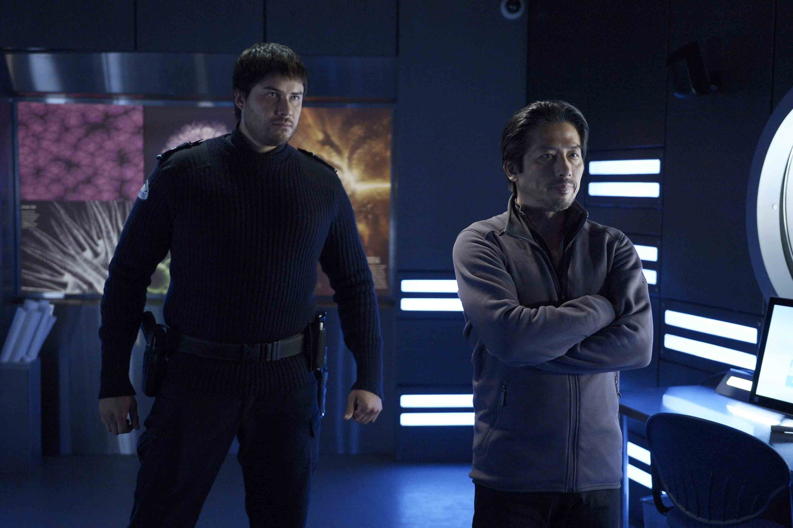

+++
type = "post"
titre = "<em>Helix</em>, Cameron Porsandeh (SyFy)"
title = "Helix, Cameron Porsandeh (SyFy)"
url = "/helix-porsandeh-syfy"
date = "2015-06-04T22:42:47"
Lastmod = "2015-06-04T22:46:51"
cover = "helix-porsandeh-syfy.jpg"
position = "right"
categorie = [ "À voir" ]
tag = [ "Apocalypse", "Fantastique", "Horreur", "Maladie", "Médecine", "Science", "Science-Fiction", "Série", "Vite oublié", "Zombie" ]
createur = [ "Cameron Porsandeh", "SyFy" ]
acteur = [ "Billy Campbell", "Hiroyuki Sanada", "Jordan Hayes", "Kyra Zagorsky", "Mark Ghanimé", "Matt Long", "Meegwun Fairbrother", "Neil Napier" ]
annee = [ "2014" ]
weight = 2014
pays = [ "États-Unis" ]

+++

<em>Helix</em> commence comme une série d&rsquo;horreur, mais elle évolue rapidement vers une intrigue beaucoup plus complexe. Entre fantastique et science-fiction, la série créée par Cameron Porsandeh n&rsquo;obtiendra jamais la palme de l&rsquo;originalité. Elle mélange des thématiques qui ont fait leur preuve et qui prouvent à nouveau qu&rsquo;elles n&rsquo;ont pas perdu de leur intérêt : la série diffusée sur SyFy fait preuve d&rsquo;une efficacité indéniable. Pour autant, ce n&rsquo;est pas vraiment une réussite et malgré les bonnes idées et les bons moments, les erreurs de jeu et de scénario sont trop importantes. Et elles expliquent sans doute pourquoi, après seulement deux saisons, SyFy a décider d&rsquo;annuler <em>Helix</em>.

La série commence avec l&rsquo;intervention du CDC dans un centre de recherche situé au milieu de l&rsquo;Antarctique. Le service américain dédié aux problèmes de santé a été appelé à la rescousse après l&rsquo;apparition d&rsquo;un virus mortel et inconnu. Quand il s&rsquo;en prend à une personne, ce virus ne la tue pas, mais la transforme en une sorte de zombie qui n&rsquo;a alors plus qu&rsquo;une seule obsession : infecter une personne saine. <em>Helix</em> pose ainsi dans son pilote une ambiance glaçante, digne des meilleurs films d&rsquo;horreur. Le lieu est bien isolé et le froid glacial de la région polaire renforce encore son isolement. Privés de moyens de communications, les docteurs envoyés par le CDC doivent affronter une menace inconnue et très dangereuse, alors que le mystère s&rsquo;épaissit vite autour du maître des lieux, le docteur Hatake. D&rsquo;emblée, Cameron Porsandeh prend soin d&rsquo;éloigner sa série de l&rsquo;horreur simple et alors que l&rsquo;on commence un petit peu comme avec <a href="http://voiretmanger.fr/strain-toro-hogan-fx/" title="The Strain, Guillermo del Toro et Chuck Hogan (FX)"><em>The Strain</em></a>, la série de Guillermo del Toro, on s&rsquo;en éloigne rapidement ensuite. Certes, la première saison met en scène des sortes de zombies, mais on sent rapidement que ce n&rsquo;est qu&rsquo;un détail et que l&rsquo;on a une vision plus vaste du problème à découvrir. D&rsquo;ailleurs, <em>Helix</em> fait partie de ces œuvres qui ne dévoilent pas tout immédiatement, et qui prennent même un malin à en dire le moins possible à tout moment. Ce choix permet effectivement à <em>Helix</em> de maintenir le spectateur dans l&rsquo;attente et on a envie d&rsquo;en apprendre toujours plus. Cameron Porsandeh a par ailleurs choisi une unité de temps astucieuse, puisque chaque épisode de chaque saison correspond à une journée. La première saison se déroule ainsi sur 13 jours seulement, dans l&rsquo;isolement total de la base en Antarctique, et force est de reconnaître que l&rsquo;ensemble est prenant.

Malheureusement, ce dispositif est difficile à reproduire sans tomber dans la répétition et c&rsquo;est précisément ce qui arrive à <em>Helix</em> dans la deuxième saison. L&rsquo;intrigue imposait de partir de zéro, mais le scénario imagine des explications compliquées pour réunir à nouveau tous les personnages, cette fois sur une île perdue au milieu d&rsquo;un océan qui reste indéterminé. C&rsquo;est un petit peu gros et on peine à croire à cette énorme coïncidence, d&rsquo;autant que l&rsquo;on assiste à nouveau à une épidémie et une attaque de zombies… la sensation de déjà-vue est un petit peu trop forte. C&rsquo;est dommage, car cette deuxième moitié est intéressante et à certains égards plus aboutie que la première, qui souffrait d&rsquo;acteurs assez mauvais. Omniprésent dans la première saison, le docteur Alan Farragut est incarné par un Billy Campbell qui ne semble jamais trop croire en son personnage. Face à lui, le docteur Hatake — Hiroyuki Sanada — n&rsquo;était guère meilleur et on avait un petit peu de mal à suivre l&rsquo;histoire à cause d&rsquo;eux. La saison 2 les efface un petit peu au profit de personnages plus convaincants et <em>Helix</em> s&rsquo;améliore nettement sur ce point. Hélas, Cameron Porsandeh n&rsquo;a pas corrigé d&rsquo;une saison à l&rsquo;autre le plus gros défaut de sa création : le scénario accumule les incohérences, au point de perdre toute crédibilité. Des personnages sont régulièrement isolés sans raison, il y a en permanence des hasards qui tombent beaucoup trop bien à chaque fois, ou au contraire des situations trop dramatiques pour que l&rsquo;on puisse y croire. On ne comprend pas pourquoi tel personnage n&rsquo;agit pas immédiatement alors que c&rsquo;est la logique même. Et on ne voit pas comment des situations peuvent s&rsquo;envenimer à ce point : le scénario de <em>Helix</em> semble bien trop paresseux et il fait à chaque fois les choix les plus simples, et souvent les plus simplistes.

On voit bien les intentions de Cameron Porsandeh, mais malheureusement, le résultat n&rsquo;est pas à la hauteur. <em>Helix</em> pioche du côté de la série britannique <a href="http://voiretmanger.fr/utopia-kelly-channel-4/" title="Utopia, Dennis Kelly (Channel 4)"><em>Utopia</em></a>, sans atteindre son niveau. Elle en est loin même, et malgré quelques bons points, elle ne laissera pas un souvenir impérissable. La faute à plusieurs facteurs, le premier étant sans doute un scénario trop incohérent et qui choisit trop systématiquement la facilité. Dommage, <em>Helix</em> aurait pu être très sympathique avec une écriture un petit peu plus rigoureuse.

<h3>Vous voulez <a href="http://voiretmanger.fr/soutien/">m&rsquo;aider</a> ?</h3>
<ul>
<li><a href="http://www.amazon.fr/s/ref=as_li_ss_tl?_encoding=UTF8&amp;camp=1642&amp;creative=19458&amp;fst=as%3Aoff&amp;keywords=helix&amp;linkCode=ur2&amp;qid=1433450465&amp;rh=n%3A409468%2Ck%3Ahelix&amp;rnid=1703605031&amp;tag=leblogdenic07-21">Acheter la série sur Amazon</a></li>
<li><a href="https://itunes.apple.com/fr/tv-season/helix-saison-1-vost/id844369443">Acheter ou louer la série sur l&rsquo;iTunes Store</a></li>
</ul>

