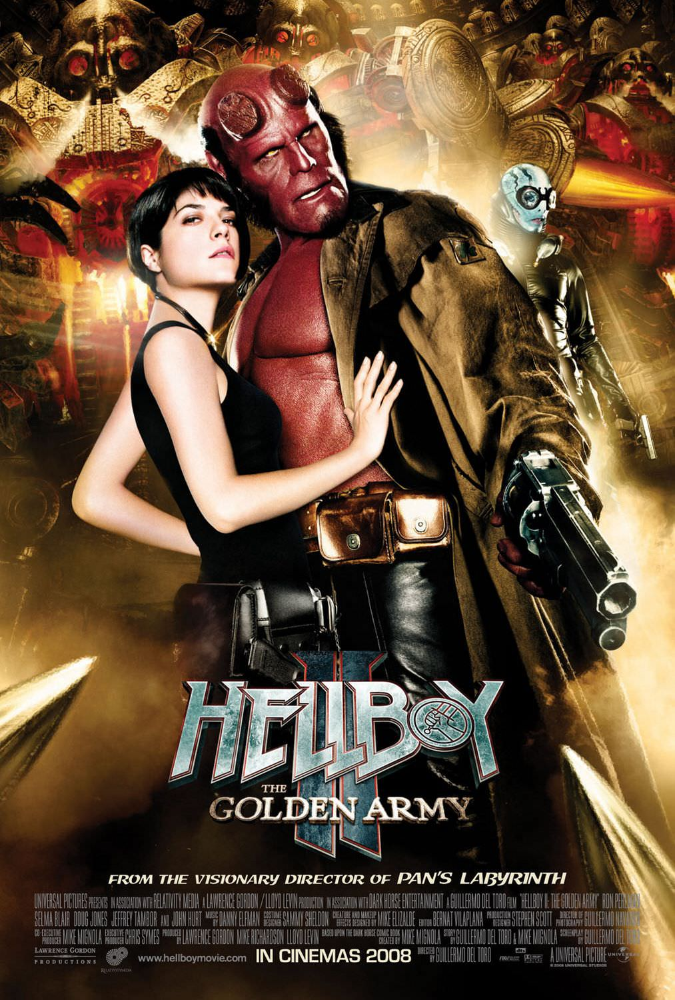
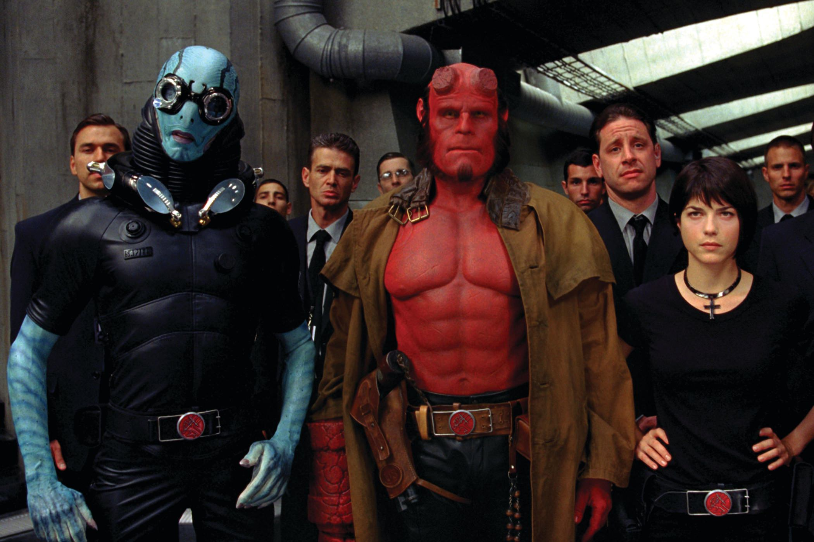
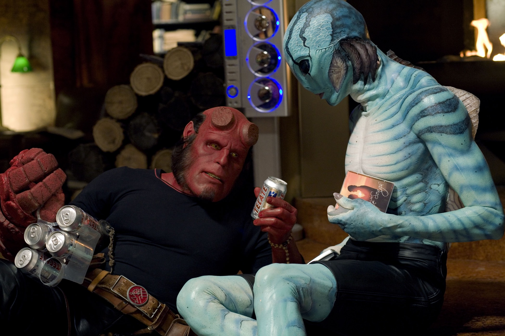

+++
type = "post"
titre = "<em>Hellboy II : Les Légions d&rsquo;or maudites</em>, Guillermo del Toro"
title = "Hellboy II : Les Légions d'or maudites, Guillermo del Toro"
url = "/hellboy-2-legions-or-maudites-toro"
date = "2015-05-19T22:16:49"
Lastmod = "2015-05-19T22:20:45"
cover = "hellboy-2-ron-perlman.jpg"
categorie = [ "À voir" ]
tag = [ "Blockbuster", "Fantastique", "Monstres", "Mythe", "Superhéros" ]
createur = [ "Guillermo del Toro" ]
acteur = [ "Doug Jones", "John Hurt", "Ron Perlman", "Selma Blair" ]
annee = [ "2008" ]
weight = 2008
saga = [ "Hellboy" ]
pays = [ "Allemagne", "États-Unis" ]
original = "Hellboy II: The Golden Army"

+++

Après un premier volet réussi et qui a rencontré son public, Guillermo del Toro offre à la <a href="http://voiretmanger.fr/saga/hellboy/">saga <em>Hellboy</em></a> une suite. Mais au lieu d&rsquo;adapter un nouvel opus du comics créé par Mike Magnola, le cinéaste mexicain a choisi de créer une histoire originale, en partenariat avec le créateur de la bande-dessinée. <em>Hellboy II : Les Légions d&rsquo;or maudites</em> reprend le concept du superhéros atypique par son désir d&rsquo;être humain alors que c&rsquo;est un diable massif, mais ce nouveau long-métrage offre à Guillermo del Toro toute latitude pour exprimer sa créativité. <a href="http://voiretmanger.fr/labyrinthe-pan-toro/" title="Le Labyrinthe de Pan, Guillermo del Toro"><em>Le Labyrinthe de Pan</em></a> est passé par là, le succès a été au rendez-vous et le réalisateur a désormais le champ libre pour créer toutes les bestioles sorties de son imagination. Pendant deux heures, c&rsquo;est ainsi un véritable défilé, pour un blockbuster fun et amusant, même s&rsquo;il s&rsquo;étire un peu sur la fin. Dans le genre, c&rsquo;est réussi !

<a href="http://voiretmanger.fr/hellboy-toro/" title="Hellboy, Guillermo del Toro"><em>Hellboy</em></a> avait la lourde charge d&rsquo;introduire le personnage et l&rsquo;univers, c&rsquo;est désormais chose faite et à part quelques brèves explications au tout début pour ceux qui n&rsquo;auraient pas suivi, le long-métrage met rapidement en place son intrigue. Comme dans le premier film, Guillermo del Toro commence avec une histoire évoquée bien des années plus tôt, pendant l&rsquo;enfance de Hellboy cette fois. Son père adoptif lui raconte un conte à base de batailles entre les elfes et les humains, et une armée de robots en or créée pour les elfes qui a conduit à d&rsquo;immenses bains de sang. Pris de remord, le roi des elfes décide d&rsquo;enterrer ses soldats et de conclure une trêve avec les humains. Naturellement, ce conte n&rsquo;en est pas un et <em>Hellboy II : Les Légions d&rsquo;or maudites</em> reprend dans le présent, avec le fils du roi, toujours bien vivant, qui entend bien rompre une trêve millénaire. Les détails importent peu, comme souvent, mais il suffit de dire que le service paranormal du FBI doit à nouveau faire intervenir ses superhéros pour affronter cette menace qui pourrait, on s&rsquo;en doute, détruire l&rsquo;humanité entière, rien de moins. Cette histoire assez peu originale — le récit raconté par le père au début rappelle <a href="http://voiretmanger.fr/saga/le-seigneur-des-anneaux/"><em>Le Seigneur des Anneaux</em></a>, ce qui est étrange quand on pense aux liens entre Guillermo del Toro et la saga de Peter Jackson — est avant tout un prétexte et il faut le prendre comme cela. C&rsquo;est une trame qui permet au réalisateur de mettre ce qu&rsquo;il préfère, à savoir des monstres bariolés, tous plus horribles, ou mignons selon les cas, les uns que les autres.

L&rsquo;inventivité déployée dans <em>Hellboy II : Les Légions d&rsquo;or maudites</em> est toujours aussi impressionnante et la séquence au cœur du film dans le marché aux trolls reste un grand moment. Guillermo del Toro fait toujours autant confiance aux techniques à l&rsquo;ancienne, et cela paye : cet univers bien vivant rappelle le meilleur de la science-fiction ou de l&rsquo;heroic-fantasy : on a évoqué déjà la saga de Tolkien, on pense encore à <a href="http://voiretmanger.fr/saga/star-wars/"><em>Star Wars</em></a>. Ce qui est plus original, c&rsquo;est bien sûr le traitement des personnages principaux. Loin des adaptations de comics usuelles, le réalisateur suit la voie tracée par le premier film, en particulier avec le rôle titre. Incarné avec toujours autant de succès par Ron Perlman, le personnage de Hellboy est une réussite toujours aussi éclatante. Il faut le voir, à fumer des cigares, se battre avec sa petite amie Liz et chercher à tout prix la reconnaissance du grand public : ce superhéros bien peu conventionnel est vraiment le point fort de la saga et ce deuxième film lui offre plus de présence encore. Son rôle est complexifié avec sa relation amoureuse et c&rsquo;est d&rsquo;ailleurs une autre surprise de <em>Hellboy II : Les Légions d&rsquo;or maudites</em>. Certes, il y a l&rsquo;intrigue principale avec les robots en or, mais c&rsquo;est presque un détail comparé aux histoires d&rsquo;amour. Outre celle, compliquée comme toujours, de Hellboy et Liz, on doit compter sur l&rsquo;amour surprenant d&rsquo;Abe avec la princesse des elfes. Là encore, on n&rsquo;est pas du tout dans la convention, mais Guillermo del Toro se risque à quelques séquences plus romantiques qui ajoutent une dimension supplémentaire au film. Et même si ce dernier s&rsquo;étire un petit peu par moments, il faut reconnaître que l&rsquo;ensemble tient parfaitement la route.

On sent bien que Guillermo del Toro apprécie particulièrement ce personnage de brute diabolique qui aimerait tant se fondre dans la masse et devenir un humain. Le réalisateur n&rsquo;a pas donné une suite à <em>Hellboy</em> par appât du gain, <em>Hellboy II : Les Légions d&rsquo;or maudites</em> est un vrai projet conçu en association avec Mike Magnolia qui avait créé le premier le personnage et l&rsquo;univers. Plus énorme encore que son prédécesseur, cette suite est vraiment très fun et si vous appréciez les bestioles en tout genre, vous serez aux anges. Pour le moment, la saga s&rsquo;est interrompue de manière un petit peu brutale avec ce deuxième volet, mais c&rsquo;est dommage, car le personnage de Hellboy est vraiment passionnant, et il mériterait plus d&rsquo;exposition.

<h3>Vous voulez <a href="http://voiretmanger.fr/soutien/">m&rsquo;aider</a> ?</h3>
<ul>
<li><a href="http://www.amazon.fr/gp/product/B001Q4N8VM/ref=as_li_ss_tl?ie=UTF8&amp;tag=leblogdenic07-21&amp;linkCode=as2&amp;camp=1642&amp;creative=19458&amp;creativeASIN=B001Q4N8VM">Acheter le film en Blu-ray sur Amazon</a></li>
<li><a href="http://www.amazon.fr/gp/product/B001Q4N8V2/ref=as_li_ss_tl?ie=UTF8&amp;tag=leblogdenic07-21&amp;linkCode=as2&amp;camp=1642&amp;creative=19458&amp;creativeASIN=B001Q4N8V2">Acheter le film en DVD sur Amazon</a></li>
<li><a href="https://itunes.apple.com/fr/movie/hellboy-ii-the-golden-army/id632168117">Acheter ou louer le film sur l&rsquo;iTunes Store</a></li>
</ul>

