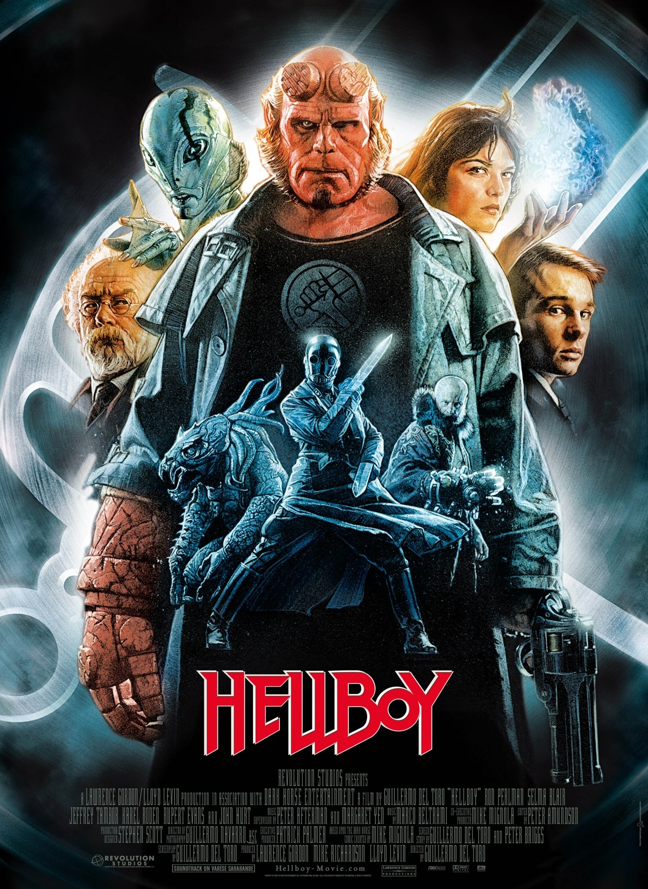
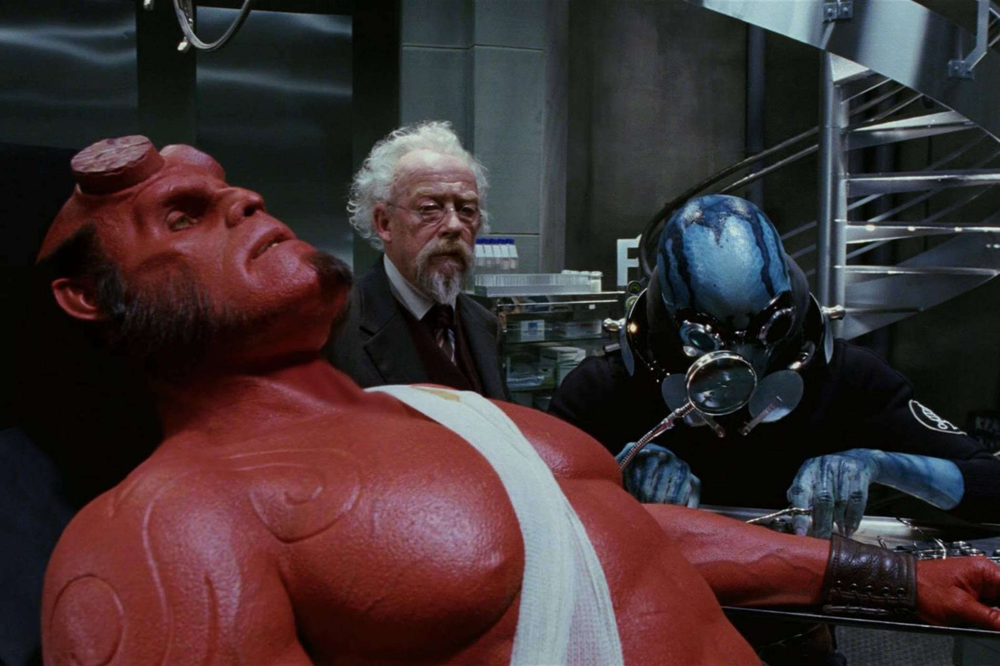
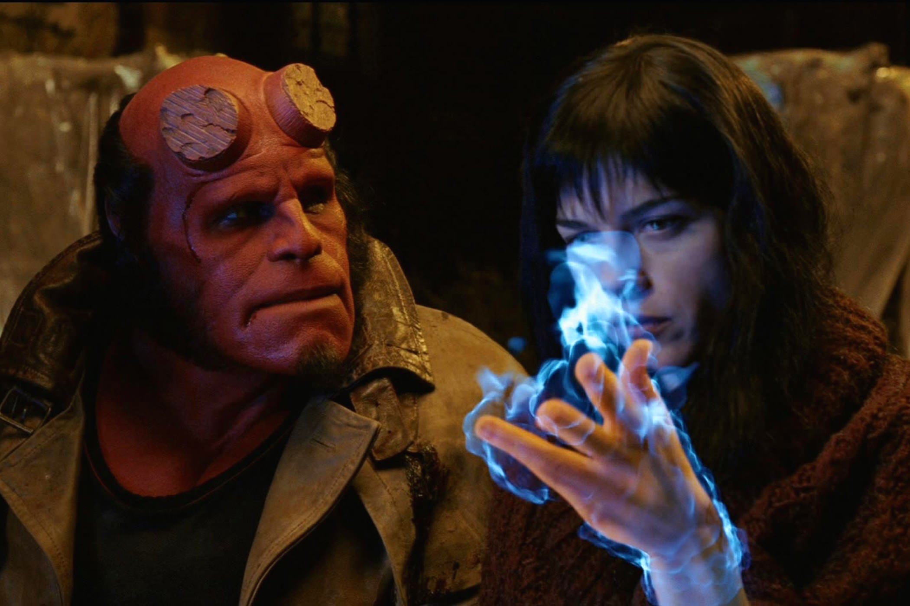

+++
type = "post"
titre = "<em>Hellboy</em>, Guillermo del Toro"
title = "Hellboy, Guillermo del Toro"
url = "/hellboy-toro"
date = "2015-05-18T17:57:22"
Lastmod = "2015-05-19T22:19:52"
cover = "hellboy-ron-perlman.jpg"
categorie = [ "À voir" ]
tag = [ "Action", "Adaptation bande-dessinée", "Amour", "Comics", "Monstres", "Superhéros" ]
createur = [ "Guillermo del Toro" ]
acteur = [ "Doug Jones", "John Hurt", "Ron Perlman", "Rupert Evans", "Selma Blair" ]
annee = [ "2004" ]
weight = 2004
saga = [ "Hellboy" ]
pays = [ "États-Unis" ]

+++

Guillermo del Toro a fait ses premiers pas dans l&rsquo;univers des comics avec <em>Blade II</em>. Le succès ayant été au rendez-vous, le cinéaste mexicain obtient une reconnaissance internationale et surtout un grand nombre de propositions. Il ne choisit ni de poursuivre la saga <em>Blade</em>, ni celle de <a href="/saga/harry-potter/"><em>Harry Potter</em></a>, mais plutôt un projet qui lui tenait à cœur : adapter au cinéma le personnage de Hellboy créé dix ans auparavant par Mike Magnolia. <em>Hellboy</em> est le résultat de ce projet, une adaptation haute en couleurs comme pouvait l&rsquo;être la bande-dessinée originale et surtout portée par un excellent personnage. Car dans la catégorie des superhéros, ce diable rouge qui voudrait surtout être normal est pour le moins atypique, et Guillermo del Toro a bien su rendre son caractère bizarre. Sans oublier qu&rsquo;il tournait un blockbuster et l&rsquo;action est aussi au rendez-vous. <em>Hellboy</em> a, en outre, la bonne idée de ne pas se prendre trop au sérieux et l&rsquo;ensemble est très plaisant.

<em>Hellboy</em> commence avec une première scène qui évoque l&rsquo;arrivée de son personnage principal sur terre. Dans une île perdue d&rsquo;Écosse, à la fin de la Seconde Guerre mondiale, les Nazis tentent tout ce qu&rsquo;ils peuvent pour inverser le cours de la guerre, y compris faire appel aux sciences occultes. En l&rsquo;occurrence, ils essaient d&rsquo;ouvrir un portail vers un monde parallèle plein de créatures diaboliques, mais l&rsquo;expérience est interrompue prématurément par les Américains venus sur place. Une créature réussit toutefois à passer, pas un monstre hideux, mais au contraire un petit diablotin très mignon. Adopté par un spécialiste du paranormal sur place, Hellboy grandit avec un papa humain aux États-Unis et on le retrouve dans le présent, adulte et superhéros pour les besoins du FBI. D&rsquo;emblée, Guillermo del Toro trouve le ton juste pour présenter son personnage : ce n&rsquo;est pas le héros héroïque que l&rsquo;on attendait, mais une créature qui aimerait plus que tout se fondre dans la masse et devenir humaine. Avec des cornes et surtout une énorme main en pierre, ce n&rsquo;est pas évident toutefois et c&rsquo;est donc un personnage bougon, voire dépressif. Il passe ses journées dans un sous-sol sécurisé, entouré de chats, à ne rien faire sauf quand on a besoin de lui. On le transporte alors dans un camion poubelle pour que le grand public ne sache rien de lui, il fait son boulot et retourne dans sa tanière. <em>Hellboy</em> dresse un portrait bien peu flatteur et c&rsquo;est sa première qualité : il prend le contrepied de la majorité des films du genre et trouve ainsi sa voie, originale et très bien trouvée.

Au fond, malgré son apparence diabolique, <em>Hellboy</em> est peut-être le plus humain des superhéros. Ce premier film à son effigie imagine une intrigue autour de Raspoutine et de nazis immortels qui veulent prendre leur revanche, mais elle est presque secondaire. On sait d&rsquo;emblée que le camp du bien vaincra et ce n&rsquo;est pas nécessairement ce qui intéresse le cinéaste, même si Guillermo del Toro filme avec un plaisir évident les nombreuses scènes d&rsquo;action. Son film est explosif comme se doit de l&rsquo;être tout bon blockbuster, on en prend plein les yeux et le spectacle est assuré, même si on a fait beaucoup mieux depuis, naturellement. <em>Hellboy</em> a toutefois bien vieilli et les effets ne sont pas hideux, avec une mention spéciale pour le masque utilisé pour transformer Ron Perlman en Hellboy. C&rsquo;est du travail à l&rsquo;ancienne — quatre heures de transformation nécessaires chaque jour — et c&rsquo;est du travail bien fait, car il permet à l&rsquo;acteur de laisser toutes ses émotions transparaître. C&rsquo;est bien ça l&rsquo;essentiel : derrière le grand spectacle, derrière le spectaculaire, Guillermo del Toro filme une histoire d&rsquo;amour improbable entre sa créature et Liz, une fille qui se transforme en torche vivante quand elle se laisse envahir par les émotions. L&rsquo;une des meilleures scènes se déploie ainsi quand le monstre suit la femme qu&rsquo;il convoite, alors que le nouvel assistant envoyé par le FBI tente de la séduire autour d&rsquo;un café. Hellboy suit la scène depuis les toits, un enfant de neuf ans à ses côtés, et le film parvient alors à être touchant, en plus d&rsquo;être drôle.

<em>Hellboy</em> n&rsquo;est pas un chef-d&rsquo;œuvre, mais Guillermo del Toro a très bien su adapter un comics en offrant la bonne dose de spectaculaire, mais sans prendre cet univers trop au sérieux. Son long-métrage est très plaisant à regarder, les amateurs de créatures seront aux anges avec le chien des enfers ajoutés par le réalisateur — qui aime vraiment bien les créatures étranges — et on peut apprécier autant le spectacle que l&rsquo;ironie du personnage, ainsi que son côté émouvant quand il tente de séduire Liz. Un bon équilibre, pour un blockbuster réussi : mission remplie pour <em>Hellboy</em> !

<h3>Vous voulez <a href="/soutien/">m&rsquo;aider</a> ?</h3>
<ul>
<li><a href="http://www.amazon.fr/gp/product/B000M2EHG4/ref=as_li_ss_tl?ie=UTF8&amp;tag=leblogdenic07-21&amp;linkCode=as2&amp;camp=1642&amp;creative=19458&amp;creativeASIN=B000M2EHG4">Acheter le film en Blu-ray sur Amazon</a></li>
<li><a href="http://www.amazon.fr/gp/product/B0007LHG5Y/ref=as_li_ss_tl?ie=UTF8&amp;tag=leblogdenic07-21&amp;linkCode=as2&amp;camp=1642&amp;creative=19458&amp;creativeASIN=B0007LHG5Y">Acheter le film en DVD sur Amazon</a></li>
<li><a href="https://itunes.apple.com/fr/movie/hellboy/id378464986">Acheter ou louer le film sur l&rsquo;iTunes Store</a></li>
</ul>

