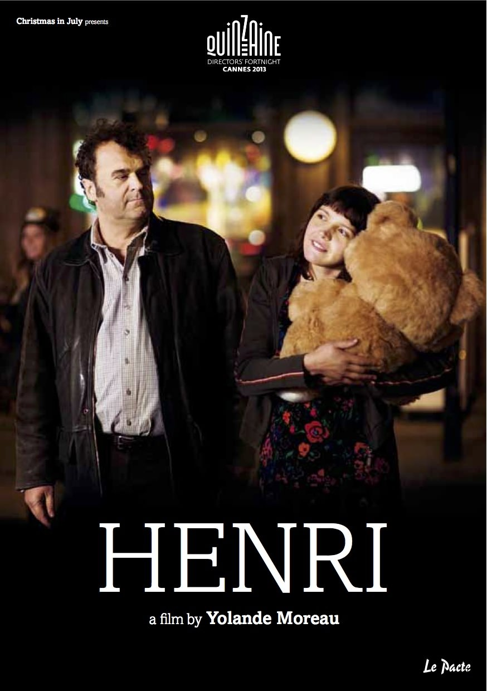

+++
titre = "<em>Henri</em>, Yolande Moreau"
title = "Henri, Yolande Moreau"
url = "/henri-moreau"
date = "2013-07-28T17:46:11"
Lastmod = "2013-12-15T17:58:15"
cover = "henri-yolande-moreau-miss-ming.jpg"
categorie = [ "À voir" ]
tag = [ "Amour", "Comédie dramatique", "Handicap" ]
createur = [ "Yolande Moreau" ]
acteur = [ "Miss Ming", "Pippo Delbono" ]
annee = [ "2013" ]
weight = 2013
pays = [ "France" ]
festival = [ "Lama 2013" ]

+++

Actrice reconnue du cinéma francophone, Yolande Moreau passe pour la deuxième fois derrière les caméras et pour la première fois seule. Pour certains acteurs, le passage à la réalisation n&rsquo;est qu&rsquo;un caprice de star ou un argument marketing. Pas pour l&rsquo;actrice belge qui prouve à nouveau avec <em>Henri</em> qu&rsquo;elle a un vrai regard de cinéaste. Ce petit film est une comédie dramatique très réussie, où le rire se mêle à une profonde mélancolie, où le handicap n&rsquo;est pas qu&rsquo;un obstacle insurmontable, où tous les tracas du quotidien peuvent disparaître le temps d&rsquo;un road-trip improvisé. Yolande Moreau signe un long-métrage tout en douceur, une vraie réussite.

« La Cantina », c&rsquo;est le nom du petit restaurant que tiennent Henri et sa femme, Rita, à Charleroi. Tous deux sont d&rsquo;origine italienne et ils vivent confortablement avec leur restaurant et les amis. <em>Henri</em> commence toutefois avec la mort subite de Rita : un malaise alors qu&rsquo;elle conduisait, elle meure peu après laissant son mari à la tête de leur restaurant. À partir de ce point de départ plutôt tragique, Yolande Moreau déroule une histoire de deuil et de reconstruction. Henri s&rsquo;est toujours occupé du bar et de la cuisine et prendre seul la tête de l&rsquo;ensemble s&rsquo;avère impossible. Il a du mal avec les additions, il peine à gérer la salle en plus de sa cuisine et sa fille lui suggère d&rsquo;embaucher un « papillon blanc » pour l&rsquo;aider, une fille handicapée d&rsquo;une institution située non loin de là. Rosette vient donc tous les jours dresser les tables, prendre les commandes et servir les clients. La réalisatrice n&rsquo;a pas triché sur ce point et a préféré travailler avec de vrais handicapés, sans se moquer d&rsquo;eux, mais en les utilisant comme des personnages à part entière. Rosette est une exception : interprété par Miss Ming, ce personnage est toutefois sans reproche en matière de réalisme et la jeune actrice est tout simplement parfaite dans ce rôle difficile. Son handicap est, certes, plus léger, mais interpréter une fille en léger décalage comme elle sans que cela fasse faux est une belle prouesse. <em>Henri</em> profite de la qualité de ce personnage féminin, mais on pourrait en dire autant de celui qui a donné au film son titre. L&rsquo;acteur italien Pippo Delbono incarne exactement comme il faut ce personnage refermé, mais extrêmement sensible, sombre et mélancolique, mais aussi drôle par moments. Eux deux soutiennent le film et le travail de Yolande Moreau en bénéficie largement. 

Henri et Rosette vont, sans surprise, apprendre à se connaître et s&rsquo;apprécier. L&rsquo;histoire de <em>Henri</em> n&rsquo;est pas des plus originales sur le papier, mais elle s&rsquo;avère moins banale qu&rsquo;il n&rsquo;y paraissait au premier abord. Tous les personnages filmés par Yolande Moreau sont surprenants et s&rsquo;avèrent finalement plus complexes qu&rsquo;escomptés. On pourrait évoquer Bibi et René, les deux piliers de comptoir qui passent leur temps accoudés au bar à boire et discuter avec Henri. On pense surtout à la troupe de handicapés rassemblée par la réalisatrice. Filmer des hommes et des femmes mentalement ou physiquement diminués n&rsquo;est jamais simple, mais ce long-métrage évite tout mal à l&rsquo;aise de la part des spectateurs, contrairement à ce que l&rsquo;on avait pu ressentir chez Bruno Dumont dans <a href="http://voiretmanger.fr/camille-claudel-1915-dumont/" title="Camille Claudel 1915, Bruno Dumont - À voir et à manger"><em>Camille Claudel 1915</em></a>. Ces handicapés plus ou moins graves nous font parfois rire, mais ce n&rsquo;est jamais à leurs dépens ; on est toujours avec eux, à leurs côtés, jamais contre eux. Cette posture n&rsquo;était pas facile à tenir, mais Yolande Moreau n&rsquo;en dévie jamais. De même, la relation amicale ou amoureuse qui nait entre Henri et Rosette n&rsquo;est jamais ridicule, bien au contraire, elle tombe parfaitement juste et devrait en émouvoir plus d&rsquo;un. Oscillant en permanence entre humour et émotion, <em>Henri</em> touche toujours précisément là où il faut et ce long-métrage est réussi d&rsquo;abord pour cette raison. On apprécie aussi les excellents choix musicaux de la cinéaste qui compose une bande originale éclectique, mais toujours de goût. On sent que la musique est essentielle pour la réalisatrice qui va jusqu&rsquo;à évoquer « <em>Innocent When You Dream</em> », un titre de Tom Waits, comme point de départ de son deuxième film. Yolande Moreau ne tient pas à multiplier les dialogues — Henri parle très peu dans tout le film —, mais ses choix de musique en disent souvent long, tandis qu&rsquo;il faut relever sa capacité à filmer des tableaux souvent magnifiques, y compris avec des centaines de pigeons voyageurs. 

Près de dix ans après <em>Quand la mer monte…</em>, son premier essai en tant que réalisatrice, Yolande Moreau confirme qu&rsquo;elle n&rsquo;est pas seulement une actrice à la présence si forte et personnalité si marquée, mais aussi une cinéaste de talent. <em>Henri</em> n&rsquo;est pas un film tape-à-l&rsquo;œil qui cherche à impressionner au maximum, c&rsquo;est au contraire un récit qui frappe toujours juste. On s&rsquo;amuse de ces personnages handicapés ou non, les uns alcooliques, les autres en décalage avec la société, mais ce n&rsquo;est pas qu&rsquo;une comédie. On est aussi ému par cette histoire d&rsquo;amitié que l&rsquo;on sent extrêmement sincère et qui parvient à toucher les spectateurs. Une vraie réussite, à ne pas rater !

<em>Sortie en salles le 4 décembre 2013</em>

