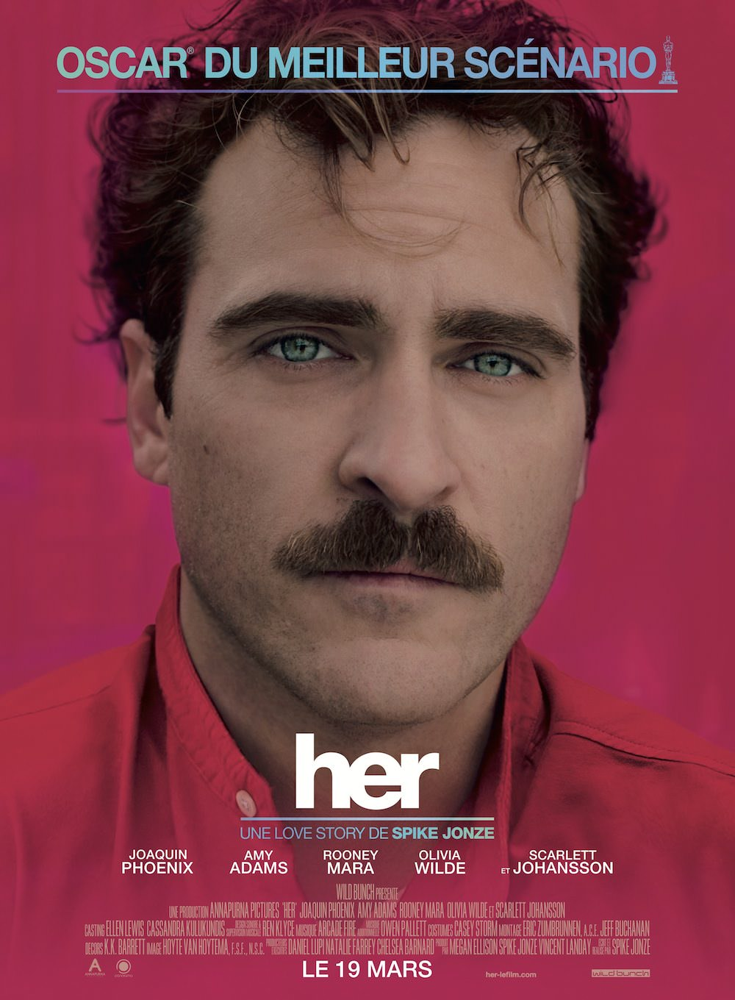
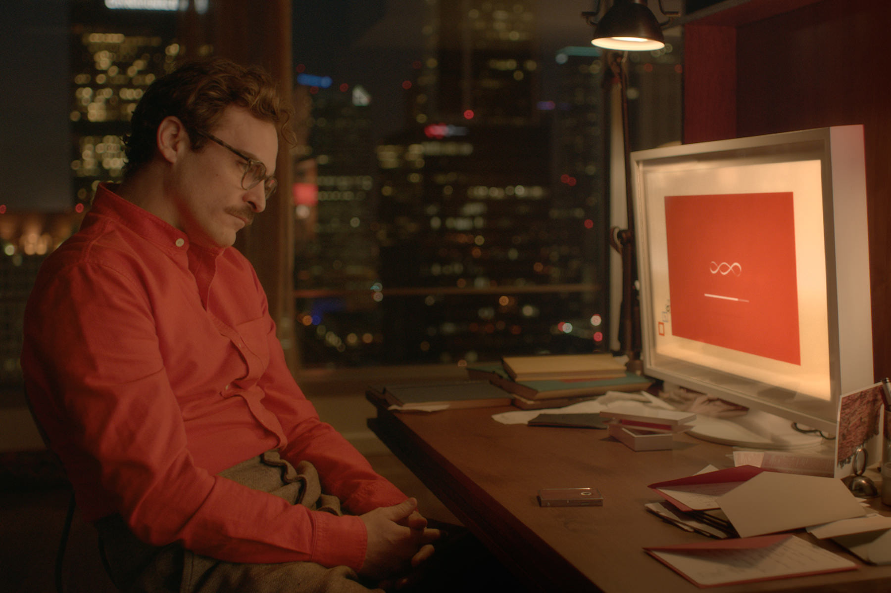

+++
titre = "<em>Her</em>, Spike Jonze"
title = "Her, Spike Jonze"
url = "/her-jonze"
date = "2014-03-23T16:05:23"
Lastmod = "2015-02-04T00:06:29"
cover = "her-joaquin-phoenix-spike-jonze.jpg"
categorie = [ "À voir" ]
tag = [ "Amour", "Drame", "Informatique", "Intelligence artificielle", "Romance", "Science-Fiction", "Sorties du mois" ]
createur = [ "Spike Jonze" ]
acteur = [ "Amy Adams", "Joaquin Phoenix", "Olivia Wilde", "Rooney Mara", "Scarlett Johansson" ]
annee = [ "2014" ]
weight = 2014
pays = [ "États-Unis" ]

+++

Thème extrêmement classique de la science-fiction, l’intelligence artificielle est toujours la source de fantasme et de danger. Fantasme de cet ordinateur aussi intelligent qu’un humain, voire même plus intelligent que lui pour l’aider au quotidien. Danger de cette intelligence qui pourrait surpasser celle de son créateur, devenir autonome et finalement décider qu’elle pourrait très bien s’en passer. Deux tendances qui ont nourri l’imaginaire de milliers d’œuvres de science-fiction et qui est aussi le sujet de <em>Her</em>. Pour son dernier long-métrage, Spike Jonze ne s’est pas vraiment concentré sur l’aspect technique qui ne l’intéresse pas, mais plutôt sur une idée un peu folle. Un homme pourrait-il tomber amoureux d’une intelligence artificielle ? <em>Her</em> n’est pas un space opera, mais un film où le futur se loge par petites touches discrètes et où, au fond, le véritable enjeu est l’amour et la solitude profonde de l’homme moderne. Au-delà, Spike Jonze compose un long-métrage d’une très belle sensibilité, un film à ne rater sous aucun prétexte.

Les premiers plans de <em>Her</em> détaillent un monde extrêmement proche du nôtre et en même temps si différent : la technologie a évolué et plus personne ne penserait à utiliser un clavier. Tout se fait avec la voix et tout le monde parle…, mais parle à son téléphone, ou en tout cas une forme d’assistant très évolué qui sait lire et écrire des messages, vous renseigner sur la météo, les informations et tout ce que l’on fait aujourd’hui avec un écran tactile. Une évolution limitée, mais néanmoins une rupture : Spike Jonze nous montre bien comment tout le monde parle, sans jamais parler à personne. Le thème n’est pas nouveau, mais les dix premières minutes du film sont sans doute celles qui les ont le mieux illustrées. Ce qui fait la force de <em>Her</em>, c’est certainement la proximité avec notre monde : combien se reconnaîtront dans ces transports en commun, où tout le monde regarde son téléphone sans se regarder ? Il suffit de remplacer l’écran par une voix et on retrouve la scène du film, et avec l’émergence des assistants vocaux — Siri chez l’un, Google Now chez l’autre —, on en est déjà très proche. Le film va plus loin, certes, en imaginant un système vraiment intelligent, car il est non seulement capable de répondre, mais aussi d’apprendre et donc d’évoluer, mais les touches de science-fiction sont extrêmement discrètes. On parie que <em>Her</em> vieillira bien, et les choix de Spike Jonze n’y sont pas étrangers. L’action se déroule dans un Los Angeles débarrassé des voitures, où l’on se déplace exclusivement en marchant, ou dans les transports en commun, métro et train en tête. Les décors, toujours très chaleureux avec une photographie qui met systématiquement en avant les couleurs chaudes, sont quant à eux discrètement rétro, à l’image aussi de la moustache très « Belle Époque ». Cet ensemble offre au film une touche intemporelle qui lui permettra sans conteste de durer, de ne pas s’essouffler face à la technologie elle-même. Tout en offrant une réflexion capable de toucher dès aujourd’hui, ce qui explique que <em>Her</em> soit aussi puissant.

Depuis la séparation avec sa femme, presque un an auparavant, Theodore ne s’est jamais totalement remis. La vie lui semble bien terne, il n’a plus de goût à rien, et ses rencontres nocturnes, uniquement par la voix ne sont qu’une bien maigre consolation. Spike Jonze établit ainsi un univers légèrement futuriste pour mieux revenir à l’essentiel : la solitude d’un homme et une histoire d’amour. <em>Her</em> coïncide avec le lancement d’un nouveau système d’exploitation qui repose sur une intelligence vraiment artificielle. Derrière la voix d’une femme, une personnalité numérique et créée par l’homme, certes, mais qui prend vite son indépendance. Samantha, c’est le nom qu’elle se donne, n’a qu’une envie : découvrir le monde et la vie. Cette curiosité, sa faculté à s’émerveille de tout, sort Theodore de sa torpeur. Grâce à cette intelligence qu’il sait bien artificielle, mais qui semble si naturelle, il sort de son mutisme et reprend goût à la vie, tant et si bien qu’il finit par tomber amoureux de cette voix. Très calmement, <em>Her</em> parvient à introduire la notion <em>a priori</em> absurde d’amour virtuel entre un homme et une intelligence. Theodore garde Samantha toujours avec lui : ils communiquent par le biais d’une oreillette et il peut lui montrer ce qui l’entoure par la caméra de son téléphone portable. Très vite, cette voix finit par le connaître à la perfection, mieux sans doute que son ex-femme ne l’a jamais connu, mieux peut-être qu’il ne se connaît lui-même. Une relation fusionnelle apparaît et le coup de force de Spike Jonze est qu’elle finit par nous sembler totalement naturelle, alors qu’elle est purement artificielle. Une belle réussite pour le film tout en subtilité, pour son scénario original parfaitement écrit, mais aussi pour les deux acteurs principaux. Joaquin Phoenix n’a plus à prouver son talent et il est parfait dans son rôle d’amoureux solitaire un peu dépressif, mais qui retrouve goût à la vie. Samantha n’apparaît jamais à l’écran et pourtant, quelle présence ! La voix de Scarlett Johansson explose encore plus fortement que si l’actrice était visible et il se passe quelque chose de très fort pendant plus de deux heures. On sort de <em>Her</em> en ayant l’impression de l’avoir vue, une belle performance quand son rôle d’actrice ne tient qu’à sa voix… Puisque l’on parle d’écouter, il ne faudrait pas oublier l’excellente bande originale composée par le groupe Arcade Fire, à l’exception de « <a href="https://itunes.apple.com/fr/album/moon-song-music-from-inspired/id818684123"><em>The Moon Song</em></a> », très belle chanson de Karen O.

Avec <em>Her</em>, Spike Jonze une idée qui relève de la science-fiction en imaginant qu’un homme et une intelligence artificielle désincarnée tombent amoureux. Une idée un peu folle, mais qui fonctionne à la merveille : c’est sans doute la réussite incontestable du film que de parvenir à rendre cette relation crédible. On y croit et on est ému par ces deux êtres, l’un de chair, l’autre purement virtuel, qui tombent amoureux de façon irrationnelle, mais en même temps avec beaucoup de force. <em>Her</em> est un long-métrage atypique, mais c’est surtout un très beau film, que vous auriez tort de ne pas voir…

<h3>Vous voulez <a href="http://voiretmanger.fr/soutien/">m&rsquo;aider</a> ?</h3>
<ul>
<li><a href="http://www.amazon.fr/gp/product/B00HYJRIE6/ref=as_li_ss_tl?ie=UTF8&amp;tag=leblogdenic07-21&amp;linkCode=as2&amp;camp=1642&amp;creative=19458&amp;creativeASIN=B00HYJRIE6">Acheter le film en Blu-ray sur Amazon</a></li>
<li><a href="http://www.amazon.fr/gp/product/B00HYJRI00/ref=as_li_ss_tl?ie=UTF8&amp;tag=leblogdenic07-21&amp;linkCode=as2&amp;camp=1642&amp;creative=19458&amp;creativeASIN=B00HYJRI00">Acheter le film en DVD sur Amazon</a></li>
<li><a href="https://itunes.apple.com/fr/movie/her-vost/id829586375">Acheter ou louer le film sur l&rsquo;iTunes Store</a></li>
</ul>

