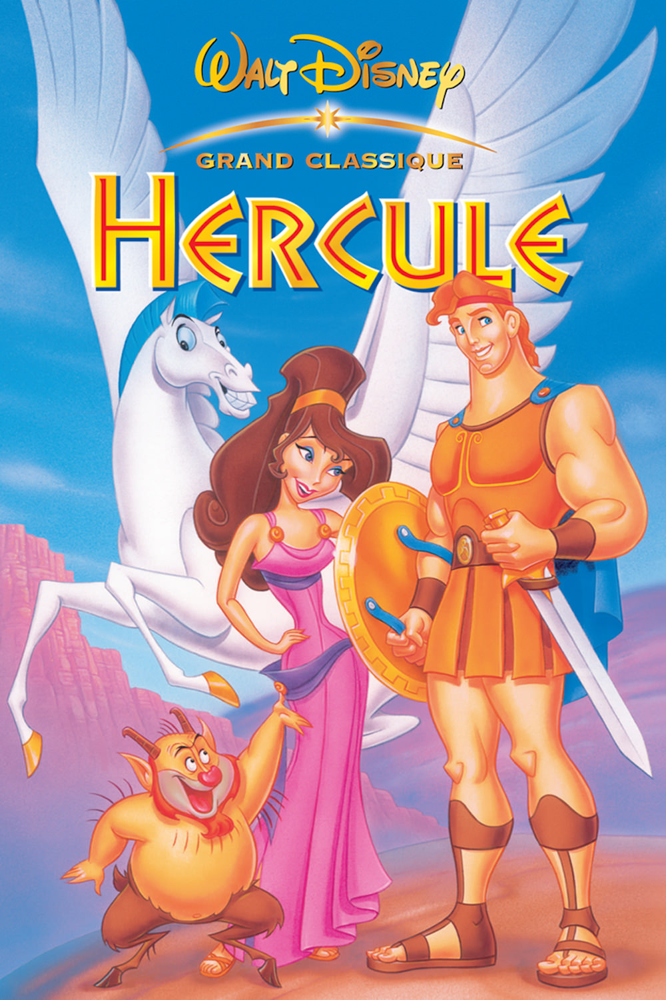
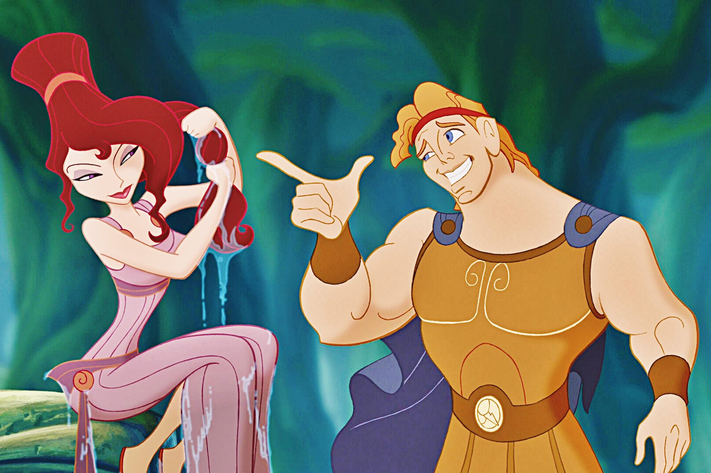
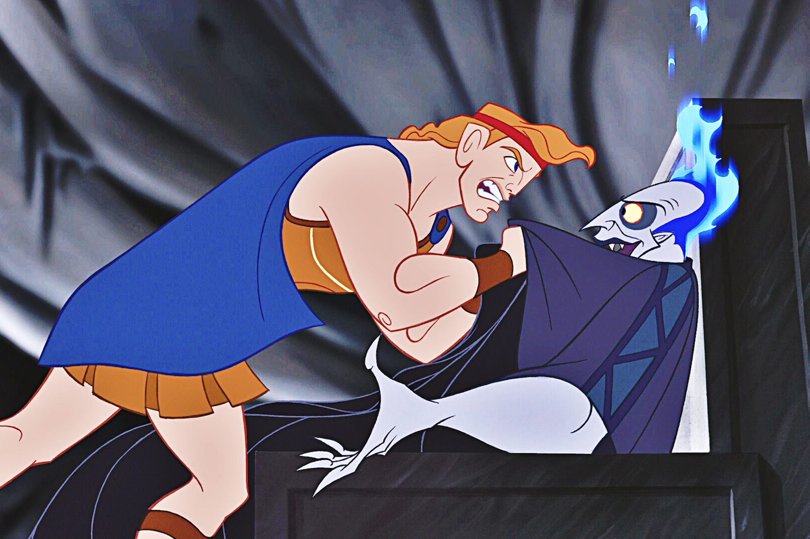

+++
type = "post"
titre = "<em>Hercule</em>, John Musker et Ron Clements"
title = "Hercule, John Musker et Ron Clements"
url = "/hercule-musker-clements"
date = "2014-01-13T15:28:25"
Lastmod = "2014-02-25T13:45:54"
cover = "hercule-john-musker-ron-clements-disney.jpg"
categorie = [ "À voir" ]
tag = [ "Amour", "Animation", "Fantastique", "Humour", "Mythe" ]
createur = [ "John Musker", "Ron Clements", "Walt Disney" ]
annee = [ "1997" ]
weight = 1997
saga = [ "Classiques d'animation Disney" ]
pays = [ "États-Unis" ]
original = "Hercules"

+++

Après une période à vide, Walt Disney retrouve une nouvelle jeunesse dans les années 1990. Le studio d&rsquo;animation enchaîne les succès publics et critiques quand sort, à la fin de l&rsquo;année 1997, <em>Hercule</em>. Le trente-cinquième film du mythique studio se tourne vers la mythologie greco-romaine pour la première fois de son histoire. Comme son nom l&rsquo;indique bien, le long-métrage réalisé par John Musker et Ron Clements raconte l&rsquo;histoire de Hercule, ce fils de Zeus envoyé sur terre pour aider les hommes. Loin des subtilités du mythe original, Disney en propose une version allégée sur le ton de l&rsquo;humour, pour un dessin-animé très classique, mais qui fonctionne très bien.

Du mythe original, <em>Hercule</em> garde quelques idées et notamment plusieurs travaux du héros. Les connaisseurs reconnaitront ainsi le combat contre l&rsquo;hydre ou encore la capture de Cerbère, mais  le studio s&rsquo;autorise plus de libertés qu&rsquo;il ne s&rsquo;est forcé à rester proche du matériau original. Oubliée l&rsquo;infidélité de Zeus, ici Hercule est l&rsquo;enfant légitime d&rsquo;un couple stable. Plus important encore, le film de John Musker et Ron Clements fait de l&rsquo;humanité du héros non pas une volonté de Zeus, mais la conséquence de l&rsquo;action de Hadès. Le dieu des enfers est ici transformé en mauvaise fée qui vient condamner le nouveau né à son berceau : Walt Disney ne peut s&rsquo;empêcher de reprendre certaines idées des contes pour les intégrer à la mythologie. Qu&rsquo;importe, l&rsquo;idée reste la même dans les grandes lignes et, devenu jeune homme, Hercule décide de partir sur les pas de son passé et de devenir un vrai héros capable de remonter sur l&rsquo;Olympe. Pour cela, il va se former auprès de Philoctète, un satyre qui a formé avant lui plusieurs héros, parmi lesquels Achille. Tout cela sur fond de complot mené par le perfide Hadès qui entend profiter d&rsquo;un alignement de planètes pour libérer les Titans et prendre le pouvoir. On le voit, <em>Hercule</em> brasse le mythe original pour l&rsquo;arranger à sa sauce, si bien qu&rsquo;il n&rsquo;en reste pas grand-chose. Ce n&rsquo;est pas gênant, après tout il s&rsquo;agit d&rsquo;un film à destination des enfants avant tout et d&rsquo;une comédie qui entend faire rire avec ces histoires.

Tous les dessins animés signés Walt Disney comportent, au moins en partie, un peu d&rsquo;humour. <em>Hercule</em> ne fait pas exception et la relecture de la mythologie greco-romaine se fait sur un ton léger. On passera rapidement sur les deux inévitables personnages secondaires que l&rsquo;on retrouve dans quasiment tous les long-métrages et qui manquent, comme toujours, de finesse pour faire rire après cinq ou six ans. Fort heureusement, John Musker et Ron Clements ne se contentent pas de ces deux personnages et ils créent un Hadès plutôt amusant. Le dieu des enfers est un raté qui est plus bouffon de farce qu&rsquo;un personnage vraiment dangereux. Ses crises de colère constituent un gag récurrent qui est efficace, à défaut d&rsquo;être particulièrement original. On apprécie aussi l&rsquo;entraînement de Philoctete et même le personnage principal est amusant, et pas forcément pour les raisons attendues. <em>Hercule</em> fait quelques écarts avec le schéma traditionnel des Disney en traitant de l&rsquo;amour naissant de son personnage. Il est gauche, mal à l&rsquo;aise et le héros ne tombe pas amoureux d&rsquo;une princesse, mais d&rsquo;une traitresse à la cause du méchant. Mine de rien, c&rsquo;est plutôt gonflé, tout comme ce choix étonnant du gospel pour plusieurs chansons. Comme toujours, John Musker et Ron Clements truffent leur film de chansons, mais ils ne le font pas ici totalement gratuitement et reprennent la tradition du chœur antique, mais dans une version revue et corrigée. Cette fois, le chœur est constitué de chanteuses gospel, un anachronisme surprenant, mais payant : les chansons écrites pour <em>Hercule</em> sont prenantes et permettent de gagner du temps en racontant tout ce que le film ne peut pas montrer. On n&rsquo;évite pas certains moments un peu niais où un personnage se met à chanter sans raison, mais cette présence d&rsquo;intermèdes de gospel est assurément très sympathique.

<em>Hercule</em> n&rsquo;est certainement pas le meilleur film de l&rsquo;histoire pour Walt Disney, mais en cette période faste pour le studio, c&rsquo;est un très bon dessin animé qui remplit parfaitement sa tâche. Amusant plus qu&rsquo;instructif, le long-métrage est plaisant pour les petits, mais aussi pour les grands qui pourront retrouver quelques vieux souvenirs de classe sur la mythologie. John Musker et Ron Clements ont fait un beau travail d&rsquo;adaptation en tout cas, à revoir en famille.

<h3>Vous voulez m&rsquo;aider ?<a href="#footnote_0_10918" id="identifier_0_10918" class="footnote-link footnote-identifier-link" title="&Agrave; propos de la publicit&eacute;&hellip;">1</a></h3>
<ul>
<li><a href="http://www.amazon.fr/gp/product/B00DGCFYR8/ref=as_li_ss_tl?ie=UTF8&#038;tag=leblogdenic07-21&#038;linkCode=as2&#038;camp=1642&#038;creative=19458&#038;creativeASIN=B00DGCFYR8">Acheter le film en Blu-Ray sur Amazon</a></li>
<li><a href="http://www.amazon.fr/gp/product/B00005CEWZ/ref=as_li_ss_tl?ie=UTF8&#038;tag=leblogdenic07-21&#038;linkCode=as2&#038;camp=1642&#038;creative=19458&#038;creativeASIN=B00005CEWZ">Acheter le film en DVD sur Amazon</a></li>
<li><a href="John Musker et Ron Clements">Acheter ou louer le film sur l&rsquo;iTunes Store</a></li>
</ul>

<ol class="footnotes"><li id="footnote_0_10918" class="footnote"><a href="http://voiretmanger.fr/soutien/">À propos de la publicité…</a> [<a href="#identifier_0_10918" class="footnote-link footnote-back-link">&#8617;</a>]</li></ol>
