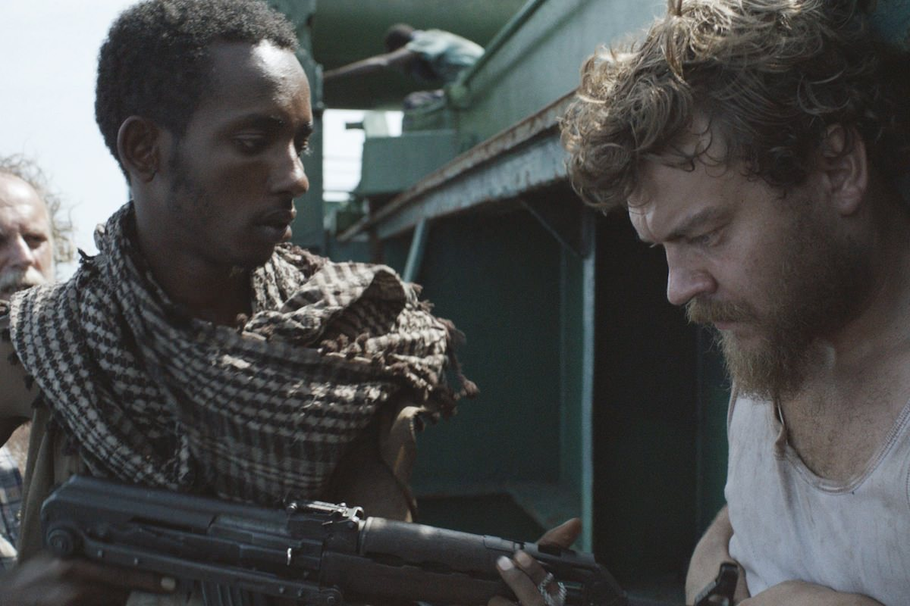
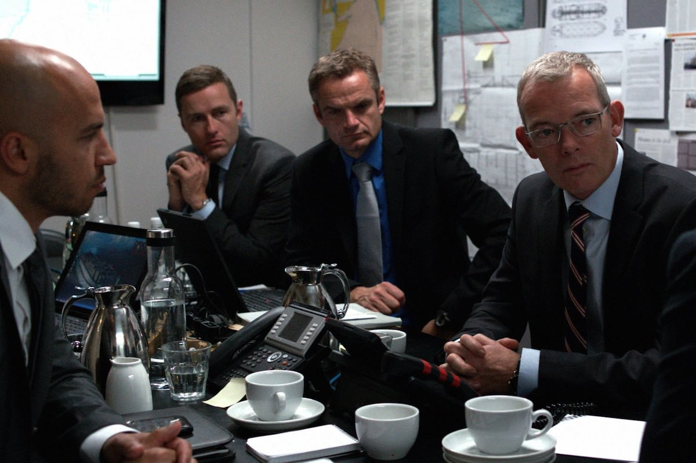

+++
type = "post"
titre = "<em>Hijacking</em>, Tobias Lindholm"
title = "Hijacking, Tobias Lindholm"
url = "/hijacking-lindholm"
date = "2012-12-22T08:05:49"
Lastmod = "2014-01-01T11:58:30"
cover = "hijacking-lindholm-johan-philip-asbaek.jpg"
categorie = [ "À voir" ]
tag = [ "Bateau", "Drame", "Huis clos", "Pirates", "Société", "Thriller" ]
createur = [ "Tobias Lindholm" ]
acteur = [ "Johan Philip Asbæk", "Søren Malling" ]
annee = [ "2013" ]
weight = 2013
pays = [ "Danemark" ]
original = "Kapringen"

+++

Après le film carcéral avec <a href="/2010/12/17/r-noer-mindholm/" title="R, Michael Noer et Tobias Mindholm - À voir et à manger"><em>R</em></a> qui n’a malheureusement pas bénéficié d’une sortie en salles, Tobias Lindholm change de style avec ce deuxième long-métrage. <em>Hijacking</em> raconte, comme son titre l’indique bien, l’histoire d’une prise en otage d’un navire de transport en plein Océan indien. L’occasion d’un long-métrage intense qui prend la forme d’un double huis clos prenant et réussi.

Mikkel est cuisinier sur un navire de transport danois, le Rozen. Le cargo se dirige vers la péninsule arabique et le chef cuistot doit alors descendre pour retrouver femme et enfant au Danemark, après plusieurs mois d’absence en mer. Alors qu’il est en route, le navire est attaqué par des pirates somaliens qui demandent à l’entreprise qui l’affrète une rançon. Les pirates espèrent obtenir 15 millions de dollars contre leurs otages. Au Danemark, le PDG de l’entreprise est abasourdi par la nouvelle et entend prendre en charge lui-même les négociations. Commence une longue guerre psychologique dans laquelle les deux camps entendent faire céder le camp adverse avant de céder lui-même. Les prix évoluent de part et d’autre, tandis que le ton monte côté pirates. Les menaces de mort commencent à apparaître, mais s’agit-il uniquement de menaces ? La vie promet d’être très difficile pendant les négociations, tant sur le navire que dans l’entreprise au Danemark…

<em>Hijacking</em> ouvre sur le Rozen et présente les différents membres d’équipage. La séquence suivante se déroule dans un tout autre contexte, le garage de l’entreprise dans lequel le PDG vient garer sa voiture. Pendant l’heure quarante qui suit, on ne quittera jamais ces deux lieux qui forment un double huis clos. Tobias Lindholm est familier de ce procédé qu’il avait déjà exploité dans <em>R</em>, il est ici le moteur principal du stress qui augmente tout au long du film. La capture du bateau par exemple n’est pas vécue depuis l’Océan indien, mais depuis le Danemark et le manque d’informations rend alors l’évènement beaucoup plus fort et dangereux qu’il ne l’a été en réalité. Même procédé plus tard, quand les pirates menacent d’exécuter un des otages et tirent un coup de feu : on est alors en Europe et seul le son du téléphone permet aux personnages comme aux spectateurs de savoir ce qui se passe réellement à bord du Rozen. <em>Hijacking</em> gagne par ce mécanisme en intensité et s’avère au passage très prenant. On souffre avec les otages à bord, mais aussi avec les négociateurs qui se sentent totalement impuissants. Tobias Lindholm met bien en avant le fait que, dans cette situation, même l’argent ne résout rien et on ne sait pas à dire vrai ce qui pourrait sauver les otages retenus par des pirates si différents et si difficiles à comprendre pour des Occidentaux. 

Au cœur de <em>Hijacking</em> comme au cœur de son intrigue, il y a des hommes qui négocient âprement, qui pour gagner le plus d’argent, qui pour sauver les otages sans trop en donner. Sur le Rozen, c’est le cuisiner qui fait office de personnage principal et d’intermédiaire pour les pirates. Mikkel n’attend qu’une chose : rentrer auprès de sa femme et de sa fille qu’il adore et cette prise en otage le contrarie au plus haut point. Il n’a qu’une vision partielle du problème et se contente de discuter avec le traducteur qui fait la liaison entre le navire et le Danemark, mais Tobias Lindholm rend bien sa détresse et son urgence. Il presse son employeur de payer et se désespère de l’absence de réponse, tandis que les pirates le mettent à rude épreuve, notamment psychologique. Face à ce camp pirate, le PDG de la compagnie maritime qui a affrété le bateau fait en fait office de vrai personnage principal pour <em>Hijacking</em>. C’est en tout cas lui que l’on voit le plus, il est présent dès les premières minutes de l’attaque et n’abandonne jamais l’affaire, malgré les critiques de ses collaborateurs. Dans une première scène introductive, ce patron est présenté comme un homme redoutable en affaire et il parvient à négocier avec un client au-delà de son objectif. Ce personnage posé, Tobias Lindholm peut mieux mettre en valeur ses premiers échecs en tant que négociateur pour récupérer les otages. Il ne s’adresse plus à un client intéressé d’abord par un chiffre, mais à des pirates qui réclameraient beaucoup plus si on leur donnait immédiatement la somme qu’ils demandent en début de négociation. <em>Hijacking</em> met les nerfs de ce personnage à rude épreuve avec une guerre psychologique très subtile, où tous les intervenants avancent avec précaution, comme sur des œufs. Le spectateur suit, tout aussi stressé, ces négociations improbables où l’entreprise danoise doit tenir bon et ne pas céder trop vite, tout en lâchant suffisamment de lest pour ne pas tuer ses employés immédiatement à trop vouloir négocier. Le tout sur fond de vie qui doit continuer, comme les principaux actionnaires de l’entreprise ne manquent pas de cruellement le rappeler à son PDG. 

Le choix du huis clos est très malin pour renforcer l’intensité, mais cela n’aurait pas suffi. <em>Hijacking</em> bénéficie en outre d’un montage qui alterne régulièrement entre les deux huis clos et qui opte quasiment systématiquement pour celui qui sera le plus inquiétant. Le procédé de Tobias Lindholm peut sembler un peu caricatural, mais il fonctionne vraiment bien dans les faits. Le spectateur est vraiment emporté par l’intensité de la négociation et on ressent le stress du PDG à l’attente du prochain appel ou d’un nouveau fax. Le long-métrage n’en fait pas des tonnes sur le bateau, mais il suffit au cinéaste danois de quelques scènes pour en dire énormément en particulier sur la condition psychologique des otages. Tobias Lindholm bénéficie en outre de l’excellent travail de tous les acteurs : il retrouve Johan Philip Asbæk, déjà présent dans <em>R</em> et qui campe ici un cuisinier convaincant. Le plus impressionnant reste toutefois le PDG interprété par Søren Malling : ce personnage très dur au début dévoile une très belle faille émotionnelle lorsqu’il craque totalement au téléphone. On sent bien sa peine sincère pour les familles des otages et Tobias Lindholm a bien réussi à faire ressentir sa difficulté à accepter son impuissance.

Jusqu’à la dernière minute, on craint le pire pour la vie des otages et on le craint autant que le patron de l’entreprise resté au Danemark. C’est incontestablement la force de ce <em>Hijacking</em> : nous faire ressentir pleinement le stress des otages et des négociateurs. En choisissant un double huis clos, Tobias Lindholm a réussi à maximiser cet effet et son nouveau film est sans conteste réussi sur ce point. Un film intense, à ne pas rater. 

<h3>Vous voulez m&rsquo;aider ?<a href="#footnote_0_8105" id="identifier_0_8105" class="footnote-link footnote-identifier-link" title="&Agrave; propos de la publicit&eacute;&hellip;">1</a></h3>
<ul>
<li><a href="http://www.amazon.fr/gp/product/B00G9TH43M/ref=as_li_ss_tl?ie=UTF8&tag=leblogdenic07-21&linkCode=as2&camp=1642&creative=19458&creativeASIN=B00G9TH43M">Acheter le film en DVD sur Amazon</a></li>
<li><a href="https://itunes.apple.com/fr/movie/hijacking-vost/id752356124">Acheter ou louer le film sur l&rsquo;iTunes Store</a></li>
</ul>

<ol class="footnotes"><li id="footnote_0_8105" class="footnote"><a href="/soutien/">À propos de la publicité…</a> [<a href="#identifier_0_8105" class="footnote-link footnote-back-link">&#8617;</a>]</li></ol>
