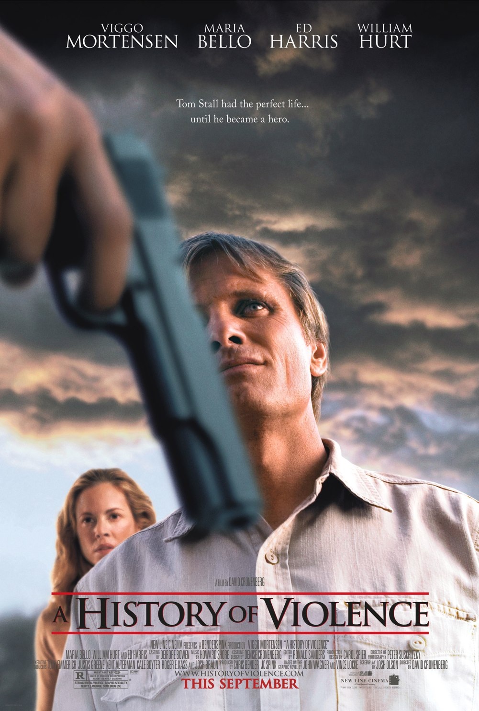
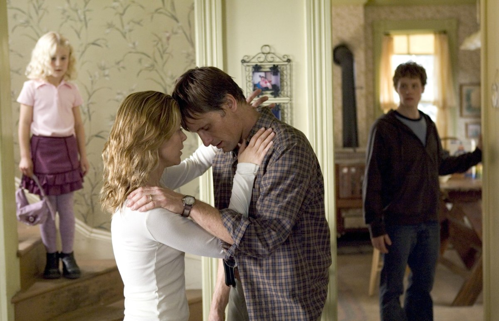

+++
type = "post"
titre = "<em>A History of Violence</em>, David Cronenberg"
title = "A History of Violence, David Cronenberg"
url = "/history-violence-cronenberg"
date = "2012-03-29T09:53:12"
Lastmod = "2015-04-12T17:38:42"
cover = "history-violence-cronenberg.jpg"
categorie = [ "À voir" ]
tag = [ "Famille", "Mafia", "Société", "Thriller", "Violence" ]
createur = [ "David Cronenberg" ]
acteur = [ "Ed Harris", "Maria Bello", "Viggo Mortensen", "William Hurt" ]
annee = [ "2005" ]
weight = 2005
pays = [ "États-Unis" ]

+++

Certains films portent des titres sans rapport avec leur sujet. Ce n&rsquo;est pas le cas de <em>A History of Violence</em> : David Cronenberg montre l&rsquo;irruption aussi soudaine que brutale de la violence au sein d&rsquo;une famille paisible des États-Unis. Ce retour de la violence perturbe la société de cette bourgade de l&rsquo;Indiana, mais elle menace surtout d&rsquo;exploser une famille. Un film intense et poignant, à (re)voir sans hésiter.

Tom Stall mène une vie tranquille dans la petite ville de Millbrook. Il dirige un petit café et il vit avec sa femme et ses deux enfants, un garçon et une petite fille. Une représentation parfaite de l&rsquo;<em>American Way of Life</em>, mais bascule brutalement le jour où deux malfrats s&rsquo;en prennent au café de Tom. Ce dernier, à la surprise générale, parvient à maîtriser et à tuer les deux hommes avec une précision qui force le respect, mais surprend en même temps tout le monde. Comment un banal père de famille sans histoire peut-il tuer de sang-froid deux hommes armés ? Le temps est vite à la consécration du héros du jour qui passe sur toutes les télévisions, mais alors que la vie semble reprendre son cours, trois mystérieux hommes arrivent en ville dans une luxueuse voiture. Ils ont reconnu Tom à la télévision et prétendent le connaître sous le nom de Joey. Qui est vraiment Tom Stall ?

<em>A History of Violence</em> commence par une séquence qui condense tout son message. Devant un motel, deux hommes sortent d&rsquo;une chambre et montent dans une voiture. Ils s&rsquo;arrêtent devant l&rsquo;accueil, l&rsquo;un entre, mais on ne voit pas ce qui s&rsquo;y passe. Quand il ressort, toujours aussi calme, l&rsquo;autre entre à son tour pour chercher de l&rsquo;eau. On découvre alors deux cadavres fraichement descendus. David Cronenberg attaque fort avec cette séquence qui fait surgir la violence dans un contexte paisible et sans problème. C&rsquo;est exactement le sujet du film : la violence est potentiellement partout et il suffit d&rsquo;un rien pour la retrouver. Tom Stall n&rsquo;est pas qu&rsquo;un serveur de café et autres parts de tarte, il est aussi un redoutable tueur : à la fin de <em>A History of Violence</em>, il compte une petite dizaine de morts à son palmarès. Cet homme est capable en temps normal de maîtriser sa violence, mais elle surgit dans certaines circonstances et a un impact direct sur son entourage. Le fils de Tom est un lycéen un peu à l&rsquo;écart, qui ne brille pas à l&rsquo;école et qui se fait harceler par un autre lycéen catégorie plus-beau-mec-du-lycée. Au départ, il se contente de répondre aux attaques incessantes de ce dernier par des plaisanteries et échappe ainsi aux coups. Quand son père tue les deux voleurs dans le café, il sort les poings et envoie deux élèves à l&rsquo;hôpital en portant des coups extrêmement violents et inattendus. Plus tard, il ira encore plus loin en tuant un homme pour protéger son père.

La violence est partout et peut surgir à n&rsquo;importe quel moment, semble ainsi signifier David Cronenberg. Le personnage principal de <em>A History of Violence</em> ne se découvre pas vraiment un caractère violent par hasard puisque, comme on le comprend vite, il a un lourd passé. Sans trop en dévoiler sur l&rsquo;intrigue, on peut dire que Tom a appartenu à la mafia de Philadelphie où il avait la réputation d&rsquo;être extrêmement violent et efficace. David Cronenberg laisse longtemps une question en suspens : Tom est-il amnésique ou joue-t-il (très bien) la comédie en se faisant passer pour un autre ? Le film ne donne aucune réponse dans un premier temps, mais penche plutôt vers la première hypothèse ; dans un deuxième temps, le personnage commence à se livrer et il évoque son travail pour enterrer son passé. Est-il vraiment sincère, a-t-il vraiment réussi à oublier son histoire de mafieux pour devenir un nouvel homme, ou a-t-il au contraire menti à sa famille pendant toutes ses années ? Là encore, <em>A History of Violence</em> a la sagesse de ne pas donner de réponses toutes faites et de laisser ces questions flotter. En fonction de son histoire personnelle, le spectateur pourra accabler ou pardonner le personnage, ce n&rsquo;est de toute manière pas l&rsquo;enjeu de ce film qui ne cherche jamais à provoquer artificiellement des réactions.

<em>A History of Violence</em> est un film assez bref — 1h30 environ — et il est aussi plutôt dense. David Cronenberg ne perd pas son temps en fioritures, il va à l&rsquo;essentiel et mène son scénario avec une certaine sécheresse, mais surtout une efficacité constante. Il prend pourtant son temps, au démarrage, pour filmer la famille dans son quotidien et montrer les liens forts qui unissent ses membres : un cauchemar de la petite dernière suffit à rassembler toute la famille autour du lit de la fille. Cette introduction tranche encore plus fortement avec la scène qui change tout, celle de l&rsquo;attaque du café. Le cinéaste fait alors surgir Joey avec d&rsquo;autant plus de violence que le spectateur ne s&rsquo;y attend pas et Viggo Mortensen n&rsquo;est pas étranger à cet effet de surprise. L&rsquo;acteur découvert avec la trilogie <em>Le Seigneur des Anneaux</em> a trouvé chez David Cronenberg un rôle à la mesure de son talent : il est tout simplement excellent pour interpréter Tom/Joey avec toute la finesse nécessaire pour rendre le personnage crédible. Autour de lui, Maria Bello forme une épouse convaincante, mais ce sont surtout Ed Harris et William Hurt qui impressionnent dans leurs rôles de mafieux.

David Cronenberg signe un grand film avec <em>A History of Violence</em>. Cette histoire de violence qui surgit sans prévenir au cœur d&rsquo;une famille et d&rsquo;une société est saisissante et très réussie. Une vision assez terrifiante de la violence, pour un film dur et efficace. Si vous ne le connaissez pas, il n&rsquo;est pas trop tard pour le découvrir !

<h3>Vous voulez m&rsquo;aider ?</h3>
<ul>
<li><a href="http://www.amazon.fr/gp/product/B0038R13TE/ref=as_li_ss_tl?ie=UTF8&amp;tag=leblogdenic07-21&amp;linkCode=as2&amp;camp=1642&amp;creative=19458&amp;creativeASIN=B0038R13TE">Acheter le film en Blu-Ray sur Amazon</a></li>
<li><a href="http://www.amazon.fr/gp/product/B000EMGB1G/ref=as_li_ss_tl?ie=UTF8&amp;tag=leblogdenic07-21&amp;linkCode=as2&amp;camp=1642&amp;creative=19458&amp;creativeASIN=B000EMGB1G">Acheter le film en DVD sur Amazon</a></li>
</ul>

