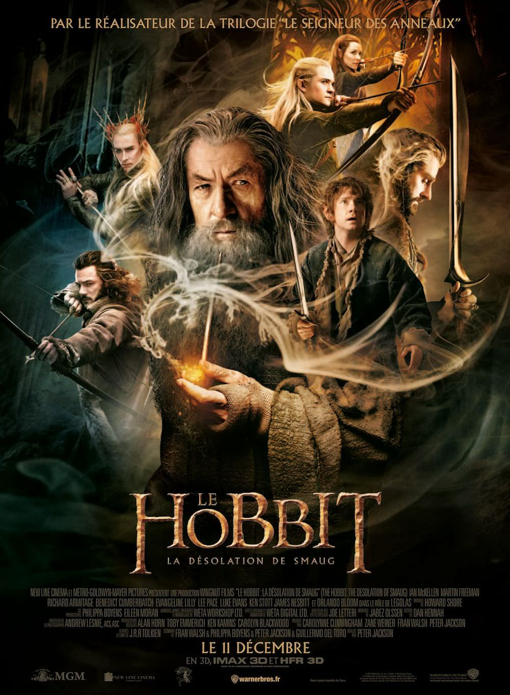
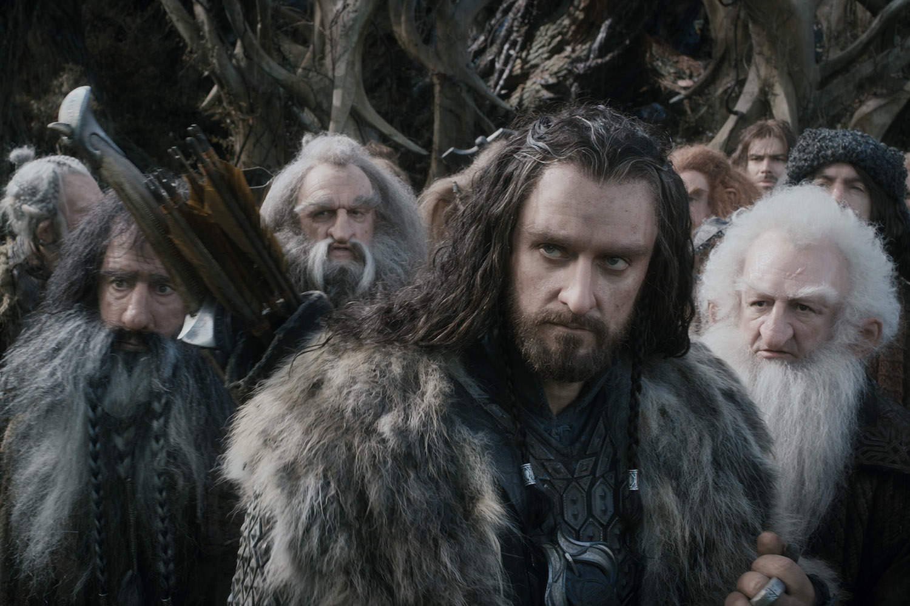
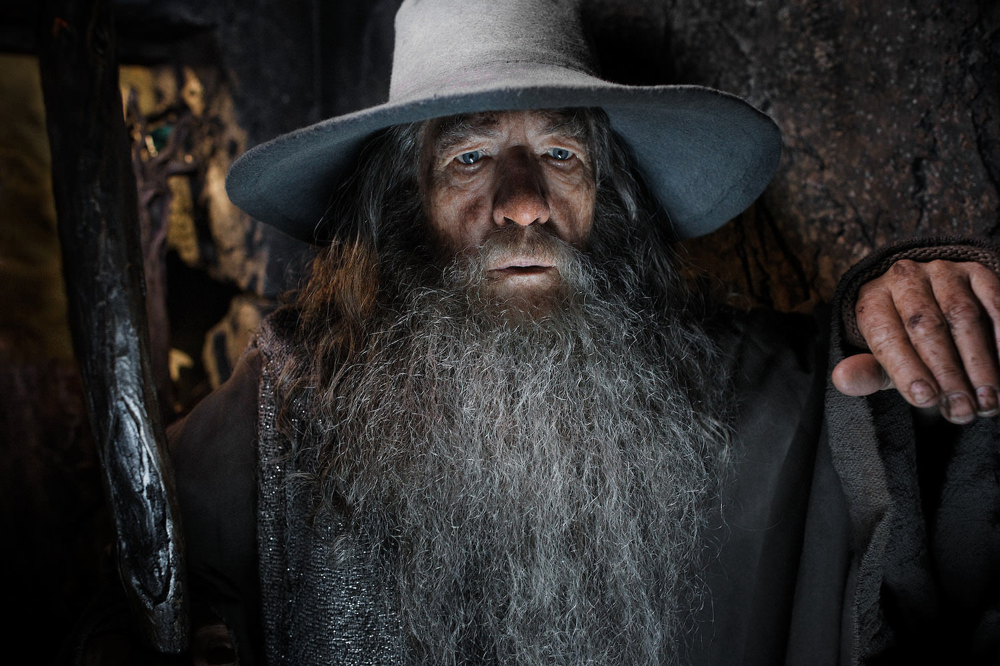

+++
type = "post"
titre = "<em>Le Hobbit : la Désolation de Smaug</em>, Peter Jackson"
title = "Le Hobbit : la Désolation de Smaug, Peter Jackson"
url = "/hobbit-desolation-smaug-jackson"
date = "2013-12-11T23:26:46"
Lastmod = "2014-12-11T00:05:05"
cover = "le-hobbit-desolation-smaug-martin-freeman-jackson.jpg"
categorie = [ "À voir" ]
tag = [ "Adaptation littéraire", "Blockbuster", "Dragon", "Fantastique", "Heroïc-Fantasy", "Société" ]
createur = [ "Peter Jackson" ]
acteur = [ "Aidan Turner", "Evangeline Lilly", "Ian McKellen", "Lee Pace", "Luke Evans", "Martin Freeman", "Orlando Bloom", "Richard Armitage" ]
annee = [ "2013" ]
weight = 2013
saga = [ "Le Hobbit" ]
pays = [ "États-Unis", "Nouvelle-Zélande" ]
original = "The Hobbit : The Desolation of Smaug"

+++

Poursuivant sans relâche son titanesque travail d’adaptation de l’univers imaginé par J.R.R. Tolkien, Peter Jackson s’est attaqué au <a href="https://itunes.apple.com/fr/book/le-hobbit/id567931828?mt=11"><em>Hobbit</em></a>. De ce petit roman destiné aux enfants, il en a fait une vraie trilogie, aussi longue que celle du <a href="http://voiretmanger.fr/saga/le-seigneur-des-anneaux/"><em>Seigneur des Anneaux</em></a>, pas moins ambitieuse. <a href="http://voiretmanger.fr/hobbit-voyage-inattendu-jackson/" title="Le Hobbit : un voyage inattendu, Peter Jackson"><em>Le Hobbit : un voyage inattendu</em></a> offrait à la saga une nouvelle introduction et permettait de replonger dans l’univers fantastique bien connu de la Terre du Milieu. Comme dans sa première trilogie, le cinéaste passe à la vitesse supérieure avec ce deuxième volet qui permet aux différentes forces de se mettre en place et qui enclenche les premiers combats. <em>Le Hobbit : la Désolation de Smaug</em> est ainsi plus porté sur l’action, plus noir que le précédent aussi et surtout beaucoup plus spectaculaire. Peter Jackson ne sait pas faire court et même s’il a beaucoup ajouté au roman original pour tenir 2h41, on ne s’ennuie jamais et on s’indigne même beaucoup de cette fin qui arrive beaucoup trop tôt. Après avoir vu ce long-métrage, on n’a qu’une envie : voir la suite. C’est bien la preuve que cette nouvelle saga est aussi réussie que la précédente, même si les enjeux sont autrement moins importants ici. <em>Le Hobbit : la Désolation de Smaug</em> est un grand spectacle d’excellente qualité, à voir au cinéma pour un plaisir maximum.

Peter Jackson ne s’embarrasse pas à résumer les épisodes précédents à ceux qui les auraient ratés : ce nouveau film commence directement là où le précédent s’arrêtait. Si vous n’aviez pas suivi, <em>Le Hobbit : la Désolation de Smaug</em> ouvre alors que Bilbo, Gandalf et une dizaine de Nains sont partis en quête d’un trésor protégé par un dragon. Les Nains veulent au passage récupérer leur montagne et cette quête initiée dans le premier volet prend ici une tournure plus sombre. La communauté est sans cesse attaquée par des Orcs avant de se faire capturer par des Elfes : l’heure n’est plus à l’ambiance légère du premier épisode. Dans son travail d’adaptation de Tolkien, le cinéaste a d’ailleurs très bien réussi à renforcer cette noirceur en plaçant le retour de Sauron quasiment au centre des enjeux. On découvre dans un bref flashback situé en tête du film que Gandalf est inquiet par le retour du mal et si le magicien ne comprend pas ce qui se passe pendant la majorité du film, le spectateur lui, sait que c’est l’ennemi ultime qui sera au centre du <em>Seigneur des Anneaux</em> qui opère déjà ici son retour, encore masqué et affaibli. De la même manière, Peter Jackson poursuit son travail acharné pour lier les deux sagas, notamment autour de l’anneau. Assez anecdotique dans l’œuvre de Tolkien, il prend ici une place importante alors qu’on voit à l’œuvre le travail de Sauron pour le récupérer et pour séduire son porteur. À plusieurs reprises tout au long de <em>Le Hobbit : la Désolation de Smaug</em>, l’anneau est évoqué sans qu’il serve vraiment le récit, mais il crée ainsi un lien avec la trilogie qui doit suivre dans la chronologie interne et c’est plutôt bien vu. Les amateurs apprécieront aussi les clins d’œil directs, comme la référence à Gimli en présence de Legolas, mais aussi les analogies que l’on peut créer entre ce film et <a href="http://voiretmanger.fr/seigneur-anneaux-deux-tours-jackson/" title="Le Seigneur des anneaux : les deux tours, Peter Jackson"><em>Le Seigneur des anneaux : les deux tours</em></a>. Le passage à Lacville par exemple n’est pas sans rappeler la séquence au Rohan dans l’autre trilogie, avec la même idée de bloquer la quête pour des raisons politiques. Certes, les enjeux ne sont pas les mêmes, mais Peter Jackson a plutôt bien réussi à noircir la saga avec cet épisode beaucoup plus sombre d’où émerge un sentiment d’urgence qui manquait peut-être un peu au précédent film.

Pour tenir près de neuf heures au total, il a bien fallu enrichir le texte original d’idées nouvelles. <em>Le Hobbit : la Désolation de Smaug</em> ne fait pas exception, au contraire même : cet épisode compte plus d’éléments nouveaux par rapport au livre original que son prédécesseur. On ne va pas faire une liste complète, mais simplement reconnaître que ces extensions sont inégales. Peter Jackson fait de séquences totalement anodines chez J.R.R. Tolkien de grands moments de cinéma avec, en particulier, quelques scènes d’action particulièrement spectaculaires et réussis. Le départ de chez les Elfes en tonneaux a tout d’une attraction de parc à thème — s’il y en a un qui est prévu, on suppose qu’il y aura droit —, mais la séquence fonctionne très bien sur grand écran. La caméra virevolte autour de l’action avec une belle dextérité et le scénario multiplie les idées tantôt époustouflantes, tantôt amusantes. Une très belle scène de cinéma qui rappelle, s’il le fallait encore, que le réalisateur néo-zélandais n’a pas son pareil pour filmer l’épique et le grandiose. Dans <em>Le Hobbit : la Désolation de Smaug</em>, tout est créé par des ordinateurs à part les vastes paysages de la Nouvelle-Zélande et même si les incrustations numériques sont visibles au point, parfois, d’évoquer l’animation, il faut reconnaître que le talent de Peter Jackson n’a pas faibli dès qu’il s’agit de filmer de grands paysages ou de l’action. Les scènes intimes sont peut-être moins fortes et d’ailleurs l’idée d’une romance entre un Nain et une Elfe qui est une complète invention de la part du cinéaste n’est pas la meilleure du film. Heureusement que ces séquences restent courtes et noyées dans un ensemble plus spectaculaire, mais on aurait préféré un film raccourci d’un bon quart d’heure plutôt que d’avoir cet intermède amoureux assez ridicule<a href="#footnote_0_10710" id="identifier_0_10710" class="footnote-link footnote-identifier-link" title="Sans compter qu&rsquo;un Elfe et un Nain ne sont pas cens&eacute;s pouvoir s&rsquo;aimer dans cet univers. Le Gorafi a bien eu raison de porter la lumi&egrave;re sur ce scandale&hellip;">1</a>. Le dragon, clou du spectacle évidemment, ne déçoit pas en revanche. On craignait un peu le pire, sachant que la créature devait parler, mais est-ce grâce à la voix magistrale de Benedict Cumberbatch ou plutôt aux dialogues très bien écrits, toujours est-il que la scène passe très bien et que l’on est ébloui par le monstre. Ce dragon est énorme comme il se doit et on aime bien la touche réaliste du corps qui rougit avant de cracher du feu. <em>Le Hobbit : la Désolation de Smaug</em> ne déçoit pas le spectateur venu pour du grand spectacle et c’est bien là l’essentiel. Qu’importe alors si Peter Jackson n’a pas respecté à la lettre le texte original, son adaptation fonctionne, dans l’ensemble, très bien.

Passer d’un roman pour enfant à une trilogie aussi ambitieuse que celle du <em>Seigneur des Anneaux</em> était un pari pour le moins ambitieux, mais un pari que Peter Jackson est en passe de réussir. On ne peut pas encore juger de la conclusion attendue fin 2014, mais <em>Le Hobbit : la Désolation de Smaug</em> est déjà une très belle réussite dans le genre épopée spectaculaire. Plus dense que le premier volet, cette section centrale remplit à la merveille son rôle de divertissement. Certes, la fin en pleine action est un peu facile, certes, il a fallu inventer beaucoup et parfois trop pour tenir aussi longtemps, mais le cinéaste est complètement fou de cet univers imaginé par J.R.R. Tolkien, cela se voit, et cela fait bien plaisir. Ce n’est sans doute pas du grand cinéma, mais <em>Le Hobbit : la Désolation de Smaug</em> est dans le haut du panier en matière de spectacle. Si vous aimez cela, ne ratez pas cette suite, de préférence sur le plus grand écran que vous trouverez…

<h3>Vous voulez <a href="http://voiretmanger.fr/soutien/">m&rsquo;aider</a> ?</h3>
<ul>
<li><a href="http://www.amazon.fr/gp/product/B00MGVTHBY/ref=as_li_ss_tl?ie=UTF8&amp;tag=leblogdenic07-21&amp;linkCode=as2&amp;camp=1642&amp;creative=19458&amp;creativeASIN=B00MGVTHBY">Acheter le film en Blu-ray sur Amazon</a></li>
<li><a href="http://www.amazon.fr/gp/product/B00MGVTHQE/ref=as_li_ss_tl?ie=UTF8&amp;tag=leblogdenic07-21&amp;linkCode=as2&amp;camp=1642&amp;creative=19458&amp;creativeASIN=B00MGVTHQE">Acheter le film en DVD sur Amazon</a></li>
<li><a href="https://itunes.apple.com/fr/movie/le-hobbit-la-desolation-smaug/id907987873">Acheter ou louer le film sur l&rsquo;iTunes Store</a></li>
</ul>

<ol class="footnotes"><li id="footnote_0_10710" class="footnote">Sans compter qu&rsquo;un Elfe et un Nain ne sont pas censés pouvoir s&rsquo;aimer dans cet univers. Le Gorafi a bien eu raison de <a href="http://www.legorafi.fr/2013/12/11/the-hobbit-nains-et-elfes-accusent-peter-jackson-de-revisionnisme-et-dappel-a-la-haine-raciale/" title="The Hobbit : Nains et Elfes accusent Peter Jackson de révisionnisme et d’appel à la haine raciale">porter la lumière</a> sur ce scandale… [<a href="#identifier_0_10710" class="footnote-link footnote-back-link">&#8617;</a>]</li></ol>
