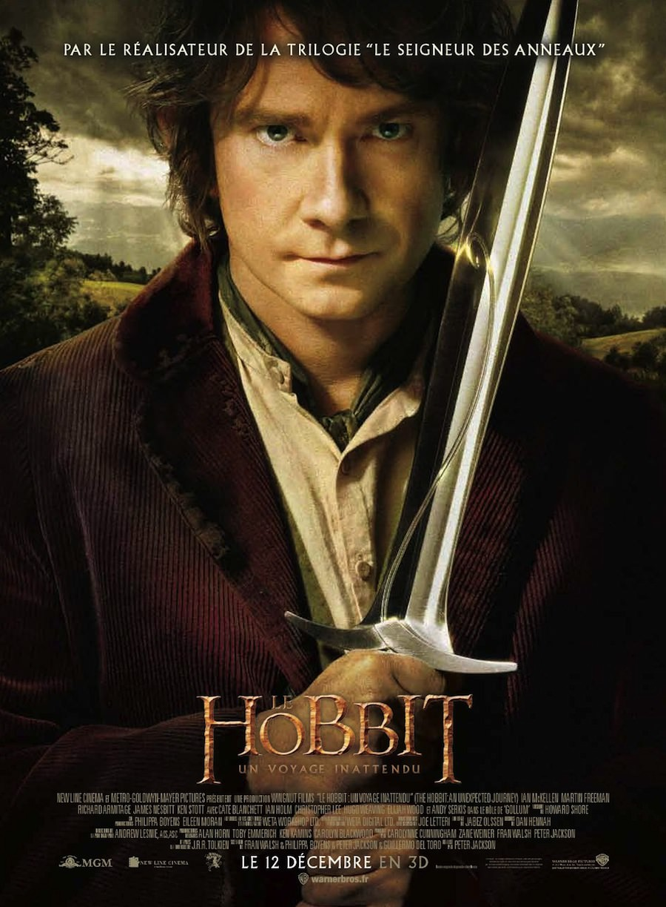
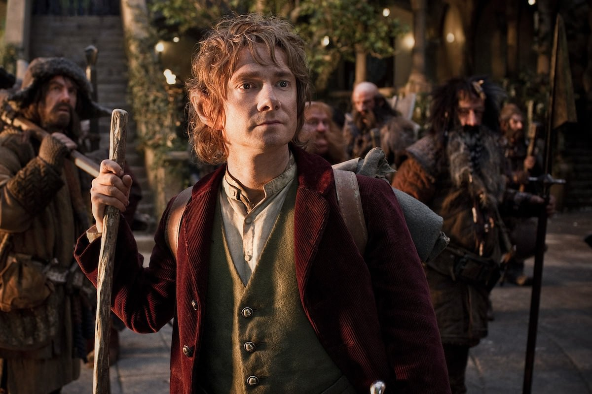
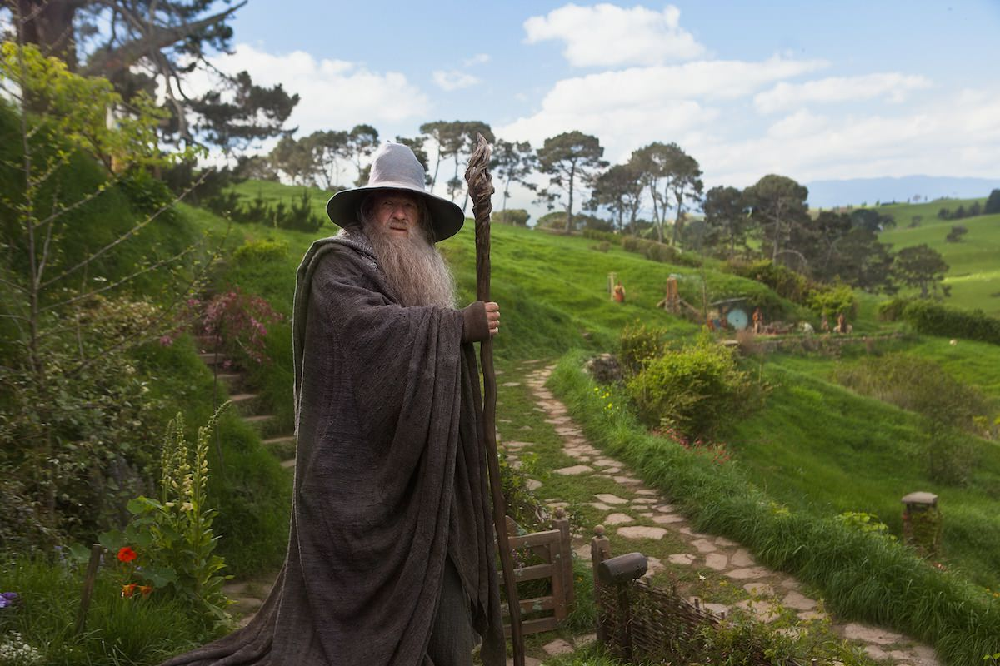
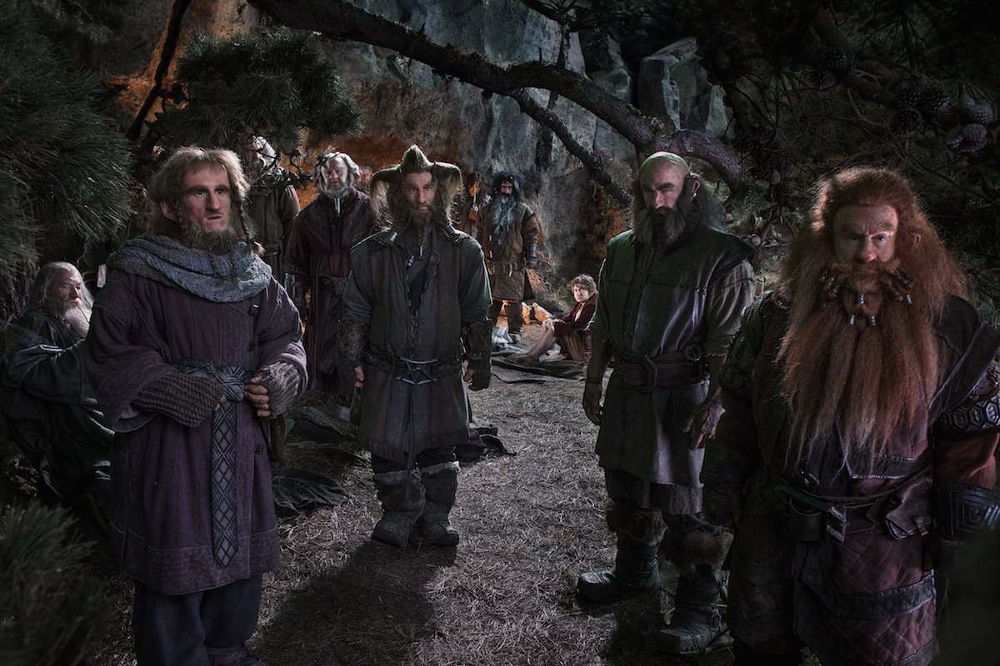

+++
type = "post"
titre = "<em>Le Hobbit : un voyage inattendu</em>, Peter Jackson"
title = "Le Hobbit : un voyage inattendu, Peter Jackson"
url = "/hobbit-voyage-inattendu-jackson"
date = "2012-12-13T01:52:43"
Lastmod = "2014-12-11T00:09:46"
cover = "hobbit-voyage-inattendu-martin-freeman-peter-jackson.jpg"
categorie = [ "À voir" ]
tag = [ "Action", "Blockbuster", "Épopée", "Fantastique", "Heroïc-Fantasy", "Humour", "Le Hobbit" ]
createur = [ "Peter Jackson" ]
acteur = [ "Hugo Weaving", "Ian McKellen", "Martin Freeman", "Richard Armitage" ]
annee = [ "2012" ]
weight = 2012
saga = [ "Le Hobbit" ]
pays = [ "États-Unis", "Nouvelle-Zélande" ]
original = "The Hobbit: An Unexpected Journey"

+++

De 2001 à 2003, Peter Jackson a sorti l’une des plus grandes épopées au cinéma, l’une des plus ambitieuses en tout cas. En adaptant <em>Le Seigneur des Anneaux</em> de J.R.R. Tolkien, un roman jugé inadaptable, il a porté sur les écrans une fresque monumentale avec un souffle épique et des moyens techniques jamais vus. Le succès a été tel qu’il ne pouvait rester sans suite et le cinéaste néo-zélandais, en bon fan de l’univers créé par Tolkien, s’est penché sur <em>Bilbo le Hobbit</em>. Ce bref roman précède la trilogie de l’anneau, tant dans l’ordre d’écriture que dans la narration et c’est un livre plutôt destiné aux enfants. Quand on a appris que Peter Jackson comptait en tirer une trilogie, on pouvait avoir quelques inquiétudes légitimes sur la capacité du réalisateur à remplir trois films sans lasser. <em>Le Hobbit : un voyage inattendu</em> est le premier des trois films et il rassure sur les intentions du cinéaste. Même s’il est peut-être un peu long, il sait rester dense et le souffle épique qui faisait la force du <em>Seigneur des Anneaux</em> est toujours de la partie. Du très grand spectacle, à voir sur grand écran !

<em>Le Hobbit : un voyage inattendu</em> ouvre précisément au même moment que <a href="http://voiretmanger.fr/2012/07/08/seigneur-anneaux-communaute-anneau-jackson/" title="Le Seigneur des anneaux : la Communauté de l'anneau, Peter Jackson - À voir et à manger"><em>Le Seigneur des anneaux : la Communauté de l’anneau</em></a>. Le récit commence ainsi dans la Comté, chez les Hobbits : Bilbo termine le récit de ses aventures et s’apprête à fêter son anniversaire. Frodon, son neveu, est tout excité à cette idée et part accueillir Gandalf, le magicien et ami de Bilbo : c’est très exactement le début de la trilogie précédente de Peter Jackson. Il ne s’agit pas là que d’un argument marketing, encore moins d’une volonté de proposer un résumé au spectateur — rien n’est explicité —, mais c’est plutôt un symbole fort. Ce lien marque en effet d’emblée la volonté du cinéaste de lier les deux trilogies. Elles ne sont pas sorties dans le bon ordre, mais elles devraient former à la fin un ensemble cohérent et il était dès lors naturel d’ouvrir ce long-métrage avec quasiment la même scène que <em>La Communauté de l’anneau</em>, avant de revenir soixante ans en arrière dans un long flashback.

Soixante ans plus tôt donc, Bilbo est un Hobbit sans histoire et très casanier qui reçoit, un jour, la visite surprise de Gandalf. Le magicien vient lui proposer de partir pour une aventure et reçoit un non définitif. Pas découragé pour autant, il repart après avoir laissé une marque sur la porte du Hobbit. Dans la soirée, un nain, puis deux, trois et finalement treize nains entrent dans la maison de Bilbo. Ils sont tous réunis par le magicien qui finit par expliquer à l’hôte bien malgré lui de la réunion le but du rassemblement. Ces nains sont des rescapés du Mont Solitaire, une montagne qui a longtemps abrité les puissants nains d’Erebor avant qu’ils soient évacués par le terrifiant dragon Smaug. Ces nains, menés par le guerrier Thorin Écu-de-Chêne, entendent reprendre leur montagne et, pour une raison qui reste largement mystérieuse pour le moment, Gandalf veut les aider et il associe, en lui forçant un peu la main, Bilbo. Ce dernier finit par accepter à contrecœur et il suit les Nains et le magicien dans une aventure extrêmement dangereuse, on s’en doute. <em>Le Hobbit : un voyage inattendu</em> commence un périple qui est loin d’être arrivé à son terme à la fin de ce premier film…

Comment retrouver l’esprit du <em>Seigneur des Anneaux</em>, sans tomber dans la redite ? Cette question a incontestablement travaillé Peter Jackson et ses équipes et <em>Le Hobbit : un voyage inattendu</em> sait maintenir un certain équilibre entre le familier et le neuf. On a déjà évoqué une scène d’introduction quasiment similaire entre ce film et l’ouverture de la trilogie de l’anneau, mais ce n’est pas le seul point commun que l’on peut relever. De fait, c’est la structure entière du film qui est quasiment identique scène par scène : on commence dans la Comté, dont on part précipitamment jusqu’à faire une pause chez les Elfes, à Fondcombe ; le groupe repart ensuite et doit affronter des Gobelins dans une mine et le film s’arrête après leur victoire. La proximité scénaristique de <em>Le Hobbit : un voyage inattendu</em> avec le film sorti en 2001 est troublante résumée ainsi, mais elle n’est pas gênante à l’écran. L’histoire de l’Anneau est encore loin, il n’est ici question que d’un trésor et d’un dragon et l’urgence que l’on pouvait retrouver dans <em>La Communauté de l’Anneau</em> n’est absolument pas présente. Les différences sont finalement plus nombreuses et importantes que les points communs : le groupe est plus important ici, mais composé quasiment uniquement de Nains, alors que cette race se fait plutôt rare dans <em>Le Seigneur des Anneaux</em>. Biblo suit volontairement l’aventure alors que Frodo y est contraint et il s’agirait presque d’une promenade de santé en comparaison, même si <em>Le Hobbit : un voyage inattendu</em> ne manque pas de scènes de combat et de morceaux de bravoure. La différence finalement, tient peut-être dans le ton employé.

Alors que la trilogie de l’Anneau est contrainte à être extrêmement sérieuse et même noire du fait de la menace du mal qui plane en permanence, <em>Le Hobbit : un voyage inattendu</em> est un film au contraire léger, et même comique par moments. Peter Jackson n’en a pas fait une comédie, n’exagérons pas, mais il a laissé une place beaucoup plus importante à des personnages secondaires et comiques, en particulier aux Nains. Mal élevés, mais bons vivants, cette galerie de personnages est plutôt réussie avec des portraits hauts en couleur et des personnalités très différentes. Ils allègent en permanence le film et <em>Le Hobbit : un voyage inattendu</em> ménage même quelques scènes de comédie pure. C’est le cas notamment de la séquence de capture par les Trolls qui pourraient être un moment dramatique — on se souvient de l’épisode de la Moria dans <em>Le Seigneur des anneaux : la Communauté de l’anneau</em> notamment —, mais qui est en fait un moment comique avec trois créatures un peu stupides qui passent leur temps à se disputer sur la manière d’assaisonner des chevaux ou des Nains. Cette légèreté tranche avec d’autres séquences d’action pure, à l’image de la bataille dans la mine qui est impressionnante, beaucoup plus que les combats que l’on avait dans la trilogie des années 2000. Ce n’est pas forcément gênant, mais ce décalage surprend, comme si Peter Jackson n’avait pas vraiment su trancher entre un public adulte et le public plus jeune qui était déjà visé par <em>Bilbo le Hobbit</em> de Tolkien. Il sera intéressant de voir si cet aspect léger sera toujours de la partie dans <em>Le Hobbit : La Désolation de Smaug</em> qui n’est pas attendu avant l’hiver 2013.

À sa sortie en 2001, l’adaptation au cinéma du <em>Seigneur des Anneaux</em> avait surpris tout le monde sur le plan technique, autant que sur l’ambition du projet. Peter Jackson avait réussi à pousser au maximum les techniques de l’époque, notamment en matière d’effets numériques, inventant au passage des logiciels adaptés à ses besoins (multiplication d’un personnage pour créer une armée gigantesque par exemple). <em>Le Hobbit : un voyage inattendu</em> innove lui aussi, mais sur un autre plan. Le film est proposé en 3D comme pour tous les blockbusters désormais, mais Peter Jackson a un autre argument dans sa poche : le HFR. Derrière ce sigle se cache en fait une petite révolution au cinéma : alors que l’on filme et diffuse à 24 images par seconde depuis l’invention des caméras modernes, ce film a été tourné à 48 images par seconde. Avec deux fois plus d’images pour chaque seconde du film, le résultat est censé être beaucoup plus net, tandis que les effets néfastes de la 3D — l’effet de flou en premier lieu — sont censés être largement diminués. Toutes les salles ne sont pas encore équipées pour diffuser à 48 images par seconde<a href="#fn-8019-1" rel="footnote">1</a> et pour cause : sur le papier, les effets sont totalement bénéfiques, mais le résultat ne plait pas à tout le monde. J’ai décidé de tester cette nouvelle technologie et je n’ai pas vraiment été gêné passées les premières minutes d’adaptation. On s’habitude vite au procédé et le résultat est indéniable : l’image est d’une finesse jamais vue, surtout pas en 3D. On distingue parfaitement tous les détails, y compris les plus infimes et certaines scènes sont à cet égard bluffantes. Ce n’est pas toujours parfait, par moment la technologie fait apparaître des défauts au contraire, mais c’est globalement un succès. Si vous avez l’occasion de tester cette nouveauté, n’hésitez pas, cela deviendra certainement la norme au cinéma dans les années à venir. Inutile cependant, en l’état, de changer vos habitudes pour voir <em>Le Hobbit : un voyage inattendu</em> avec 48 images par seconde : le gain est appréciable, mais ce n’est pas non plus révolutionnaire<a href="#fn-8019-2" rel="footnote">2</a>…

Peter Jackson n’a, par ailleurs, pas perdu la main pour ce nouveau film. Le cinéaste connaît bien les projets pharaoniques et il maîtrise celui-ci autant que pour <em>Le Seigneur des Anneaux</em>, si ce n’est mieux. <em>Le Hobbit : un voyage inattendu</em> emporte le spectateur et maîtrise parfaitement son scénario pour ne pas ennuyer, même s’il faut relever quelques temps morts. Le film dure près de trois heures, l’action ne peut pas être permanente sur la durée, mais le cinéaste l’a bien dosée et on ne s’ennuie jamais, ou presque. À force d&rsquo;étirer l&rsquo;histoire de Tolkien, le cinéaste a intégré quelques scènes vraiment étranges, à l&rsquo;image de ce combat de géants dans la montagne qui aurait vraiment gagné à être coupée au montage et ajoutée aux scènes coupées…<a href="#fn-8019-3" rel="footnote">3</a> Les effets numériques ont fait des progrès considérables depuis 2001 et cela se voit : la modélisation des créatures est troublante de réalisme, tout est fluide et spectaculaire. La scène la plus impressionnante de <em>Le Hobbit : un voyage inattendu</em> n’est pas une scène de combat pourtant, mais la rencontre entre Bilbo et Gollum. Moment fort de cette trilogie, elle montre bien les progrès de la Motion Capture — <a href="http://voiretmanger.fr/2009/12/18/avatar-james-cameron/" title="Avatar, James Cameron - À voir et à manger"><em>Avatar</em></a> est passé par là — tout en étant une formidable scène de cinéma avec ce jeu d’énigmes à la fois drôle et terrifiant. Peter Jackson peut toujours compter sur la qualité de tous ses acteurs, que ce soit ceux que l’on connaît déjà — Ian McKellen en tête — ou les nouveaux : Martin Freeman, le Dr Watson de la série <a href="http://voiretmanger.fr/2012/05/06/sherlock-bbc/" title="Sherlock, BBC - À voir et à manger"><em>Sherlock</em></a>, fait un excellent Hobbit. Il bénéficie aussi d’une très bonne <a href="http://www.amazon.fr/gp/product/B009A9BGIC/ref=as_li_ss_tl?ie=UTF8&#038;tag=leblogdenic07-21&#038;linkCode=as2&#038;camp=1642&#038;creative=19458&#038;creativeASIN=B009A9BGIC">bande originale</a> qui emprunte quelques éléments à celle du <em>Seigneur des Anneaux</em> tout en réinventant ses propres thèmes autour de la chanson des Nains entendue au début du film.

<em>Le Hobbit : un voyage inattendu</em> réussit à nous emporter à nouveau au cœur de la Terre du Milieu avec une histoire familière, mais renouvelée. Peter Jackson s&rsquo;en sort très bien avec ce premier épisode, même s&rsquo;il aurait peut-être gagné à le raccourcir un petit peu. Le film n&rsquo;est pas inutilement long toutefois, ce qui est plutôt rassurant sur la trilogie <em>Le Hobbit</em> dans son ensemble. Sans préjuger de ce que fera Peter Jackson l&rsquo;an prochain et dans deux ans, on peut en tout cas recommander sans crainte <em>Le Hobbit : un voyage inattendu</em> à tous les fans de l&rsquo;univers de Tolkien. Les autres peuvent en revanche passer leur chemin, ils ne devraient pas plus aimer cette nouvelle trilogie que l&rsquo;originale…

<h3>Vous voulez m&rsquo;aider ?</h3>
<ul>
<li><a href="http://www.amazon.fr/gp/product/B00B1SKEQA/ref=as_li_ss_tl?ie=UTF8&#038;tag=leblogdenic07-21&#038;linkCode=as2&#038;camp=1642&#038;creative=19458&#038;creativeASIN=B00B1SKEQA">Acheter le film en Blu-Ray et DVD sur Amazon</a></li>
<li><a href="http://www.amazon.fr/gp/product/B00ANMWJ36/ref=as_li_ss_tl?ie=UTF8&#038;tag=leblogdenic07-21&#038;linkCode=as2&#038;camp=1642&#038;creative=19458&#038;creativeASIN=B00ANMWJ36">Acheter le film en DVD sur Amazon</a></li>
<li><a href="https://itunes.apple.com/fr/movie/hobbit-unexpected-journey/id604874913?l=en">Acheter ou louer le film sur l&rsquo;iTunes Store</a></li>
</ul>

<ol>
<li id="fn-8019-1">
On trouvera une liste <em>a priori</em> exhaustive sur <a href="http://www.48fpsmovies.com/48-fps-theater-list/">ce site</a>. Notons au passage l’absence totale d’UGC, le réseau a décidé de faire encore une fois preuve d’une prudence extrême, à moins que ce ne soit de la radinerie pure…&#160;<a href="#fnref-8019-1" rev="footnote">&#8617;</a>
</li>
<li id="fn-8019-2">
Alexandre Mathis parle beaucoup mieux que moi du HFR sur <a href="http://www.playlistsociety.fr/2012/12/le-hobbit-de-peter-jackson-ce-que-nous-apporte-de-hfr/110208/" title="Le Hobbit de Peter Jackson : ce que nous apporte le HFR">PlaylistSociety</a>. Pour une analyse plus générale, je vous en recommande la lecture.&#160;<a href="#fnref-8019-2" rev="footnote">&#8617;</a>
</li>
<li id="fn-8019-3">
Même si ce combat a été <a href="http://lotr.wikia.com/wiki/Stone_giants">écrit par J.R.R. Tolkien</a>&#160;<a href="#fnref-8019-3" rev="footnote">&#8617;</a>
</li>
</ol>

