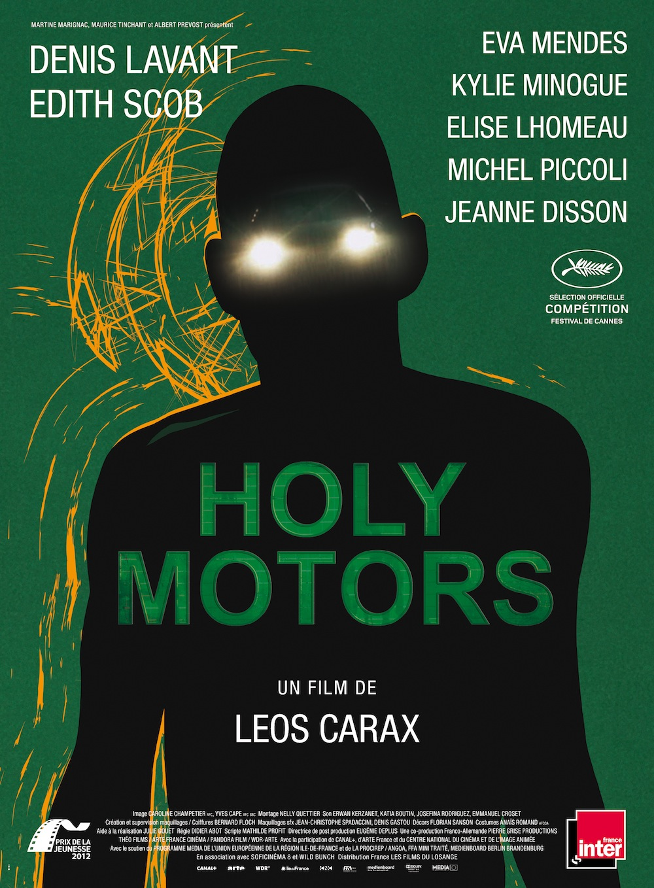
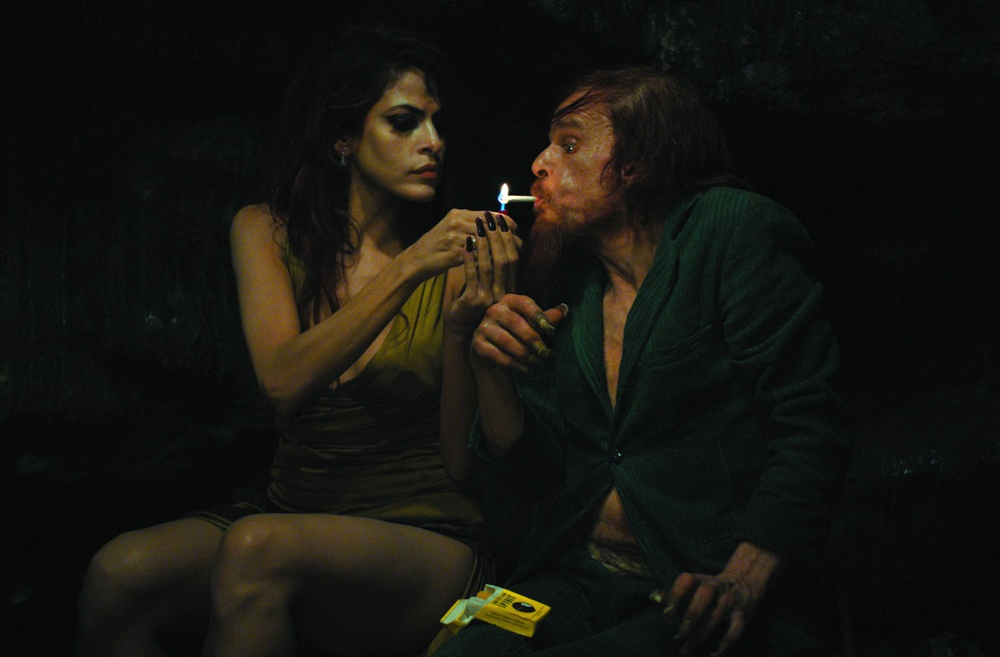
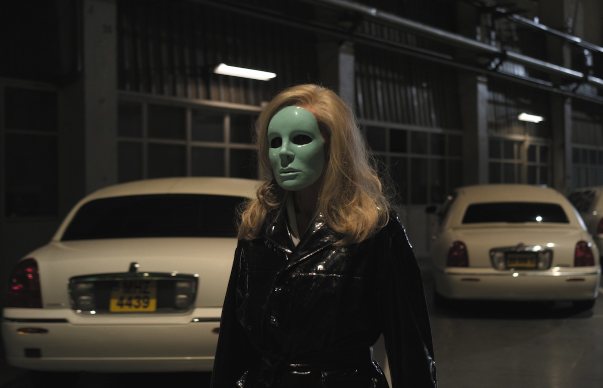

+++
type = "post"
titre = "Holy Motors, Leos Carax"
title = "Holy Motors, Leos Carax"
url = "/holy-motors-carax"
date = "2012-07-06T00:03:45"
Lastmod = "2012-11-30T10:46:39"
cover = "holy-motors-leos-carax.jpg"
categorie = [ "À voir" ]
tag = [ "Drame", "Expérience", "Metafilm", "Société", "Surréalisme" ]
createur = [ "Leos Carax" ]
acteur = [ "Denis Lavant", "Edith Scob", "Eva Mendes" ]
annee = [ "2012" ]
weight = 2012
pays = [ "France" ]

+++

Les limousines étaient manifestement à l&rsquo;honneur à Cannes, mais celles de Leos Carax n&rsquo;ont pas grand-chose à voir avec celles de <a title="Cosmopolis, David Cronenberg" href="/2012/06/02/cosmopolis-cronenberg/"><em>Cosmopolis</em></a>. Nonobstant l&rsquo;apparence extérieure, <em>Holy Motors</em> est en effet un film bien différent et même un film différent de tout ce que l&rsquo;on a pu voir par ailleurs. Véritable objet cinématographique non identifié, <em>Holy Motors</em> est une œuvre extrêmement libre, exigeante et incompréhensible. Un curieux mélange, une œuvre frustrante, une expérience de cinéma… Leos Carax ne laisse pas indifférent.

Dissipons d&rsquo;emblée un doute possible : résumer <em>Holy Motors</em> est vain. Le film de Leos Carax ne suit aucun fil narratif bien défini, même si l&rsquo;on suit la journée d&rsquo;Oscar, étrange personnage qui va de rendez-vous en rendez-vous dans une longue limousine américaine. Oscar est simplement accompagné de Céline, une grande dame d&rsquo;un certain âge qui lui sert autant de chauffeur que de secrétaire personnelle. <em>Holy Motors</em> commence étrangement de manière assez similaire au film de David Cronenberg : un homme d&rsquo;affaires immensément riche part travailler dans sa limousine, accompagné de quelques gardes du corps. Dans la voiture, il reçoit un appel : un collègue, avec qui il discute des difficultés actuelles et des dangers qui les guettent. Cette première piste est pourtant rapidement évacuée par le cinéaste, qui brouille un peu plus les cartes à chaque nouvel arrêt. Le personnage principal change de déguisement et il interprète un autre personnage radicalement différent à chaque fois. On comprend peu à peu qu&rsquo;il est embauché pour interpréter ces rôles, pour jouer des mises en scène complexes. Seule inconnue toutefois, on ne sait jamais pourquoi il fait cela, la question de la justification et du sens n&rsquo;est jamais posée par le film.

Leos Carax aime brouiller les pistes et embrouiller ses spectateurs, on le comprend vite. Quand le générique de fin s&rsquo;affiche à l&rsquo;écran, <em>Holy Motors</em> s&rsquo;apparente plus que jamais à une série de sketches qui semblent n&rsquo;avoir que bien peu de liens entre eux. Chaque arrêt, chaque mise en scène donne lieu à un épisode plus ou moins loufoque, plus ou moins censé. Le premier — une mendiante dans la rue — reste assez logique et rationnel, mais Oscar interprète aussi un fou furieux dans un cimetière parisien. Cette interprétation l&rsquo;entraîne quand même à manger des fleurs et des doigts, et à bander comme un cheval en rut auprès d&rsquo;Eva Mendes qui joue alors son propre rôle. Le spectateur décidé à expliquer rationnellement <em>Holy Motors</em> risque bien d&rsquo;être rapidement perdu, c&rsquo;est bien sûr totalement volontaire. Leos Carax s&rsquo;amuse avec nos attentes et il se permet tout, absolument tout. On n&rsquo;a pas l&rsquo;habitude de voir un film aussi libre, de voir un cinéaste capable d&rsquo;envisager une scène où des limousines parlent entre elles. <em>Holy Motors</em> semble nécessairement brouillon, il y a de tout et le meilleur côtoie aussi le pire, mais c&rsquo;est justement le principe même du film.

Mieux vaut en être conscient avant d&rsquo;entrer en salles : <em>Holy Motors</em> tient plus de l&rsquo;expérience artistique que du cinéma au sens strict. Par certains aspects, l&rsquo;œuvre rappelle les installations d&rsquo;art moderne que l&rsquo;on peut voir en musées et Leos Carax rappelle à cet égard les artistes surréalistes. Tout n&rsquo;est pas totalement jeté au hasard et incompréhensible toutefois et le spectateur suffisamment attentif et prêt à laisser passer les errements d&rsquo;Oscar peut trouver matière à nombreuses réflexions dans <em>Holy Motors</em>. Oscar est un acteur qui passe son temps à mettre en scène des situations imposées : le long-métrage a dès lors nécessairement des accents de metafilm. Le film en train de se construire est une métaphore du cinéma, une plongée dans la folie du créateur qui est aussi celle de l&rsquo;acteur. Leos Carax propose même une vision multiple du cinéma, avec des effets à l&rsquo;ancienne — les coups de couteau ou les balles — et d&rsquo;autres beaucoup plus modernes — une étonnante scène de copulation numérique entre deux bestioles fantastiques. Oscar passe son temps à jouer et à se mettre en scène, si bien qu&rsquo;il ne sait plus lui-même faire la différence entre le réel et son métier. Le spectateur n&rsquo;est pas le seul perdu dans <em>Holy Motors</em>, le personnage principal l&rsquo;est tout autant. Le film commence dans une maison qui semble être son vrai foyer, il se termine dans une autre maison qui pourrait tout aussi bien être son foyer. Certes, on suit une journée complète qu&rsquo;il est censé avoir terminé en fin de journée… mais qui nous dit que l&rsquo;ouverture comme la fermeture ne sont pas encore des rôles qu&rsquo;il joue sur commande ? A-t-il seulement une réalité sur laquelle se poser ? Ne comptez pas sur Leos Carax pour obtenir ne serait-ce qu&rsquo;un début de réponse…

Libre, <em>Holy Motors</em> l&rsquo;est aussi sur le plan formel. Dès les premières images qui nous font remonter aux origines du cinéma — des scènes prises en <a title="Chronophotographie - Wikipédia" href="http://fr.wikipedia.org/wiki/Chronophotographie"><em>chronophotographie</em></a> — le spectateur comprend qu&rsquo;il n&rsquo;a pas affaire à une œuvre traditionnelle. Le cinéaste ne respecte aucun code, il coupe ses scènes brutalement et sans logique, passe à la suivante directement. Les registres et ambiances changent eux aussi du tout au tout, avec quelques scènes poétiques, d&rsquo;autres au contraire très réalistes et crues. Dans l&rsquo;ensemble, <em>Holy Motors</em> est assez lent et sons scénario décousu ne facilite pas la concentration et incite au contraire à laisser son esprit vagabonder. C&rsquo;est sans doute l&rsquo;effet recherché par Leos Carax et c&rsquo;est alors une réussite ; mieux vaut en tout cas être en forme pour voir le film… La longue liste d&rsquo;acteurs sur l&rsquo;affiche est trompeuse, on voit surtout Denis Lavant à l&rsquo;écran. L&rsquo;acteur est toutefois impeccable et ses nombreuses métamorphoses constituent une très belle performance.

<em>Holy Motors</em> est décidément un film bien étrange. Leos Carax compose une œuvre libre et intransigeante qui ne fait rien pour le confort de ses spectateurs. L&rsquo;expérience est à la fois fascinante et frustrante : fascinante, parce que l&rsquo;on sent bien qu&rsquo;il se passe quelque chose d&rsquo;exceptionnel et frustrant, parce que l&rsquo;on ne comprend pas grand-chose et parce que le film donne souvent le sentiment d&rsquo;être volontairement snob et d&rsquo;en rajouter dans le n&rsquo;importe quoi. Au total, <em>Holy Motors</em> est un film intéressant qui mérite d&rsquo;être vu, mais en ayant bien conscience qu&rsquo;il offre une expérience de cinéma exigeante et non une séance sympa…

<h3>Vous voulez m&rsquo;aider ?<a href="#footnote_0_6991" id="identifier_0_6991" class="footnote-link footnote-identifier-link" title="&Agrave; propos de la publicit&eacute;&hellip;">1</a></h3>
<ul>
<li><a href="http://www.amazon.fr/gp/product/B008PPQR90/ref=as_li_ss_tl?ie=UTF8&tag=leblogdenic07-21&linkCode=as2&camp=1642&creative=19458&creativeASIN=B008PPQR90">Acheter le film en Blu-Ray sur Amazon</a></li>
<li><a href="http://www.amazon.fr/gp/product/B008PPQQZ0/ref=as_li_ss_tl?ie=UTF8&tag=leblogdenic07-21&linkCode=as2&camp=1642&creative=19458&creativeASIN=B008PPQQZ0">Acheter le film en DVD sur Amazon</a></li>
<li><a href="https://itunes.apple.com/fr/movie/holy-motors/id573363597">Acheter ou louer le film sur l&rsquo;iTunes Store</a></li>
</ul>

<ol class="footnotes"><li id="footnote_0_6991" class="footnote"><a href="/soutien/">À propos de la publicité…</a> [<a href="#identifier_0_6991" class="footnote-link footnote-back-link">&#8617;</a>]</li></ol>
