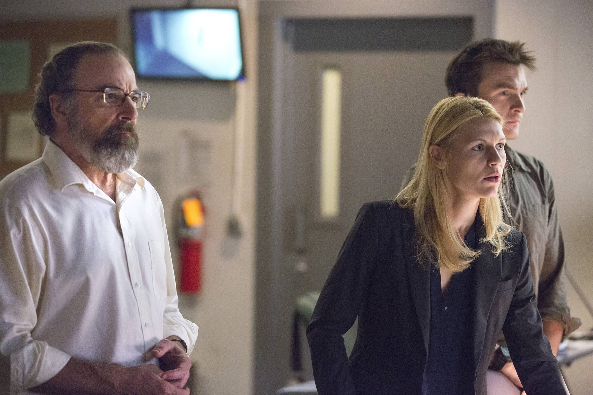
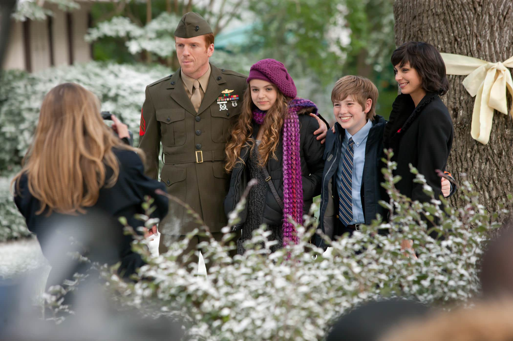
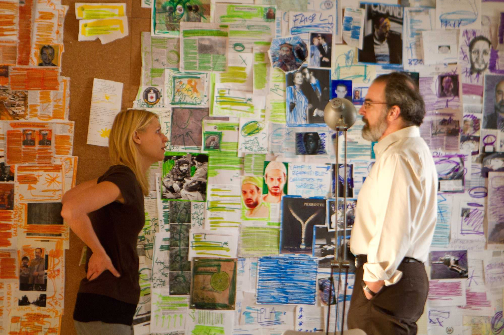

+++
titre = "<em>Homeland</em>, Howard Gordon, Alex Gansa et Gideon Raff (Showtime)"
title = "Homeland, Howard Gordon, Alex Gansa et Gideon Raff (Showtime)"
url = "/homeland-gordon-gansa-raff-showtime"
date = "2014-12-30T23:48:20"
Lastmod = "2014-12-31T08:38:30"
cover = "homeland-showtime.jpg"
categorie = [ "À voir" ]
tag = [ "Amour", "Drame", "Espionnage", "Famille", "Guerre", "Histoire", "Islam", "Religion", "Remake", "Série", "Société", "Terrorisme" ]
createur = [ "Alex Gansa", "Gideon Raff", "Howard Gordon", "Showtime" ]
acteur = [ "Claire Danes", "Damian Lewis", "David Harewood", "David Marciano", "Jamey Sheridan", "Mandy Patinkin", "Morena Baccarin", "Rupert Friend" ]
annee = [ "2011" ]
weight = 2011
pays = [ "États-Unis" ]

+++

D&rsquo;abord série israélienne, <em>Homeland</em> a été rapidement adaptée pour la télévision américaine et c&rsquo;est la série diffusée par Showtime qui s&rsquo;est rapidement fait connaître. Les trois créateurs de cette version n&rsquo;ont gardé de <em>Hatufim</em> qu&rsquo;une idée de base : celle du retour compliqué d&rsquo;un soldat, américain en l&rsquo;occurence, après plusieurs années de captivité. Une idée intéressante, alors que la guerre au Moyen-Orient n&rsquo;a jamais vraiment cessé depuis les attentats du 11 Septembre, mais une idée qui ne sert ici que de base. <em>Homeland</em> s&rsquo;en libère après deux saisons — la durée également de la série israélienne, ce n&rsquo;est probablement pas une coïncidence — et surtout cette déclinaison est d&rsquo;abord centrée sur la CIA. Espionnage international, lutte contre le terrorisme, conflit en interne et problèmes personnels : tous les ingrédients sont réunis pour faire une bonne série. De fait, malgré une troisième saison globalement ratée, Showtime a signé une excellente série, haletante et qui évite la majorité des clichés avec une vision réaliste sur des pays et situations très complexes.

Comme la version israélienne, <em>Homeland</em> commence avec la libération d&rsquo;un prisonnier de guerre. Après huit ans passés en captivité, le sergent Brody revient au pays comme un héros. Mais on s&rsquo;en doute, une aussi longue période passée dans des situations épouvantables et dans un milieu totalement étranger laisse des marques, au sens propre comme au figuré. Entre les cicatrices des tortures et les troubles post-traumatiques, Nicholas Brody porte les marques de ses années d&rsquo;emprisonnement et le retour est nécessairement difficile. La première saison de la série se consacre en grande partie à ce retour, d&rsquo;autant plus complexe que sa famille s&rsquo;était quelque peu détourné du soldat, laissé pour mort. Sa femme a été voir ailleurs, ses enfants qu&rsquo;il n&rsquo;a pas vu grandir ont trouvé un père de substitution ; bref, retrouver une place ne va pas être simple. C&rsquo;est le premier enjeu de la série, mais c&rsquo;est loin d&rsquo;être le seul et ce n&rsquo;est même pas le plus important. En effet, <em>Homeland</em>  ne se contente pas de ce retour au pays, fût-il difficile : dès le pilote, Howard Gordon, Alex Gansa et Gideon Raff introduisent le véritable personnage principal. Carrie Bradshaw est un agent de la CIA qui apprend lors d&rsquo;une mission au Moyen-Orient, qu&rsquo;un prisonnier américain a été retourné par l&rsquo;ennemi pour commettre un attentat contre les États-Unis. Quand elle apprend le retour de Brody, elle fait immédiatement le pont et pense que c&rsquo;est lui, le prisonnier retourné.

La bonne idée de la série, c&rsquo;est que Carrie est le seul personnage convaincu de la culpabilité du sergent Brody. Tous les autres personnages et même les spectateurs sont laissés dans le noir pendant un moment, si bien qu&rsquo;elle paraît complètement folle. Sa hiérarchie refuse d&rsquo;ailleurs de la croire et elle se met à espionner la famille de son côté, sans aucune autorisation de la CIA. L&rsquo;effet est réussi et <em>Homeland</em> se résume souvent à une opposition entre Carrie et le reste du monde, du moins pendant les deux premières saisons. Le personnage souffre en outre de problèmes psychologiques graves qui ont tendance à renforcer l&rsquo;hypothèse de la folie, mais on ne sait jamais vraiment et le scénario prend un soin tout particulier à ne pas dévoiler trop d&rsquo;informations trop rapidement. C&rsquo;est malin, car le suspense est souvent très élevé autour de cette simple question : Brody est-il un vrai héros ou un traitre ? Naturellement, <em>Homeland</em> commence sur des bases simples, mais la situation se complique rapidement, avec des ramifications politiques qui viennent vite troubler la situation. Résultat, on ne s&rsquo;ennuie jamais pendant les deux premières saisons et la série peut même se targuer d&rsquo;avoir quelques « <em>cliff-hangers</em> » d&rsquo;une intensité rare, et un premier épisode à couper le souffle dans la première saison. On avait rarement atteint de tels niveaux de suspense et certaines scènes sont extrêmement bien réalisées, mais il faut aussi saluer le travail des acteurs, tous excellents. Damian Lewis compose ainsi un Nicholas Brody convaincant, toujours dans le doute, mais on retiendra surtout le travail de Claire Danes, épatante en Carrie. Son entêtement et sa folie sont toujours parfaitement crédibles et la réussite de la série lui doit beaucoup.

Après deux saisons d&rsquo;un haut niveau, l&rsquo;intrigue autour du retour au pays de Brody était terminée et les créateurs de <em>Homeland</em> n&rsquo;ont, manifestement, pas su trop quoi faire. Le succès étant au rendez-vous, la troisième saison a été diffusée un an après la précédente, mais ce n&rsquo;était pas forcément la meilleure idée. Toute cette saison est largement inférieure au reste de la série, probablement parce que Howard Gordon, Alex Gansa et Gideon Raff ne savaient pas ce qu&rsquo;ils devaient faire. Ils ont cherché à concilier les deux premières saisons en les relançant sur de nouvelles bases, mais cela ne fonctionne pas du tout. Le résultat est un assemblage hasardeux d&rsquo;histoires qui n&rsquo;ont pas grand-chose en commun et que l&rsquo;on oublie d&rsquo;un épisode à l&rsquo;autre. Le sort de la famille Brody est, à cet égard, intéressant : alors qu&rsquo;elle occupe une part importante des premiers épisodes, elle disparaît sans autre forme de cérémonie au milieu de la saison et on n&rsquo;en entend plus jamais parler. Cette inconstance et ce manque de cohérence, qui faisait pourtant la force de <em>Homeland</em>, est vraiment gênante, mais la quatrième saison justifie l&rsquo;effort pour regarder la troisième. Débarrassée du poids des débuts, cette saison est en effet d&rsquo;un bien meilleur niveau et on retrouve ce suspense d&rsquo;une intensité record dans quelques épisodes, surtout vers la fin. Par certains aspects, cette saison est encore meilleure que les deux premières et elle justifie à elle seule de regarder la série.

<em>Homeland</em> souffre de ce creux de la troisième saison, mais ce n&rsquo;est en aucun cas une raison suffisante pour bouder la série. Certes, les scénaristes ont raté le passage d&rsquo;une histoire à l&rsquo;autre, mais la quatrième saison la relance sur d&rsquo;excellentes bases et on peut espérer que la suite confirme ce regain d&rsquo;intérêt. Et puis les deux premières saisons, qui fonctionnent vraiment main dans la main, sont sans conteste excellentes et elles justifient, avec la quatrième saison, de voir l&rsquo;ensemble. Les personnages créés par Howard Gordon, Alex Gansa et Gideon Raff sont crédibles et attachants — on doit au moins évoquer Saul Berenson, mentor de Carrie interprété par l&rsquo;excellent Mandy Patinkin —, tandis que l&rsquo;envers du décors de la CIA et ses intrigues de couloir est un cadre parfait pour que la série se développe. <em>Homeland</em> est l&rsquo;anti-<em>24 heures chrono</em> et sa vision plus contrastée de la lutte contre le terrorisme est la bienvenue. Malgré ses défauts, cette série de Showtime reste une réussite, à voir !

<h3>Vous voulez <a href="http://voiretmanger.fr/soutien/">m&rsquo;aider</a> ?</h3>
<ul>
<li><a href="http://www.amazon.fr/s/?_encoding=UTF8&amp;camp=1642&amp;creative=19458&amp;fst=as%3Aoff&amp;keywords=homeland&amp;linkCode=ur2&amp;qid=1419979352&amp;rh=n%3A405322%2Cn%3A409468%2Ck%3Ahomeland&amp;rnid=409392&amp;tag=leblogdenic07-21&amp;linkId=LPAMR7B4ONCGAYJI">Acheter la série en Blu-Ray ou DVD sur Amazon</a></li>
<li><a href="https://itunes.apple.com/fr/tv-season/homeland-saison-1-vost/id554242550">Acheter ou louer la série sur l&rsquo;iTunes Store</a></li>
<li><a href="http://www.netflix.com/WiMovie/70180387">Regarder la série sur Netflix</a></li>
</ul>

