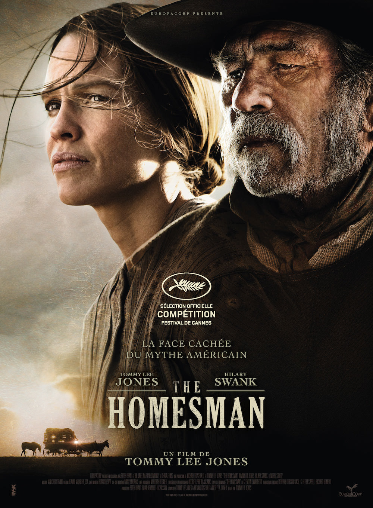
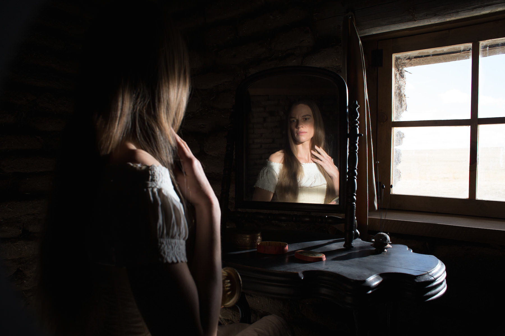
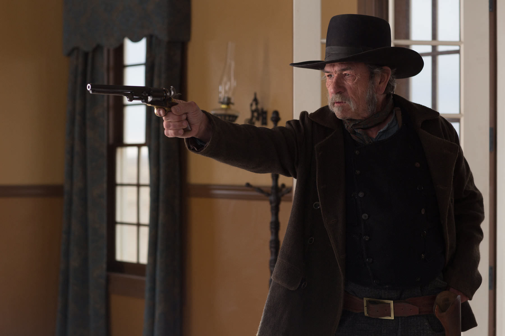

+++
type = "post"
titre = "<em>The Homesman</em>, Tommy Lee Jones"
title = "The Homesman, Tommy Lee Jones"
url = "/homesman-lee-jones"
date = "2014-05-18T17:15:30"
Lastmod = "2014-05-18T17:26:03"
cover = "homesman-tommy-lee-jones.jpg"
categorie = [ "À voir" ]
tag = [ "Adaptation littéraire", "Drame", "Féminisme", "Folie", "Histoire", "Religion", "Sorties du mois", "Western" ]
createur = [ "Tommy Lee Jones" ]
acteur = [ "Grace Gummer", "Hilary Swank", "John Lithgow", "Miranda Otto", "Sonja Richter", "Tommy Lee Jones", "William Fichtner" ]
annee = [ "2014" ]
weight = 2014
pays = [ "États-Unis" ]

+++

Tommy Lee Jones est surtout connu pour ses talents d’acteur, mais cet éternel bourru commence aussi à se faire une belle place derrière les caméras. Neuf ans après l’excellent <em>Trois Enterrements</em>, sa première réalisation au cinéma, il est de retour avec un nouveau film encore plus ambitieux. <em>The Homesman</em> présente, si l’on en croit son affiche du moins, « <em>La face cachée du mythe américain</em> ». Derrière la formule marketing, un western à la fois très classique par la forme, et moderne par sa vision très noire d’une époque extrêmement rude, surtout pour les femmes. Porté par des acteurs exceptionnels, <em>The Homesman</em> est un long-métrage qui parvient à surprendre pendant deux heures, à suivre une piste parsemée d’embuches et à naviguer entre plusieurs genres. Un western à ne surtout pas rater !

Dès le générique d’ouverture, c’est le soin porté à l’image qui frappe. Le genre même du western est associé aux grandes plaines de l’Ouest américain, un espace vide à perte de vue que <em>The Homesman</em> embrasse avec ces cadres fixes sur des paysages complètement vides. Tommy Lee Jones aime le genre et cela se voit : dès cette introduction, on sent qu’il a envie de faire un western, un vrai. Sur le style, le réalisateur ne se risque pas aux expérimentations les plus folles, mais compte plutôt sur un classicisme parfaitement maîtrisé. Sublimés par une photographie souvent magnifique, les plans sont composés avec soin et ils font la part belle aux lignes droites ou à la symétrie. La bande originale composée par Marco Beltrami accompagne à merveille ces images, pour un rendu presque poétique qui n’est pas sans rappeler certains westerns classiques ou, plus récemment, le style de l’excellent <a href="/assassinat-jesse-james-lache-robert-ford-dominik/" title="L’Assassinat de Jesse James par le lâche Robert Ford, Andrew Dominik"><em>L’Assassinat de Jesse James par le lâche Robert Ford</em></a> qui avait déjà cette attention pour les plus grands espaces. Plus tard, c’est à Terrence Malick et <a href="/moissons-ciel-malick/" title="Les moissons du ciel, Terrence Malick"><em>Les moissons du ciel</em></a> qui vient en tête, le temps d’une scène notamment dans la nuit éclairée par un grand feu. Le cinéaste sait filmer un western et il sait aussi convoquer tous les passages obligés du genre. Après un générique vide, <em>The Homesman</em> commence ainsi par le quotidien d’une femme seule, quelque part dans les territoires du Nebraska, sans doute au milieu du XIXe siècle — aucune date n’est donnée toutefois. Dans cet univers impitoyable, Mary Bee Cudy dirige sa ferme d’une main de maître. Cette femme d’une trentaine d’années n’a pas trouvé de mari malgré tous ses efforts, mais elle sait assurément entretenir un ranch et vivre correctement. Malicieux, le titre du nouveau long-métrage de Tommy Lee Jones laisse entendre que le personnage principal sera un homme, alors qu’il s’agit en fait d’une femme. Et quelle femme : Hilary Swank offre à ce personnage toute la complexité nécessaire, entre détresse de la solitude et courage presque rude pour survivre dans cet environnement hostile. Avec ce personnage, déjà, le film marque ses distances face au genre en imposant une vision féministe qui n&rsquo;était pas le propre du genre, et ce n’est que le début.

De fait, si <em>The Homesman</em> commence comme un western traditionnel, s’il contient quelques éléments d’intrigue liés au genre, le film de Tommy Lee Jones marque vite sa différence. D’ailleurs, c’est même une de ses caractéristiques principales de surprendre continuellement les spectateurs avec des éléments inattendus. Difficile d’en parler précisément sans trop en dire, mais on peut se contenter de constater que le long-métrage ne va jamais là où on l’attend. On commence avec l’histoire d’une femme qui ne trouve pas de maris, mais son départ vers l’Est pour accompagner trois femmes tombées dans la folie modifie le scénario et transforme le film en une sorte de <em>road-movie</em>. Par la suite encore, d’autres pistes vont s’avérer tout aussi fausses, si bien que l’on ne sait jamais vraiment à quoi s’en tenir. Ce n’est absolument pas un processus gratuit toutefois : le scénario avance avec détermination et tout est logique, y compris la plus grosse surprise que l’on ne saurait révéler, mais qui offre un éclairage différent sur l’ensemble. <em>The Homesman</em> raconte bien l’histoire d’une femme qui doit traverser le pays pour accompagner d’autres femmes tombées dans la folie et qui se fait aider pour cela par Georges Briggs, un voyou sauvé <em>in extremis</em> de la pendaison. Cette histoire ne respecte pas les canons du genre en plaçant la femme au centre : traditionnellement, les femmes n’ont pas une place très enviable dans le western, elles sont le plus souvent là pour faire joli. Ici, elles occupent le premier rôle et même si l’homme du titre est peut-être ce Georges, le cow-boy solitaire qui a tant fait fantasmer n’est pas le vrai personnage principal. Au fond, ce sont les femmes et peut-être même les trois qui sont tombées dans la folie, qui constituent le sujet principal du film et qui constituent son côté féministe. Une folie assez violente — l’avertissement sur le long-métrage n’est pas superflu — qui témoigne bien de la souffrance de ces femmes venues de très loin, de l’autre bout du monde même pour certaines. Elles sont déracinées et doivent affronter un univers extrêmement difficile et des maris bien peu compréhensifs, quand ils ne sont pas violents. À certains égards, c’est bien ce pays extrêmement difficile qui est le personnage principal de <em>The Homesman</em> : tout le monde semble tomber dans la folie ou le désespoir simplement en y passant du temps. Un sujet indéniablement inattendu pour un western…

Des deux côtés de la caméra, Tommy Lee Jones excelle autant en temps qu’acteur que réalisateur. Côté face, il compose un escroc très convaincant et se risque dans des registres qu’on ne lui connaissait pas, avec des phases d’humour qui tranchent avec un long-métrage dans l’ensemble très sombre. Côté pile, il magnifie ses immenses espaces vides, compose des cadres rigoureux et souvent splendides et dirige à la perfection tous ses acteurs. <em>The Homesman</em> est un film étonnant qui commence comme un western traditionnel, mais qui s’avère en fait beaucoup plus inattendu. Une bien belle surprise, immanquable…

