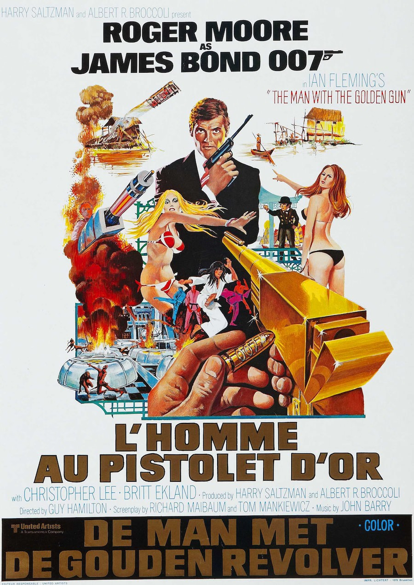
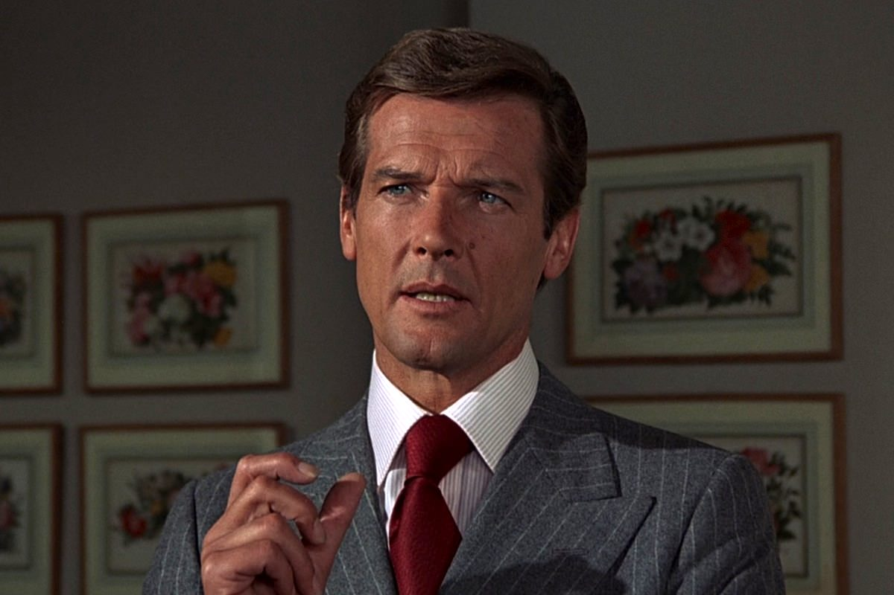

+++
type = "post"
titre = "L&rsquo;homme au pistolet d&rsquo;or, Guy Hamilton"
title = "L'homme au pistolet d'or, Guy Hamilton"
url = "/homme-pistolet-or-hamilton"
date = "2013-02-17T10:13:17"
Lastmod = "2013-05-11T10:00:39"
cover = "homme-au-pistolet-or-christopher-lee.jpg"
categorie = [ "À voir" ]
tag = [ "Blockbuster", "Espionnage", "James Bond", "Vite oublié" ]
createur = [ "Guy Hamilton" ]
acteur = [ "Britt Ekland", "Christopher Lee", "Herve Villechaize", "Roger Moore" ]
annee = [ "1974" ]
weight = 1974
saga = [ "James Bond" ]
original = "The Man with the Golden Gun"

+++

Le retour de James Bond sous les traits de Roger Moore a plu au public au-delà des espérances des producteurs. <a href="http://voiretmanger.fr/2013/02/10/vivre-e-laisser-mourir-hamilton/" title="Vivre et laisser mourir, Guy Hamilton - À voir et à manger"><em>Vivre et laisser mourir</em></a> a connu un gros succès et les producteurs décident de le doubler en faisant revenir le plus rapidement possible L’agent 007 sur les écrans. <em>L’homme au pistolet d’or</em> sort ainsi un an tout juste après son prédécesseur et le neuvième épisode de la saga joue la carte de la sécurité. Guy Hamilton est à nouveau appelé à la réalisation — c’est son quatrième <em>James Bond</em> — et le long-métrage tente à nouveau de faire dans la sobriété. Inutile de compter sur des gadgets ou sur la conquête spatiale, cet épisode se concentre sur l’opposition entre l’agent secret et son ennemi. Bonne idée sur le papier, mais qui ne suit pas vraiment à l’écran. <em>L’homme au pistolet d’or</em> est un épisode qui peine à trouver son ton, son rythme et qui, au total, peine à passionner…

<em>L’homme au pistolet d’or</em> fait tout pour ressembler au mieux à son prédécesseur. L’équipe n’a pas changé, mais la formule non plus et cet épisode ne s’inscrit ainsi directement dans L’actualité. Après les États-Unis et les ghettos noirs, place à la crise pétrolière et aux problèmes énergétiques. Quand le film commence, James Bond mène L’enquête sur un objet capable de résoudre tous les problèmes de ressources, mais cette enquête est interrompue par M quand il reçoit des menaces de mort à L’encontre de son agent secret. Une balle en or, les chiffres « 007 » gravés dessus et une lettre qui menace très explicitement L’agent. Le patron du MI6 préfère éviter de perdre son agent et ainsi de compromettre la mission, mais il accepte que James Bond se mette à la recherche de celui qui veut sa mort : Scaramanga. Le spectateur a déjà eu L’occasion de le rencontrer dans le pré-générique, qui lui est entièrement dévolu. Ce méchant est repoussant avec ses trois tétons, il est aussi et surtout un vil personnage qui tue par pur plaisir et entend justement tuer James Bond, mais pas froidement dans le dos : il veut l’attirer dans son île pour le tuer au cours d’un duel, face à face. C’est la première fois dans la saga que L’agent secret affronte son méchant dans un combat aussi personnel. Le SPECTRE n’est plus qu’un lointain souvenir, cette fois quelqu’un en veut personnellement à James Bond et l’agent ne va pas L’accepter avec le sourire. Au contraire de <em>Vivre et laisser mourir</em>, Roger Moore compose un agent beaucoup plus sérieux et dangereux. Pour obtenir des informations, il n’hésite pas à faire mal à une femme, tandis que son humour britannique a été largement effacé. De fait, <em>L’homme au pistolet d’or</em> est un épisode beaucoup plus sérieux, trop peut-être dans une saga qui avait comme atout la dérision de son agent. Le problème tient sans doute dans l’inadéquation entre ce personnage et son acteur : Roger Moore n’est pas Daniel Craig et ce sérieux ne lui convient pas vraiment. En face, Christopher Lee compose en revanche un Scaramanga assez réussi. 

Après la blaxploitation dans <em>Vivre et laisser mourir</em>, place aux films d’arts martiaux : telle semble être l’idée de ce nouvel épisode. <em>L’homme au pistolet d’or</em> se déroule essentiellement en Asie et les arts martiaux sont assez présents dans la première partie du long-métrage. Guy Hamilton n’est pas un cinéaste habitué au genre et autant il s’était plutôt bien débrouillé avec les rues sales de Harlem, autant les villes asiatiques lui parlent moins. Bizarrement, l’épisode change totalement d’orientation dans sa deuxième partie : quand L’agent secret arrive sur l’île de Scaramanga, on retrouve plutôt l’esprit de <a href="http://voiretmanger.fr/2012/12/23/james-bond-007-contre-dr-no-young/" title="James Bond 007 contre Dr. No, Terence Young - À voir et à manger"><em>James Bond 007 contre Dr. No</em></a>. L’ensemble est assez déséquilibré et <em>L’homme au pistolet d’or</em> ne semble pas savoir où aller, d’autant que son sérieux et son minimalisme ne fonctionnent plus vraiment. Ce long-métrage est assez lent et plutôt vide, même s’il contient quelques séquences réussies. On apprécie le QG du MI6 dans la carcasse du Queen Mary et la cascade de la voiture qui se vrille est très impressionnante, bien que toute la scène soit un peu gâchée par le retour du personnage grotesque du shérif de l’épisode précédent. Cette présence à elle seule résume bien le problème de ce film : à trop vouloir s’inscrire dans la continuité de <em>Vivre et laisser mourir</em>, ce neuvième épisode perd toute son originalité et sa force. Est-ce aussi de la lassitude de la part de Guy Hamilton ? Toujours est-il que ce film marque L’épuisement de la formule et ce n’est pas pour rien que la saga marque après lui une pause de plusieurs années ; les problèmes du côté des producteurs n’y sont pas étrangers bien sûr. Même la musique, pourtant composée par John Barry, n’est pas bonne dans <em>L’homme au pistolet d’or</em> : trop convenue, elle ressemble presque à une caricature sans idée des thèmes musicaux de <em>James Bond</em>…

Un peu à la manière d’<a href="http://voiretmanger.fr/2013/01/20/on-ne-vit-que-deux-fois-gilbert/" title="On ne vit que deux fois, Lewis Gilbert - À voir et à manger"><em>On ne vit que deux fois</em></a>, ce neuvième épisode signe la fin d’une époque avec un film qui s’essouffle vite. Les producteurs ont trop parié sur la reprise de ce qui avait fonctionné avant, mais cela ne fonctionne plus du tout et <em>L’homme au pistolet d’or</em> est un film bien vite oublié. C’est la dernière fois que Guy Hamilton réalise un <em>James Bond</em> et pour cause : la saga doit repartir sur de meilleures bases, ou disparaître.

<strong>James Bond reviendra dans… <a href="http://voiretmanger.fr/2013/02/24/espion-aimait-gilbert/" title="L’espion qui m’aimait, Lewis Gilbert"><em>L&rsquo;espion qui m&rsquo;aimait</em></a></strong>

<h3>Vous voulez m’aider ?<a href="#footnote_0_8483" id="identifier_0_8483" class="footnote-link footnote-identifier-link" title="&Agrave; propos de la publicit&eacute;&hellip;">1</a></h3>
<ul>
<li><a href="http://www.amazon.fr/gp/product/B002DQKKN6/ref=as_li_ss_tl?ie=UTF8&#038;tag=leblogdenic07-21&#038;linkCode=as2&#038;camp=1642&#038;creative=19458&#038;creativeASIN=B002DQKKN6">Acheter le film en Blu-Ray sur Amazon</a></li>
<li><a href="http://www.amazon.fr/gp/product/B000NJM5TC/ref=as_li_ss_tl?ie=UTF8&#038;tag=leblogdenic07-21&#038;linkCode=as2&#038;camp=1642&#038;creative=19458&#038;creativeASIN=B000NJM5TC">Acheter le film en DVD sur Amazon</a></li>
<li><a href="https://itunes.apple.com/fr/movie/lhomme-au-pistolet-dor-man/id561912394">Acheter ou louer le film sur L’iTunes Store</a></li>
</ul>
<ul>
<li><a href="http://www.amazon.fr/gp/product/B008U6R9B4/ref=as_li_ss_tl?ie=UTF8&amp;tag=leblogdenic07-21&amp;linkCode=as2&amp;camp=1642&amp;creative=19458&amp;creativeASIN=B008U6R9B4">Acheter la trilogie complète en Blu-Ray sur Amazon</a></li>
<li><a href="http://www.amazon.fr/gp/product/B008U6R93C/ref=as_li_ss_tl?ie=UTF8&amp;tag=leblogdenic07-21&amp;linkCode=as2&amp;camp=1642&amp;creative=19458&amp;creativeASIN=B008U6R93C">Acheter la trilogie complète en DVD sur Amazon</a></li>
</ul>

<ol class="footnotes"><li id="footnote_0_8483" class="footnote"><a href="http://voiretmanger.fr/soutien/">À propos de la publicité…</a> [<a href="#identifier_0_8483" class="footnote-link footnote-back-link">&#8617;</a>]</li></ol>
