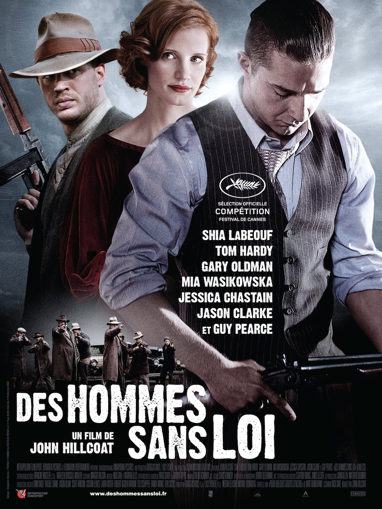
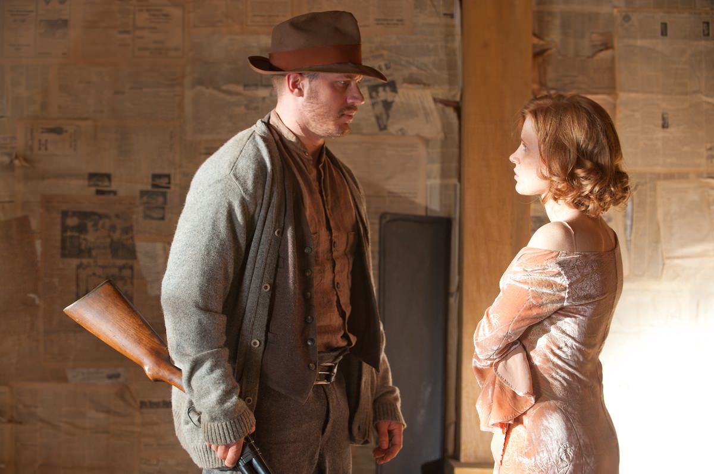

+++
titre = "<em>Des hommes sans loi</em>, John Hillcoat"
title = "Des hommes sans loi, John Hillcoat"
url = "/hommes-sans-loi-hillcoat"
date = "2012-10-16T23:54:18"
Lastmod = "2015-01-03T22:43:14"
cover = "hommes-sans-loi-hillcoat.jpg"
categorie = [ "À voir" ]
tag = [ "Drame", "Famille", "Film de gangsters", "Histoire", "Mafia", "Société", "Violence", "Vite oublié" ]
createur = [ "John Hillcoat" ]
acteur = [ "Dane DeHaan", "Gary Oldman", "Guy Pearce", "Jason Clarke", "Jessica Chastain", "Mia Wasikowska", "Shia LaBeouf", "Tom Hardy" ]
annee = [ "2012" ]
weight = 2012
pays = [ "États-Unis" ]
original = "Lawless"

+++

Après le western dans <em>The Proposition</em>, après le road-trip apocalyptique de <a title="La Route, John Hillcoat" href="http://voiretmanger.fr/2009/12/05/la-route-hillcoat/"><em>La Route</em></a>, John Hillcoat poursuit sa carrière avec encore un autre genre. <em>Des hommes sans loi</em>, traduction littérale bien peu inspirée de <em>Lawless</em>, est un film de gangsters dans la plus grande tradition du genre. Tout y est, de la période de la Prohibition aux personnages — le clan de gangsters contre le policier sadique — et le film respecte bien les canons du genre… un peu trop peut-être. Si <em>Des hommes sans loi</em> est très efficace et se regarde avec plaisir, il déçoit un peu par son manque d&rsquo;originalité et son histoire très conventionnelle, fut-elle vraie.

États-Unis, début des années 1930. La <a href="http://fr.wikipedia.org/wiki/Prohibition">Prohibition</a> est en place depuis plus de dix ans, mais le pays n&rsquo;a jamais autant produit et consommé autant d&rsquo;alcool. S&rsquo;il est officiellement interdit et combattu par les gouvernements successifs, l&rsquo;État est encore beaucoup trop faible et désorganisé pour imposer sa loi sur cet immense territoire occupé d&rsquo;hommes qui entendent bien faire leur propre loi. Le comté de Franklin, dans l&rsquo;État de Virginie, est alors célèbre pour son importante production d&rsquo;alcool de contrebande : les distilleries clandestines sont nombreuses et elles approvisionnent abondamment les villes alentour, en premier lieu Chicago. Loin d&rsquo;agir, la police participe au réseau et se sert au passage, tout le monde y trouve son compte. Jusqu&rsquo;au jour où l&rsquo;agent spécial Charlie Rakes débarque dans la région. Venu de Chicago, il entend bien non pas mettre un terme à la production illégale d&rsquo;alcool, mais forcer tous les producteurs à payer son patron, magistrat en charge de l&rsquo;État. Tous les petits gangsters rentrent rapidement dans le rang, mais pas la famille Bondurant. Ces hommes sans loi se disent invincibles et ils refusent de céder face à ce pouvoir corrompu. Une guerre sans merci commence alors entre les trois frères Bondurant et Charlie Rakes…

Le cadre historique de John Hillcoat n&rsquo;est pas étranger au septième art, la Prohibition a même inspiré des dizaines et des dizaines de films. Pour cette nouvelle variation, le cinéaste a choisi l&rsquo;histoire vraie de trois frères qui ont tenu tête pendant plusieurs années à la police corrompue qui voulait une part du gâteau. <em>Des hommes sans loi</em> se concentre sur le conflit entre les gangsters et l&rsquo;agent spécial Charlie Rakes, mais le film se termine en même temps que la Prohibition : les hors-la-loi reviennent alors dans le droit chemin de la légalité pour former une famille sans grand intérêt. Ce qui intéresse John Hillcoat, c&rsquo;est bien sûr la période où ils étaient dans l&rsquo;illégalité. Le cinéaste parvient à plonger ses spectateurs dans une autre époque, la reconstitution est de qualité et les personnages sont convaincants. L&rsquo;histoire est quant à elle très conventionnelle, on est immédiatement en terrain connu : <em>Des hommes sans loi</em> repose ainsi sur une structure en pointe, avec dans un premier temps une progression positive de la situation pour les Bondurant, jusqu&rsquo;à l&rsquo;apogée et inévitablement la chute. Il serait néanmoins injuste de restreindre le film à cette seule structure binaire. Le scénario écrit par Nick Cave laisse transparaître un sentiment d&rsquo;oppression de la part du personnage de Charlie Rakes qui ne perd jamais vraiment la main sur la situation. La fin s&rsquo;avère par ailleurs moins tragique qu&rsquo;escomptée, si bien que le film joue un peu sur nos attentes, trop peu pour surprendre réellement.

Au-delà de l&rsquo;intrigue générale, <em>Des hommes sans loi</em> est un film de personnages qui oppose trois hommes. Du côté de l&rsquo;oppression, on trouve sans surprise Charlie Rakes, un flic présenté comme un être dédaigneux, hautain et sadique, mais aussi à la sexualité trouble. Côté positif, la famille Bondurant et ses trois frères, dont deux qui comptent plus : il y a d&rsquo;abord Forrest, le grand frère qui fait chef de famille autant que de clan. Solide comme un roc, il est tour à tour sage et capable de la violence la plus extrême ; c&rsquo;est un personnage respecté dans la communauté, mais aussi craint autant par la police locale que par tous ses concurrents sur le segment de l&rsquo;alcool interdit. Jack, le cadet, est bien différent : ce jeune homme fougueux a des rêves plein les yeux, il voudrait étendre la petite affaire familiale, la faire sortir des frontières et gagner beaucoup plus d&rsquo;argent. John Hillcoat dresse deux portraits opposés en tout, y compris en amour, avec pour chacun une conquête obtenue bien différemment : Forrest avec douceur et patience, pendant que son jeune frère tente avec insistance et avec de beaux costumes et de belles voitures de convaincre une jolie fille d&rsquo;abandonner père et religion. C&rsquo;est peut-être ces portraits de personnage qui intéressent finalement le plus dans <em>Des hommes sans loi</em> : moins convenus que l&rsquo;intrigue générale, même s&rsquo;ils sont rattachés à des genres de personnages, ils maintiennent l&rsquo;intérêt d&rsquo;un bout à l&rsquo;autre des deux heures que compte le long-métrage.

John Hillcoat a impressionné avec un premier film vraiment très réussi, <em>La Route</em> était déjà plus convenu, même si sa vision du monde post-apocalyptique inventé par Cormac McCarthy était très réussie. <em>Des hommes sans loi</em> est très soigné, peut-être un peu trop. Le cinéaste s&rsquo;applique à filmer l&rsquo;Amérique des années 1930 et certains plans sont très réussis, avec plusieurs scènes où la violence surgit de manière très brutale. Le film tend parfois vers le genre du western et offre au total une relecture efficace des films de gangsters qui le précédent. Le troisième long-métrage de John Hillcoat tient d&rsquo;abord, il faut le reconnaître, sur ses personnages et donc ses acteurs. Ils sont tous très bien, de Shia LaBeouf qui trouve ici (enfin ?) un rôle principal riche et intéressant au très bon Guy Pearce qui accompagne d&rsquo;ailleurs le réalisateur depuis son premier film et qui compose ici un agent spécial sadique et emprunté à souhait. Jessica Chastain ne se défend pas non plus trop mal, mais la vedette ici est volée à tous les autres acteurs par Tom Hardy. Ce dernier reprend sa voix grave et un peu métallique qui faisait tout le sel du personnage de Bane qu&rsquo;il incarnait si bien dans <a title="The Dark Knight Rises, Christopher Nolan" href="http://voiretmanger.fr/2012/07/25/dark-knight-rises-nolan/"><em>The Dark Knight Rises</em></a> — c&rsquo;en est même parfois troublant tant c&rsquo;est proche — et il lui suffit d&rsquo;un léger grognement pour s&rsquo;imposer à l&rsquo;écran. John Hillcoat a de nouveau confié au duo Nick Cave et Warren Ellis la lourde tâche de composer une bande originale et <em>Des hommes sans loi</em> bénéficie, une nouvelle fois, du travail des deux excellents musiciens. On ne retrouve pas la fulgurante et la beauté de la musique composée pour <a title="L’Assassinat de Jesse James par le lâche Robert Ford, Andrew Dominik" href="http://voiretmanger.fr/2012/06/30/assassinat-jesse-james-lache-robert-ford-dominik/"><em>L’Assassinat de Jesse James par le lâche Robert Ford</em></a>, mais le résultat est dans le ton et efficace, tout simplement.

Si vous aimez les films de gangsters et les années 1930 aux États-Unis, vous n&rsquo;avez aucune raison de ne pas voir <em>Des hommes sans loi</em>. Le dernier film de John Hillcoat ne brille pas par son originalité, certes, mais il est très efficace et se regarde avec plaisir. On n&rsquo;apprendra rien de spécial si on a déjà vu d&rsquo;autres films sur la période, mais qu&rsquo;importe, on passe un bon moment et ce n&rsquo;est pas si mal…

<h3>Vous voulez m&rsquo;aider ?</h3>
<ul>
<li><a href="http://www.amazon.fr/gp/product/B00A0PJQPK/ref=as_li_ss_tl?ie=UTF8&#038;tag=leblogdenic07-21&#038;linkCode=as2&#038;camp=1642&#038;creative=19458&#038;creativeASIN=B00A0PJQPK">Acheter le film en Blu-Ray sur Amazon</a></li>
<li><a href="http://www.amazon.fr/gp/product/B00A0PJO5M/ref=as_li_ss_tl?ie=UTF8&#038;tag=leblogdenic07-21&#038;linkCode=as2&#038;camp=1642&#038;creative=19458&#038;creativeASIN=B00A0PJO5M">Acheter le film en DVD sur Amazon</a></li>
<li><a href="https://itunes.apple.com/fr/movie/des-hommes-sans-loi-vost/id590377177?l=en">Acheter ou louer le film sur l&rsquo;iTunes Store</a></li>
</ul>

