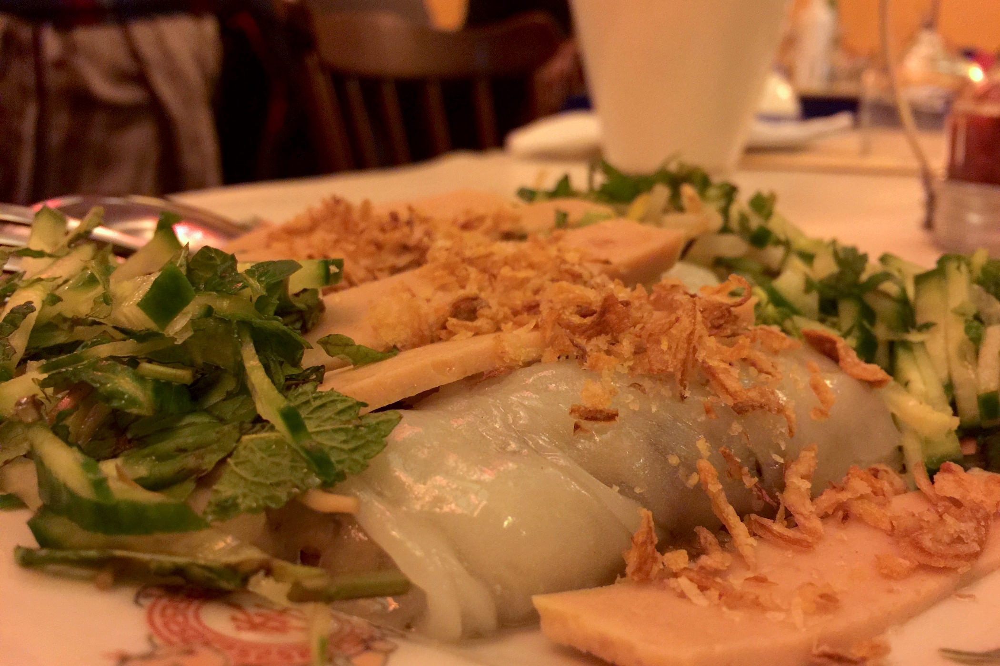
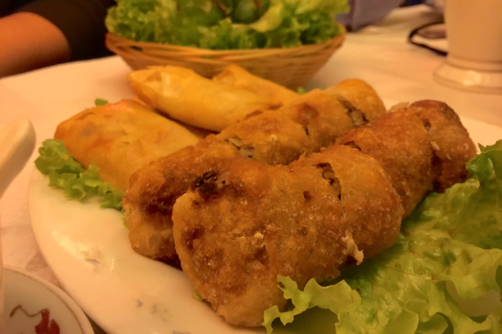
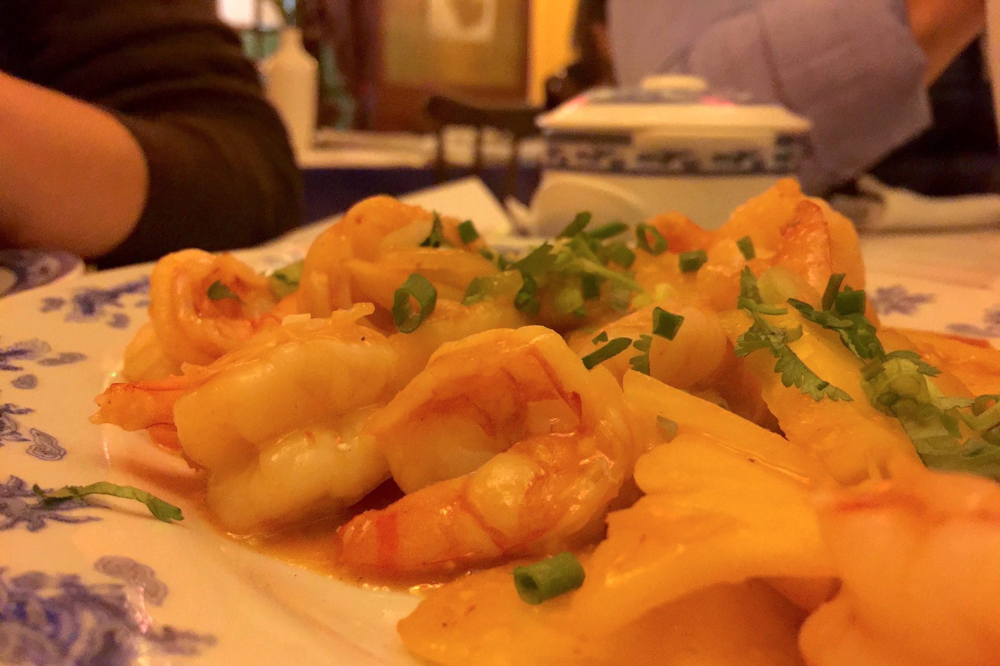
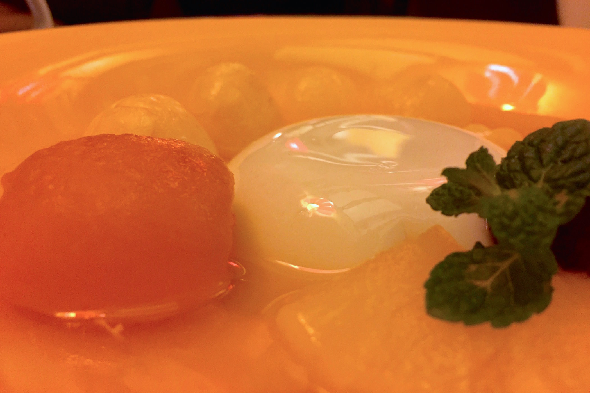

+++
type = "post"
titre = "Le Hong Ha à Lyon"
title = "Le Hong Ha à Lyon"
url = "/hong-ha-lyon"
date = "2014-11-29T23:07:50"
Lastmod = "2014-12-06T16:46:44"
cover = "hong-ha-lyon.jpg"
categorie = [ "À manger" ]
tag = [ "Cuisine", "Cuisine vietnamienne" ]

+++

Au cœur du quartier de Saint-Jean, dans l&rsquo;une des mythiques ruelles pavées du Vieux Lyon, on ne trouve pas que des bouchons lyonnais. Même si c&rsquo;est <em>le</em> quartier par excellence pour les bouchons et même si les touristes se pressent par centaines pour venir y manger l&rsquo;une des spécialité gastronomique de la ville, il y a aussi d&rsquo;autres restaurants. En témoigne le <a href="http://www.restaurant-hong-ha.fr"><strong>Hong Ha</strong></a>, une adresse vietnamienne qui semble défier tous les bouchons du coin depuis 1977. Et si vous aimez la cuisine du Vietnam, vous auriez tort de ne pas vous y arrêter : ce tout petit restaurant propose une cuisine maison de qualité, une plongée dans la gastronomie vietnamienne à ne pas rater !

Comme la majorité des adresses du Vieux Lyon, le <strong>Hong Ha</strong> est un tout petit restaurant. D&rsquo;après son site, 35 personnes peuvent y manger en même temps, mais quand on voit la taille de la salle, on comprend que l&rsquo;ambiance sera conviviale. De fait, l&rsquo;étroite pièce ne laisse pas beaucoup de choix : il n&rsquo;y a que des tables de quatre et si on vient à deux, il faudra partager sa table avec un autre couple. Ce samedi soir-là, le restaurant affichait complet et refusait même régulièrement du monde. Autant dire que pour un repas en amoureux, il faudra voir ailleurs… mais c&rsquo;est une caractéristique très commune dans le quartier. On reste dans l&rsquo;esprit du bouchon et l&rsquo;ambiance était d&rsquo;ailleurs très conviviale. Beaucoup de couples, quelques familles et surtout des habitués : c&rsquo;est ce qui surprend le plus, cette adresse a manifestement ses amateurs et le patron est toujours très chaleureux. L&rsquo;ambiance est ainsi bruyante, mais particulièrement agréable, un bon point.

La cuisine vietnamienne est très riche et la carte du <strong>Hong Ha</strong> reflète bien cette richesse. S&rsquo;il y a des incontournables, des nems au bo bun, en passant par les beignets de crevettes, on trouve aussi quelques spécialités moins connues, mais toujours très engageantes. Pour les curieux, le mieux est encore de se laisser porter : à cette fin, on trouve plusieurs menus, dont un à 54 € que l&rsquo;on doit partager à deux. Mais si le patron est de bonne humeur et que vous vous sentez vraiment d&rsquo;humeur curieuse, demandez-lui une sélection de son choix et laissez-vous vous surprendre. Vous aurez des plats également à la carte et peut-être une surprise, en fonction de l&rsquo;humeur des cuisiniers et des produits à leur disposition. C&rsquo;est une excellente manière de s&rsquo;initier à cette cuisine que l&rsquo;on ne connaît pas forcément très bien, et le patron compose toujours un menu à partager convaincant. On sort rassasié — mais sans avoir vraiment trop mangé pour autant — et les prix sont raisonnables. Pour cinq plats et du thé, à deux, la note est restée sous la barre des 70 € : la qualité étant au rendez-vous, c&rsquo;est un prix très correct.

Ce repas surprise a commencé avec les <em>Banh Cuon</em>, des crêpes à la vapeur qui rappellent un petit peu les Dim Sum, mais avec une forme différente. Les crêpes sont servies dans un plat à partager et la serveuse nous explique au passage comment procéder. Une leçon de pédagogie bienvenue pour ces bouchées savoureuses, qui fondent dans la bouche et sont parfaitement rehaussées par une sauce légèrement piquante et par un ensemble d&rsquo;herbes aromatiques. On continue ensuite avec des nems, oui, mais des nems croustillants : cette variante plus originale que la recette de base est un délice. La pâte croustillante ajoute un jeu de texture et la chair — au bœuf — est succulente à l&rsquo;intérieur : on sent que ces nems viennent d&rsquo;être préparés, c&rsquo;est frais et c&rsquo;est délicieux. Les croustilles aux crevettes qui les accompagnent sont un peu moins impressionnants, mais déjà une nouvelle entrée arrive. Il s&rsquo;agit cette fois d&rsquo;une sorte de salade avec des vermicelles de riz et des morceaux de bœuf : la viande, bien cuite, n&rsquo;est pas sèche, l&rsquo;assaisonnement est bien maîtrisé, c&rsquo;est à nouveau excellent. On passe au plat de résistance, une poêlée de crevettes à la mangue fraiche, rehaussée de coriandre fraiche et accompagnée de riz : simple, efficace. Les desserts sont souvent les parents pauvres de la cuisine asiatique, mais <strong>Hong Ha</strong> ne les oublie pas et les beignets aux fruits flambés à la table sont bien cuits, avec un bon équilibre entre le fruit et la pâte. Quant au flan d&rsquo;amandes, il est parfait pour finir le repas sur une note légère, avec quelques fruits autour et ce subtil goût d&rsquo;amandes qui reste en bouche.

Ce n&rsquo;est pas parce qu&rsquo;une adresse n&rsquo;est pas un bouchon qu&rsquo;elle doit être boudée dans le Vieux Lyon. Le <strong>Hong Ha</strong> est spécialisé dans la cuisine vietnamienne et l&rsquo;adresse qui ne paye pas de mine depuis la rue n&rsquo;est pas pleine sans raison. Avec sa cuisine fraiche et vraiment faite maison, elle mérite un détour pour changer des quenelles et autres spécialités lyonnaises. Seul regret : ne pas pouvoir tout goûter en un repas… il faudra y retourner pour tester le <em>My xao</em> au bœuf et calamars, spécialité de la maison qui donne vraiment envie.

