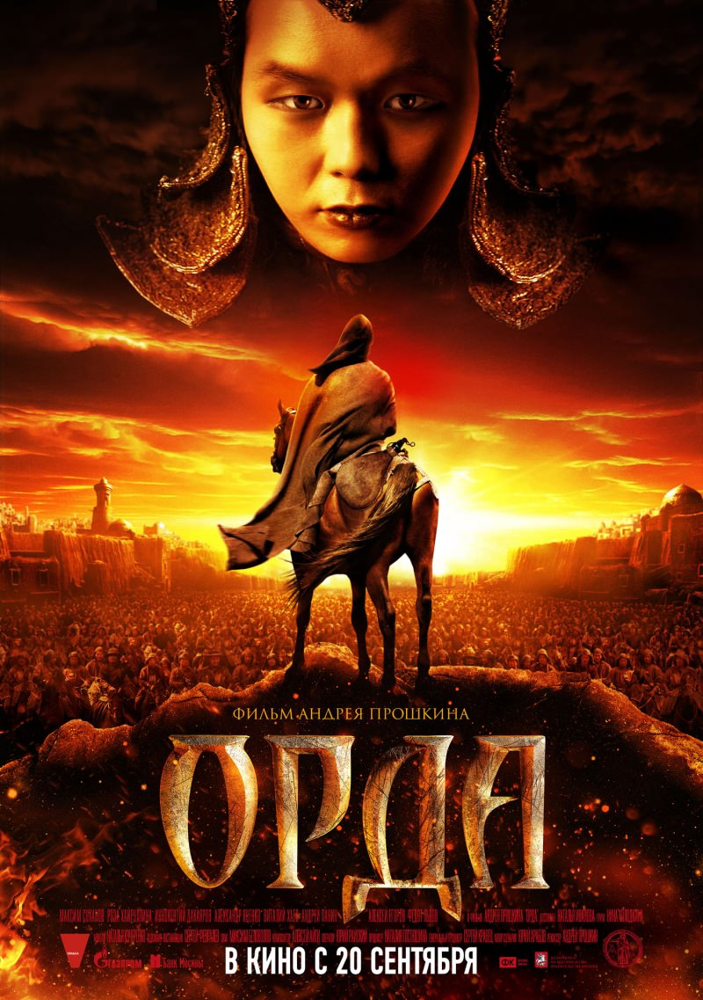
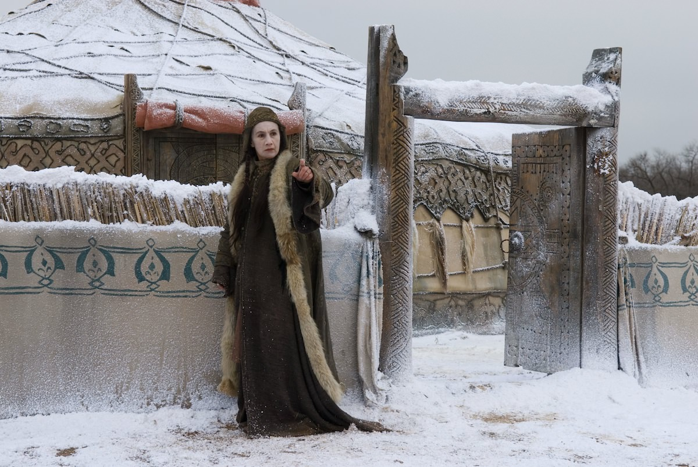
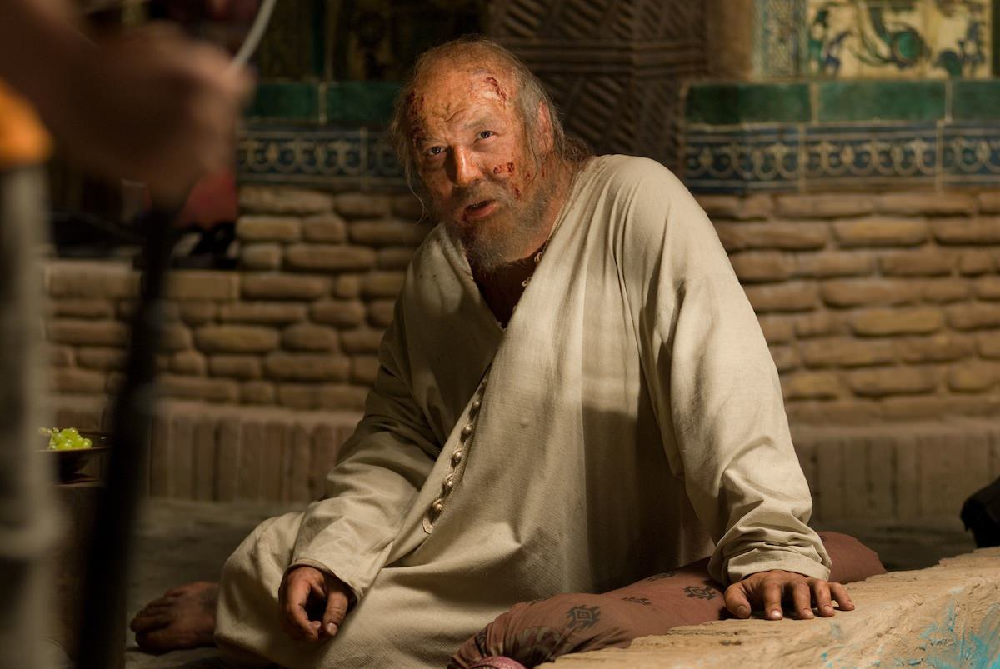

+++
type = "post"
titre = "La Horde, Andrey Proshkin"
title = "La Horde, Andrey Proshkin"
url = "/horde-proshkin"
date = "2012-12-26T09:40:24"
Lastmod = "2013-01-14T12:29:05"
cover = "proshkin-la-horde-maxim-sukhanov.jpeg"
categorie = [ "À voir" ]
tag = [ "Arcs 2012", "Drame", "Famille", "Histoire", "Histoire vraie", "Maladie", "Politique", "Religion", "Société", "Vite oublié" ]
createur = [ "Andrey Proshkin" ]
acteur = [ "Maxime Soukhanov", "Rosa Khaïroullina" ]
annee = [ "2013" ]
weight = 2013
pays = [ "Russie" ]
original = "Орда"

+++

<em>La Horde</em> raconte l’histoire largement méconnue en Occident de la guérison miraculeuse de la mère du Khan qui régnait sur l’Asie Mineure au XIVe siècle par un haut dignitaire orthodoxe. Une légende assez populaire encore aujourd’hui dans la région et qui permet à Andrey Poshkin de dépeindre une époque lointaine où les Mongols régnaient en maîtres et menaçaient même l’Europe entière. Si ce sujet peut passionner et si la reconstitution historique semble de qualité, <em>La Horde</em> peine globalement à passionner. Les intentions d’Andrey Poshkin ne sont pas évidentes et les sous-textes politiques et religieux nous dépassent un peu. Une curiosité que l’on aura du mal à recommander…

L’histoire n’a quasiment retenu du règne des Mongols que <a href="http://fr.wikipedia.org/wiki/Gengis_Khan">Gengis Khan</a> qui a fondé un empire, certes, mais aussi une lignée de dirigeants qui ont longtemps régné sur un territoire immense. <em>La Horde</em> se déroule dans la première moitié du XIVe siècle, sous le règne de <a href="http://fr.wikipedia.org/wiki/Djanibeg">Djanibeg</a>. Andrey Proshkin ouvre d’ailleurs son long-métrage avec l’assassinat du Khan précédent, le frère de Djaniberg, et se termine sur l’assassinat de ce chef-là, une tradition de l’époque. Le cinéaste ne s’est pas intéressé à ses quinze ans de règne, mais surtout à un épisode précis de sa vie : la guérison de sa mère, devenue aveugle, par le <a href="http://fr.wikipedia.org/wiki/Métropolite">Métropolite</a> Alexis. Quand Taidula perd la vue, son fils est fou de rage et il fait appel à tous ceux qui devraient pouvoir la soigner. Des médecins mongols, des sorciers un peu fous, tous passent devant la femme sans pouvoir lui rendre la vue. Pris de désespoir, il envoie chercher le plus haut dignitaire de l’Église orthodoxe de Moscou, Alexis. Le vieil homme essaie de la sauver en reproduisant le miracle de la guérison d’un aveugle par le Christ tel qu’il est relaté dans la Bible. Sa foi va toutefois être mise à rude épreuve, car le miracle attendu ne vient pas…

Le règne de Djaniberg est une période de transition dans l’histoire de l’empire mongole. Après des années de gloire et de règne sans partage sur l’Asie Mineure, la Russie et même l’Europe occidentale, son règne signe le début des ennuis et il fut suivi de vingt-cinq ans de très forte instabilité politique. Son pouvoir a été constamment remis en cause par une forte agitation féodale, mais ce n’est pas vraiment ce qui intéresse Andrey Poshkin. <em>La Horde</em> ne s’attarde pas sur ces questions politiques pourtant passionnantes, même s’il offre un aperçu assez précis de cette époque et de cet empire qui a largement disparu aujourd’hui. La reconstitution de <a href="http://en.wikipedia.org/wiki/Sarai_(city)">Saraï</a>, la capitale de cet empire totalement détruite aujourd’hui, impressionne, d’autant qu’il s’agissait à l’époque de l’une des plus grandes villes qui soient. La sédentarité assumée de Djaniberg est aussi intéressante et contraste avec la volonté de sa mère de rester nomade. On voit bien là deux tendances se dessiner, d’un côté la génération qui a toujours été mobile et en conquête, de l’autre un empire centralisé et stable qui finit toutefois par causer la perte des Mongols. Toutes ces questions historiques sont passionnantes, mais elles sont malheureusement largement minoritaires dans <em>La Horde</em>. 

Avant le film, un panneau précise que <em>La Horde</em> a été en partie financé par Orthodox Encyclopedia, une entreprise russe qui a financé de nombreux films ou travaux en faveur de la religion orthodoxe. Même si Andrey Proshkin se <a href="http://www.rferl.org/content/the-horde-film-tatarstan-stereotypes-russia/24713352.html">défend</a> d’avoir réalisé un film de propagande, ce financement est assez suspect, d’autant que ce qui l’intéresse plus que l’empire mongol, c’est justement la guérison miraculeuse permise par le Métropolite Alexis. La véritable intrigue de <em>La Horde</em> se met en place tardivement, quand le Khan envoie deux émissaires à Moscou pour chercher le haut dignitaire orthodoxe. Si Alexis refuse de venir, la ville doit être attaquée et entièrement détruite par les Mongols et le religieux n’a guère le choix. Il se rend donc dans la Horde d’or et tente de rendre à Taidula sa vue. Après un premier échec, il décide de s’abandonner à dieu en se portant volontaire pour figurer parmi les esclaves russes qui travaillent pour les Mongols. L’allusion à la figure christique est alors évidente et le vieil homme barbu accepte les pires traitements avec ses vêtements en loque et ses blessures. Une figure très clairement positive, alors qu’Andrey Proshkin réserve aux Mongols un traitement des plus négatifs et largement caricatural. Ils sont tous décrits comme des êtres brutaux et insensibles, des hommes qui n’hésitent pas à s’entre-tuer et qui tuent pour le plaisir hommes et animaux, un peuple ignare qui vit dans un environnement en permanence sale… bref <em>La Horde</em> fait de la Horde d’or une tribu barbare bien peu fréquentable. Ajoutons que Moscou est, <em>a contrario</em>, présentée comme une bourgade propre et bien construite et on comprend sans peine que le film penche plutôt d’un côté que de l’autre. Cette sensation de voir un film de propagande qui ne ressort vraiment qu’à la fin du film est assez déplaisante, d’autant qu’il nous manque certainement quelques arguments pour en juger correctement.

Si <em>La Horde</em> pose problème sur le fond, sa forme est beaucoup plus satisfaisante. Bénéficiant d’un budget confortable, Andrey Proshkin propose une reconstitution historique plutôt réussie de l’Empire mongol et de la vie dans cette région au XIVe siècle. Que ce soit la ville Saraï ou les campements mongols, les différents décors sont précisément constitués et on est immédiatement plongé dans l’époque, même si les scènes mongoles sont sans doute un peu caricaturales pour renforcer l’opposition avec la civilisation orthodoxe. <em>La Horde</em> bénéficie, en tout cas, d’un traitement digne des blockbusters hollywoodiens et il s’avère très efficace et prenant. Dès la première scène où deux dignitaires de l’Église catholique sont venus d’Avignon pour s’assurer que la Horde d’or ne compte pas attaquer le Pape, on est plongé dans cet univers où le Khan faisait trembler toute l’Europe. Une scène qui impressionne par son final sanglant et l’assassinat du Khan par son frère, Djaniberg. Andrey Proshkin ne fait pas dans la reconstitution policée, mais n’hésite pas au contraire à multiplier les détails qui ajoutent à la saleté des personnages ou des situations. <em>La Horde</em> passe ainsi des beaux paysages de la steppe aux geôles infâmes de Saraï, pour un résultat réussi.

Andrey Proshkin reconstitue un contexte historique que l’on connaît mal et <em>La Horde</em> passionne d’abord pour cette raison et l’opportunité de découvrir la Horde d’or et l’empire mongol. La guérison miraculeuse de Taidula intéresse beaucoup moins, d’abord parce que l’on a du mai à comprendre l’objectif du cinéaste. Se défendre d’avoir réalisé un film de propagande en faveur de l’Église orthodoxe est une chose, mais l’opposition caricaturale des deux camps et le financement particulier du long-métrage sont suspects. <em>La Horde</em> reste un film historique assez efficace, surtout dans sa première partie, mais ce n’est pas vraiment suffisant. 

<em>Sortie en salles à une date inconnue</em>

