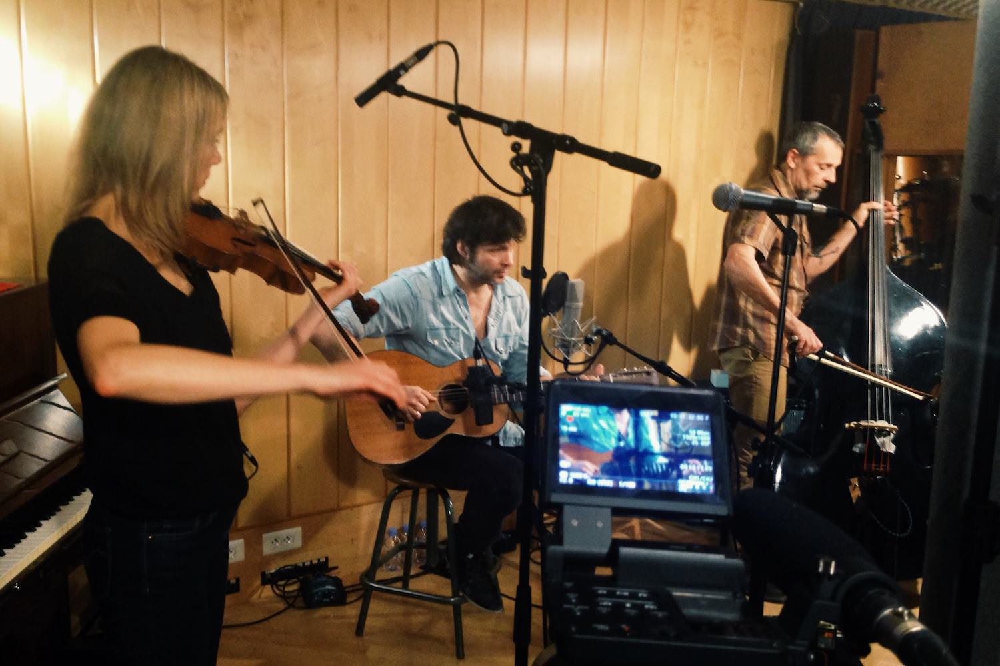

+++
type = "post"
titre = "<em>Horizons</em>, Détroit (Bertrand Cantat et Pascal Humbert)"
title = "Horizons, Détroit (Bertrand Cantat et Pascal Humbert)"
url = "/horizons-detroit-cantat-humbert"
date = "2013-11-20T08:31:59"
Lastmod = "2013-11-20T15:49:13"
cover = "detroit-humbert-cantat.jpg"
categorie = [ "Musique" ]
tag = [ "Album", "Chanson", "Rock" ]
createur = [ "Bertrand Cantat", "Détroit", "Pascal Humbert" ]
annee = [ "2013" ]
weight = 2013
pays = [ "France" ]

+++

Noir Désir a bercé mon adolescence, pour ne pas dire mon enfance. C’est sans doute le premier groupe dont j’ai été fan. Peut-être même le seul pour lequel j’ai vraiment éprouvé de l’admiration, au point de vouloir tout connaître par cœur et d’écouter ses albums en boucle. Quand son dernier album, <a href="https://itunes.apple.com/fr/album/des-visages-des-figures/id26259265"><em>Des Visages Des Figures</em></a> est sorti, j’ai connu un des moments forts de ma conscience musicale et cet album reste un de mes plus grands souvenirs musicaux. Quand j&rsquo;ai enfin eu l’âge d&rsquo;aller les voir sur scène, le drame de Vilnius a tout interrompu. Même si je reste encore un grand amateur et admirateur des six uniques albums produits par Noir Désir, je n’en suis plus fan aujourd’hui. Mais apprenant la sortie d’un nouvel album avec Bertrand Cantat, je n’ai pas hésité longtemps avant de l’écouter. Après quelques écoutes, je suis rassuré : ce <em>Horizons</em> n’est pas un argument marketing lancé par une maison de disques en quête de bons chiffres. C’est un album sincère et touchant, une dizaine de morceaux apaisés, dans la suite directe du travail réalisé par le chanteur avec son ancien groupe, mais qui ne sont pas de simples redites. Un beau retour…

<blockquote class="pull-quote">
ça m&rsquo;amuse que tu sois ma muse 
dis moi si ça t&rsquo;amuse aussi 
ou bien si tu refuses 
le fluide ne s&rsquo;use que si l&rsquo;on en abuse 
et si ça m&rsquo;use parfois ma muse 
tellement ça fuse de toute parts 
d&rsquo;antennes en satellites  
ou pylônes au hasard 
je ne regrette pas<cite class="author"> — Détroit, Horizons, « Ma Muse »</cite>

</blockquote>

L’album commence avec « Ma muse » et on n’entend d’abord qu’une ligne de guitare très simple, avant la voix si caractéristique de Bertrand Cantat. Ces notes de guitare répétées tout au long du morceau sont immédiatement entraînantes et offrent un cadre mélodique aux paroles si travaillées du chanteur. Difficile d’entendre à nouveau cette voix sans une certaine émotion : sur ce point, l’ancien leader de Noir Désir n’a pas changé et c’est tant mieux. On retrouve avec plaisir les jeux sur les mots et cette langue poétique qui a perdu de son militantisme politique sur <em>Horizons</em>, mais pas de sa force symbolique. Peu après cette voix, c&rsquo;est la basse de Pascal Humbert qui complète le duo qui signe l&rsquo;album. On aurait parfois tendance à l’oublier derrière Bertrand Cantat, mais ce nouveau projet est signé Détroit, un duo composé de l&rsquo;ex-chanteur de Noir Désir et du bassiste français qui a travaillé, entre autres, avec 16 Horsepowers. Une basse ronde et bien présente qui donne au morceau du corps, même si on retient d’abord la guitare. Ce premier contact est en tout cas une vraie réussite. Une ouverture calme qui rappelle un peu « Le vent nous portera », puis une lente montée en puissance avec un final plus rock, pour un morceau que l’on retient dès la première écoute. 

<iframe class="aligncenter" width="850" height="458" src="//www.youtube.com/embed/MoXNwGKA8cg" frameborder="0" allowfullscreen></iframe>

La suite est en anglais : Bertrand Cantat a gardé cette vieille habitude d’écrire dans les deux langues. Pendant tout l’album, les morceaux anglophones créent un rythme assez agréable. Un rythme aussi dans les choix musicaux avec une tendance étonnante à varier entre les époques de Noir Désir. Peut être est-ce le prisme de l’ancien fan qui parle, mais on entend les influences des anciens albums. <a href="https://itunes.apple.com/fr/album/des-visages-des-figures/id26259265"><em>Des Visages Des Figures</em></a> domine sans doute — on le retrouve aussi bien sur le premier morceau que sur « Terre brûlante » par exemple —, mais même si le ton est dans l’ensemble apaisé, on entend encore la rage des débuts. « Le creux des mains » en particulier retrouve le rock énervé qui a longtemps été la marque de fabrique du groupe. C’est aussi le morceau le moins bon à mon avis : le reste, suivant l’évolution inéluctable initiée par le groupe à partir de <a href="https://itunes.apple.com/fr/album/666.667-club/id68370640"><em>666.667 Club</em></a>, est plus réussi. On retiendra surtout l’excellent « Horizon » qui impressionne autant par sa douceur que par sa puissance au cœur du morceau. Le premier single, « Droit dans le soleil » (ci-dessus) est aussi une très belle chanson, tout en douceur. Détroit résiste aux modes et ce n’est pas plus mal. Les sonorités instrumentales, fussent-elles électriques, dominent presque systématiquement, avec cette habitude — peut être un peu trop systématique d’ailleurs — de commencer par quelques notes de guitare seules, comme dans le premier morceau. Seule exception notable, l’étonnant « Avec le temps », une reprise de Léo Ferré qui clôt l’album avec des tonalités électroniques plus rares, mais qui fonctionnent d’ailleurs parfaitement. De quoi même regretter que le duo n’ait pas plus expérimenté avec des sonorités moins proches du rock traditionnel. <em>Horizons</em> fait au moins preuve d’une belle harmonie, sans endormir pour autant l&rsquo;auditeur avec un ensemble trop mou. 

Écouté en boucle depuis sa sortie, <em>Horizons</em> est un album agréable dès la première fois, mais qui s’apprécie de plus en plus. Ce n’est pas une œuvre radicale qui vient tout bouleverser et on pourrait sans doute reprocher à Bertrand Cantat de rester trop proche de ce qu’il a fait avec Noir Désir. En même temps, le duo qu’il forme avec Pascal Humbert fonctionne bien et les compositions sont toutes efficaces et souvent très belles. À l’écoute, l’émotion est au rendez-vous et on ne reste pas indifférent : c’est un bel album, mais il est trop tôt sans doute pour dire s’il tiendra la distance. En attendant, on retrouve avec un grand plaisir l’artiste Cantat…

<h3>Vous voulez m&rsquo;aider ?<a href="#footnote_0_10588" id="identifier_0_10588" class="footnote-link footnote-identifier-link" title="&Agrave; propos de la publicit&eacute;&hellip;">1</a></h3>
<ul>
<li><a href="http://www.amazon.fr/gp/product/B00FSU90BW/ref=as_li_ss_tl?ie=UTF8&#038;tag=leblogdenic07-21&#038;linkCode=as2&#038;camp=1642&#038;creative=19458&#038;creativeASIN=B00FSU90BW">Acheter l&rsquo;album sur Amazon</a></li>
<li><a href="https://itunes.apple.com/fr/album/horizons/id726076057">Acheter l&rsquo;album sur l&rsquo;iTunes Store</a></li>
<li><a href="http://open.spotify.com/album/5NAlRXuJEAqDjuYlzuGewb">Écouter l&rsquo;album sur Spotify</a></li>
</ul>

<ol class="footnotes"><li id="footnote_0_10588" class="footnote"><a href="http://voiretmanger.fr/soutien/">À propos de la publicité…</a> [<a href="#identifier_0_10588" class="footnote-link footnote-back-link">&#8617;</a>]</li></ol>
