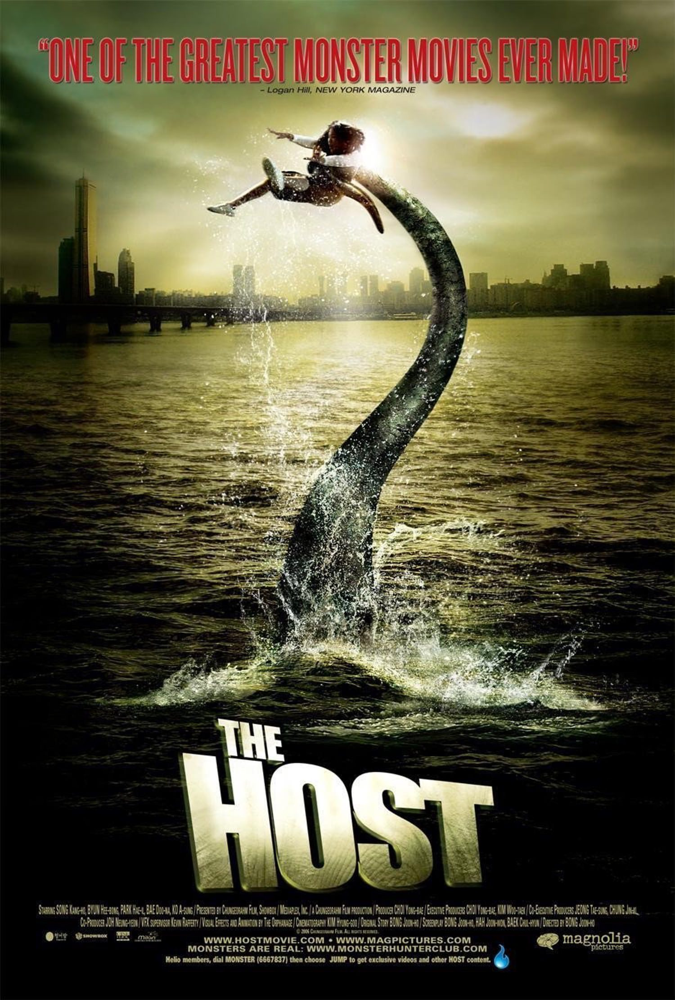
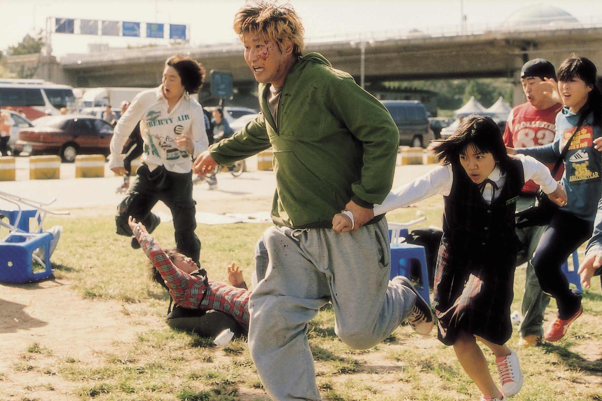
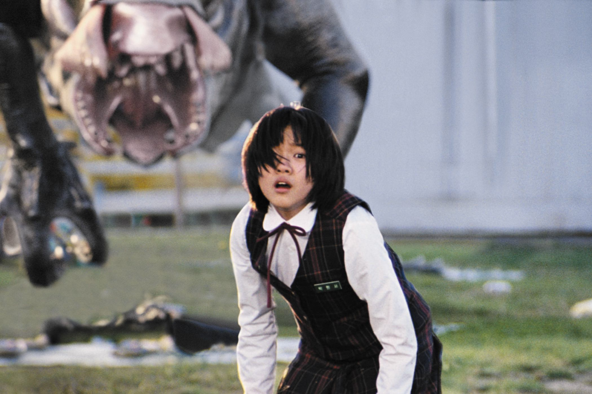

+++
titre = "<em>The Host</em>, Bong Joon-ho"
title = "The Host, Bong Joon-ho"
url = "/host-bong"
date = "2015-06-10T00:37:53"
Lastmod = "2015-06-11T19:10:44"
cover = "host-bong-joon-ho.jpeg"
position = "right"
categorie = [ "À voir" ]
tag = [ "Action", "Drame", "Écologie", "Famille", "Horreur", "Humour", "Monstres", "Politique", "Société" ]
createur = [ "Bong Joon-ho" ]
acteur = [ "Bae Doona", "Byun Hee-bong", "Go Ah-sung", "Park Hae-il", "Song Kang-Ho" ]
annee = [ "2006" ]
weight = 2006
pays = [ "Corée du Sud" ]
original = "Gwoemul"

+++

Après le succès critique et public de <em>Memories of Murder</em>, Bong Joon-ho est devenu l&rsquo;un des réalisateurs coréens les plus en vue. Quand il se lance sur son troisième projet au cinéma, il dispose ainsi de coudées franches et d&rsquo;un budget très confortable. Ce qui lui permet de réaliser… un film de monstre. Mais loin de répéter pour la centième fois le schéma de <em>Godzilla</em>, le cinéaste sud-coréen propose avec <em>The Host</em> une lecture très personnelle du genre. Sans oublier l&rsquo;action et des effets très réussis au service d&rsquo;une créature monstrueuse comme il faut, son film est à la fois très politique et assez drôle par moments. Un assemblage de genres audacieux, pour un résultat réjouissant. Près de dix ans après sa sortie, <em>The Host</em> n&rsquo;a pas pris une ride et reste l&rsquo;un des meilleurs du genre.

L&rsquo;ouverture de <em>The Host</em> est exemplaire : sans donner d&rsquo;explications lourdes, Bong Joon-ho retrace la genèse du monstre qui concentre toutes les attentions de son récit. Inspiré d&rsquo;une histoire vraie<a href="#fn-13828-1" rel="footnote">1</a>, le scénario imagine que des litres et des litres de produits chimiques extrêmement dangereux sont déversés dans le fleuve Han, qui traverse le pays et Séoul, sa capitale. Le film ne dit rien, mais on comprend déjà grâce aux protestations du Coréen qui doit exécuter l&rsquo;ordre du supérieur américain que ce n&rsquo;est pas une bonne idée. Il a beau faire valoir que jeter ces produits à l&rsquo;évier revient à les jeter dans la nature sans traitement, les bouteilles partent toutes dans la nature. Deux ans plus tard, une brève séquence présente deux pécheurs dans le même fleuve. L&rsquo;un d&rsquo;eux aperçoit un drôle de petit animal, qui ressemble autant à un poisson qu&rsquo;à une sorte de lézard. Là encore, <em>The Host</em> ne dit rien, mais le montage fait que l&rsquo;on pense évidemment à la séquence précédente et que l&rsquo;on fasse le lien. Le plan suivant nous avance en 2006, soit le présent à la sortie du long-métrage, et cette fois on affronte la bête de face. Discrète jusque-là, la créature imaginée par Bong Joon-ho se montre alors totalement, là où beaucoup de films centrés autour d&rsquo;un monstre préfère retarder la présentation. Ici, on la voit complètement et longuement, ce qui nous laisse tout loisir d&rsquo;en admirer la plastique. Créée en partie en numérique, mais aussi avec des maquettes, la bête de <em>The Host</em> emprunte au dinosaure, au poisson, au batracien ou encore au lézard. Elle nage, elle fait des bons et des acrobaties, elle a une longue langue visqueuse, des pates lourdes. Bref, elle est vraiment moche et assez impressionnante, il faut le reconnaître, d&rsquo;autant qu&rsquo;elle semble dotée d&rsquo;une certaine intelligence. C&rsquo;est d&rsquo;ailleurs ce qui explique qu&rsquo;elle survive aussi longtemps, mais ce n&rsquo;est pas la seule explication.

D&rsquo;emblée, <em>The Host</em> surprend par son mélange des genres. La créature meurtrière qui enchaîne les morts sanglantes dans les premières minutes attire le long-métrage vers le film d&rsquo;action et d&rsquo;horreur. Après la découverte de la créature, la panique est générale, tout le monde court dans tous les sens : on est en terrain connu. Mais dans le même temps, Bong Joon-ho introduit des éléments qui appartiennent à un tout autre genre : la famille qu&rsquo;il a choisi en guise de personnages principaux ne rentre pas vraiment dans la norme et elle oriente clairement le film vers la comédie. L&rsquo;humour est surtout lié au personnage du père, avec ses cheveux blonds, un grand gamin qui travaille avec son père dans un petit stand qui vend de la nourriture et qui passe ses journées à dormir. Mais ce n&rsquo;est pas le seul élément comique : certains plans sont tournés de manière assez ridicule, à l&rsquo;image de cette séquence où des dizaines de personnes entrent dans une roulotte pour se protéger du monstre, uniquement pour être suivis par la bête qui en fait un festin. Bong Joon-ho ne montre pas de chairs sanguinolentes et la caméra qui s&rsquo;éloigne tout en montrant la roulotte qui oscille suffit à comprendre ce qui se passe, tout en introduisant une dose de comique. <em>The Host</em> n&rsquo;a rien d&rsquo;une comédie toutefois. Le film est aussi très politique, et peut-être avant tout politique. Pour commencer, la naissance de la créature est directement associée à la présence de l&rsquo;armée américaine en Corée du Sud. Les États-Unis sont responsables à l&rsquo;origine, ils seront irresponsables pendant tout le traitement de la crise. Le constat est cinglant : ils créent un faux virus pour inquiéter la population locale qu&rsquo;ils laissent par ailleurs totalement dans le noir, ils n&rsquo;écoutent pas la famille alors même qu&rsquo;elle sait où se trouve le monstre et leur solution finale est encore pire que la bestiole. L&rsquo;une des dernières séquences de <em>The Host</em> est la plus impressionnante : l&rsquo;armée va disperser un gaz jaune censé être sans danger pour la population, mais qui fait polémique. Alors même qu&rsquo;il y a des manifestants, le gaz est envoyé et s&rsquo;il blesse le monstre sans le tuer, il fait aussi du mal à tous les humains présents sur place. Cette séquence est d&rsquo;une violence rare, non pas par ses images, mais par son message sur la société et le monde politique.

<em>The Host</em> pourrait n&rsquo;être qu&rsquo;un film de monstres de plus, une œuvre assez banale où une bestiole quelconque terroriste la population avant d&rsquo;être heureusement décimée. Bong Joon-ho ne cède pas à cette facilité et propose au contraire un long-métrage très original et beaucoup plus complexe qu&rsquo;il n&rsquo;en a l&rsquo;air. Certes, on reste autour de l&rsquo;idée d&rsquo;une famille contre une créature, mais le scénario mélange les genres et glisse surtout une critique en règle du monde politique et de l&rsquo;armée américaine. Au total, <em>The Host</em> est bien plus intéressant qu&rsquo;il n&rsquo;en a l&rsquo;air, et c&rsquo;est une réussite totale. Que ce soit sur le plan technique, la réalisation et le montage parfaits, ou encore les acteurs excellents, c&rsquo;est un sans faute pour ce film qui se voit et se revoit avec plaisir.

<h3>Vous voulez <a href="http://voiretmanger.fr/soutien/">m&rsquo;aider</a> ?</h3>
<ul>
<li><a href="http://www.amazon.fr/gp/product/B001CRVY1E/ref=as_li_ss_tl?ie=UTF8&amp;tag=leblogdenic07-21&amp;linkCode=as2&amp;camp=1642&amp;creative=19458&amp;creativeASIN=B001CRVY1E">Acheter le film en Blu-ray sur Amazon</a></li>
<li><a href="http://www.amazon.fr/gp/product/B000RO8TDO/ref=as_li_ss_tl?ie=UTF8&amp;tag=leblogdenic07-21&amp;linkCode=as2&amp;camp=1642&amp;creative=19458&amp;creativeASIN=B000RO8TDO">Acheter le film en DVD sur Amazon</a></li>
</ul>

<ol>
<li id="fn-13828-1">
En 2000, l&rsquo;armée américaine stationnée en Corée du Sud a été accusée <a href="http://en.wikipedia.org/wiki/The_Host_(2006_film)#Political_background">d&rsquo;avoir déversé</a> de grandes quantités de produits toxiques dans la nature. Un incident qui a créé des tensions apparemment vives entre les États-Unis et les Coréens.&#160;<a href="#fnref-13828-1" rev="footnote">&#8617;</a>
</li>
</ol>

