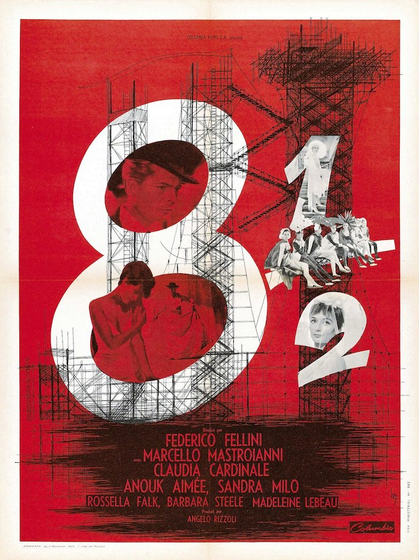
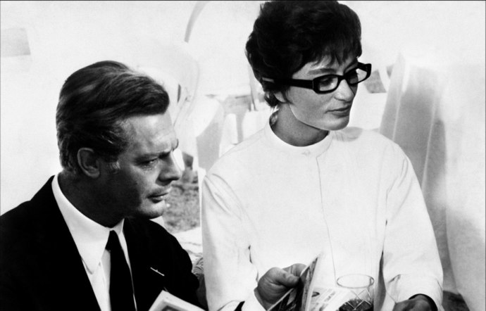
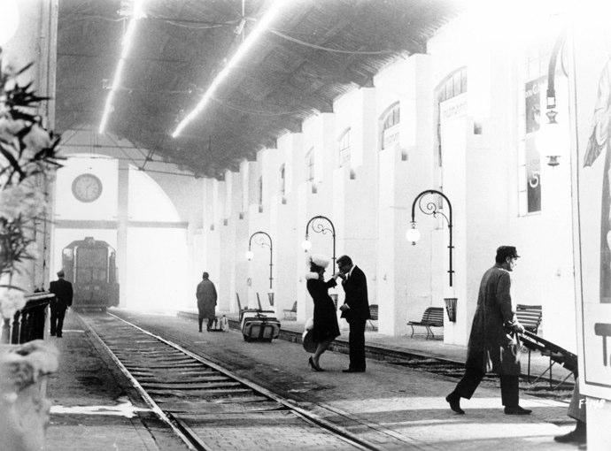

+++
type = "post"
titre = "Huit et demi, Frederico Fellini"
title = "Huit et demi, Frederico Fellini"
url = "/huit-et-demi-fellini"
date = "2010-04-25T00:33:15"
Lastmod = "2012-06-03T11:23:29"
cover = "8-1-2-fellini.jpg"
categorie = [ "À voir" ]
tag = [ "Cinéma classique", "Comédie", "Drame", "Metafilm" ]
createur = [ "Frederico Fellini" ]
acteur = [ "Marcello Mastroianni" ]
annee = [ "1963" ]
weight = 1963

+++

Frederico Fellini fait partie de ces réalisateurs tellement classiques, tellement grands que l&rsquo;on semble les connaître sans même les avoir regardés. C&rsquo;est à ce constat que je suis arrivé quand le nom de <em>Huit et demi</em> était évoqué à propos de <em>Nine</em>, comédie musicale inspirée de ce film de Fellini. Je découvris alors que je n&rsquo;avais jamais vu un film de Fellini en entier… Pour réparer ce manque, pourquoi ne pas commencer par ce qui est considéré comme l&rsquo;une de ses œuvres les plus ambitieuses ?

Le synopsis de <em>Huit et demi</em> tient sur un demi-ticket de métro : c&rsquo;est ainsi l&rsquo;histoire de Guido, cinéaste incapable de produire du cinéma et dépressif en cure dans une station thermale. Autour de lui gravite une ribambelle de personnes, tant du monde du cinéma que de sa vie privée. On retrouve ainsi l&rsquo;auteur du scénario de son prochain film et toute l&rsquo;équipe technique associée, mais aussi une brochette d&rsquo;actrices belles, mais capricieuses qui tentent d&rsquo;obtenir plus d&rsquo;informations sur leur prochain rôle. On y retrouve également sa femme et sa maîtresse. Tout cet univers gravite autour de lui, donnant vite le tournis, mais c&rsquo;est à peu près tout ce que l&rsquo;on peut dire de l&rsquo;histoire.

À dire vrai, le scénario importe peu. <em>Huit et demi</em> est d&rsquo;abord un film sur le cinéma et ce qui intéresse Fellini est d&rsquo;abord de montrer le monde du cinéma. En faisant de son héros un réalisateur, le film ouvre logiquement une réflexion sur le cinéma et devient alors un <a href="http://en.wikipedia.org/wiki/Metafilm">metafilm</a>. Le procédé est mieux connu en littérature, mais fonctionne à plein chez Fellini : écrire sur la peur de la page blanche, ou ici filmer sur l&rsquo;incapacité à filmer. Du film en gestation depuis cinq mois, on a bien des actrices, des décors. Mais il faut choisir une actrice et Guido en est manifestement incapable et il se révèle vite impuissant à les maîtriser, à les canaliser. Toutes l&rsquo;agacent en même temps qu&rsquo;elles le fascinent et l&rsquo;attirent. Le décor gigantesque — une plateforme de lancement pour une fusée — symbolise à lui seul le blocage du cinéaste. À la fois énorme et transparent (finalement, il ne s&rsquo;agit que d&rsquo;échafaudages), il semble être à la fois le dernier motif pour continuer (on ne cesse de rappeler à Guido le prix de sa construction) et aussi la vacuité d&rsquo;un projet d&rsquo;ailleurs très flou.

Les grands réalisateurs ont souvent un acteur fétiche et ce fut le cas de Frederico Fellini qui a trouvé en Marcello Mastroianni<a href="#footnote_0_3201" id="identifier_0_3201" class="footnote-link footnote-identifier-link" title="Qui ressemble d&rsquo;ailleurs &agrave; s&rsquo;y m&eacute;prendre &agrave; sa fille, ou plut&ocirc;t l&rsquo;inverse. C&rsquo;en est presque troublant&hellip;">1</a> à la fois un acteur fidèle et une sorte de double. <em>Huit et demi</em> est ainsi un film hautement autobiographique. Le simple fait de filmer un réalisateur est un signe fort bien sûr, mais le réalisateur italien renforce constamment la piste en jetant le trouble et en faussant la perception du rêve et du réel. On ne sait jamais bien si ce que l&rsquo;on voit est censé s&rsquo;être passé, ou s&rsquo;il s&rsquo;agit des divagations du héros, ou bien encore de Fellini. Il y a bien des séquences rêvées, comme celle qui ouvre le film par exemple, mais elles arrivent brusquement, sans le moindre changement de ton ou de décor. Certaines scènes mêlent les deux et proposent parfois les deux simultanément à l&rsquo;écran, ce qui complique souvent la compréhension logique du film. Mais à condition de se laisser porter par les images et de ne surtout pas chercher à tout expliquer, le spectateur est emporté dans un tourbillon d&rsquo;images assez bluffant. Plusieurs thématiques typiquement felliniennes, comme le cirque par exemple, sont ainsi intégrées à <em>Huit et demi</em>, comme autant de rappels de la nature partiellement autobiographique du film. Son titre même, qui évoque le nombre de films que Fellini avait réalisés auparavant, sonne comme part du contrat autobiographique. Les flashbacks sur l&rsquo;enfance sont des lieux communs du genre.

<em>Huit et demi</em> force aussi le respect par sa réalisation. Sur le plan technique, le spectateur contemporain habitué aux super productions actuelles aura besoin d&rsquo;un temps d&rsquo;adaptation face à une image plus &laquo;&nbsp;sale&nbsp;&raquo; que ce que l&rsquo;on voit aujourd&rsquo;hui, et surtout face à un son mono et surtout ajouté <em>a posteriori</em> aux images. Quand on est perturbé par les voix désynchronisées des films en VF, c&rsquo;est troublant, même s&rsquo;il s&rsquo;agit des voix des acteurs. Au-delà de ces aspects purement techniques, c&rsquo;est la mise en scène qui impressionne : alors que certaines scènes sont très chargées en acteurs et en actions, la caméra très souple, toute en travellings (on est encore loin de la mode caméra sur l&rsquo;épaule), en offre une lecture claire. La lumière est également très travaillée pour un film très noir et très blanc en fonction des scènes. Il est réellement fascinant de trouver dans ce film des plans, des points de vue, des façons de filmer qui semblent familiers, que l&rsquo;on a vu dans tant de films. C&rsquo;est sans doute à cela que l&rsquo;on reconnaît un classique. Cela vaut aussi pour la musique composée par Nino Rota et qui ressemblerait à une compilation de musique de films s&rsquo;il ne s&rsquo;agissait pas en fait d&rsquo;originaux. À noter aussi une utilisation bien plus originale de la chevauchée des Walkyries que celle d&rsquo;<em>Apocalypse Now</em>, comme quoi cette musique n&rsquo;est pas forcément martiale (le <a href="http://voiretmanger.fr/2010/04/25/huit-et-demi-fellini/#comment-2305">commentaire de Mathilde</a> apporte des éléments très intéressants à ce sujet…).

Regarder aujourd&rsquo;hui <em>Huit et demi</em> donne un peu une sensation de vertige. Vertige devant un univers cinématographique à découvrir, un univers aussi vaste (une vingtaine de films) que riche et complexe. Vertige devant ce qui est manifestement un maître du genre : on ne compte plus les réalisateurs qui se sont inspirés de Fellini, consciemment ou même inconsciemment. Vertige aussi face à la constatation grisante et effrayante à la fois qu&rsquo;il reste tant à découvrir au cinéma…

Si vous voulez en savoir plus sur Frederico Fellini, je ne peux que recommander le très long et riche <a href="http://www.critikat.com/Federico-Fellini.html">article de Critikat</a> sur le sujet. Ils proposent un panorama très intéressant de l&rsquo;œuvre de l&rsquo;Italien et donnent envie de voir tous ses films.

<h3>Vous voulez m&rsquo;aider ?<a href="#footnote_1_3201" id="identifier_1_3201" class="footnote-link footnote-identifier-link" title="&Agrave; propos de la publicit&eacute;&hellip;">2</a></h3>
<ul>
<li><a href="http://www.amazon.fr/gp/product/B004TTZ0VM/ref=as_li_ss_tl?ie=UTF8&#038;tag=leblogdenic07-21&#038;linkCode=as2&#038;camp=1642&#038;creative=19458&#038;creativeASIN=B004TTZ0VM">Acheter le film en Blu-Ray sur Amazon</a></li>
<li><a href="http://www.amazon.fr/gp/product/B002JP9X8O/ref=as_li_ss_tl?ie=UTF8&#038;tag=leblogdenic07-21&#038;linkCode=as2&#038;camp=1642&#038;creative=19458&#038;creativeASIN=B002JP9X8O">Acheter le film en DVD sur Amazon</a></li>
<li><a href="http://itunes.apple.com/fr/movie/huit-et-demi/id494569182">Acheter ou louer le film sur l&rsquo;iTunes Store</a></li>
</ul>

<ol class="footnotes"><li id="footnote_0_3201" class="footnote">Qui ressemble d&rsquo;ailleurs à s&rsquo;y méprendre à sa fille, ou plutôt l&rsquo;inverse. C&rsquo;en est presque troublant… [<a href="#identifier_0_3201" class="footnote-link footnote-back-link">&#8617;</a>]</li><li id="footnote_1_3201" class="footnote"><a href="http://voiretmanger.fr/a-propos/publicite/">À propos de la publicité…</a> [<a href="#identifier_1_3201" class="footnote-link footnote-back-link">&#8617;</a>]</li></ol>
