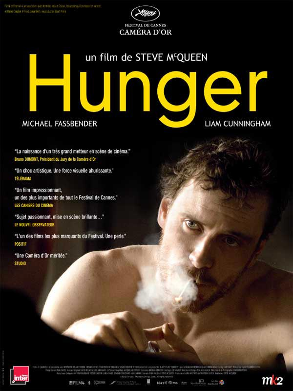
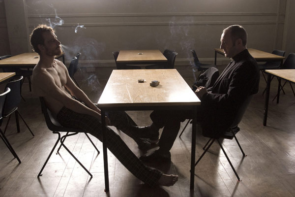

+++
type = "post"
titre = "<em>Hunger</em>, Steve McQueen"
title = "Hunger, Steve McQueen"
url = "/hunger-mcqueen"
date = "2008-11-30T16:00:11"
Lastmod = "2014-01-29T22:51:22"
cover = "hunger-mcqueen.jpg"
categorie = [ "À voir" ]
tag = [ "Drame", "Histoire", "Politique", "Prison", "Société" ]
createur = [ "Steve McQueen" ]
acteur = [ "Michael Fassbender" ]
annee = [ "2008" ]
weight = 2008

+++

<em>Hunger</em> n&rsquo;est pas un film qui laisse indifférent. Si la critique est globalement très enthousiaste, certains journaux sont au contraire très négatifs, et ce, pour des raisons très différentes. Il faut dire que le premier film de l&rsquo;anglais Steve McQueen ne traite pas d&rsquo;un sujet facile, mais surtout ne traite pas ce sujet difficile facilement.

<em>Hunger</em> relate l&rsquo;emprisonnement, dans les années 1980, de membres de l&rsquo;IRA à la prison de Belfast et surtout les grèves successives des prisonniers pour obtenir la reconnaissance de leur statut de prisonnier politique, un statut qu&rsquo;ils n&rsquo;obtinrent jamais. Après une première grève de la faim, les prisonniers entament une grève des vêtements et de l&rsquo;hygiène : ils refusent de porter tout vêtement et de se laver. Ces deux mouvements n&rsquo;ayant pas conduit le gouvernement de Thatcher à plier, ils entament une grève de la faim qui se solde par la mort de neuf d&rsquo;entre eux et l&rsquo;échec politique. Si le gouvernement anglais cède sur leurs revendications pratiques, il reste inflexible sur son refus de leur donner le statut de prisonniers politiques : on voit bien, ici, la capacité des Anglais à être absolument intraitables, surtout quand il s&rsquo;agit de l&rsquo;Irlande. Le film se concentre plus particulièrement sur le leader de ces prisonniers, Bobby Sands qui fut le premier à mourir.

Le sujet n&rsquo;est pas évident à traiter puisque la grève de l&rsquo;hygiène a consisté pour les prisonniers, très concrètement, à tapisser leurs cellules de leurs excréments, à déverser leurs urines dans les couloirs et à vivre au milieu des asticots attirés par la nourriture pourrissante. La revendication politique prend ici place dans les corps et démontre au passage une vérité rappelée par Foucault : le contrôle des esprits est aussi (d&rsquo;abord ?) un contrôle des corps. Steve McQueen ne nous cache rien et nous montre même cette réalité brusquement, sans éclairage accommodant, à la simple lumière du jour. On voit ainsi les prisonniers &laquo;&nbsp;décorer&nbsp;&raquo; directement leurs cellules, on voit des asticots et surtout on voit bien les corps abîmés, que ce soit par les forces de l&rsquo;ordre ou par la faim.

Le film a été récompensé à Cannes de la Caméra d&rsquo;or et ça n&rsquo;est pas pour rien. En effet, <strong>le film est formellement très travaillé et finalement très esthétique</strong>, aussi étrange que cela puisse paraître au premier abord. Depuis Baudelaire, le doute n&rsquo;est plus permis, la laideur peut être belle et c&rsquo;est ce principe que semble suivre Steve Mc Queen : certains plans sont assez impressionnants de beauté, que ce soit dans la construction de plans souvent fixes, ou dans la composition de scènes souvent colorées (le bleu est très présent en dehors des cellules ou les couleurs marron dominent). L&rsquo;esthétique est ici omniprésente et fait sens : l&rsquo;opposition entre la laideur des cellules, tapissées des excréments des prisonniers, et le monde extérieur est évidemment présente mais le réalisateur a su ne pas en rester à cette opposition frontale et simpliste. La beauté peut émerger de la laideur — comme cette sorte de soleil formé, certes, d&rsquo;excréments, mais qui a sa propre beauté qui stupéfait autant le nettoyeur que le spectateur —, mais inversement, la laideur peut surgir dans la beauté — comme l&rsquo;accès brusque de violence dans la maison de retraite.

Si <em>Hunger</em> est formellement et esthétiquement très travaillé, il n&rsquo;est pas qu&rsquo;un vain exercice formel. Et toute la différence tient en une scène, mais quelle scène ! Par sa durée — 22 minutes de plan-séquence ininterrompu ! —, par sa position de pivot scénaristique, et par le brillant jeu de ses deux acteurs, <strong>cette scène m&rsquo;a semblé constituer le réel point d&rsquo;orgue du film</strong>. Dans un film marqué jusque-là par une violence omniprésente, seulement interrompue par le silence des cellules ou du monde extérieur, un film marqué par une violence qui explosait régulièrement, brusquement, sans prévenir, une scène de dialogue entre le leader Bobby Sanders et un prêtre irlandais commence. Quand je dis brusquement, je pèse mes mots : le film n&rsquo;explique pas comment une telle discussion a pu avoir lieu, même s&rsquo;il suggère l&rsquo;influence du prêtre pourtant manifestement anti-anglais. En tout cas, la caméra se pose à distance des deux hommes qui fument et discutent autour d&rsquo;une table pendant une vingtaine de minutes. Si la discussion commence sur des banalités, elle s&rsquo;oriente vite vers la question de fond : le prêtre comprend vite que Bobby veut lui annoncer quelque chose, et c&rsquo;est qu&rsquo;il va entamer une grève de la faim jusqu&rsquo;à ce que mort s&rsquo;ensuive. Commence alors un débat politico-philosophique tout à fait passionnant.

Le prêtre, en effet, comprend très vite son interlocuteur qu&rsquo;il perce en frappant là où cela fait mal. Il comprend que si le leader irlandais veut mener cette grève de la faim, ça n&rsquo;est pas tant pour ses idéaux que pour mourir, mais mourir en héros. L&rsquo;autre a beau s&rsquo;en défendre, on comprend bien (en tout cas, j&rsquo;ai compris) qu&rsquo;il sait que le prêtre n&rsquo;a pas tort, en tout cas pas totalement. Sa position de martyre, christique même, a à voir tant avec l&rsquo;inscription dans l&rsquo;histoire — un objectif réussi, la preuve on fait un film sur lui près de 30 ans après sa mort — que la volonté d&rsquo;en finir par le suicide.

Ce plan-séquence est long, mais m&rsquo;a paru très court. S&rsquo;il ne consiste qu&rsquo;en une discussion avec, en gros, deux plans fixes successifs (un premier plan large sur les deux hommes, un deuxième plan serré sur le visage de Boddy Sanders), on ne s&rsquo;ennuie pourtant jamais grâce au talent des deux acteurs, brillants dans ce jeu de réplique. Il s&rsquo;agit réellement d&rsquo;un combat, mais où les bâtons de CRS ont été remplacés par la parole et il n&rsquo;est pas dit que le plus violent soit celui que l&rsquo;on croit.

Ce dialogue apporte un intérêt supplémentaire réel au film, trouvé-je, contrairement à <a href="http://www.critikat.com/Hunger.html">Critikat</a> qui juge que la scène est inutile et même dessert le film. Il est intéressant de constater que les <a href="http://www.lesinrocks.com//hunger/?original_url=cine/cinema-article/critique/hunger/">Inrockuptibles</a> pensent exactement l&rsquo;inverse : ils trouvent le film très mauvais, sauf cette scène&#8230; <a href="http://www.telerama.fr/cinema/films/hunger,346656,critique.php">Télérama</a> est entre les deux puisque la critique est double : je ne suis pas d&rsquo;accord avec Pierre Murat, encore une fois, et j&rsquo;approuve la critique positive. Si, effectivement, le formalisme esthétique est sans doute un point faible du film, c&rsquo;est aussi, je trouve, son plus gros point fort. Certes, l&rsquo;aspect politique est un peu écarté même si Thatcher est présente par la voix. Mais j&rsquo;aime autant un film esthétisant à un film moralisant&#8230;

<em><strong>H</strong><strong>unger</strong></em><strong> n&rsquo;est pas un film facile</strong>, nul doute. Il n&rsquo;est pas facile tant par ses accès de violence que par la crudité de ce qu&rsquo;il montre (excréments et grosses pustules dégoulinantes de pus). N&rsquo;allez pas le voir si vous êtes sensibles à ces aspects, mais sachez aussi que le film évite totalement le travers du trash : on n&rsquo;est pas, ici, sur une émission censée faire du chiffre. On sent que le réalisateur a souhaité montrer le combat d&rsquo;hommes par leurs corps en même temps que la répression des corps par l&rsquo;autorité ; on sent aussi que le réalisateur a voulu esthétiser le plus trivial comme cette scène de balayage rythmé de la pisse déversée dans les couloirs qui se transforme en une sorte de danse avec un balai.

<strong>Le film a des défauts</strong>, nul doute non plus. L&rsquo;esthétique a ses limites et conduit, peut-être, à un traitement trop caricatural (et encore, le fait de montrer qu&rsquo;un policier craque, ou de montrer la souffrance, physique au moins, des gardiens, relativise grandement cet aspect). Mais cela ne m&rsquo;a nullement gêné : sans doute est-ce une sorte de fascination pour la laideur, mais<strong> j&rsquo;</strong><strong>ai été littéralement happé par le film</strong> et n&rsquo;ai pas vu le temps passer. Et puis, <strong>ne serait-ce que pour cette scène de dialogue centrale, je vous recommande ce film !</strong>

<h3>Vous voulez m&rsquo;aider ?<a href="#footnote_0_961" id="identifier_0_961" class="footnote-link footnote-identifier-link" title="&Agrave; propos de la publicit&eacute;&hellip;">1</a></h3>
<ul>
<li><a href="http://www.amazon.fr/gp/product/B006QP0CAG/ref=as_li_ss_tl?ie=UTF8&tag=leblogdenic07-21&linkCode=as2&camp=1642&creative=19458&creativeASIN=B006QP0CAG">Acheter le film en Blu-Ray sur Amazon</a></li>
<li><a href="http://www.amazon.fr/gp/product/B006M44KCM/ref=as_li_ss_tl?ie=UTF8&tag=leblogdenic07-21&linkCode=as2&camp=1642&creative=19458&creativeASIN=B006M44KCM">Acheter le film en DVD sur Amazon</a></li>
<li><a href="https://itunes.apple.com/fr/movie/hunger-vost/id507658255">Acheter ou louer le film sur l&rsquo;iTunes Store</a></li>
</ul>

<ol class="footnotes"><li id="footnote_0_961" class="footnote"><a href="http://voiretmanger.fr/soutien/">À propos de la publicité…</a> [<a href="#identifier_0_961" class="footnote-link footnote-back-link">&#8617;</a>]</li></ol>
