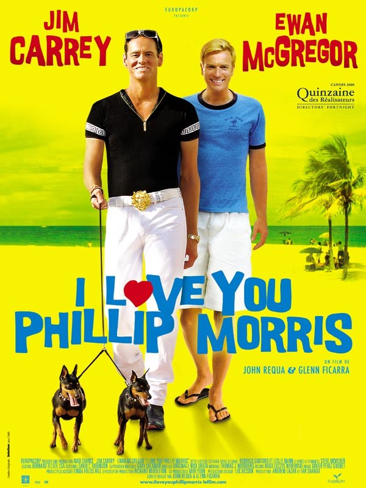
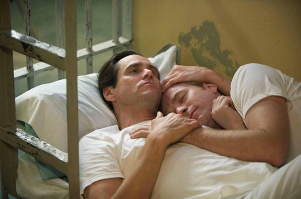

+++
titre = "<em>I Love You Phillip Morris</em>, Glenn Ficarra et John Requa"
title = "I Love You Phillip Morris, Glenn Ficarra et John Requa"
url = "/i-love-you-phillip-morris-ficarra-requa"
date = "2010-02-11T01:04:11"
Lastmod = "2014-10-10T14:56:53"
cover = "i-love-you-phillip-morris-ficarra-requa.jpg"
categorie = [ "À voir" ]
tag = [ "Amour", "Comédie", "Drame", "Homosexualité", "Humour" ]
createur = [ "Glenn Ficarra", "John Requa" ]
acteur = [ "Ewan McGregor", "Jim Carrey", "Leslie Mann" ]
annee = [ "2010" ]
weight = 2010
pays = [ "États-Unis" ]

+++

Il y a toujours une part d&rsquo;imprévu quand on va au cinéma. On ne sait pas ce que vaudra le film que l&rsquo;on va voir, mais parfois on ne sait pas plus le film que l&rsquo;on verra. Ce soir, ce devait être des poils et des dents acérées, mais séance complète oblige, ce fut <em>I Love You Phillip Morris</em> de Glenn Ficarra et John Requa. Le bilan est mitigé, la partie comédie de ce film dual fonctionnant très bien. C&rsquo;est sur la partie drame amoureux gay que le film pèche…

<em>I Love You Phillip Morris</em> retrace l&rsquo;histoire d&rsquo;un homme peu ordinaire. Steven Russel fut un homme bon, le parfait représentant de l&rsquo;<em>American Way Of Life</em>. Policier, père de deux enfants, mari aimant, bon chrétien… il a tout pour plaire. Mais un accident de voiture qui l&rsquo;amène au plus près de la mort le conduit à vouloir vivre sa vie sans se cacher, et sans cacher son homosexualité jusque-là enfouie. Le voilà gay et fier de l&rsquo;être, et il entend profiter à fond. Seul problème, cela lui coûte cher et il n&rsquo;a que des revenus modestes. C&rsquo;est pourquoi il se lance dans la très rentable arnaque aux assurances. Ce qui fonctionne très bien, il paie à son petit ami des montres en or, des voyages de rêve…, jusqu&rsquo;au jour fatal où l&rsquo;arnaque est découverte et le voilà en prison. C&rsquo;est là qu&rsquo;il rencontre le Phillip Morris du titre, et c&rsquo;est immédiatement le coup de foudre entre les deux hommes. Steven Russel passe ensuite le plus clair de son temps à sortir de prison par les combines les plus folles, sans jamais réussir.

Et d&rsquo;ailleurs, Steven Russel est encore aujourd&rsquo;hui en prison, enfermé à perpétuité sous surveillance permanente dans une prison du Texas. Le plus étonnant dans cette histoire est ainsi&#8230; qu&rsquo;elle est vraie. Le film commence d&rsquo;ailleurs par un message assurant que tout est vrai, et insiste même, comme si on pouvait remettre en cause cette idée. Et en effet, on le peut. Cet arnaqueur de génie a quand même réussi à duper des juges, se faisant passer pour un avocat, une grosse entreprise, se faisant passer pour un directeur financier, et même le système de santé du Texas dans son ensemble, se faisant passer pour un mourant du SIDA ! Un scénario fictif aurait semblé pour le moins exagéré, mais là tout est vrai.

Ce genre d&rsquo;histoire est, il faut en convenir, fascinante et on comprend sans peine ce qui a motivé les cinéastes. Steven Russel est un formidable acteur, mais dans la vraie vie, et non sur écran. Porter cette histoire sur le grand écran n&rsquo;a pas exigé trop d&rsquo;adaptations et la succession des arnaques offre au film un bon rythme et nombreuses scènes très drôles. Toute la partie humoristique du film fonctionne ainsi très bien, essentiellement grâce aux talents de Jim Carrey, il faut le dire. L&rsquo;acteur est ici parfaitement dans son élément, on croirait le rôle écrit pour lui, et il cabotine comme seul lui sait le faire. Jim Carrey joue du Jim Carrey, c&rsquo;est vrai, mais après tout il est encore le meilleur dans ce rôle et il se donne, ici, à fond. Ses grimaces d&rsquo;amoureux éplorés, ou ses airs de connivence avec les juges ou les responsables de l&rsquo;entreprise pour laquelle il travaille sont vraiment excellents.

La finesse ou la légèreté n&rsquo;ont pas leur place dans <em>I Love You Phillip Morris</em>. Bien au contraire même, le film joue des caricatures, les exagérant à outrance pour mieux les ridiculiser. C&rsquo;est particulièrement vrai pour toutes les scènes où Jim Carrey s&rsquo;amuse à jouer une grande folle avec deux ridicules petits chiens (cf l&rsquo;horrible<a href="#footnote_0_2804" id="identifier_0_2804" class="footnote-link footnote-identifier-link" title="&Agrave; ce sujet, des affiches comme celle-ci, &ccedil;a devrait &ecirc;tre tout bonnement interdit. Non, mais s&eacute;rieusement, ce jaune fluo l&agrave;, ils n&rsquo;ont vraiment rien trouv&eacute; de mieux&nbsp;? Il ne manquerait plus qu&rsquo;il y aussi de la Comic Sans MS et ce serait le parfait exemple de ce qu&rsquo;il ne faut surtout, mais alors surtout pas, faire en mati&egrave;re de graphisme&hellip;">1</a> affiche) et des accoutrements disons repérables de loin. Le film, lui-même, ne fait pas dans la finesse : rien n&rsquo;est laissé au hasard, toutes les arnaques sont bien expliquées (même si, il faut l&rsquo;avouer, elles sont tellement énormes que l&rsquo;on pardonne la lourdeur des explications) et la structure est appuyée de telle sorte que jamais le spectateur moyen ne se perde. Le film n&rsquo;évite aucun cliché, du bisou sur fond de soleil couchant jusqu&rsquo;aux envolées lyriques violoneuses.

Cette lourdeur ne gêne en rien la comédie, au contraire même les clichés gays sont détournés de manière assez amusante. Mais le gros problème de <em>I Love You Phillip Morris</em>, c&rsquo;est que manifestement ses concepteurs n&rsquo;ont pas su choisir entre une comédie bien lourde comme la filmographie Jim Carrey en compte des dizaines (par exemple, la série des <em>Ace Ventura</em>) et le drame amoureux traité sérieusement. Or ce qui fonctionnait en comédie se casse la figure quand l&rsquo;amour censé être sérieux débarque.

En effet, on a beaucoup évoqué jusque-là Jim Carrey et son jeu hors du commun, mais à l&rsquo;affiche, il y a aussi Ewan McGregor, celui qui interprète l&rsquo;aimé du titre. Comme ce dernier l&rsquo;indique d&rsquo;ailleurs, <em>I Love You Phillip Morris</em> est d&rsquo;abord une histoire d&rsquo;amour, et un amour fou, fusionnel, entre deux hommes. Pour qu&rsquo;on en arrive à simuler la maladie du SIDA à coup de sous-nutrition chronique et d&rsquo;un coma médicamenteux de quatre jours, uniquement pour voir celui que l&rsquo;on aime, c&rsquo;est qu&rsquo;effectivement l&rsquo;amour est fort. Sauf que cela ne se voit jamais à l&rsquo;écran. On ne croit pas une seconde à l&rsquo;amour entre deux hommes, on ne voit que deux très bons acteurs jouer deux amoureux. Dès la scène du coup de foudre, dans la bibliothèque, il y a un souci, quelque chose sonne faux. Ce sentiment ne quitte le film qu&rsquo;avec le générique, et il est regrettable que les réalisateurs n&rsquo;aient pas clairement choisi entre les deux orientations du film. Le film aurait été beaucoup plus fort si l&rsquo;on avait cru à leur histoire, ou si l&rsquo;amour en avait été purement et simplement évincé.

Le bilan d&rsquo;<em>I Love You Phillip Morris</em> est ainsi contrasté. D&rsquo;un côté, le show Jim Carrey est toujours aussi efficace et constitue une comédie drôle et réussie. De l’autre, la partie romance gay ne parvient pas à convaincre, la faute sans doute à un traitement trop second degré pour que le spectateur y croie plus d’une seconde. Le film devient bancal et empêche d’être pleinement satisfait. Ceci étant, c’est un bon divertissement qui sera vite oublié, mais après tout peu importe.

Ce qui ne laisse pas de m&rsquo;étonner, c&rsquo;est l&rsquo;unanimité des avis positifs concernant le film de Glenn Ficarra et John Requa : que ce soit <a href="http://www.toujoursraison.com/2010/02/i-love-you-phillip-morris.html">Rob</a>, <a href="http://www.filmosphere.com/2010/01/critique-i-love-you-phillip-morris-2009/">Nicolas</a>, <a href="http://myscreens.fr/2010/cinema/i-love-you-phillip-morris-la-critique/">Fred</a> ou pour <a href="http://blog.landofthegeeks.com/?p=22018">Chandleyr</a> (qui développe l&rsquo;idée selon laquelle Steven Russell n&rsquo;aime pas Phillip Morris, mais satisfait juste la demande de son premier et seul amour sur son lit de mort ; c&rsquo;est une lecture intéressante, mais qui n&rsquo;est jamais confirmée par le film). Quelques voix discordantes néanmoins repérées, comme celle de <a href="http://keikuchi.blogs.allocine.fr/keikuchi-255066-i_love_you_phillip_morris.htm">Keikuchi</a> (qui rappelle à juste titre qu&rsquo;un film d&rsquo;arnaques est déjà sorti récemment avec <em><a href="http://voiretmanger.fr/2009/10/11/the-informant-soderbergh/">The Informant</a></em>). Du côté de la presse traditionnelle, c&rsquo;est aussi un déluge de louanges, et même <a href="http://www.critikat.com/I-Love-You-Phillip-Morris.html">Critikat</a> en fait son film de la semaine. On peut y lire : &nbsp;&raquo; <em>I Love You Phillip Morris</em> […] <em>est un pied de nez décomplexé à la mort et à l’absurdité d’une existence qui n’amènerait que des contraintes, laissant après la projection un indicible sentiment de mélancolie euphorique.</em>&nbsp;&raquo; J&rsquo;ai, manifestement, raté quelque chose…

<h3>Vous voulez <a href="http://voiretmanger.fr/soutien/">m&rsquo;aider</a> ?</h3>
<ul>
<li><a href="http://www.amazon.fr/gp/product/B0037QGE0O/ref=as_li_ss_tl?ie=UTF8&amp;tag=leblogdenic07-21&amp;linkCode=as2&amp;camp=1642&amp;creative=19458&amp;creativeASIN=B0037QGE0O">Acheter le film en DVD sur Amazon</a></li>
<li><a href="https://itunes.apple.com/fr/movie/i-love-you-phillip-morris/id455573531">Acheter ou louer le film sur l&rsquo;iTunes Store</a></li>
</ul>

<ol class="footnotes"><li id="footnote_0_2804" class="footnote">À ce sujet, des affiches comme celle-ci, ça devrait être tout bonnement interdit. Non, mais sérieusement, ce jaune fluo là, ils n&rsquo;ont vraiment rien trouvé de mieux ? Il ne manquerait plus qu&rsquo;il y aussi de la Comic Sans MS et ce serait le parfait exemple de ce qu&rsquo;il ne faut surtout, mais alors surtout pas, faire en matière de graphisme… [<a href="#identifier_0_2804" class="footnote-link footnote-back-link">&#8617;</a>]</li></ol>
